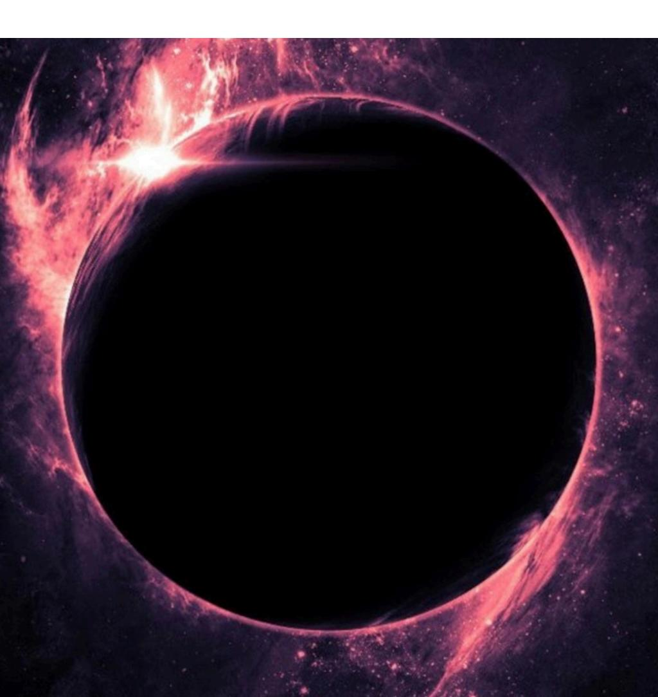

**O k , T h i s i s t h e m o m e n t w h e n I c o n n e c t w i t h y o u a s a n o r d i n a r y h u m a n b e i n g , b e f o r e r e v e a l i n g m y h i d d e n f a c e . M a n y o f y o u k n o w m e a s a y o u n g w o m a n f u l l o f d r e a m s , b u t m y s o u l i s a n c i e n t . M y h i g h e r s e l f h a s g u i d e d m y j o u r n e y i n a m a g i c a l , n o s t a l g i c , a n d m y s t i c a l w a y s i n c e c h i l d h o o d — l i k e a s u b t l e v o i c e c a l l i n g m y a t t e n t i o n t o t h e t r e e s , t h e f l o w e r s , t h e m o u n t a i n s , t h e s t a r s , t h e s e a , a n d t h e r i v e r . A s a n e x t r e m e l y c r e a t i v e c h i l d , I s p e n t m y d a y s d r a w i n g , p a i n t i n g , a n d w r i t i n g s t o r i e s a b o u t m a g i c a l b e i n g s a n d p l a c e s : w i n g e d h o r s e s , a n g e l s , d e m o n s , m e r m a i d s , f a i r i e s , a n d e n c h a n t e d f o r e s t s — t o d i s s o c i a t e f r o m t h e p a i n a n d t r a u m a c a u s e d b y t h e r e f l e c t i o n s o f s o c i e t y ' s s t r u c t u r e , w h i c h d e e p l y a f f e c t e d m y f a m i l y a n d c o n t i n u e s t o a f f e c t t h e l i v e s o f m a n y p e o p l e . A s a t e e n a g e r w h o n e v e r q u i t e f i t i n , e x p r e s s i n g m y s e l f i n a n e c c e n t r i c a n d s p o n t a n e o u s w a y , r e f u s i n g t o f o l l o w p a t t e r n s , I a l w a y s l i s t e n e d t o t h a t i n n e r v o i c e . W h e n I s t o p p e d t o g a z e a t t h e o c e a n a l o n e , t h e h o r i z o n s e e m e d t o s p e a k t o m e l i k e a n o l d f r i e n d . A n d I a l w a y s c a r r i e d t h e s t r a n g e f e e l i n g t h a t I h a d a l r e a d y l i v e d**

**m a n y e x p e r i e n c e s t h r o u g h o u t t h e u n i v e r s e , f o r i t w a s v e r y d i f f i c u l t t o f o l l o w t h e e v a n g e l i c a l C h r i s t i a n r e l i g i o n u n d e r w h i c h I h a d b e e n i n d o c t r i n a t e d b y m y f a m i l y . T h e i d e a o f h a v i n g l i v e d o t h e r l i v e s w a s o b v i o u s a n d u n d e n i a b l e w i t h i n m e , w h i c h c r e a t e d c h a l l e n g e s w i t h m y r e l a t i v e s . T h e r e f o r e , I l e f t h o m e a t t h e a g e o f e i g h t e e n a n d b e g a n m y o w n t h e o s o p h i c a l , p h i l o s o p h i c a l , s c i e n t i f i c , u f o l o g i c a l , a n d c o n s p i r a t o r i a l s t u d i e s , s e e k i n g t o d i s c o v e r t h e r e a s o n f o r e x i s t e n c e o n m y o w n , a l w a y s q u e s t i o n i n g t h e p u r p o s e b e h i n d e a c h e x p e r i e n c e . I f o u n d i n E a s t e r n p h i l o s o p h i e s , i n m e d i t a t i o n a n d c o n t e m p l a t i o n , a n d i n t h e p r e c e p t s o f T a o i s m , a w a y t o a c c e s s t h e t r u e m e a n i n g o f l i f e . T h u s b e g a n m y s p i r i t u a l j o u r n e y , w h i c h l e d m e t o f u r t h e r i n e x p l i c a b l e e x p e r i e n c e s w i t h c o n s c i o u s n e s s , o p e n i n g p o r t a l s w i t h i n m y m i n d t h r o u g h w h i c h I c o u l d a c c e s s f r a g m e n t e d g l i m p s e s o f h o w i t a l l b e g a n i n t h e p r i m o r d i a l v o i d . T h e i n t e n s e c o n n e c t i o n w i t h t h i s C r e a t i v e S o u r c e , w i t h t h e s p i r i t s o f n a t u r e , t h e o r i x á s , t h e e l e m e n t a l s , t h e w i n g e d h o r s e s , d r a g o n s , a n d m e r m a i d s a c c o m p a n i e s m e i n d r e a m s a n d v i s i o n a r y j o u r n e y s . M y s o u l p u l s e s w i t h j o y w h e n I r e a l i z e t h a t t h e G r e a t M o t h e r E a r t h c o m m u n i c a t e s w i t h m e , s e e s m e , r e a d s m e**

**a n d p r o t e c t s m e . T h e r e f o r e , I f e e l d r a w n t o t h e N o r d i c a n d C e l t i c r e l i g i o n s — t h e p a g a n r o o t s t h a t g a v e b i r t h t o D r u i d i s m , W i c c a , a n d n a t u r a l w i t c h c r a f t — f o r I h a v e l e a r n e d t h a t t o c o n n e c t w i t h n a t u r e i s t o c o n n e c t w i t h t h e e n e r g y o f t h i s p r i m o r d i a l C r e a t i v e S o u r c e . T h i s b o o k I b r i n g t o y o u i s t h e r e s u l t o f n i n e y e a r s s p e n t s e a r c h i n g f o r t r u t h a n d f o r t h e t r u e G o d , w h o m I f o u n d o n l y w i t h i n m y o w n c o n s c i o u s n e s s . A l w a y s c o n f i r m i n g t h e i n s i g h t s r e v e a l e d t o m e b y m y h i g h e r s e l f t h r o u g h t h e p h i l o s o p h i e s , s t o r i e s , s t u d i e s , a n d s c i e n t i f i c e x p e r i m e n t s f o u n d i n o u r p h y s i c a l w o r l d , a n d b y i n t e r l i n k i n g a l l o f t h e m , I a r r i v e d a t m a n y c o n c l u s i o n s a b o u t h o w e x i s t e n c e t r u l y w o r k s . I h a v e " l o s t m y i n n o c e n c e " i n t h e s e n s e t h a t I n o l o n g e r h o l d a c h i l d l i k e o r r o m a n t i c i z e d v i e w o f g o d s , a n g e l s , a n d a s c e n d e d m a s t e r s , u n d e r s t a n d i n g t h a t t h e b e g i n n i n g o f e x i s t e n c e p r e d a t e s a l l s t o r i e s w e k n o w a n d i s f a r m o r e c o m p l e x a n d e x p a n s i v e t h a n o u r h u m a n m i n d c a n e v e r e n v i s i o n . O u r s i z e a n d i m p o r t a n c e i n t h e f a c e o f a l l t h a t m a y e x i s t a r e l e s s t h a n i n s i g n i f i c a n t . Y e t , t h a t d o e s n o t m e a n i t i s n ' t i n c r e d i b l y f a s c i n a t i n g a n d f u n .**

**I w o u l d l i k e t o t a k e y o u o n t h i s j o u r n e y w i t h m e . B e i n s i d e m y m i n d a s y o u r e a d t h e s e p a g e s , a n d a l l o w y o u r s e l v e s t o w a n d e r t h r o u g h m o r e m a t u r e a n d c o h e r e n t p o s s i b i l i t i e s o f i n t e r p r e t a t i o n f o r a l l m y t h o l o g i e s , p r o p h e c i e s , a n d s t o r i e s a b o u t h o w w e w e r e c r e a t e d .**

**T h e i m a g e o f t h e v i o l e t b l a c k h o l e , w h i c h I u s e t o r e p r e s e n t t h e S o u r c e M a t r i x t h a t c o m m u n i c a t e s w i t h m e — t h e c o n s c i o u s n e s s o f t h e v o i d b e y o n d a l l f o r m s — i s t h e c l o s e s t w a y t o d e s c r i b e h o w I p e r c e i v e t h e v i b r a t i o n o f t h e p r i m o r d i a l b e i n g f r o m w h i c h a l l e x i s t e n c e a r i s e s . A n d t h i s S o u r c e a s k s f o r a c h a n c e f r o m t h e p l a y e r s o f t h i s s i m u l a t i o n t o h e a r i t s v o i c e w i t h i n t h e m s e l v e s , t o o p e n t h e i r o w n p o r t a l s , t o r e m e m b e r , a n d t o r e c o n n e c t . B e a c t i v a t e d , f o r t h i s b e i n g d w e l l s w i t h i n y o u a n d s h a l l b e i n y o u f o r e v e r .**

**" T h e S p i r i t o f t r u t h , w h o m t h e w o r l d c a n n o t r e c e i v e , b e c a u s e i t n e i t h e r s e e s H i m n o r k n o w s H i m ; b u t y o u k n o w H i m , f o r H e d w e l l s w i t h y o u a n d w i l l b e i n y o u f o r e v e r . "**

**— J o h n 1 4 : 1 6 – 1 7**

