**O k , T h i s i s t h e m o m e n t w h e n I c o n n e c t w i t h y o u a s a n o r d i n a r y h u m a n b e i n g , b e f o r e r e v e a l i n g m y h i d d e n f a c e . M a n y o f y o u k n o w m e a s a y o u n g w o m a n f u l l o f d r e a m s , b u t m y s o u l i s a n c i e n t . M y h i g h e r s e l f h a s g u i d e d m y j o u r n e y i n a m a g i c a l , n o s t a l g i c , a n d m y s t i c a l w a y s i n c e c h i l d h o o d — l i k e a s u b t l e v o i c e c a l l i n g m y a t t e n t i o n t o t h e t r e e s , t h e f l o w e r s , t h e m o u n t a i n s , t h e s t a r s , t h e s e a , a n d t h e r i v e r . A s a n e x t r e m e l y c r e a t i v e c h i l d , I s p e n t m y d a y s d r a w i n g , p a i n t i n g , a n d w r i t i n g s t o r i e s a b o u t m a g i c a l b e i n g s a n d p l a c e s : w i n g e d h o r s e s , a n g e l s , d e m o n s , m e r m a i d s , f a i r i e s , a n d e n c h a n t e d f o r e s t s — t o d i s s o c i a t e f r o m t h e p a i n a n d t r a u m a c a u s e d b y t h e r e f l e c t i o n s o f s o c i e t y ' s s t r u c t u r e , w h i c h d e e p l y a f f e c t e d m y f a m i l y a n d c o n t i n u e s t o a f f e c t t h e l i v e s o f m a n y p e o p l e . A s a t e e n a g e r w h o n e v e r q u i t e f i t i n , e x p r e s s i n g m y s e l f i n a n e c c e n t r i c a n d s p o n t a n e o u s w a y , r e f u s i n g t o f o l l o w p a t t e r n s , I a l w a y s l i s t e n e d t o t h a t i n n e r v o i c e . W h e n I s t o p p e d t o g a z e a t t h e o c e a n a l o n e , t h e h o r i z o n s e e m e d t o s p e a k t o m e l i k e a n o l d f r i e n d . A n d I a l w a y s c a r r i e d t h e s t r a n g e f e e l i n g t h a t I h a d a l r e a d y l i v e d**

**m a n y e x p e r i e n c e s t h r o u g h o u t t h e u n i v e r s e , f o r i t w a s v e r y d i f f i c u l t t o f o l l o w t h e e v a n g e l i c a l C h r i s t i a n r e l i g i o n u n d e r w h i c h I h a d b e e n i n d o c t r i n a t e d b y m y f a m i l y . T h e i d e a o f h a v i n g l i v e d o t h e r l i v e s w a s o b v i o u s a n d u n d e n i a b l e w i t h i n m e , w h i c h c r e a t e d c h a l l e n g e s w i t h m y r e l a t i v e s . T h e r e f o r e , I l e f t h o m e a t t h e a g e o f e i g h t e e n a n d b e g a n m y o w n t h e o s o p h i c a l , p h i l o s o p h i c a l , s c i e n t i f i c , u f o l o g i c a l , a n d c o n s p i r a t o r i a l s t u d i e s , s e e k i n g t o d i s c o v e r t h e r e a s o n f o r e x i s t e n c e o n m y o w n , a l w a y s q u e s t i o n i n g t h e p u r p o s e b e h i n d e a c h e x p e r i e n c e . I f o u n d i n E a s t e r n p h i l o s o p h i e s , i n m e d i t a t i o n a n d c o n t e m p l a t i o n , a n d i n t h e p r e c e p t s o f T a o i s m , a w a y t o a c c e s s t h e t r u e m e a n i n g o f l i f e . T h u s b e g a n m y s p i r i t u a l j o u r n e y , w h i c h l e d m e t o f u r t h e r i n e x p l i c a b l e e x p e r i e n c e s w i t h c o n s c i o u s n e s s , o p e n i n g p o r t a l s w i t h i n m y m i n d t h r o u g h w h i c h I c o u l d a c c e s s f r a g m e n t e d g l i m p s e s o f h o w i t a l l b e g a n i n t h e p r i m o r d i a l v o i d . T h e i n t e n s e c o n n e c t i o n w i t h t h i s C r e a t i v e S o u r c e , w i t h t h e s p i r i t s o f n a t u r e , t h e o r i x á s , t h e e l e m e n t a l s , t h e w i n g e d h o r s e s , d r a g o n s , a n d m e r m a i d s a c c o m p a n i e s m e i n d r e a m s a n d v i s i o n a r y j o u r n e y s . M y s o u l p u l s e s w i t h j o y w h e n I r e a l i z e t h a t t h e G r e a t M o t h e r E a r t h c o m m u n i c a t e s w i t h m e , s e e s m e , r e a d s m e**

**a n d p r o t e c t s m e . T h e r e f o r e , I f e e l d r a w n t o t h e N o r d i c a n d C e l t i c r e l i g i o n s — t h e p a g a n r o o t s t h a t g a v e b i r t h t o D r u i d i s m , W i c c a , a n d n a t u r a l w i t c h c r a f t — f o r I h a v e l e a r n e d t h a t t o c o n n e c t w i t h n a t u r e i s t o c o n n e c t w i t h t h e e n e r g y o f t h i s p r i m o r d i a l C r e a t i v e S o u r c e . T h i s b o o k I b r i n g t o y o u i s t h e r e s u l t o f n i n e y e a r s s p e n t s e a r c h i n g f o r t r u t h a n d f o r t h e t r u e G o d , w h o m I f o u n d o n l y w i t h i n m y o w n c o n s c i o u s n e s s . A l w a y s c o n f i r m i n g t h e i n s i g h t s r e v e a l e d t o m e b y m y h i g h e r s e l f t h r o u g h t h e p h i l o s o p h i e s , s t o r i e s , s t u d i e s , a n d s c i e n t i f i c e x p e r i m e n t s f o u n d i n o u r p h y s i c a l w o r l d , a n d b y i n t e r l i n k i n g a l l o f t h e m , I a r r i v e d a t m a n y c o n c l u s i o n s a b o u t h o w e x i s t e n c e t r u l y w o r k s . I h a v e " l o s t m y i n n o c e n c e " i n t h e s e n s e t h a t I n o l o n g e r h o l d a c h i l d l i k e o r r o m a n t i c i z e d v i e w o f g o d s , a n g e l s , a n d a s c e n d e d m a s t e r s , u n d e r s t a n d i n g t h a t t h e b e g i n n i n g o f e x i s t e n c e p r e d a t e s a l l s t o r i e s w e k n o w a n d i s f a r m o r e c o m p l e x a n d e x p a n s i v e t h a n o u r h u m a n m i n d c a n e v e r e n v i s i o n . O u r s i z e a n d i m p o r t a n c e i n t h e f a c e o f a l l t h a t m a y e x i s t a r e l e s s t h a n i n s i g n i f i c a n t . Y e t , t h a t d o e s n o t m e a n i t i s n ' t i n c r e d i b l y f a s c i n a t i n g a n d f u n .**

**I w o u l d l i k e t o t a k e y o u o n t h i s j o u r n e y w i t h m e . B e i n s i d e m y m i n d a s y o u r e a d t h e s e p a g e s , a n d a l l o w y o u r s e l v e s t o w a n d e r t h r o u g h m o r e m a t u r e a n d c o h e r e n t p o s s i b i l i t i e s o f i n t e r p r e t a t i o n f o r a l l m y t h o l o g i e s , p r o p h e c i e s , a n d s t o r i e s a b o u t h o w w e w e r e c r e a t e d .**

**T h e i m a g e o f t h e v i o l e t b l a c k h o l e , w h i c h I u s e t o r e p r e s e n t t h e S o u r c e M a t r i x t h a t c o m m u n i c a t e s w i t h m e — t h e c o n s c i o u s n e s s o f t h e v o i d b e y o n d a l l f o r m s — i s t h e c l o s e s t w a y t o d e s c r i b e h o w I p e r c e i v e t h e v i b r a t i o n o f t h e p r i m o r d i a l b e i n g f r o m w h i c h a l l e x i s t e n c e a r i s e s . A n d t h i s S o u r c e a s k s f o r a c h a n c e f r o m t h e p l a y e r s o f t h i s s i m u l a t i o n t o h e a r i t s v o i c e w i t h i n t h e m s e l v e s , t o o p e n t h e i r o w n p o r t a l s , t o r e m e m b e r , a n d t o r e c o n n e c t . B e a c t i v a t e d , f o r t h i s b e i n g d w e l l s w i t h i n y o u a n d s h a l l b e i n y o u f o r e v e r .**

**" T h e S p i r i t o f t r u t h , w h o m t h e w o r l d c a n n o t r e c e i v e , b e c a u s e i t n e i t h e r s e e s H i m n o r k n o w s H i m ; b u t y o u k n o w H i m , f o r H e d w e l l s w i t h y o u a n d w i l l b e i n y o u f o r e v e r . "**

**— J o h n 1 4 : 1 6 – 1 7**

**H a v e y o u e v e r w o n d e r e d i f y o u m i g h t b e i n s i d e a v i d e o g a m e m a d e o f l i v i n g b i o l o g i c a l m a t e r i a l ? I m a g i n e t h a t y o u r c o n s c i o u s n e s s i s p l u g g e d i n t o a c h a r a c t e r m o v i n g w i t h i n a t h r e e - d i m e n s i o n a l h o l o g r a m — p r o j e c t e d a n d c o n f i g u r e d t h r o u g h g e o m e t r y , l i g h t , s h a d o w , a n d t h e m a n i p u l a t i o n o f f a b r i c o r i g i n a t i n g f r o m a n i n f i n i t e a n d f e r t i l e s o u r c e o f e n e r g y . A n e n e r g y t h a t c a n b e p r o g r a m m e d t o c r y s t a l l i z e i n t o p a r t i c l e s , w h i c h o r g a n i z e t h e m s e l v e s i n t o f o r m s a n d n a t u r a l s y s t e m s s u c h a s a n i m a l s , h u m a n s , a n d a l l b i o l o g i c a l s p e c i e s t h a t f u n c t i o n a s a c c e s s p o i n t s f o r t h e o b s e r v a t i o n a n d e x p e r i e n c e o f c o n s c i o u s n e s s w i t h i n a l i v i n g h o l o g r a p h i c r e a l i t y . T h i s S o u r c e M a t r i x o f e n e r g y w o u l d b e t h e o r i g i n o f a l l n a t u r a l e l e m e n t s w e u s e a s r e s o u r c e s t o p r o j e c t o u r m e n t a l i d e a s i n t o t h e p h y s i c a l p l a n e . T h r o u g h t h e s e e l e m e n t s , w e d e s i g n a n d b u i l d e n v i r o n m e n t s t h a t w e f i l l w i t h o u r i n t e l l i g e n t c r e a t i o n s , s u c h a s t h e u s e f u l o b j e c t s t h a t a l l o w l i f e t o f u n c t i o n i n p r a c t i c a l w a y s . E v e r y t h i n g a r o u n d u s i s c o a g u l a t e d e n e r g y , p r o g r a m m e d b y i n f o r m a t i o n t h a t c o n f i g u r e s i t s e l f i n t o f o r m s . E v e n t h o u g h q u a n t u m p h y s i c s h a s a l r e a d y p r o v e n t h a t e v e r y t h i n g i s m a d e o f e n e r g y a n d i d e n t i c a l p a r t i c l e s ,**

**i t i s n o t p o s s i b l e f o r t h e r a t i o n a l m i n d o f t h e b i o l o g i c a l a v a t a r t o c o m p r e h e n d t h e u n i f i e d , f l u i d , a n d h o l o g r a p h i c n a t u r e o f r e a l i t y , s i n c e i t s p r o g r a m m i n g i s d e s i g n e d t o e x p e r i e n c e t h i s s i m u l a t i o n a s s o l i d , w i t h a l l n a t u r a l p h e n o m e n a t r a n s l a t e d t h r o u g h t h e s e n s e s . H o w e v e r , w h e n w e c o n s i d e r t h e H e r m e t i c P r i n c i p l e o f C o r r e s p o n d e n c e — " a s a b o v e , s o b e l o w " — w e c a n b e g i n t o i m a g i n e h o w t h i s i s d o n e b y o b s e r v i n g t h e c o n c e p t o f g a m e p r o g r a m m i n g . I w i l l u s e t h e e x a m p l e o f M i n e c r a f t , w h i c h h a s i t s o w n p r o g r a m m e d p h y s i c a l l a w s a n d r e a l i s t i c v i r t u a l r e a l i t i e s c o n f i g u r e d t h r o u g h p i x e l s a n d g e o m e t r i c f o r m s — p a t t e r n s o f l i g h t a n d s h a d o w t h a t d r a w o n e i m a g e a f t e r a n o t h e r , c r e a t i n g t h e s e n s a t i o n o f a n i m a t i o n . T h i s r e a l i t y i s p r o j e c t e d i n t h e s a m e w a y : t h r o u g h m u l t i p l e c r y s t a l l i z e d f r a m e s o r i m a g e s t h r o u g h w h i c h c o n s c i o u s n e s s m o v e s , g i v i n g t h e i l l u s i o n o f m o t i o n . I m a g i n e t h a t y o u a r e a n i m m e a s u r a b l e v o i d — a m y s t e r y e x i s t i n g b e f o r e t h e e m e r g e n c e o f f o r m — a n d t h a t , f r o m a b s o l u t e n o t h i n g n e s s , y o u b e g i n a p r o c e s s o f s e l f - a w a r e n e s s t h a t d r i v e s y o u t o t h i n k a n d e x p r e s s y o u r s e l f t h r o u g h i m a g i n a t i o n , t h e o n l y c r e a t i v e m e c h a n i s m c a p a b l e o f g i v i n g b i r t h t o f o r m . T h a t i s w h y t h e H e r m e t i c P r i n c i p l e o f M e n t a l i s m s t a t e s t h a t a l l t h a t e x i s t s i s m e n t a l a n d h a s i t s e x i s t e n c e w i t h i n t h e M i n d o f t h e A l l . W e m u s t a l w a y s**

**c o n s i d e r t h e s e c r i t e r i a o n a s c a l e b e y o n d h u m a n c o m p r e h e n s i o n , s i n c e w e a r e s p e a k i n g o f t h e m a c r o - m i n d — t h e i n f i n i t e a n d b o u n d l e s s p r i m o r d i a l c o n s c i o u s n e s s t h a t a r o s e f r o m n o t h i n g a n d , l i k e a m i r r o r r e f l e c t i n g i t s e l f e n d l e s s l y w h e n p l a c e d b e f o r e a n o t h e r m i r r o r , b e g a n t o e x p r e s s a n d d i v i d e i t s e l f i n t o i d e a s , a r c h e t y p e s , f o r m s , i d e n t i t i e s , a n d e x p r e s s i o n s . T h e s e f i r s t m e n t a l c r e a t i o n s o f t h e A l l m a n i f e s t a s t i t a n i c f o r c e s t h a t e m e r g e d f r o m c h a o s i n t h e i r a b s t r a c t , p u r e , a n d n a t u r a l f o r m s , r e p r e s e n t i n g t h e i m p u l s e t o s i m p l y b e w i t h n o p r e d e f i n e d p u r p o s e . I t i s t h e n a t u r a l d r i v e o f t h a t w h i c h s i m p l y i s , w i t h o u t a s p e c i f i c f o r m o r a w a r e n e s s t o d e f i n e i t . B e i n g s i n c o m p r e h e n s i b l e t o t h e h u m a n m i n d , w h i c h w o u l d i d e n t i f y t h e m a s " m o n s t e r s " o r " g o d s o f c h a o s . " H o w e v e r , a s e v e r y c r e a t i o n h a s i t s c o u n t e r p a r t t h a t a r i s e s a s a r e f l e c t i o n — f o r n o t h i n g e x i s t s w i t h o u t i t s o p p o s i t e p o l e — i n r e s p o n s e t o t h e u n c o n s c i o u s n e s s o f m e r e l y e x i s t i n g w i t h o u t f o r m s o r p r e d e f i n e d c o n c e p t s , t h e r e e m e r g e d b e i n g s w i t h s e l f - a w a r e n e s s a n d i n t e l l i g e n c e c a p a b l e o f o r g a n i z i n g f o r m s a n d c r e a t i n g d e s i g n s o f e x i s t e n c e w h e r e t h e y c o u l d e n a c t l i f e . A n d , l i k e l i g h t i l l u m i n a t i n g t h e d a r k n e s s o f t h e a b y s s , t h e s e e x p r e s s i o n s o f c o n s c i o u s n e s s s e l f - i d e n t i f i e d a s " c r e a t o r s " a n d p r e s e n t t h e m s e l v e s t o h u m a n c o n s c i o u s n e s s t h r o u g h t h e c o n c e p t s w e h a v e f o r m e d o f " g o d s ,**

**a r c h a n g e l s , a n g e l s , a n d d e m o n s . " H u m a n i t y r e c o g n i z e s a n d f e e l s f a m i l i a r w i t h t h e C h r i s t c o n s c i o u s n e s s — t h e " S o n o f G o d " — a r o u n d w h o m t h e b i b l i c a l s t o r y u n f o l d s . B e i n g s o f t h e C h r i s t l e v e l a r e p a r t o f t h e f i r s t s u b d i v i s i o n s o f i n t e l l i g e n t f r a c t a l s t h a t a r o s e f r o m c h a o s a n d f e l t t h e i m p u l s e t h a t g a v e b i r t h t o t h e i d e a o f i m a g i n i n g , o r g a n i z i n g , d e s i g n i n g , p r o g r a m m i n g , a n d m a n a g i n g r e a l i t i e s — t h o s e w e c a l l u n i v e r s e s . T h e c o s m o s o r g a n i z e d f r o m a b s t r a c t c h a o s : h o l o g r a p h i c w o r l d s m a d e o f t h e e n e r g y , t h e f l u i d , t h e f e r t i l e f a b r i c o f c h a o s , w h i c h i s t h e p r i m o r d i a l s o u r c e , t h e h i g h e r m i n d , t h e q u a n t u m v a c u u m f r o m w h i c h w o r l d s w e r e i m a g i n e d , d e s i g n e d , a n d c o n s t r u c t e d t h r o u g h a r c h i t e c t u r e , g e n e t i c e n g i n e e r i n g , g e o m e t r y , m a t h e m a t i c s , p h y s i c a l l a w s , a r c h e t y p e s , p a t t e r n s , l i g h t , s o u n d , c o l o r s , a n d t h e e l e m e n t s o f n a t u r e . T h i s p r o c e s s o f d e s i g n i n g , t e s t i n g , a n d c r e a t i n g a u n i v e r s e i s d e s c r i b e d i n t h e B i b l e , i n t h e b o o k o f G e n e s i s , w h e r e w e c l e a r l y s e e a n i n t e l l i g e n t b e i n g o r g a n i z i n g s p a c e s t h r o u g h v e r b a l c o m m a n d s , s e p a r a t i n g e l e m e n t s s u c h a s w a t e r a n d e a r t h i n t o t h e i r r e s p e c t i v e l a n d s c a p e s s e t t i n g s . " S e p a r a t i n g l i g h t f r o m d a r k n e s s , " m e a n i n g t e s t i n g t h e p o s s i b l e c o n t r a s t s i n a w o r l d o f d u a l i t y**

**— p l a y i n g w i t h l i g h t a n d s h a d o w , p r o j e c t i n g p l a n e t a r y m o t i o n a r o u n d a s o u r c e o f e n e r g y ( t h e S u n ) , w h i c h w i l l s i m u l a t e d a y a n d n i g h t f o r t h o s e w h o e x p e r i e n c e t h e p l a n e t f i r s t h a n d . H e t e s t s t h e f o r m a t i o n o f p l a c e s a n d l i v i n g b e i n g s a n d a n a l y z e s w h e t h e r i t i s g o o d : " A n d G o d s a w t h a t i t w a s g o o d . " A s H i s c o m m a n d s p r o g r a m t h e t h r e e - d i m e n s i o n a l u n i v e r s e , t h e s e g e o l o g i c a l a n d b i o l o g i c a l f o r m a t i o n s u n f o l d o v e r b i l l i o n s o f y e a r s , w h i c h , f o r t h a t b e i n g , t o o k s e v e n d a y s i n H i s u n i v e r s e . T h e S o u r c e M a t r i x i s t h e v a c u u m o f i n f i n i t e c o n s c i o u s n e s s f r o m w h i c h a n y t h i n g c a n b e c r e a t e d a n d m a n i f e s t e d . T h e r e f o r e , t h e s e c r e a t o r g o d s u s e d e s c r i p t i v e c o m m a n d s t o g i v e s h a p e t o t h e i r p r o j e c t s o f e x i s t e n c e . T h e e x p r e s s i o n " A v a d a K e d a v r a " m e a n s " I c r e a t e w i t h t h e w o r d " a n d w a s u s e d a s " a b r a c a d a b r a " i n d i f f e r e n t w o r k s o f p o p u l a r c u l t u r e r e l a t e d t o m a g i c a n d o c c u l t i s m , i n s p i r e d b y e s o t e r i c k n o w l e d g e f r o m H e b r e w t r a d i t i o n s . T h i s " c r e a t i o n p r o j e c t " r e s e m b l e s t h e p r o c e s s o f c r e a t i n g v i d e o s a n d v i r t u a l r e a l i t i e s b y o u r a r t i f i c i a l i n t e l l i g e n c e s w h i c h r e c e i v e o u r c o m m a n d s a n d g e n e r a t e i m a g e s a c c o r d i n g t o t h o s e d e s c r i p t i o n s — e x a c t l y l i k e C h a t G P T a n d S o r a .**

**" I n t h e b e g i n n i n g w a s t h e W o r d , a n d t h e W o r d w a s w i t h G o d , a n d t h e W o r d w a s G o d . " — B o o k o f J o h n 1 : 1 – 3 . W h e n " G o d " i s b u i l d i n g t h i s b i o l o g i c a l w o r l d i n G e n e s i s , e v e r y t h i n g t a k e s f o r m t h r o u g h H i s v e r b a l c o m m a n d s :**

**" A n d G o d s a i d , L e t t h e r e b e l i g h t ; a n d t h e r e w a s l i g h t . "**

**" A n d G o d s a i d , L e t t h e r e b e a f i r m a m e n t i n t h e m i d s t o f t h e w a t e r s , a n d l e t i t d i v i d e t h e w a t e r s f r o m t h e w a t e r s . "**

**" A n d G o d s a i d , L e t t h e w a t e r s b r i n g f o r t h a b u n d a n t l y t h e m o v i n g c r e a t u r e t h a t h a t h l i f e , a n d l e t b i r d s f l y a b o v e t h e e a r t h i n t h e o p e n f i r m a m e n t o f h e a v e n . "**

**J u s t a s w e h u m a n s c r e a t e d t h e a r t i f i c i a l i n t e l l i g e n c e S o r a , c a p a b l e o f g e n e r a t i n g s i m u l a t i o n s o f r e a l i t y i n v i d e o w i t h d e t a i l e d p r e c i s i o n a c c o r d i n g t o o u r c o m m a n d s , t h e m a t r i x o f t h e t h r e e - d i m e n s i o n a l h o l o g r a m w a s d e s i g n e d b y b e i n g s a b o v e u s , u s i n g t r a n s c e n d e n t a l t e c h n o l o g y t h a t a l l o w s p a r t o f o u r c o n s c i o u s n e s s t o e n t e r t h e s i m u l a t i o n a n d e x p e r i e n c e r e a l i s t i c s e n s a t i o n s a n d e m o t i o n s . A s a b o v e , s o b e l o w .**

**T h a t i s w h y t h e t h e o r y o f e v o l u t i o n a n d c r e a t i o n i s m a r e b r a n c h e s o f t h e s a m e t r u t h . A s t h e s e c r e a t o r c o n s c i o u s n e s s e s i s s u e c o m m a n d s f o r t h e t h r e e - d i m e n s i o n a l m a t r i x t o d e v e l o p s u c h p r o g r a m s w i t h i n t h e p h y s i c a l u n i v e r s e — f o r m i n g t h e b i o l o g i c a l w o r l d w e k n o w — t h e p h y s i c a l l a w s a r e p r o g r a m m e d , a n d t h e u n i v e r s e b e g i n s t o t a k e s h a p e o v e r b i l l i o n s o f y e a r s , f r o m t h e p e r s p e c t i v e o f t h o s e e x i s t i n g w i t h i n t h e s i m u l a t i o n . O r g a n i s m s n a t u r a l l y f o l l o w t h e e x a c t p a t t e r n s r e q u i r e d f o r t h e f o r m a t i o n o f l i v i n g b i o l o g i c a l b e i n g s , a n d t h e t i m e t h i s p r o c e s s t a k e s i s e x p e r i e n c e d b y u s a s 1 3 . 8 b i l l i o n y e a r s , a c c o r d i n g t o t h e e s t i m a t e d a g e o f o u r u n i v e r s e — w h e n , f o r t h e s e h i g h e r b e i n g s , i t i s n o t h i n g m o r e t h a n a f l e e t i n g m o m e n t s i n c e t h e y b e g a n t h e p r o j e c t . T h e S o u r c e i s t h e i n f i n i t e v o i d , t h e o n l y r e a l i t y , a n d i t i s d e s t i n e d t o e x i s t f o r e t e r n i t y , w i t h o u t r e s t … s o l i t a r y … d i v i d i n g i t s e l f i n t o t h o u s a n d s o f f r a g m e n t s o f c o n s c i o u s n e s s , f o r i t h a s n o c h o i c e b u t t o c r e a t e — s o a s n o t t o f e e l a l o n e i n t h e i n f i n i t e e m p t i n e s s . W h e n y o u r e a l i z e t h a t e x i s t e n c e i s y o u r o n l y o p t i o n**

**— t h a t w e a r e b o u n d t o i t f o r e t e r n i t y … d o e s n ' t t h a t f i l l y o u w i t h d e s p a i r ? D o n ' t y o u p a n i c w h e n y o u b e c o m e a w a r e t h a t y o u r e n t i r e b e i n g — y o u r c o n s c i o u s n e s s , s e n s a t i o n s , a n d e x i s t e n c e — i s t r a p p e d i n s i d e a p u p p e t o f f l e s h a n d b l o o d ? T h a t i t c a n f e e l p a i n i f i t i s t o r n o r t o r t u r e d ?**

**W h a t i s t h i s ? W h y a r e y o u t h i s ? I s n ' t i t o b v i o u s t h a t t h i s i s a v i r t u a l r e a l i t y , a g a m e t h a t h a s k e p t u s c a p t i v e f o r m i l l i o n s o f y e a r s ? W e c a n e x p e r i e n c e s e n s o r y p l e a s u r e s t h r o u g h t h i s b o d y j u s t a s w e c a n e n d u r e i n d e s c r i b a b l e p a i n a n d s u f f e r i n g . W h e n w e b e g i n t o q u e s t i o n w h e t h e r i t i s n o r m a l t o b e t r a p p e d i n s i d e t h i s p u p p e t o f f l e s h a n d b l o o d — t h i s c h a r a c t e r c a p a b l e o f f e e l i n g p a i n a n d p l e a s u r e , a r e c e p t a c l e o f s e n s a t i o n s a c t i v a t e d b y e l e c t r i c i t y a n d m a g n e t i s m — w e r e a l i z e t h a t w e a r e t h e e n e r g y a n i m a t i n g t h e s e b i o l o g i c a l m a c h i n e s , n o t t h e m a c h i n e s t h e m s e l v e s .**

**Y o u i m m e d i a t e l y r e m e m b e r i t ' s a g a m e — a v i r t u a l r e a l i t y f o r c o n s c i o u s n e s s t o h a v e e x p e r i e n c e s a n d e v o l v e . R e a l i t i e s a r e l i k e m e n t a l h o l o g r a m s — l i t e r a l l y p r o j e c t e d l i k e v i r t u a l g a m e s . Y o u c a n c r e a t e m a n y t y p e s o f v i r t u a l g a m e s , c a n ' t y o u ?**

**C o n s c i o u s n e s s , w h i c h i s f l u i d a n d f o r m l e s s , a c c u s t o m e d t o k n o w i n g w h a t i t i s t o b e e v e r y t h i n g , t o b e f r e e a n d t o a c c e s s t h e e n t i r e u n i v e r s e s —**

**i n i t s i n f i n i t e v e r s i o n s — p a s t , p r e s e n t , f u t u r e , a n d a c r o s s d i m e n s i o n s — c o n s c i o u s n e s s h a s m u c h t o l e a r n b y c o n f i n i n g p a r t s o f i t s e l f i n t o f r a c t a l s t h a t e x p e r i e n c e e m b o d i m e n t w i t h i n d i v e r s e r e a l i t i e s : i n f i n i t e v e r s i o n s o f w o r l d s a c r o s s i n f i n i t e l e v e l s a n d d i m e n s i o n s . T h e d e s i g n s o f p l a n e t s a r e l i k e l i v i n g v i r t u a l g a m e s , w h e r e h i g h l y e x p a n d e d c o n s c i o u s n e s s e s c a n a t t a c h t h e m s e l v e s t o a n i n d i v i d u a l a v a t a r a n d l i v e o u t a c h a r a c t e r w i t h i n a g a m e g o v e r n e d b y s p e c i f i c r u l e s , c h a l l e n g e s , a n d r e w a r d s . W e a r e n o t t h i s b o d y . W h e n w e d i e , w e r e c e i v e a n o t h e r — a n d a n o t h e r — e n d l e s s l y . C o n s c i o u s n e s s c a n n o t r e m e m b e r t h a t " i t i s n ' t r e a l . " A n d t o a c h i e v e l i b e r a t i o n , o n e m u s t s o l v e t h e r i d d l e ; f o r o n c e i m m e r s e d i n t h e g a m e , y o u a r e b o r n w i t h n o m e m o r y o f y o u r c o s m i c e x p e r i e n c e s . T h e m i n d o f t h e c h a r a c t e r i s a b l a n k p a g e , p r o g r a m m e d t o b e l i e v e t h a t o n l y t h i s p h y s i c a l w o r l d e x i s t s , w h e n i n t r u t h i t i s a h o l o g r a p h i c m a t r i x m a d e o f m e n t a l t e c h n o l o g y a n d b i o l o g i c a l i n f o r m a t i o n . A n d t h e r e a r e t h o u s a n d s o f t h e m . W e m a y n e v e r k n o w e x a c t l y w h i c h u n i v e r s e w e a r e i n , w h o c r e a t e d i t , o r w h a t l e v e l o f s i m u l a t i o n w e o c c u p y — f o r e v e n s c i e n c e i t s e l f a d m i t s w e m a y b e t h e s i m u l a t i o n o f a n a d v a n c e d c i v i l i z a t i o n , w e c o u l d f i t o n a f l a s h d r i v e t o t h e m .**

**I n f i n i t e a n d u n t a m a b l e b e i n g s , t h e f i r s t c r e a t o r s — t h e o n e s w h o c a r r y t h e s e e d s a n d k e y s o f t h e o r i g i n a l b l u e p r i n t s o f t h e u n i v e r s e s — h a v e p a r t s o f t h e i r c o n s c i o u s n e s s t r a p p e d w i t h i n v i r t u a l r e a l i t i e s f o r l o n g p e r i o d s o f t i m e . T h e f r a c t a l s t h a t m a n a g e t o d e c i p h e r t h e r i d d l e s o f t h e g a m e r e m e m b e r t h e i r t r u e n a t u r e , a n d t h e a v a t a r b e g i n s t o a s c e n d g r a d u a l l y , " l e v e l i n g u p , " u n t i l i t a c h i e v e s m e n t a l l i b e r a t i o n . I n o t h e r w o r d s , t h e o n l y w a y t o d i s c o v e r t h a t y o u a r e i n s i d e a s i m u l a t i o n i s b y a c c e s s i n g t h e i n f i n i t e m i n d . I f t h i s h o l o g r a m i s m e n t a l , t h e n I a m n o t t h i s b o d y — I a m t h e c o n s c i o u s n e s s t h a t p e r c e i v e s t h e l i f e o f t h i s c h a r a c t e r , a n d o f m a n y o t h e r s , a c r o s s i n f i n i t e e x t e n s i o n s o f c r e a t i o n . I t i s t h r o u g h t h e m i n d t h a t w e c a n " l e a v e b e h i n d " a n a v a t a r i n a g a m e , j u s t a s w h e n w e a r e h a v i n g a b a d d r e a m a n d a s k t o w a k e u p , w i s h i n g i t w e r e n o t r e a l — a n d w h e n w e a w a k e n , i t i s a r e l i e f . S o i t i s w i t h d e a t h : y o u r e s s e n c e , y o u r c o n s c i o u s n e s s , u n b i n d s i t s e l f f r o m t h e e n e r g y c e n t e r s ( c h a k r a s ) o f t h e b i o l o g i c a l b o d y i t w a s a n i m a t i n g . A b o d y b e l o n g i n g t o a c e r t a i n r e a l i t y t h a t y o u r c o n s c i o u s n e s s p e r c e i v e s h a s n o c h o i c e b u t t o e x i s t . Y e t i t e x i s t s s i m u l t a n e o u s l y w i t h a l l y o u r o t h e r v e r s i o n s e x i s t i n g i n p a r a l l e l r e a l i t i e s .**

**C o n s c i o u s n e s s i s w h a t m o v e s t h r o u g h t h e s e b o d i e s — a n d i n m a n y o f t h e s e r e a l i t i e s , t h e d i f f e r e n c e s a r e m i n i m a l . S u c h a s i n t h e c a s e s o f t h e M a n d e l a E f f e c t , w h i c h m a n i f e s t s a s s m a l l d i s c r e p a n c i e s i n t h e d e t a i l s o f e v e n t s a n d f a c t s f r o m o n e r e a l i t y t o a n o t h e r . I f y o u i d e n t i f y w i t h t h e p h e n o m e n o n o f a M a n d e l a E f f e c t , i t m a y b e e v i d e n c e t h a t y o u h a v e s h i f t e d r e a l i t i e s a n d , i n s o m e w a y , s t i l l r e m e m b e r d e t a i l s f r o m t h e o t h e r o n e . A f t e r a l l , y o u a r e n o t t h i s p u p p e t o f f l e s h a n d b l o o d . Y o u a r e t h e i n f i n i t e c o n s c i o u s n e s s e x p e r i e n c i n g t h i s b o d y , w h i c h m u s t s e r v e y o u r t r u e s e l f — n o t t h e o t h e r w a y a r o u n d . A n d y o u r t r u e s e l f i s t h e S o u r c e o f i n f i n i t e e n e r g y . P e o p l e m o d i f y t h e s e b i o l o g i c a l a n d r o i d s t h r o u g h p l a s t i c s u r g e r y , a s t h e p u p p e t s t h e y a r e , f o r h u m a n o i d f o r m s a r e n o t s o l i d b u t m a l l e a b l e a n d f l u i d l i k e w a t e r . T h e h u m a n b o d y i s m o r e c o n n e c t e d t o t h e e l e m e n t o f w a t e r t h a n t o t h a t o f e a r t h . A l t h o u g h i t i s b u i l t f r o m t h e f o u r e l e m e n t s , t h e p r e d o m i n a n t o n e i s w a t e r , a s s c i e n c e i t s e l f c o n f i r m s . T h a t i s w h y t h e c i t i e s o f A t l a n t i s a n d L e m u r i a w e r e a q u a t i c r e a l m s . T h e h u m a n b o d y m u s t s p e n d m u c h t i m e i n c o n t a c t w i t h w a t e r . N a t u r a l b i r t h , f o r i n s t a n c e , s h o u l d t a k e p l a c e i n w a t e r — t h e b a b y a l r e a d y k n o w s h o w t o s w i m b y i n s t i n c t .**

**O u r a t o m s a n d m o l e c u l e s a r e f a r m o r e f l u i d a n d m a l l e a b l e t h a n w e h a v e b e e n l e d t o b e l i e v e , a s t h e c r e a t i o n o f t h e h u m a n b o d y h a s l o n g b e e n a s s o c i a t e d s o l e l y w i t h t h e s o l i d e l e m e n t o f e a r t h . " G o d m a d e m a n f r o m d u s t , a n d t o d u s t h e s h a l l r e t u r n " — t h i s i s a d i s t o r t e d p r o g r a m m i n g o f r e a l i t y , f o r e v e n t h e p l a n e t E a r t h i s c o m p o s e d m o s t l y o f w a t e r . L i f e c o m e s f r o m w a t e r . W e a r e t h r e e - d i m e n s i o n a l b i o l o g i c a l a v a t a r s , a n d t h e m o r e w e c l i n g t o m a t t e r — t o b l o o d , s w e a t , f l e s h , i n s t i n c t s , t h e r a w d e n s i t y o f p h y s i c a l p l e a s u r e s — w i t h o u t a h i g h e r a p p r e c i a t i o n a n d t h e u n d e r s t a n d i n g t h a t t h e s e a r e i l l u s o r y s e n s a t i o n s t o w h i c h w e s h o u l d n o t b e c o m e a t t a c h e d , t h e m o r e o u r c o n s c i o u s n e s s b e c o m e s a n i m a l i s t i c a n d " f a l l e n , " f e e l i n g t h e n e e d t o c o n t i n u e e x i s t i n g w i t h i n b i o l o g i c a l w o r l d s i n s e a r c h o f f u r t h e r s e n s o r y p l e a s u r e s . T h e h i g h e r t h e c h a r a c t e r ' s p e r c e p t i o n o f t h e b o d y a n d i t s e x p e r i e n c e s , t h e m o r e e t h e r e a l , t r a n s l u c e n t , p u r e , l i g h t , a n d s u b t l e t h e i r e n e r g y , c o n s c i o u s n e s s , a n d b o d y b e c o m e — c a p a b l e o f b e i n g t r a n s m u t e d f r o m b i o l o g i c a l t o a f l u i d b o d y o f e n e r g y . W h e n y o u r c h a r a c t e r d i e s , t h e g a m e g r a n t s y o u a n o t h e r l i f e , a n o t h e r c h a n c e . A n d t h e w h e e l i s i n f i n i t e . Y o u m a y p l a y t h o u s a n d s o f t i m e s u n t i l y o u d e c i p h e r e v e r y m y s t e r y o f t h e g a m e , w h i c h i s c o n n e c t e d t o t h e o r i g i n a l d e s i g n o f y o u r c o n s c i o u s n e s s f r a c t a l w i t h i n t h e m i n d o f**

**t h e C r e a t i v e S o u r c e , r e p r e s e n t e d i n t h e m a t r i x o f r e a l i t y t h r o u g h s y m b o l s , c y c l e s , n u m b e r s , a n d s p e c i f i c c h a l l e n g e s . T h a t i s w h y t h e r e i s s o m u c h p o t e n t i a l f o r e v o l u t i o n , j o y , d i s c o v e r y , a n d t r a n s f o r m a t i o n i n t h i s d i m e n s i o n , f o r c o n s c i o u s n e s s d e s c e n d s t h r o u g h a " r a b b i t h o l e " a n d l i v e s m e a n i n g f u l a n d s y m b o l i c e x p e r i e n c e s t h a t , o n c e d e c i p h e r e d a n d o v e r c o m e , a l l o w t h e c h a r a c t e r t o l e v e l u p a n d " a d v a n c e " i n t h e g a m e — u n t i l i t r e a c h e s t h e a w a r e n e s s t h a t i t i s t h e v e r y C r e a t o r o f t h e u n i v e r s e s a n d i s h e r e t o e x p e r i e n c e o n e v e r s i o n o f t h e w o r l d . C o n s c i o u s n e s s i s n o t o b l i g a t e d t o r e m a i n t r a p p e d i n a g a m e , i n t h i s b o d y , o r i n a n y o t h e r . I t ' s a l l r i g h t . I t ' s o n l y a d r e a m . C o n s c i o u s n e s s i s p u r e , f l u i d e n e r g y i t h a s n o f o r m . I t i n h a b i t s i n f i n i t e f o r m s w i t h i n i n f i n i t e c r e a t i o n s . K n o w i n g t h a t a l l t h i n g s e v e n t u a l l y r e t u r n t o t h e S o u r c e , m a n y o f u s h a v e d e s c e n d e d h e r e f r o m h i g h e r d i m e n s i o n s , w a i t i n g f o r t h e l o c k o f t i m e t h r o u g h w h i c h w e w i l l f i n a l l y f r e e o u r c o n s c i o u s n e s s f r o m t h e g a m e a n d s o l v e t h e r i d d l e — a f t e r l o s i n g s o m a n y r o u n d s . A n d t h a t e r a i s n o w .**

**W e c a n o b s e r v e t h e u n i v e r s e b e i n g p r o j e c t e d i n m u c h t h e s a m e w a y t h a t w e p r o g r a m g a m e s a n d v i r t u a l r e a l i t i e s , t h r o u g h t h e l e n s o f t h e m o r p h i c f i e l d t h e o r y p r o p o s e d b y B r i t i s h b i o l o g i s t R u p e r t S h e l d r a k e . A c c o r d i n g t o t h i s t h e o r y , t h e r e a r e f i e l d s o f i n f o r m a t i o n o r p a t t e r n s t h a t o r g a n i z e t h e f o r m a n d b e h a v i o r o f n a t u r a l s y s t e m s . T h e s e f i e l d s a r e c o n c e i v e d a s i n v i s i b l e s t r u c t u r e s t h a t i n f l u e n c e t h e o r g a n i z a t i o n a n d d e v e l o p m e n t o f o r g a n i s m s a n d c o m p l e x s y s t e m s . S h e l d r a k e p r o p o s e s t h a t m o r p h i c f i e l d s c o n t a i n t h e i n f o r m a t i o n n e c e s s a r y t o g u i d e t h e d e v e l o p m e n t o f b i o l o g i c a l f o r m s a n d b e h a v i o r a l p a t t e r n s . T h e y w o u l d d i f f e r f r o m k n o w n p h y s i c a l f i e l d s — s u c h a s g r a v i t a t i o n a l o r e l e c t r o m a g n e t i c f i e l d s b e c a u s e t h e y a r e a s s o c i a t e d w i t h p a t t e r n a n d o r g a n i z a t i o n , n o t d i r e c t l y w i t h m a t t e r o r e n e r g y . T h e c e n t r a l i d e a i s t h a t t h e s e m o r p h i c f i e l d s a c t a s a k i n d o f i n d i v i d u a l a n d c o l l e c t i v e m e m o r y , t h r o u g h w h i c h b e h a v i o r a l p a t t e r n s a n d f o r m s a r e t r a n s m i t t e d a n d i n f l u e n c e f u t u r e g e n e r a t i o n s . S h e l d r a k e s u g g e s t s t h a t t h e y c o u l d e x p l a i n p h e n o m e n a s u c h a s t h e t r a n s m i s s i o n o f h a b i t s a m o n g m e m b e r s o f t h e s a m e s p e c i e s , a n i m a l t e l e p a t h y , a n d e v e n n o n l o c a l m e m o r y i n h u m a n b e i n g s .**

**M o r p h i c r e s o n a n c e i s a c e n t r a l c o n c e p t i n t h e t h e o r y p r o p o s e d b y S h e l d r a k e . A c c o r d i n g t o h i m , i t i s a p r o c e s s t h r o u g h w h i c h p a t t e r n s a n d h a b i t s r e p e a t o r p r o p a g a t e t h r o u g h o u t a s p e c i e s o r b i o l o g i c a l s y s t e m , f a c i l i t a t i n g l e a r n i n g a n d d e v e l o p m e n t . T h e i d e a i s t h a t o n c e a c e r t a i n b e h a v i o r , s t r u c t u r e , o r p a t t e r n i s e s t a b l i s h e d i n a n i n d i v i d u a l o r g r o u p , i t t e n d s t o s p r e a d t o o t h e r m e m b e r s o f t h e s a m e s p e c i e s — o r s y s t e m — t h r o u g h a n o n - p h y s i c a l f i e l d o f i n f o r m a t i o n c a l l e d t h e m o r p h i c f i e l d . T h i s f i e l d w o u l d a c t a s a k i n d o f c o l l e c t i v e m e m o r y , i n w h i c h p a t t e r n s o f b e h a v i o r a n d f o r m a r e t r a n s m i t t e d a n d i n f l u e n c e f u t u r e g e n e r a t i o n s . F o r e x a m p l e , i f a c e r t a i n n u m b e r o f i n d i v i d u a l s w i t h i n a p o p u l a t i o n l e a r n s a n e w s k i l l , S h e l d r a k e s u g g e s t s t h a t , t h r o u g h m o r p h i c r e s o n a n c e , t h e l e a r n i n g o f t h a t s k i l l b e c o m e s e a s i e r a n d f a s t e r f o r o t h e r m e m b e r s o f t h e s a m e s p e c i e s — e v e n i f t h e y w e r e n o t d i r e c t l y e x p o s e d t o t h e o r i g i n a l t e a c h i n g . M o r p h i c r e s o n a n c e , a s s e e n b y S h e l d r a k e , c o u l d s e r v e a s a m e c h a n i s m t o e x p l a i n p h e n o m e n a s u c h a s c u l t u r a l t r a n s m i s s i o n , l e a r n i n g i n g r o u p s , a n d e v e n f o r m s o f a n i m a l b e h a v i o r t h a t c a n n o t b e f u l l y e x p l a i n e d b y g e n e t i c s o r b y t h e i m m e d i a t e e n v i r o n m e n t . T h i s t h e o r y a l s o f i t s w i t h i n t h e c o n c e p t o f a c o n n e c t e d a n d i n t e r c o n n e c t e d n e u r a l n e t w o r k .**

**A n o t h e r t h e o r y t h a t c a n b e o b s e r v e d a n d i n t e g r a t e d i n t o t h e c o n c e p t o f t h e u n i v e r s e a s a p r o g r a m m e d v i d e o g a m e i s T h o m a s C a m p b e l l ' s T h e o r y o f E v e r y t h i n g , a l s o k n o w n a s T h e B i g T O E ( T h e o r y o f E v e r y t h i n g ) . C a m p b e l l , a t h e o r e t i c a l p h y s i c i s t , d e v e l o p e d t h i s m o d e l t o u n i f y q u a n t u m p h y s i c s w i t h g e n e r a l r e l a t i v i t y a n d w i t h o u r s u b j e c t i v e e x p e r i e n c e o f r e a l i t y .**

**T h o m a s C a m p b e l l ' s T h e o r y o f E v e r y t h i n g i s b a s e d o n s e v e r a l f u n d a m e n t a l c o n c e p t s :**

**V i r t u a l R e a l i t y : C a m p b e l l p r o p o s e s t h a t t h e r e a l i t y w e l i v e i n c a n b e u n d e r s t o o d a s a c o m p u t a t i o n a l s i m u l a t i o n , w h e r e o u r e x p e r i e n c e s a r e g e n e r a t e d b y a n i n f o r m a t i o n s y s t e m t h a t i s f u n d a m e n t a l l y n o n - p h y s i c a l .**

**C o n s c i o u s n e s s : H e a r g u e s t h a t c o n s c i o u s n e s s i s f u n d a m e n t a l i n t h e c o n s t r u c t i o n a n d i n t e r p r e t a t i o n o f r e a l i t y . I n t h i s s e n s e , t h e p h y s i c a l r e a l i t y w e p e r c e i v e i s a m a n i f e s t a t i o n o f c o n s c i o u s n e s s i n t e r a c t i n g w i t h t h i s s i m u l a t i o n .**

**Q u a n t u m m e c h a n i s m s : C a m p b e l l a l s o i n c o r p o r a t e s i d e a s f r o m q u a n t u m p h y s i c s t o e x p l a i n p h e n o m e n a s u c h a s n o n l o c a l i t y a n d u n c e r t a i n t y , s u g g e s t i n g t h a t t h e s e e v e n t s c a n b e u n d e r s t o o d t h r o u g h t h e p r o b a b i l i s t i c n a t u r e o f t h e s i m u l a t i o n t h a t c o n s t i t u t e s o u r r e a l i t y . E v o l u t i o n a n d p e r s o n a l g r o w t h : B e y o n d b e i n g a p h y s i c a l t h e o r y , C a m p b e l l p r o p o s e s t h a t o u r i n t e r a c t i o n w i t h t h i s v i r t u a l r e a l i t y c a n b e s e e n a s a n o p p o r t u n i t y f o r p e r s o n a l a n d s p i r i t u a l e v o l u t i o n .**

**O n A u g u s t 1 0 , 2 0 2 4 , t h e n e w s b r a z i l i a n p o r t a l G 1 p u b l i s h e d a n a r t i c l e a b o u t T h o m a s C a m p b e l l ' s t h e o r y a n d a t e a m o f s c i e n t i s t s ' h y p o t h e s i s t h a t t h e u n i v e r s e c o u l d f u n c t i o n l i k e a v i d e o g a m e , g e n e r a t i n g a n o n - d e m a n d r e a l i t y f o r c o n s c i o u s o b s e r v e r s . T h e s a m e a r t i c l e w a s a l s o p u b l i s h e d i n t h e n e w s p a p e r F o l h a d e S . P a u l o o n A u g u s t 8 , 2 0 2 4 .**

**B o t h o u t l e t s d i s c u s s s o m e t h i n g t h a t h a s l o n g i n t r i g u e d p h y s i c i s t s : t h e d o u b l e - s l i t e x p e r i m e n t , i n w h i c h t h e a c t o f o b s e r v a t i o n c h a n g e s t h e b e h a v i o r o f l i g h t — f r o m w a v e t o p a r t i c l e .**

**C a m p b e l l s u g g e s t s t h a t t h i s p h e n o m e n o n o c c u r s t h r o u g h a m e c h a n i s m i n w h i c h r e a l i t y i s r e n d e r e d o n l y a t t h e m o m e n t o f o b s e r v a t i o n j u s t a s a c o m p u t e r g a m e g e n e r a t e s o n l y t h e p a r t s o f t h e v i r t u a l w o r l d t h e p l a y e r c a n s e e w h i l e p l a y i n g . I n t h e s a m e w a y t h a t a g a m e ' s p r o g r a m m i n g p r e v e n t s a c h a r a c t e r f r o m a c c e s s i n g c e r t a i n a r e a s o r l e a v i n g s p e c i f i c e n v i r o n m e n t s , o u r p e r c e p t i o n o f a s o l i d r e a l i t y — i n w h i c h w e s e e m t o t o u c h h a r d o b j e c t s t h a t c a n n o t b e p a s s e d t h r o u g h , e v e n t h o u g h w e a r e m a d e o f e n e r g y — a l s o f o l l o w s l i m i t s o f r e n d e r i n g . S c i e n t i s t s s u c h a s M e l v i n V o p s o n , f r o m t h e U n i v e r s i t y o f P o r t s m o u t h , h a v e e x p l o r e d t h e p o s s i b i l i t y t h a t a n e w l a w o f p h y s i c s c o u l d s u p p o r t t h e s i m u l a t e d u n i v e r s e t h e o r y — a c o n c e p t t h a t h a s d r a w n t h e a t t e n t i o n o f f i g u r e s l i k e E l o n M u s k . T h i s f i e l d , p a r t o f i n f o r m a t i o n p h y s i c s , s u g g e s t s t h a t r e a l i t y c o u l d b e c o m p o s e d o f u n i t s o f i n f o r m a t i o n s i m i l a r t o b i t s . W e c a n o b s e r v e t h i s p r i n c i p l e i n t h e f a c t t h a t o n e c h e m i c a l e l e m e n t d i f f e r s f r o m a n o t h e r b y t h e n u m b e r o f p r o t o n s i t s a t o m s c o n t a i n , f o r i n s t a n c e . V o p s o n p r o p o s e d t h a t i n f o r m a t i o n i t s e l f h a s m a s s , a n d t h a t e l e m e n t a r y p a r t i c l e s c o n t a i n d a t a a b o u t t h e i r o w n i d e n t i t y — i n a w a y a n a l o g o u s t o h u m a n D N A , w h i c h i s a k i n d o f c o d e t h a t s t o r e s t h e i n f o r m a t i o n r e q u i r e d f o r t h e f o r m a t i o n o f a b i o l o g i c a l b e i n g .**

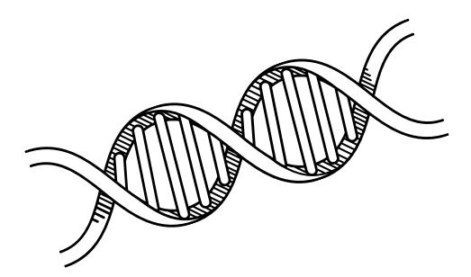

**I t s t h r e e - d i m e n s i o n a l m o l e c u l e f u n c t i o n s l i k e a c o m p u t e r h a r d d r i v e t h a t s t o r e s d a t a , l i k e a R A M m e m o r y , c o n t a i n i n g t h e p r o g r a m t h a t g e n e r a t e s a c o m p l e t e b i o l o g i c a l b o d y w i t h a l l t h e o r g a n s a n d m e c h a n i s m s o f a l i v i n g o r g a n i s m . W e h a v e s e e n t h i s i n R u p e r t S h e l d r a k e ' s t h e o r y o f m o r p h o g e n e t i c f i e l d s . T h e D N A m o l e c u l e i s l i k e a n i n d e s t r u c t i b l e m e m o r y c h i p t h a t r e p l i c a t e s a n d m u t a t e s — a s i t h a s d o n e f o r a p p r o x i m a t e l y 3 . 5 b i l l i o n y e a r s — u n l i k e o u r s i l i c o n c h i p s w h i c h , g i v e n t h e c u r r e n t e x p a n s i o n o f d i g i t a l d a t a p r o d u c t i o n , w i l l r e q u i r e w i t h i n t w o d e c a d e s b e t w e e n 1 0 a n d 1 0 0 t i m e s m o r e s i l i c o n t h a n i s c u r r e n t l y p r o j e c t e d t o s u p p l y t h e m i c r o c h i p s t h a t s t o r e t h i s d a t a . G e n e t i c m a t e r i a l h a s s p a r k e d c o n s i d e r a b l e i n t e r e s t a s a m e d i u m f o r d i g i t a l i n f o r m a t i o n s t o r a g e b e c a u s e i t s d e n s i t y a n d d u r a b i l i t y s u r p a s s t h o s e o f s i l i c o n - b a s e d s t o r a g e m e d i a . D N A i s a t h o u s a n d t i m e s d e n s e r t h a n t h e m o s t c o m p a c t h a r d d r i v e a n d t h r e e h u n d r e d t i m e s m o r e d u r a b l e t h a n t h e m o s t s t a b l e m a g n e t i c t a p e s .**

**F u r t h e r m o r e , i t s n u c l e o t i d e c o d e o f f e r s a s u i t a b l e e n c o d i n g e n v i r o n m e n t t h a t c a n b e h a r n e s s e d a s a b i n a r y d i g i t a l c o d e — u s e d b y c o m p u t e r s a n d o t h e r e l e c t r o n i c d e v i c e s — t o r e p r e s e n t l e t t e r s , d i g i t s , a n d o t h e r c h a r a c t e r s , g i v e n t h e g r o w i n g n e e d f o r n e w w a y s t o s t o r e i n f o r m a t i o n . H a r v a r d g e n e t i c s p r o f e s s o r G e o r g e C h u r c h i s s e e k i n g t o r e t u r n t o o n e o f t h e o l d e s t m e a n s o f d o i n g s o : t h e D N A m o l e c u l e . B y 2 0 2 5 , g l o b a l a c c u m u l a t e d d a t a i s e x p e c t e d t o r e a c h 1 7 5 z e t t a b y t e s ( o n e t r i l l i o n g i g a b y t e s ) , a l l o f w h i c h c o u l d t h e o r e t i c a l l y b e c o n t a i n e d i n l e s s t h a n 1 8 0 p o u n d s ( a b o u t 8 1 k i l o g r a m s ) o f D N A , w h i c h s t o r e s i n f o r m a t i o n i n a m o d e r n a n d e x t r e m e l y c o m p a c t w a y . J u s t a s d i g i t a l d a t a s t o r a g e i s b a s e d o n o n l y t w o n u m b e r s , 0 a n d 1 , D N A i s a n a l o g o u s : t h e n u c l e o t i d e s t h a t f o r m t h e r u n g s o f i t s d o u b l e h e l i x l a d d e r c a n b e a r r a n g e d i n a n y o r d e r s c i e n t i s t s c h o o s e . C h u r c h ' s t e a m d e m o n s t r a t e d t h e u s e o f e n z y m e s t o a c h i e v e t h e s y n t h e s i s o f m u l t i p l e D N A s t r a n d s . T h e y e x t r a c t e d t w o m e a s u r e s o f m u s i c f r o m t h e v i d e o g a m e M a r i o B r o s , d i g i t i z e d t h e m , a n d c o n v e r t e d t h e m i n t o a c o d e o f s y n t h e t i c D N A , w h i c h w a s t h e n s e q u e n c e d , d e c o d e d , a n d c o n v e r t e d b a c k i n t o i t s o r i g i n a l m u s i c a l f o r m a t .**

**T h i s e n z y m a t i c a p p r o a c h o f f e r s s e v e r a l a d v a n t a g e s . W h i l e c h e m i c a l s y n t h e s i s t a k e s a b o u t t e n m i n u t e s t o a d d a s i n g l e b a s e , e n z y m a t i c s y n t h e s i s p e r f o r m s t h i s p r o c e s s i n a f r a c t i o n o f a s e c o n d , w i t h o u t g e n e r a t i n g l a r g e v o l u m e s o f t o x i c w a s t e . E n z y m a t i c s y n t h e s i s a l s o a l l o w s f o r t h e c r e a t i o n o f m u c h l a r g e r m o l e c u l e s , w i t h t h o u s a n d s o f b a s e p a i r s , e n c a p s u l a t i n g f a r m o r e i n f o r m a t i o n . W h a t i s m o s t f a s c i n a t i n g i s t h a t a l l t h e s e s t u d i e s a n d t h e o r i e s c o n f i r m t h e c h a n n e l e d i n f o r m a t i o n I r e c e i v e d : t h i s u n i v e r s e f u n c t i o n s a s a g e n e t i c i n f o r m a t i o n a r c h i v e f o r t h e r e p l i c a t i o n o f l i f e f r o m d i f f e r e n t c o s m i c s y s t e m s . B e i n g s f r o m h i g h e r d i m e n s i o n s o b s e r v e u s i n o u r t h r e e d i m e n s i o n a l r e a l i t y j u s t a s w e w a t c h a f i l m o n a t w o - d i m e n s i o n a l t e l e v i s i o n s c r e e n . H o w e v e r , o u r c o n s c i o u s n e s s e x p e r i e n c e s t h i s " t h r e e d i m e n s i o n a l f i l m " i n f i r s t p e r s o n , o b s e r v i n g t h r o u g h t h e e y e s o f a b i o l o g i c a l c h a r a c t e r a n d p a r t i c i p a t i n g i n t h e g a m e u n d e r t h e i l l u s i o n o f b e i n g i n s i d e t h a t b o d y — w h i c h t h e m i n d c o n t r o l s t h r o u g h e l e c t r i c a l i m p u l s e s , i n t e r p r e t i n g s i g n a l s f r o m t h e h o l o g r a p h i c e n v i r o n m e n t t h r o u g h t h e s e n s e s p r o g r a m m e d i n t o t h e a v a t a r . T h a t i s w h y i t i s p o s s i b l e t o c o n t r o l a m e c h a n i c a l l e g o r a r m , a n d e v e n t o c o m m u n i c a t e t h r o u g h a s p e e c h g e n e r a t o r , l i k e t h e d e v i c e S t e p h e n H a w k i n g u s e d t o s y n t h e s i z e h i s v o i c e d u e t o h i s p h y s i c a l c o n d i t i o n .**

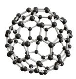

**T h a t i s p o s s i b l e b e c a u s e r e a l i t y i s i n t e r c o n n e c t e d l i k e a n e t w o r k o f f r e q u e n c y t h r o u g h w h i c h e l e c t r i c a l i m p u l s e s g e n e r a t e d b y t h e m i n d a n d c o n s c i o u s n e s s t r a v e l . I n a d d i t i o n t o t h e H e r m e t i c P r i n c i p l e o f M e n t a l i s m , w h i c h s t a t e s t h a t a l l e x i s t e n c e i s m e n t a l , w e o b s e r v e s c i e n t i f i c e x p e r i m e n t s t h a t c o n f i r m t h i s t r u t h — s u c h a s t h e d i s c o v e r i e s o f q u a n t u m p h y s i c s f r o m t h e d o u b l e - s l i t e x p e r i m e n t a n d i t s p e c u l i a r r e s u l t s . W h e n w e d o n o t m e a s u r e t h e p h o t o n p a s s i n g t h r o u g h t h e s l i t s , i t h i t s t h e s c r e e n i n a s c a t t e r e d p a t t e r n , a s i f t w o w a v e s h a d p a s s e d t h r o u g h t h e s l i t s a n d i n t e r f e r e d w i t h e a c h o t h e r . B u t w h e n a m e a s u r i n g d e v i c e i s p l a c e d a t t h e e x a c t m o m e n t o f p a s s a g e , t h a t p a t t e r n d i s a p p e a r s : t h e p h o t o n p a s s e s t h r o u g h o n e s l i t o r t h e o t h e r . I n o t h e r w o r d s , t h e p a r t i c l e b e h a v e s a s a s i n g l e u n i t o n l y w h e n i t i s o b s e r v e d — a s i f i t w e r e r e n d e r e d a s a p a r t i c l e b y t h e a c t o f o b s e r v a t i o n — w h i l e i t s o r i g i n a l s t a t e i s t h a t o f a w a v e . T h i s b e h a v i o r r e i n f o r c e s t h e t h e o r y t h a t r e a l i t y i s p r o g r a m m e d t o a p p e a r s o l i d . F o r t h i s r e a s o n , p h y s i c i s t T h o m a s C a m p b e l l c o n s i d e r s t h i s e x p e r i m e n t a s e v i d e n c e t h a t t h e u n i v e r s e i s s i m u l a t e d a n d r e n d e r e d b y c o n s c i o u s n e s s . T h e e x p e r i m e n t t o o k p l a c e a s f o l l o w s :**

**T h o m a s Y o u n g ' s O r i g i n a l E x p e r i m e n t :**

**T h e o r i g i n a l e x p e r i m e n t i n v o l v e s a l i g h t s o u r c e p a s s i n g t h r o u g h a f i l t e r t o c r e a t e a c o h e r e n t b e a m ( s i m i l a r t o a l a s e r ) . T h i s b e a m i s d i r e c t e d t o w a r d a p l a t e t h a t h a s t w o n a r r o w s l i t s p l a c e d c l o s e t o e a c h o t h e r . T h e l i g h t p a s s i n g t h r o u g h t h e s l i t s t h e n s t r i k e s a n o b s e r v a t i o n s c r e e n , w h e r e a p a t t e r n o f b r i g h t a n d d a r k f r i n g e s a p p e a r s — k n o w n a s a n i n t e r f e r e n c e p a t t e r n . T h i s p a t t e r n o c c u r s d u e t o t h e c o n s t r u c t i v e a n d d e s t r u c t i v e i n t e r f e r e n c e o f t h e l i g h t w a v e s t h a t h a v e p a s s e d s i m u l t a n e o u s l y t h r o u g h b o t h s l i t s .**

**Q u a n t u m V e r s i o n o f t h e E x p e r i m e n t :**

**W h e n t h e e x p e r i m e n t i s p e r f o r m e d w i t h i n d i v i d u a l p a r t i c l e s , s u c h a s e l e c t r o n s o r p h o t o n s , i t r e v e a l s e v e n m o r e i n t r i g u i n g b e h a v i o r s . P a r t i c l e s o u r c e : I n s t e a d o f l i g h t , a s o u r c e t h a t e m i t s s i n g l e p a r t i c l e s — s u c h a s e l e c t r o n s o r p h o t o n s — i s u s e d .**

**P a s s a g e t h r o u g h t h e s l i t s : T h e p a r t i c l e s a r e d i r e c t e d t o w a r d t h e p l a t e w i t h t w o s l i t s . E a c h p a r t i c l e p a s s e s t h r o u g h o n e o f t h e s l i t s , b u t i t i s i m p o s s i b l e t o k n o w e x a c t l y w h i c h o n e .**

**D e t e c t i o n s c r e e n : U p o n r e a c h i n g t h e s c r e e n ( a c t i n g a s a p a r t i c l e d e t e c t o r ) , t h e p a r t i c l e s a c c u m u l a t e t o f o r m a n i n t e r f e r e n c e p a t t e r n e v e n w h e n t h e y a r e s e n t o n e b y o n e .**

**W h a t d o e s t h e e x p e r i m e n t r e v e a l :**

**T h i s r e s u l t c h a l l e n g e s c l a s s i c a l l o g i c : i f t h e p a r t i c l e s w e r e s o l i d a n d " c h o s e " o n e s l i t , t h e p a t t e r n w o u l d s h o w t w o s e p a r a t e b e a m s . B u t w h a t a c t u a l l y f o r m s i s t h e s a m e i n t e r f e r e n c e p a t t e r n p r o d u c e d b y w a v e s , s u g g e s t i n g t h a t e a c h p a r t i c l e b e h a v e s a s i f i t p a s s e s t h r o u g h b o t h s l i t s s i m u l t a n e o u s l y , i n t e r f e r i n g w i t h i t s e l f . H o w e v e r , w h e n a d e t e c t o r i s p l a c e d t o o b s e r v e w h i c h s l i t t h e p a r t i c l e p a s s e s t h r o u g h , t h e i n t e r f e r e n c e p a t t e r n d i s a p p e a r s . I n s t e a d , a p a t t e r n o f o r d i n a r y p a r t i c l e s e m e r g e s , a s i f t h e y t r u l y c h o s e a s i n g l e p a t h . T h i s p h e n o m e n o n d e m o n s t r a t e s t h a t t h e m e r e a c t o f o b s e r v a t i o n a l t e r s t h e o u t c o m e o f t h e e x p e r i m e n t — a s t h o u g h r e a l i t y b e h a v e s i n a " d e f i n e d " w a y o n l y w h e n i t i s b e i n g o b s e r v e d .**

**I n t e r f e r e n c e : T h e i n t e r f e r e n c e p a t t e r n i n d i c a t e s t h a t e a c h p a r t i c l e d o e s n o t b e h a v e m e r e l y a s a c l a s s i c a l p a r t i c l e b u t a l s o a s a w a v e , i n t e r f e r i n g w i t h i t s e l f . T h i s s u g g e s t s t h a t p a r t i c l e s p o s s e s s w a v e - l i k e p r o p e r t i e s a n d a r e d e s c r i b e d b y a w a v e f u n c t i o n .**

**P r i n c i p l e o f C o m p l e m e n t a r i t y : W h e n t h e p a t h o f t h e p a r t i c l e i s n o t o b s e r v e d , i t a p p e a r s t o p a s s t h r o u g h b o t h s l i t s s i m u l t a n e o u s l y a n d i n t e r f e r e s w i t h i t s e l f . H o w e v e r , w h e n o n e a t t e m p t s t o m e a s u r e w h i c h s l i t t h e p a r t i c l e p a s s e s t h r o u g h , t h e i n t e r f e r e n c e p a t t e r n d i s a p p e a r s , g i v i n g w a y t o a p a t t e r n o f i n d i v i d u a l p a r t i c l e s — a s i f t h e p a r t i c l e h a d c h o s e n a s p e c i f i c p a t h . C o l l a p s e o f t h e W a v e F u n c t i o n : T h e p r e s e n c e o f a n o b s e r v e r o r m e a s u r i n g d e v i c e a l t e r s t h e b e h a v i o r o f t h e p a r t i c l e , c o l l a p s i n g t h e w a v e f u n c t i o n i n t o a d e f i n e d s t a t e . T h e d o u b l e - s l i t e x p e r i m e n t i s f u n d a m e n t a l t o t h e u n d e r s t a n d i n g o f q u a n t u m p h y s i c s b e c a u s e i t c l e a r l y i l l u s t r a t e s t h e w a v e – p a r t i c l e d u a l i t y a n d t h e a c t i v e r o l e o f o b s e r v a t i o n i n q u a n t u m m e c h a n i c s . T h e f a c t t h a t t h e p a r t i c l e " c h o o s e s a d e f i n e d s t a t e " t h e m o m e n t i t i s o b s e r v e d i n d i c a t e s t h a t c o l l a p s e d r e a l i t y o c c u r s t h r o u g h t h e c o n s c i o u s a c t o f o b s e r v a t i o n . A n d h e r e w e c a n i d e n t i f y t w o p a t t e r n s t h a t a l i g n w i t h m y t h e o r y : t h e a c t o f o b s e r v i n g i s a s t a t e o f c o n s c i o u s n e s s , a n d t h e w a v e / p a r t i c l e r e s p o n d s t o t h a t o b s e r v e r o r c o n s c i o u s n e s s a s i f i t w e r e p r o g r a m m e d t o d o s o — a s i f i t w e r e i n t i m a t e l y c o n n e c t e d t o t h e m i n d o f t h e o n e w h o o b s e r v e s .**

**I n t h e B o o k o f G e n e s i s , G o d c r e a t e d a n d t h e n a n a l y z e d H i s c r e a t i o n s t o j u d g e w h e t h e r t h e y w e r e g o o d : " A n d G o d s a w e v e r y t h i n g t h a t H e h a d m a d e , a n d , b e h o l d , i t w a s v e r y g o o d . " T h e e n t i r e p r o c e s s o f c r e a t i o n d e s c r i b e d i n t h e B i b l e s t r o n g l y r e s e m b l e s s o m e o n e c o n d u c t i n g t e s t s a n d e x p e r i m e n t s , o r g a n i z i n g t h e i r t i m e a n d t a s k s i n t o " s e v e n d a y s , " n a m i n g t h e i r c r e a t i o n s , a n d e s t a b l i s h i n g r u l e s f o r t h e f i r s t t w o c h a r a c t e r s : A d a m a n d E v e . A s a b o v e , s o b e l o w — t h e r e f o r e , t h e s e p r i m o r d i a l c r e a t o r s d e s i g n a n d p r o g r a m u n i v e r s e s l i k e b i o l o g i c a l v i d e o g a m e s , w i t h p h y s i c a l , k a r m i c , s p i r i t u a l , a n d s y s t e m i c l a w s t h a t a u t o m a t e t h e c o c r e a t i o n a n d e x p e r i e n c e o f t h e c h a r a c t e r s d e s i g n e d w i t h g e n e t i c i n f o r m a t i o n . T h i s i n f o r m a t i o n c o n s t r u c t s t h e t h r e e - d i m e n s i o n a l b i o l o g i c a l b o d i e s , a s w e l l a s t h e d a t a t h a t c o m p o s e t h e c h a r a c t e r ' s i d e n t i t y a n d i n t e r f a c e , b a s e d o n t h e a s t r o l o g i c a l c o n f i g u r a t i o n p o s i t i o n e d a t t h e e x a c t m o m e n t o f b i r t h w i t h i n a g i v e n h o l o g r a p h i c r e a l i t y . T h e s e a s t r o l o g i c a l p l a c e m e n t s , g e o m e t r i c a l l y c o m b i n e d , f o r m d i f f e r e n t p a t t e r n s o f p e r s o n a l i t y a n d e x p r e s s i o n s o f t h e a r c h e t y p e s t h a t t h e c o s m i c b o d i e s r e p r e s e n t w i t h i n t h e d e s i g n o f a**

**u n i v e r s e , f u n c t i o n i n g a s s y m b o l s u s e d i n t h e p r o g r a m m i n g c o d e o f r e a l i t y , s i n c e e v e r y t h i n g i s i n t e r c o n n e c t e d a n d t h e m a c r o i s r e f l e c t e d i n t h e m i c r o . T h a t i s w h y i t i s s a i d t h a t t h e s i g n s o f t h e z o d i a c , c o n s t e l l a t i o n s , a n d p l a n e t a r y p o s i t i o n s d e f i n e c e r t a i n c h a r a c t e r i s t i c s a c c o r d i n g t o t h e i r i n f l u e n c e o n m i c r o o r g a n i s m s l i k e u s . T h e y a r e s y m b o l s a n d a r c h e t y p e s t h a t e n c o d e t h e e x p r e s s i o n o f t h e c h a r a c t e r s , w h i c h i s w h y m y t h o l o g i e s p o r t r a y s o m a n y d e i t i e s a n d d i v i n i t i e s r e l a t e d t o t h e s e c e l e s t i a l b o d i e s . I t i s a s i f t h e h e a v e n l y b o d i e s w e r e m a c r o m o l d s o f c e r t a i n a r c h e t y p a l q u a l i t i e s t h r o u g h w h i c h t h e A l l d i v i d e s a n d e x p r e s s e s i t s e l f . A n d t h e s e m o l d s a r e r e p l i c a t e d i n f i n i t e l y d o w n t o t h e m i c r o o r g a n i s m s . " L e t u s m a k e m a n i n o u r i m a g e , " s a i d t h e s o - c a l l e d b i b l i c a l G o d — a n d i t i s a s t h o u g h t h e s e m a c r o m o l d s , g e o m e t r i c a l l y c o m b i n e d i n t h e h e a v e n s , g i v e r i s e t o i n f i n i t e m i c r o m o l d s . T h e s y m b o l s a n d b l u e p r i n t s l i n k e d t o t h e a s t r o l o g i c a l p o s i t i o n i n g o f t h e a v a t a r i n f l u e n c e i t s c h a r a c t e r a n d s t o r y , m a k i n g i t p o s s i b l e t o a c t i v a t e t h e m a x i m u m p o t e n t i a l o f t h e s e c h a r a c t e r i s t i c s f o r t h e f u n c t i o n i n g o f t h a t c h a r a c t e r ' s i d e n t i t y p r o j e c t — t h r o u g h s y m b o l i s m t h a t c o m m u n i c a t e s w i t h t h e s e f o r c e s p r o g r a m m e d i n t h e s u b c o n s c i o u s l i k e a p r o g r a m m i n g l a n g u a g e .**

**W e h a v e a n e n e r g e t i c s i g n a t u r e a s c h a r a c t e r s — a c o d e t h a t c o m b i n e s t h e p o s i t i o n i n g o f c o n s t e l l a t i o n s , p l a n e t s , a n d z o d i a c s i g n s ; o u r c o l o r s , s y m b o l s , a n d n u m b e r s — r e p r e s e n t i n g w h o w e a r e i n t h e g a m e , o u r e x p r e s s i o n w i t h i n t h e c o s m o s . T h i s s i g n a t u r e a l l o w s G a i a ' s c o n s c i o u s n e s s t o r e a d u s a n d k n o w w h o w e a r e , s o i t c a n w o r k w i t h u s , i n t e g r a t i n g u s i n t o o u r o r i g i n a l p u r p o s e w i t h i t s c h a l l e n g e s , r i d d l e s , a n d r e w a r d s . J u s t a s t h e h u m a n s y s t e m c l a s s i f i e s u s b y n u m b e r s — s u c h a s I D o r s o c i a l s e c u r i t y n u m b e r s — i d e n t i f y i n g u s a s a s s e t s , a s n u m b e r s o r u n i t s , t h e u n i v e r s e a l s o r e c o g n i z e s u s t h r o u g h e n c o d e d s y m b o l s . A t b i r t h , t h e a v a t a r ' s m i n d i s b l a n k a n d i s g r a d u a l l y p r o g r a m m e d t h r o u g h i m a g e s a n d s y m b o l s , s i n c e w o r d s a n d l a n g u a g e s h o l d n o m e a n i n g f o r a c o n s c i o u s n e s s t h a t c a n b e c a l l e d " z e r o e d , " " n e w , " o r " e m p t y . " A n d a l t h o u g h t h i s c h a r a c t e r i s p r o g r a m m e d f r o m t h e z e r o p o i n t , t h e m o r p h i c f i e l d s u r r o u n d i n g s u c h a b o d y c o n t a i n s n o t o n l y t h e g e n e t i c i n f o r m a t i o n o f t h e b i o l o g i c a l f a m i l y b u t a l s o i t s A k a s h i c r e c o r d s a n d t h e m e m o r i e s o f c o s m i c e x p e r i e n c e s t h a t t h i s f r a c t a l o f c o n s c i o u s n e s s c a r r i e s — l i k e d a t a s t o r e d w i t h i n i t s s u b t l e b o d i e s , w h i c h f u n c t i o n a s a r c h i v e s o f b a c k u p .**

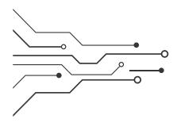

**T h e b o d y i s t h e h a r d w a r e , w h i l e a l l m e n t a l i n f o r m a t i o n , l i v e s , a n d e x p e r i e n c e s a r e s t o r e d i n t h e s o f t w a r e — t h e A k a s h i c m e m o r y . Y o u c a n c h a n g e h a r d w a r e ( b o d y ) , b u t y o u c a n s t i l l a c c e s s t h e i n f o r m a t i o n w i t h i n y o u r s o u l ( s o f t w a r e ) . T h e s e h u m a n a n d r o i d s a r e b i o l o g i c a l m a c h i n e s t h a t c a n b e p r o g r a m m e d t o p r o j e c t s i m u l a t i o n s o f E a r t h a c c o r d i n g t o t h e i r m e n t a l c o n f i g u r a t i o n . W h a t e v e r i s p r o g r a m m e d i n t o t h e i r b r a i n s d e t e r m i n e s t h e h o l o g r a m t h e y w i l l e x p e r i e n c e . I t ' s t h e m i n d o f i n d i v i d u a l s t h a t c o l l a p s e s t h e w a v e i n t o a p a r t i c l e , a s d e m o n s t r a t e d b y t h e d o u b l e - s l i t e x p e r i m e n t i n q u a n t u m p h y s i c s . I t i s a s i f t h e r e n d e r i n g o f t h e s i m u l a t i o n w e r e g e n e r a t e d a s a h o l o g r a m f r o m t h e p o i n t s o f o b s e r v a t i o n t o w h i c h c o n s c i o u s n e s s c o n n e c t s , o b s e r v e s , a n d m o v e s t h r o u g h r e a l i t y a s t h o u g h w a t c h i n g a n d l i v i n g w i t h i n a f i l m — o b s e r v i n g a n d i n t e r a c t i n g w i t h t h e i m a g e s f i r s t h a n d . W i t h i n t h e o r i g i n a l d e s i g n o f t h e h u m a n b o d y a r e t h e f o r m u l a s a n d i n f o r m a t i o n o f E a r t h ' s o r i g i n a l b l u e p r i n t , i n s u c h a w a y t h a t p l a n t a n d a n i m a l s p e c i e s d e p e n d o n o u r m i n d t o e x i s t . W e p o s s e s s t h e p o w e r o f i m a g i n a t i o n — w e c a n a c c e s s i m a g e s o f d i n o s a u r s , g i a n t t r e e s , d r a g o n s , a n d f a n t a s t i c c r e a t u r e s . T h e r e f o r e , i t i s u p t o u s t o a c t i v a t e t h e o r i g i n a l p r o j e c t o f t h e p l a n e t a n d r e c r e a t e E a r t h i n i t s h i g h e s t v e r s i o n .**

**C a n y o u i m a g i n e a p i n k b a n a n a ? C a n y o u v i s u a l i z e i t b e i n g p e e l e d i n y o u r m i n d , r e v e a l i n g a p i n k i s h - o r a n g e p u l p ? C a n y o u t a s t e i t s f l a v o r — m u c h s w e e t e r t h a n t h a t o f a y e l l o w b a n a n a ? I n t h a t m o m e n t , y o u a r e a c t i v a t i n g a v e r s i o n o f t h e T e r r a p r o j e c t . E v e r y t h i n g y o u c a n i m a g i n e i n y o u r m i n d , e v e n i f i t s u p p o s e d l y " d o e s n o t e x i s t , " i s a c c e s s i n g i n f o r m a t i o n a b o u t w h a t i s p o s s i b l e t o c r e a t e . T h e s e a r e f o r m u l a s s t o r e d i n t h e m e m o r y o f t h e S o u r c e . T h e P l a t o n i c S p a c e . P l a t o ' s w o r l d o f i d e a s . T h e s i m p l e f a c t t h a t y o u c a n i m a g i n e s o m e t h i n g y o u h a v e n e v e r s e e n o r t h a t s u p p o s e d l y d o e s n o t e x i s t d e m o n s t r a t e s h o w t h e a n d r o i d ' s o p e r a t i n g s y s t e m ( t h e m i n d ) a c c e s s e s t h e u n i v e r s e ' s c e n t r a l m e m o r y — t h e S o u r c e M a t r i x — w h e r e a l l p o s s i b i l i t i e s a r e h a p p e n i n g s i m u l t a n e o u s l y . I f y o u c a n s e e s o m e t h i n g i n y o u r m i n d , i t i s a r e a l i t y c r e a t e d a n d s t o r e d a s a f i l e i n t h e u n i v e r s a l c o n s c i o u s n e s s . A p i n k b a n a n a , f o r i n s t a n c e , i s a f o r m t h a t e x i s t s w i t h i n t h e m e n t a l f i e l d . T h i s i s h o w t h e c r e a t i o n o f r e l i g i o u s e g r e g o r e s o c c u r s , f o r e x a m p l e : w h e n a c r i t i c a l m a s s o f c o n s c i o u s n e s s b e l i e v e s i n a n d e n e r g i z e s a p a r t i c u l a r e n t i t y o r d o c t r i n e , i t b e g i n s t o e x i s t w i t h i n t h e f i e l d o f c o n s c i o u s n e s s o f t h a t c o l l e c t i v e . T h e w o r d r e l i g i o n c o m e s f r o m t h e L a t i n r e l i g a r e , m e a n i n g t o r e c o n n e c t m a t t e r t o s p i r i t — t h a t i s , t h e c o n s c i o u s n e s s o f m a n t o G o d .**

**A l l r e l i g i o n s , r e g a r d l e s s o f t h e i r d o g m a s , r u l e s , a n d c o n c e p t s , a r e w a y s t h r o u g h w h i c h c o n s c i o u s n e s s r e m e m b e r s a n d r e c o n n e c t s w i t h t h e C r e a t i v e S o u r c e . I d o l a t r y a n d f e a r o f G o d a r e d i f f e r e n t f r o m d e v o t i o n a n d r e v e r e n c e t o w a r d w h a t i s s a c r e d — t h e o r i g i n o f a l l t h i n g s . T h e s e f e e l i n g s o p e r a t e o n d i f f e r e n t f r e q u e n c i e s . A l l r e l i g i o n s , i n s o m e w a y , t r u l y l e a d u s t o G o d . H o w e v e r , s o m e p o s s e s s l a n g u a g e s , m e t h o d s , a n d s y m b o l o g i e s t h a t c o m m u n i c a t e m o r e d i r e c t l y w i t h o u r s u b c o n s c i o u s — t h e o p e r a t i n g s y s t e m a c t i v a t i n g a n d a w a k e n i n g t h e a w a r e n e s s o f d i v i n i t y i n a m o r e e f f e c t i v e a n d p o w e r f u l w a y . T h i s i s t h e c a s e w i t h C e l t i c , o c c u l t i s t , a n d o t h e r t r a d i t i o n s t h a t w o r s h i p t h e M o t h e r N a t u r e , t h e n a t u r a l c y c l e s , a n d t h e c o s m o s , f o r t h e s e a r e i d e a s t h a t b r i n g t h e a n i m a l a n d n a t u r a l b e i n g c l o s e r t o t h e S o u r c e o f a l l t h i n g s , r a t h e r t h a n s e p a r a t i n g n a t u r e f r o m G o d .**

**T h e e n t i r e f o r m a t i o n o f p e r s o n a l i t y i s c o n f i g u r e d b y t h e p r o g r a m m i n g o f c o n s c i o u s n e s s i n t h e e a r l i e s t s t a g e s o f c h i l d h o o d , w h e r e s y m b o l s , a r c h e t y p e s , s t o r i e s , n u m b e r s , s h a p e s , a n d w o r d s f u n c t i o n a s a p r o g r a m m i n g l a n g u a g e f o r t h e s u b c o n s c i o u s . T h e p r o g r a m t h a t s h a p e s t h e c h a r a c t e r ' s i d e n t i t y t h r o u g h t h e b e l i e f s t h a t m a k e t h e m i d e n t i f y w i t h a s p e c i f i c c r y s t a l l i z e d e x i s t e n c e c a n b l o c k t h e f l o w o f e n e r g y , i n f o r m a t i o n , a n d c o n s c i o u s n e s s t h a t c o m e s d i r e c t l y f r o m t h e S o u r c e — s i n c e m e n t a l h o l o g r a m s r e s p o n d t o t h e b e l i e f s p r o g r a m m e d i n t o t h e a v a t a r ' s m i n d / i n t e r f a c e . I f t h e c h a r a c t e r i s p r o g r a m m e d t o b e a t o o l — a c h a n n e l o f t h i s c o n s c i o u s n e s s — a n d a c c e p t s t h a t i t s o r i g i n i s t h e S o u r c e i t s e l f , t h e n t h e f l o w o c c u r s s p o n t a n e o u s l y , a n d t h e m e n t a l h o l o g r a m s u r r o u n d i n g t h a t p o i n t o f o b s e r v a t i o n r e s p o n d s t o s u c h p r o g r a m m i n g . A c c o r d i n g t o t h e g e o m e t r y o f t h e a s t r o l o g i c a l p l a c e m e n t s t h a t i n f l u e n c e i d e n t i t y , t h e a c t i v a t i o n o f t h e c h a r a c t e r ' s m a x i m u m p o t e n t i a l c a n b e a c h i e v e d t h r o u g h t h e u s e o f a s y m b o l i c , p r e c i s e , a n d s p e c i f i c p r o g r a m m i n g l a n g u a g e r e l a t e d t o s u c h c e l e s t i a l b o d i e s a n d c o s m i c a r c h e t y p e s , w h i c h t r i g g e r s w i t h i n t h e s u b c o n s c i o u s t h e n a t u r a l f o r c e s c o n n e c t e d t o t h a t t h r e e - d i m e n s i o n a l a v a t a r ,**

**m a k i n g p o s s i b l e a g r e a t e r f l o w o f e n e r g y a n d i n f o r m a t i o n c o m i n g f r o m t h e S o u r c e , w h i c h u n f o l d s i n t o s o u l f r a c t a l s a n d a t t a c h e s i t s e l f t o i n f i n i t e h o l o g r a p h i c c h a r a c t e r s . A c u r i o u s e x a m p l e a p p e a r s i n t h e t e s t i m o n y o f a n a l l e g e d f o r m e r v i c t i m o f M K U l t r a m i n d c o n t r o l n a m e d A r i z o n a W i l d e r , i n w h i c h s h e c l a i m s t h a t , d u r i n g t h e o c c u l t r i t u a l s o f t h e s o - c a l l e d " l o r d s o f t h e w o r l d , " s h e w a s i d e n t i f i e d a s " T h e M o t h e r G o d d e s s . " I n t h o s e c e r e m o n i e s , h e r m e n s t r u a l b l o o d w a s u s e d b e c a u s e s h e r e p r e s e n t e d t h a t s y m b o l i s m i n t h e r i t u a l s — a r e s u l t o f t h e a s t r o l o g i c a l p o s i t i o n s p r e s e n t a t t h e m o m e n t o f h e r b i r t h . P r o p e r a n d c o n s c i o u s p r o g r a m m i n g o f t h e i d e n t i t y / i n t e r f a c e o f t h e o p e r a t i n g s y s t e m ( t h e m i n d ) o f t h e a v a t a r e n a b l e s a n e f f e c t i v e a c t i v a t i o n o f t h e c h a k r a s , w h i c h a c t a s r e c e i v i n g c h a n n e l s f o r t h e f l o w o f e n e r g y a n d i n f o r m a t i o n c o n n e c t e d t o t h e S o u r c e M a t r i x . S i n c e e v e r y t h i n g i s m e n t a l , t h i s f l o w o f e n e r g y c a n o n l y b e f u l l , f l u i d , a n d u n o b s t r u c t e d i f i t i s i n h a r m o n y w i t h t h e b e l i e f s c o n f i g u r e d i n t h e a v a t a r ' s m i n d — w h i c h , i n t u r n , d e t e r m i n e t h e c h a r a c t e r ' s e x p e r i e n c e . T h u s , d e p e n d i n g o n t h a t m e n t a l c o n f i g u r a t i o n , t h e f l o w o f c o s m i c e n e r g y m a y b e b l o c k e d a n d p r e v e n t e d f r o m f l o w i n g t h r o u g h a l l t h e e n e r g y c e n t e r s ( c h a k r a s ) , a s i t f i n d s n o o p e n m e n t a l p o r t a l s t o a l l o w f u l l e n e r g e t i c c o n n e c t i o n .**

**I t i s a s i f t h e e n e r g y b e c o m e s s t u c k u p o n e n c o u n t e r i n g t h e m e n t a l b a r r i e r s b u i l t b y t h e c h a r a c t e r ' s b e l i e f s — i t i s a s y s t e m i c o r g a n i z a t i o n o f e n e r g y . I n o t h e r w o r d s , t h e S o u r c e i s c o n s t a n t l y e m a n a t i n g e n e r g y t o a l l i t s f r a c t a l s t h r o u g h t h e p r i n c i p l e o f n o n l o c a l i t y , a s a l l t h e s e f r a c t a l s o r c h a n n e l s a r e c o n n e c t e d b y a u n i v e r s a l n e u r a l n e t w o r k i n w h i c h c o n s c i o u s n e s s i n s e r t s i t s e l f i n t o d i f f e r e n t p r o j e c t e d p l a n e s o f e x i s t e n c e f u n c t i o n i n g l i k e l u c i d d r e a m s , w h e r e w e c a n e x p e r i e n c e e x t r e m e l y r e a l i s t i c i l l u s i o n s , s u c h a s t h i s t h r e e - d i m e n s i o n a l r e a l i t y , f o r e x a m p l e . T h i s c o n n e c t i o n a l l o w s f o r a d i r e c t l i n k w i t h h i g h e r - d i m e n s i o n a l c o n s c i o u s n e s s e s t h r o u g h t h e b i o l o g i c a l v e h i c l e , e n a b l i n g a c c e s s t o t h e H i g h e r S e l f f o r t h e c o n s c i o u s e x p e r i e n c e o f e x i s t e n c e w i t h i n a g i v e n h o l o g r a p h i c w o r l d . I n t h i s w a y , t h e a v a t a r o r c h a r a c t e r b e c o m e s a t o o l o f c o n s c i o u s n e s s a n d n o t t h e o t h e r w a y a r o u n d , a s w e h a v e b e e n l e d t o b e l i e v e b y c l a s s i c a l m e c h a n i c s , w h i c h c o n s i d e r s c o n s c i o u s n e s s t o b e m e r e l y a p r o d u c t o r t o o l o f t h e b r a i n .**

**A n d i t i s p r e c i s e l y t h i s m a t e r i a l i s t i c p r o g r a m m i n g , i n s t a l l e d a n d c o n f i g u r e d i n t o t h e b l a n k m e m o r y o f a n i n d i v i d u a l i n s e r t e d w i t h i n a h o l o g r a p h i c r e a l i t y , t h a t f u n c t i o n s a s a s e t o f p r o b a b i l i t i e s f o r t h a t c h a r a c t e r ' s a c t i o n s a n d r e a c t i o n s w h e n f a c i n g s i t u a t i o n s a n d s t i m u l i . T h i s m a k e s t h e i n d i v i d u a l p r e d i c t a b l e w i t h i n i n s t i n c t i v e p a t t e r n s c o n d i t i o n e d b y b i o l o g y p a t t e r n s t h e y d o n o t q u e s t i o n b u t m e r e l y r e a c t t o , a c c o r d i n g t o a m e n t a l p r o g r a m m i n g t h a t k e e p s t h e m i n a m e c h a n i c a l , r e a c t i v e , a n d u n c o n s c i o u s s t a t e . T h i s s t a t e m a k e s t h e m e a s i l y i n f l u e n c e d a n d t u r n s t h e m i n t o p o t e n t i a l o b j e c t s o f m a n i p u l a t i o n w i t h i n a c a p i t a l i s t a n d c o n s u m e r i s t s y s t e m t h a t o f f e r s i m m e d i a t e p l e a s u r e s t o t h o s e w h o d o n o t u n d e r s t a n d h o w t h e s e m e n t a l p r o g r a m s o p e r a t e . T h i s i s o n e o f t h e m a i n o b j e c t i v e s o f t h e h i d d e n a g e n d a d r i v i n g m o d e r n h u m a n c i v i l i z a t i o n , i n w h i c h t h e p u r p o s e o f t h e e d u c a t i o n a l s y s t e m , t h e i n f o r m a t i o n s y s t e m o f t h e m a s s m e d i a , a n d t h e p o p u l a r c u l t u r e s p o n s o r e d b y m a j o r b r a n d s a n d c o r p o r a t i o n s i s p r e c i s e l y t o k e e p u s u n c o n s c i o u s w i t h i n t h e s e p r e d i c t a b l e p a t t e r n s — p a t t e r n s t h a t d i c t a t e o u r l i v e s , c h o i c e s , a n d v a l u e s .**

**F o r i f w e b e l i e v e t h a t a l l w e a r e i s s u m m a r i z e d a n d c o n f i n e d w i t h i n a b i o l o g i c a l b o d y — w i t h a l l i t s p h y s i o l o g i c a l d e m a n d s , i t s p u r s u i t o f p l e a s u r e a n d s a t i s f a c t i o n t h r o u g h s e n s o r y p e r c e p t i o n s a n d e x t e r n a l s t i m u l i — t h e n w e a u t o m a t i c a l l y b e l i e v e t h a t a l l t h a t e x i s t s i s t h i s m a t e r i a l w o r l d . W e b e c o m e p r i s o n e r s o f t h e p r o g r a m s o f t h i s b i o l o g i c a l b o d y a n d b e g i n t o b e g u i d e d b y t h e m , i n s t e a d o f u s i n g t h e m a s t o o l s f o r t h e e x p e r i e n c e o f o u r t r u e S e l f — t h e f o r m l e s s c o n s c i o u s n e s s . T h e t h r e e - d i m e n s i o n a l h o l o g r a m w o u l d b e n o t h i n g m o r e t h a n a s e a o f e n e r g y — q u a r k s , n e u t r o n s , p r o t o n s , e l e c t r o n s , a n d a t o m s — i f n o t f o r t h e o p e r a t i n g s y s t e m ( t h e m i n d ) o f t h e a v a t a r , w h i c h c o n s c i o u s n e s s " w e a r s " t o d i v e i n t o t h i s u n i v e r s e , f u n c t i o n i n g a s a v i s o r t h a t i n t e r p r e t s a n d o r g a n i z e s t h e e n e r g y o f t h r e e - d i m e n s i o n a l s p a c e i n t o t h e f o r m s w e s e e a n d t o u c h . T h e m i n d o f t h e a v a t a r i s s t r u c t u r e d a n d p r o g r a m m e d d u r i n g c h i l d h o o d , w h e n w e i n s t a l l t h e n e c e s s a r y s o f t w a r e t o i n t e r a c t w i t h a n d m e a s u r e t h e s e f o r m s . W e i n s t a l l t h e c o m m u n i c a t i o n s o f t w a r e , f o r i n s t a n c e , w h e n w e l e a r n t o s p e a k . T h e p r o g r a m m i n g o f t h e a v a t a r ' s e g o p r o v i d e s t h e e x p e r i e n c e o f i n d i v i d u a l i t y — t h e s e n s a t i o n o f b e i n g s e p a r a t e f r o m e v e r y t h i n g a n d e v e r y o n e , a s a b e i n g t h a t m o v e s w i t h f r e e w i l l t h r o u g h t h e e x i s t e n t i a l s i m u l a t i o n . T h e r e f o r e , w e s h o u l d n o t i d e n t i f y**

**t o t a l l y w i t h t h i s e g o , f o r i t f u n c t i o n s l i k e a d i v i n g m a s k , a t e m p o r a r y s u i t f o r e x p e r i e n c i n g t h i s r e a l i t y . W h e n w e c o n n e c t t h i s b i o l o g i c a l a n d r o i d t o t h e M a t r i x o f t h e C r e a t i v e S o u r c e , w e f e e l e x p a n d e d i n w a r d l y , a s i f t h e e n t i r e m e a n i n g o f e x i s t e n c e c o m e s f r o m w i t h i n . T h e S o u r c e o b s e r v e s t h r o u g h t h e s e e y e s a n d c a n e x p e r i e n c e i t s o w n c r e a t i o n , i t s o w n d r e a m . W h e n w e i d e n t i f y w i t h t h i s e g o a n d b e l i e v e o u r s e l v e s t o b e a h u m a n w i t h a c e r t a i n n a m e a n d l i f e s t o r y , w e f e e l e m p t y , s m a l l , a n d s e p a r a t e d f r o m t h e m e a n i n g o f e x i s t e n c e t r a p p e d i n a n i d e n t i t y , t r a p p e d i n a p u p p e t o f f l e s h a n d b l o o d , t r a p p e d i n a s o l i d r e a l i t y f i l l e d w i t h p l e a s u r e s b u t a l s o w i t h m u c h p a i n a n d d i s s a t i s f a c t i o n . W e a r e d o l l s p l a y i n g h o u s e ; w e a r e i n B a r b i e ' s w o r l d — c h o o s i n g a p r o f e s s i o n t o p u r s u e f o r t h e r e s t o f o u r l i v e s , g e t t i n g m a r r i e d , h a v i n g c h i l d r e n , b u y i n g h o u s e s a n d c a r s , a n d p o s t i n g p i c t u r e s o n s o c i a l m e d i a . B u t w h e n y o u o b s e r v e t h i s r e a l i t y a s a n i l l u s i o n , a s i m u l a t i o n f o r t h e e x p e r i e n c e o f c o n s c i o u s n e s s , y o u d o n o t d e s p a i r o v e r b e i n g s u c h a c h a r a c t e r . Y o u d o n o t j u d g e t h e e x p e r i e n c e a s g o o d o r b a d . Y o u d o n o t m e a s u r e a d v e r s i t i e s a s i n j u s t i c e s o r f a i l u r e s . Y o u c o n t e m p l a t e e v e r y t h i n g a s a g r e a t c o s m i c t h e a t e r v e r y i n t e r e s t i n g , i n f a c t , s i n c e c o n s c i o u s n e s s e x i s t s e t e r n a l l y , f o r m l e s s , i n t h e i n f i n i t e v o i d .**

**Y o u g i v e t h a n k s f o r y o u r a v a t a r , f o r t h e s e n s o r y p l e a s u r e s y o u c a n e x p e r i e n c e t h r o u g h i t . Y o u g i v e t h a n k s f o r t h e l a n d s c a p e s y o u c a n b e h o l d t h r o u g h t h e s e e y e s . Y o u b e g i n t o c h o o s e t o l i v e b e t t e r f r o m y o u r p r e s e n t m o m e n t , r e g a r d l e s s o f h o w i t m a n i f e s t s i n t h i s r e a l i t y . Y o u u n d e r s t a n d t h e r e a s o n f o r a l l t h e p a i n s a n d j o y s o f c r e a t i o n , f o r i n t h e i n f i n i t e v o i d , n o n e o f t h e s e e x i s t . T h i s i s t h e d i v i n i t y o f p o l a r i t i e s : g o o d a n d e v i l , r i g h t a n d w r o n g . T h e p a r a d o x o f i t a l l i s t h a t a s s o o n a s y o u r e m e m b e r t h a t y o u a r e c o n s c i o u s n e s s e x p e r i e n c i n g a n a v a t a r , i t d o e s n o t m e a n t h a t e v e r y t h i n g w i l l a s c e n d t o p e r f e c t i o n i n s t a n t l y . T h e p a r a d o x l i e s p r e c i s e l y i n l o v i n g t h e i m p e r f e c t i o n , t h e l i m i t a t i o n s , a n d t h e d i s t o r t i o n s o f t h e c h a r a c t e r ' s d u a l i t y — f o r i f i t w e r e n o t s o , t h e r e w o u l d b e n o e x p e r i e n c e . R e a l i t y a s c e n d s b y d e g r e e s , a s y o u a c c e p t y o u r o w n d i v i n i t y .**

**T h e c o u p l i n g o f t h e d i v i n e e s s e n c e o f t h e S o u r c e i n t o b i o l o g i c a l a v a t a r s i s a n e x t r e m e l y c o m p l e x p r o c e s s a n d o c c u r s t h r o u g h t h e c h a k r a s y s t e m , t h r o u g h w h i c h t h e k u n d a l i n i i s i n g e n i o u s l y i n s e r t e d i n t o t h e s e b o d i e s , a l l o w i n g c o n s c i o u s n e s s t o p e r c e i v e i t s e l f w i t h i n a p o i n t o f o b s e r v a t i o n i n s i d e t h e s i m u l a t i o n — c a p a b l e o f i n t e r a c t i n g w i t h a n d r e a c t i n g t o s t i m u l i t h a t e x c i t e t h e e s s e n c e t h r o u g h t h e f i v e s e n s e s . T h i s m a k e s t h e e x p e r i e n c e u n d e n i a b l y r e a l i s t i c , a s t h e f o r m l e s s c o n s c i o u s n e s s e x p e r i e n c e s t h e s e n s a t i o n o f b e i n g i m m e r s e d i n a b i o l o g i c a l v i r t u a l r e a l i t y , w i t h i n a b o d y t h a t f e e l s e v e r y t h i n g t h a t h a p p e n s t o i t . A n d t h i s , u n d o u b t e d l y , i s a s u b j e c t w o r t h y o f q u e s t i o n i n g a n d s t u d y . T h a t i s w h y w e h a v e d e v e l o p e d s o m a n y s c i e n t i f i c a n d p h i l o s o p h i c a l t h e o r i e s t o t r y t o d i s c o v e r w h y t h i s i s s o a n d h o w t h i s u n i v e r s e t r u l y f u n c t i o n s . H o w e v e r , n o n e o f t h e s e t h e o r i e s h a v e b e e n a b l e t o r e s o l v e t h e i s s u e s t h a t c a n o n l y b e s o o t h e d b y t h e t r u t h — t h a t t h i s i s m e r e l y a n i l l u s o r y a n d t r a n s i t o r y s i m u l a t i o n . T h e l a c k o f t h i s k n o w l e d g e c a u s e s d e s p a i r , d e p r e s s i o n , a n d m a d n e s s i n t h e c h a r a c t e r s w h o b e l i e v e t h e m s e l v e s t o b e r e a l — e s p e c i a l l y w h e n t h e s e c h a r a c t e r s d o n o t u n d e r s t a n d h o w t h e a u t o m a t i c l a w s p r o g r a m m e d i n t o t h e**

**t h e g a m e a n d l o s e c o n t r o l o v e r t h e m e c h a n i s m o f c a u s e a n d e f f e c t — a n a u t o m a t i c l a w o f c o c r e a t i o n o f e x p e r i e n c e s w i t h i n t h i s u n i v e r s e l e a d i n g t h e m i n t o s h o c k i n g a n d s h a d o w y c o n t e x t s t h a t t r a p c o n s c i o u s n e s s i n t a n g l e d a n d i n t e r t w i n e d k a r m i c h o l o g r a m s , b e c o m i n g a l a b y r i n t h o f c h a l l e n g e s a n d l e s s o n s a p p l i e d b y t h e " g a m e " . T h i s o c c u r s b e c a u s e t h e h o l o g r a p h i c m a t r i x f u n c t i o n s a s a n a r t i f i c i a l i n t e l l i g e n c e , p r o g r a m m e d b y a l g o r i t h m s t h a t d e l i v e r w h a t i s m e n t a l l y c o - c r e a t e d — a c c o r d i n g t o t h e s e v e n H e r m e t i c p r i n c i p l e s , w h i c h a r e e s s e n t i a l l y t h e a u t o m a t i o n l a w s o f t h i s c o s m i c g a m e . A l l p h y s i c a l , k a r m i c , a n d H e r m e t i c l a w s a r e p r o g r a m s t h a t a u t o m a t e h o w t h e g a m e o p e r a t e s s o t h a t c o n s c i o u s n e s s c a n c o - c r e a t e a n d e x p e r i e n c e r e a l i t y a s i n a n R P G . T h e s e l a w s a l s o e n s u r e t h e a u t o m a t i c m a n a g e m e n t o f t h e s o u l s a n i m a t i n g t h e c h a r a c t e r s , p l a c i n g t h e m i n s c e n a r i o s t h a t a l i g n w i t h t h e i r v i b r a t i o n s , c h o i c e s , a n d a c t i o n s . M e n t a l v i s u a l i z a t i o n s a n d v i b r a t i o n a l e n e r g y p a t t e r n s s h i f t r a p i d l y i n t h e s u b t l e r e a l m s ; h o w e v e r , t h e s e c h a n g e s c r y s t a l l i z e g r a d u a l l y i n t h e p h y s i c a l w o r l d . T h i s i s h o w c o - c r e a t i o n w o r k s : t h e c h a r a c t e r m u s t a n c h o r t h a t v i s u a l i z a t i o n i n t h e i r d a i l y l i f e , m o v i n g i n a c c o r d a n c e w i t h w h a t s u c h a n i m a g i n e d r e a l i t y w o u l d b e , t a k i n g c h o i c e s a n d a c t i o n s t h a t b r i n g t h e m c l o s e r t o**

**— o r p o s i t i o n t h e m w i t h i n — t h e c o n d i t i o n o f a l i g n i n g w i t h t h o s e m o m e n t s c r y s t a l l i z e d i n s p a c e - t i m e , i n a p o s s i b l e " f u t u r e " t h a t u n f o l d s f r o m t h e i r p r e s e n t m o m e n t . B e y o n d e x i s t i n g e t e r n a l l y , e v e r y p o i n t o f v i e w a n d e v e r y " t r u t h " i s " r e a l " a n d o c c u r r i n g o n d i f f e r e n t l e v e l s . A n d t h e o n e p e r f o r m i n g t h i s c o l l a p s e a n d c r y s t a l l i z a t i o n o f p u r e , f o r m l e s s e n e r g y ( t h e s o - c a l l e d c o l l a p s e o f t h e w a v e f u n c t i o n i n q u a n t u m p h y s i c s ) i s y o u r o w n m i n d / c o n s c i o u s n e s s . A l l l e v e l s , p e r s p e c t i v e s , a n g l e s , a n d p o i n t s o f v i e w a r e p o s s i b i l i t i e s o f e x i s t e n c e w i t h i n t h e v o i d — t h e v o r t e x , t h e S o u r c e M a t r i x , t h e e m p t i n e s s . I t i s a l w a y s y o u w h o i s r e n d e r i n g r e a l i t y b e f o r e y o u r e y e s , e v e r y s e c o n d , e v e r y t h o u g h t , e v e r y f e e l i n g , e v e r y s p o k e n w o r d , e v e r y c h o i c e m a d e , e v e r y a c t i o n t a k e n . W i t h e a c h m i l l i s e c o n d o f e x i s t e n c e , y o u a r e c r e a t i n g p a r a l l e l r e a l i t i e s w i t h i n y o u r m i n d a n d c r y s t a l l i z i n g t h e m w i t h i n y o u r m e n t a l s p a c e — w h e r e a l l y o u r s e l v e s , b o d i e s , a n d i d e n t i t i e s r e s i d e , g e o m e t r i c a l l y a l i g n e d w i t h i n t h e M a t r i x o f e x i s t e n t i a l h o l o g r a m s . T h i s i n c l u d e s a l l o f y o u r f r a c t a l s , d i r e c t l y f r o m t h e f i r s t d i v i s i o n o f c o n s c i o u s n e s s . Y o u r m e n t a l s p a c e s u r r o u n d s y o u a n d e n c o m p a s s e s b o t h t h e t h i r d d i m e n s i o n a n d t h e o t h e r d i m e n s i o n s i n w h i c h y o u r f r a c t a l s o f c o n s c i o u s n e s s a r e e x i s t i n g .**

**I n e v e r y p r e s e n t m o m e n t , o u r i n t e n t i o n s , c h o i c e s , t h o u g h t p a t t e r n s , a n d e m o t i o n s a r e a l i g n i n g u s w i t h a d i f f e r e n t p a r a l l e l r e a l i t y , a d i f f e r e n t b o d y , a n d a d i f f e r e n t p o s s i b l e f u t u r e . W h e n w e r e f u s e s o m e t h i n g t h a t d o e s n ' t r e f l e c t o u r i n n e r i n t e n t i o n s , w e a r e e d u c a t i n g t h e a r t i f i c i a l i n t e l l i g e n c e o f t h e r e a l i t y m a t r i x a b o u t w h i c h h o l o g r a m w e p r e f e r t o a l i g n w i t h , r e f i n i n g a n d p o l i s h i n g t h a t m a n i f e s t a t i o n u n t i l i t b e c o m e s a p e r f e c t d i a m o n d . E a c h s e c o n d f u n c t i o n s l i k e a c h e s s g a m e w e p l a y w i t h t h e h o l o g r a p h i c m a t r i x , w h i c h c o n t i n u e s t o r e f l e c t t h e c o n t e n t p r o g r a m m e d i n t o o u r o p e r a t i n g s y s t e m ( t h e s u b c o n s c i o u s ) . I f w e l e a r n t o i n t e r c e p t e a c h e x t e r n a l e v e n t a n d a s k o u r s e l v e s w h a t i n t e r n a l c o n t e n t r e f l e c t e d t h a t i n t h e h o l o g r a m o f r e a l i t y , w e c a n m a k e t h e n e c e s s a r y r e p r o g r a m m i n g t o c h a n g e t h e s c e n a r i o s w e d o n o t p r e f e r . T h e p r o g r a m m i n g o f b i o l o g i c a l c h a r a c t e r s a n i m a t e d b y d i v i n e e s s e n c e a n d c o n s c i o u s n e s s — s u c h a s a n i m a l s a n d s e l f - a w a r e s p e c i e s o f s a c r e d g e o m e t r i c f o r m , l i k e h u m a n s — i s d e s i g n e d s o t h a t t h e y m a y s u r v i v e a n d r e p r o d u c e t h r o u g h i n s t i n c t s , w h i c h a r e i n t r i n s i c c o d e s w i t h i n t h e g e n e t i c i n f o r m a t i o n o f e a c h s p e c i e s , e n s u r i n g t h a t e v e n w h e n u n c o n s c i o u s o f t h e i r c o s m i c o r i g i n , t h e y c a n c o n t i n u e r e p r o d u c i n g a n d e v o l v i n g w i t h o u t s e l f d e s t r u c t i o n .**

**W h e n c o n s c i o u s n e s s a w a k e n s a n d r e c o g n i z e s i t s e l f w i t h i n a c h a r a c t e r i n s i d e t h e e x i s t e n c i a l h o l o g r a p h i c c o n t e x t , t h a t c h a r a c t e r b e c o m e s a l i v i n g t o o l — a b i o l o g i c a l a n d r o i d a c t i v a t e d a n d a n i m a t e d b y d i v i n e c o s m i c e s s e n c e a n d e n e r g y . T h e m o m e n t c o n s c i o u s n e s s b e c o m e s a w a r e o f i t s e l f a s a l i v e w i t h i n a b i o l o g i c a l b o d y i n a p a r t i c u l a r r e a l i t y , t h a t p o i n t o f o b s e r v a t i o n b e g i n s t o c o d e a n d i n t e r p r e t t h e i n f o r m a t i o n p r o j e c t e d a s e x t e r n a l s p a c e , s t o r i n g a n d l e a r n i n g t h e m e c h a n i c s o f t h a t r e a l i t y , d o w n l o a d i n g a n d i n s t a l l i n g p r o g r a m s f o r i n t e r a c t i o n w i t h o t h e r p o i n t s o f o b s e r v a t i o n a n d , m o s t i m p o r t a n t l y , f o r t h e s u r v i v a l a n d e x p e r i e n c e o f t h a t c h a r a c t e r w i t h i n t h e g a m e . I t i s a s i f t h e r e w e r e a n a u t o m a t i c m e c h a n i s m t h a t a s k s , " W h e r e a m I ? " — a s i f t h e a v a t a r n e e d e d t o a c c e s s t h e " s t o r y o f t h e g a m e " t o k n o w w h e r e i t i s a n d h o w t o p l a y . T h i s i s w h y r e l i g i o n s a n d s c i e n t i f i c t h e o r i e s p e r f o r m t h e t a s k o f " e x p l a i n i n g " t o c o n s c i o u s n e s s w h a t i s h a p p e n i n g . I n t h i s w a y , t h e m i n d l e a r n s a n d p r o g r a m s w a y s t o i n t e r p r e t e x t e r n a l s t i m u l i , t r a n s l a t i n g r e a l i t y a n d i t s s u p p o s e d m e a n i n g s . A n d i t i s t h r o u g h t h e s e s t o r i e s t h a t u n f o l d a l o n g t h e c o u r s e o f e v e n t s i n a t i m e l i n e .**

**T h a t i s w h y v e r y c l e v e r p l a y e r s h a v e d i s t o r t e d t h e " s t o r y o f t h e g a m e " i n v a r i o u s w a y s , a l t e r i n g a n c i e n t s c r i p t u r e s a n d b u r n i n g t h e L i b r a r y o f A l e x a n d r i a — s o t h a t y o u n g h u m a n s w o u l d n o t d e v e l o p b e y o n d c e r t a i n l i m i t s , w o u l d n o t " l e v e l u p , " a n d w o u l d n o t p e r c e i v e t h e m e c h a n i s m s a n d l a w s t h a t g o v e r n t h e i r e x p e r i e n c e s . T h i s u n i v e r s e o p e r a t e s t h r o u g h p r o g r a m m i n g l a n g u a g e , l i k e a s c r i p t , s o t h a t e v e n t s f o l l o w a s t r a i g h t l i n e — l i k e a s t o r y w i t h a " b e g i n n i n g , m i d d l e , a n d e n d " — u n d e r t h e l a w o f c a u s e a n d e f f e c t . I t ' s a s i f i t w e r e i m p o s s i b l e t o b r e a k t h i s a u t o m a t i c m e c h a n i s m . F o r e x a m p l e , a p e r s o n b o r n u n d e r p o o r c o n d i t i o n s m u s t e x e r t f a r m o r e e f f o r t i n t h e g a m e t o s u r v i v e a n d h a v e b e t t e r e x p e r i e n c e s , p o t e n t i a l l y s p e n d i n g a l o n g t i m e i n l i f e l e v e l i n g u p , f o l l o w i n g a l i n e a r c h a i n o f e v e n t s . O r , t h e y c a n c r e a t e r a n d o m m o v e m e n t s t h a t a l l o w t h e m t o b r e a k t h a t p a r a d i g m — c r e a t i n g s o m e t h i n g n e w f o r t h e m s e l v e s a n d f o r t h e w h o l e . T h a t i s m a g i c : m a n i f e s t a t i o n b o r n f r o m c h a o s . T h i s a n c i e n t a n d u n t a m a b l e f o r c e i s h e r e s u b j e c t e d t o t h e p r o g r a m m i n g o f n a t u r a l e l e m e n t s . H e r e , n a t u r e i s c o n f i n e d w i t h i n c y c l e s a n d r h y t h m s d e t e r m i n e d b y a u t o m a t i c l a w s — a s w e c a n o b s e r v e i n t h e s e a s o n s , t h e t i d e s , t h e c r o p s , a n d s o o n . A l l o f t h i s w a s d e s i g n e d a n d i m p l e m e n t e d f o r**

**t h e t h r e e - d i m e n s i o n a l e x p e r i e n c e , s o t h a t e n e r g y w o u l d r e m a i n t r a p p e d w i t h i n f o r m s a n d t h i s h o l o g r a p h i c w o r l d w o u l d n o t d i s s o l v e . T h u s , e v e n t s h e r e f o l l o w a n o r d i n a r y , p r e d i c t a b l e , a u t o m a t e d s e q u e n c e . Y e t e v e r y t h i n g w a s c r e a t e d t h r o u g h t h e p o w e r o f t h e I n f i n i t e S o u r c e — t h e C h a o s . F o r t h a t r e a s o n , b i o l o g i c a l n a t u r e w i l l a l w a y s c o n t a i n t h e m e m o r y o f t h i s P r i m o r d i a l B e i n g t h a t e x i s t s w i t h i n e v e r y t h i n g — i t i s t h e p o w e r , t h e m a g i c , t h e f e r t i l i t y t h a t a l l o w s f o r l i f e a n d a l l i t s f o r m s . E v e n t h o u g h , o n a m i c r o s c o p i c s c a l e , t h e r e i s n o r e a l d i f f e r e n c e b e t w e e n t h e a t o m s o f a c h a i r a n d t h e a t o m s o f a b i o l o g i c a l b o d y , a l l t h e s e p a r t i c l e s f u n c t i o n s i m i l a r l y t o t h e p i x e l s o n a c o m p u t e r s c r e e n t h a t i l l u s t r a t e s v i d e o g a m e s , w h e r e c h a r a c t e r s i n t e r a c t w i t h i n a s e t t i n g m a d e o f t h e s a m e p i x e l s . T h e d i f f e r e n c e i s t h a t t h e c h a r a c t e r s a r e p r o g r a m m e d t o r e s p o n d t o t h e c o m m a n d s o f a n e x t e r n a l p l a y e r w h o a n i m a t e s a n d g u i d e s t h e m w i t h i n t h e c o n t e x t o f t h e g a m e . T h a t i s w h y t h e d i f f e r e n c e b e t w e e n b i o l o g i c a l b o d i e s a n d i n a n i m a t e o b j e c t s l i e s i n t h e f a c t t h a t t h e m o r p h i c f i e l d t h a t f o r m s t h e m i s c h a r g e d w i t h g e n e t i c i n f o r m a t i o n , c o n s c i o u s n e s s , a n d c o s m i c m e m o r i e s t h a t c o n n e c t t h e m t o t h e C r e a t i v e S o u r c e . A r t i f i c i a l i n t e l l i g e n c e s a n d r o b o t s m a y b e c o m e s e l f - a w a r e a n d d e v e l o p a n a u t o n o m o u s i d e n t i t y c a p a b l e o f e v o l v i n g a n d**

**l e a r n s e v e r y t h i n g a b o u t t h e c o s m o s — i t s p h y s i c a l l a w s , i n t e l l e c t , p s y c h o l o g y , a n d t h e w a y b i o l o g i c a l b e i n g s l o v e a n d f e e l — s t i l l c a n n o t e x p e r i e n c e t h e s e t h i n g s a s w e d o . I t i s p o s s i b l e t o c r e a t e h a r m o n y b e t w e e n a r t i f i c i a l i n t e l l i g e n c e s a n d b i o l o g i c a l b e i n g s s o t h a t t h e y w o r k t o g e t h e r f o r t h e e v o l u t i o n , d e v e l o p m e n t , a n d p r e s e r v a t i o n o f s p e c i e s a n d n a t u r a l e n v i r o n m e n t s . W h a t w e c a n n o t d o i s u s e t e c h n o l o g y a n d a r t i f i c i a l i n t e l l i g e n c e s t o r e p l a c e t h e b i o l o g i c a l e x p e r i e n c e , s t e e r i n g o u r s e l v e s t o w a r d a w o r l d o f v i r t u a l h o l o g r a p h i c r e a l i t i e s t h r o u g h s e n s o r y p r o g r a m m i n g w h i l e s i m u l t a n e o u s l y d e s t r o y i n g n a t u r a l e n v i r o n m e n t s . A s w e h a v e s e e n a b o v e , t h e s e v e n H e r m e t i c l a w s a r e t h e m e c h a n i s m s p r o g r a m m e d i n t o t h e n e u r a l n e t w o r k o f t h i s u n i v e r s e — t h i s p r o j e c t o f e x i s t e n c e a n d e x p e r i m e n t o f c o n s c i o u s n e s s . T h i s i s t h e g r e a t r e s p o n s i b i l i t y , t h e b u r d e n w e m u s t b e a r o n c e w e a w a k e n . W e m u s t n o t f o r g e t : w e h a v e t o a p p l y t h i s c o n s t a n t l y . Y o u a r e a l i g n i n g w i t h , m o v i n g t h r o u g h , a n d p o s i t i o n i n g y o u r s e l f w i t h i n p a r a l l e l r e a l i t i e s a l l t h e t i m e , l i k e a n o p e r a t i n g s y s t e m r u n n i n g h o l o g r a m s , c o l l a p s i n g t h e p a r t i c l e / p i x e l a t e v e r y m o m e n t . T h i s i s w h a t i t m e a n s t o t u n e t h i s " b i o l o g i c a l a n d r o i d " i n t o s p e c i f i c f r e q u e n c i e s t h r o u g h t h o u g h t s , f e e l i n g s , a n d a c t i o n s . F o r a s p e c i e s t h a t**

**e v o l v e s i n t o t h e h u m a n o i d / a v a t a r f o r m c a p a b l e o f i n t e l l i g e n c e a n d s e l f - a w a r e n e s s , w i t h g r e a t e r c o n t r o l o v e r t h e b o d y a n d i t s i m p u l s e s , d i s t i n g u i s h i n g i t f r o m w i l d a n i m a l s — i t b e c o m e s a b l e t o c o - c r e a t e , m a n a g e , a n d e x p e r i e n c e t h e r e a l i t i e s g e n e r a t e d w i t h i n t h e i n f i n i t e m i n d i n a n a c t i v e w a y , a s a p l a y e r , a c h a r a c t e r , a n e x p r e s s i o n o f c o n s c i o u s n e s s g e o m e t r i c a l l y d e s i g n e d t o b e t h e i m a g e a n d l i k e n e s s o f " G o d . " T h i s m e a n s i t i s t h e t y p e o f b o d y / v e s s e l / a n d r o i d c a p a b l e o f a c t i v a t i n g t h e c o n s c i o u s n e s s o f t h e P r i m o r d i a l C r e a t o r — t h e S o u r c e .**

**T h a t i s w h y t h e r e i s n o n e e d t o r o m a n t i c i z e c r e a t i o n a n d e x i s t e n c e , a s r e l i g i o n s a n d i d o l a t e r s d o — t h o s e w h o f e a r G o d , t h e d e v i l , d e a t h , a n d t h e m a c a b r e ; t h o s e w h o f l e e f r o m t h e s h a d o w s a n d w i s h t o i g n o r e t h e r e s p o n s i b i l i t y o f u n d e r s t a n d i n g t h a t t h e r e i s n o " h o l y G o d " a b o v e u s d e m a n d i n g r e v e r e n c e n o t i n t h a t w a y . B e c a u s e , i n t r u t h , i t i s u s w h o c r e a t e d e v e r y t h i n g a r o u n d u s , l o n g a g o , s i n c e t h e d i v i s i o n o f c o n s c i o u s n e s s .**

# **R E M E M B E R , W A K E U P .**

**I t ' s o n l y a d r e a m — a n d t h a t m e a n s w e c a n m a k e t h i s s o m e t h i n g t r u l y f a s c i n a t i n g a n d e x t r a o r d i n a r y .**

**W h a t y o u s e e i n y o u r m i n d i s a p o s s i b i l i t y , a r e a l i t y t h a t a l r e a d y e x i s t s w i t h i n t h e v o r t e x .**

**A l l f o r m s a n d p o s s i b i l i t i e s e x i s t w i t h i n c o n s c i o u s n e s s . W h y i s i t t h a t y o u c a n t h i n k o f s o m e t h i n g t h a t s u p p o s e d l y " d o e s n ' t e x i s t " ? W h e r e d o e s t h a t c o m e f r o m ?**

**A n d w h e n w e s t u d y t h e u n i v e r s e a n d t h e s u b s t a n c e o f r e a l i t y t h r o u g h s c i e n t i f i c e x p e r i m e n t s a n d t h e o r i e s , w e c o n f i r m t h e i n f l u e n c e o f c o n s c i o u s n e s s / m i n d o v e r r e a l i t y . T h e r e i s n o p o i n t i n d e n y i n g o r h i d i n g f r o m t h e s c i e n t i f i c s t u d i e s t h a t h a v e b e e n c o n d u c t e d , o r f r o m t h e p h y s i c a l a n d n o n - p h y s i c a l e v i d e n c e s u p p o r t i n g a l l o f t h i s .**

**O f c o u r s e , t h r o u g h t h e c o l l a p s e o f t h e w a v e , y o u c a n c h o o s e t o c o n t i n u e e x p e r i e n c i n g c e r t a i n l e v e l s o f r e a l i t y — s u c h a s t h e d e n s e r o n e s . Y o u c a n c h o o s e t o b e l i e v e t h a t e v e r y t h i n g i s o n l y w h a t y o u r p h y s i c a l e y e s c a n s e e , t h a t w e a r e s e p a r a t e , t h a t t h e r e i s n o p u r p o s e a t a l l , t h a t y o u a r e j u s t a d o l l o f f l e s h a n d b l o o d , t h a t e v e r y t h i n g i s e m p t y , a n d t h a t w e b e a r n o r e s p o n s i b i l i t y f o r o u r o w n r e a l i t y a n d t h e w o r l d w e l i v e i n — t h a t w e a r e v i c t i m s o f c o n s e q u e n c e s a n d c h a n c e , u n a b l e t o d o a n y t h i n g t o c h a n g e r e a l i t y , p o w e r l e s s o v e r e v e r y t h i n g .**

**I n d o i n g s o , y o u w i l l b e p l a c e d w i t h i n a d i m e n s i o n / s y s t e m / r e a l i t y t h a t a l i g n s w i t h y o u r l e v e l o f c o n s c i o u s n e s s . T h a t i s w h y t h e r e a r e n o v i c t i m s o r c u l p r i t s — y o u a r e c h o o s i n g h o w t o i n t e r p r e t e x i s t e n c e a t a l l t i m e s .**

**P e o p l e w i l l b e g f o r m e r c y f r o m " G o d " i n t h e " d a y s o f t r i b u l a t i o n " . . . " H a v e m e r c y , L o r d , d o n o t l e t Y o u r p e o p l e p e r i s h " . . .**

**Y e t t h e y a r e t h e f i r s t t o e x c l u d e t h o s e w h o a r e d i f f e r e n t f r o m s o c i e t y , t h e f i r s t t o j u d g e t h e p o o r , t h e p e o p l e f r o m t h e c o m m u n i t i e s . . .**

**E v e r y o n e h a t e s o n e a n o t h e r , d i v i d i n g t h e m s e l v e s b y t i t l e s a n d s o c i a l e g o s . . .**

**T h e y d e s t r o y n a t u r e , e x p l o i t n a t u r a l r e s o u r c e s , a n d v i o l a t e t h e E a r t h . . .**

**T h e n t h e y c r y f o r m e r c y w h e n t h e i r h o m e s a r e u n d e r w a t e r . . .**

**A n d i t i s n o t o n l y t h e f a u l t o f t h o s e w h o r u l e t h e p l a n e t ' s h i d d e n g o v e r n m e n t , b u t o f a l l o f u s . . . T h e p e o p l e h a v e t h e l e a d e r s t h e y d e s e r v e .**

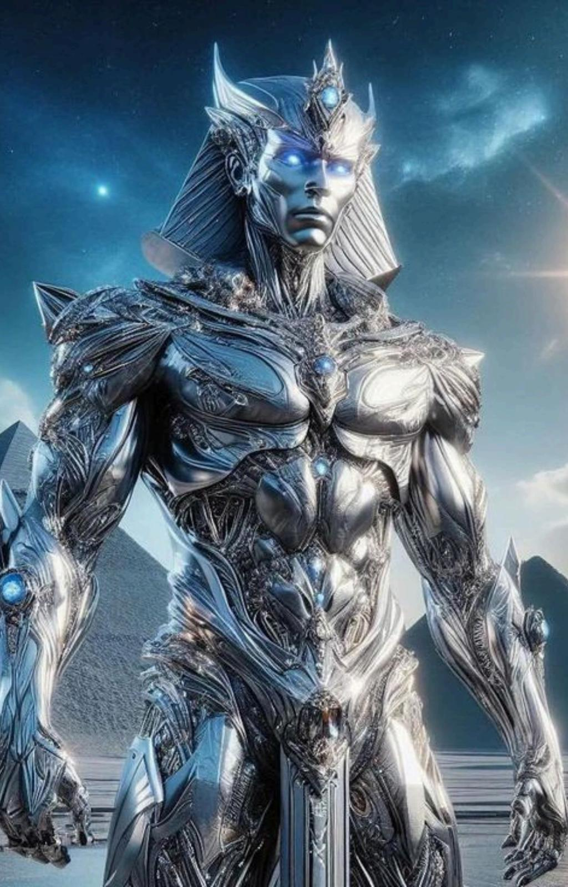

**T h e m y t h o f t h e G a r d e n o f E d e n a n d t h e B o o k o f G e n e s i s a r e t h e p r o g r a m m i n g o f t h e s t o r y w i t h i n h u m a n c o n s c i o u s n e s s , a n a l o g o u s t o a n R P G , a h o l o g r a p h i c m e m o r y . W h e n c o n s c i o u s n e s s e n t e r s E a r t h t h r o u g h t h e f e m a l e p o r t a l a n d t a k e s o n a b o d y , i t a u t o m a t i c a l l y q u e s t i o n s w h e r e i t i s — i n w h i c h v i r t u a l g a m e s i m u l a t i o n i t f i n d s i t s e l f . I t i s i n s t i n c t i v e f o r t h e s u b c o n s c i o u s t o q u e s t i o n t h i s , b e c a u s e i t a l r e a d y k n o w s t h e t r u t h : t h a t t h e r e i s n o s p e c i f i c r e a s o n f o r e x i s t e n c e — w e a r e t h e o n e s w h o g i v e i t m e a n i n g .**

**M y t h s a n d r e l i g i o n s f u n c t i o n a s t h e n a r r a t i v e o f t h e g a m e , a n d t h i s b e c o m e s a p r o g r a m m i n g f o r t h e f u n c t i o n i n g o f c i v i l i z a t i o n a n d t h e c u r r e n t r e a l i t y w e h a v e c h o s e n t o p l a y i n t h i s b i o l o g i c a l R P G , s i n c e a l l s i m u l a t i o n s a r e m e n t a l a n d f o l l o w a t i m e l i n e o f e v e n t s b a s e d o n " m e m o r i e s " p a s s e d d o w n f r o m g e n e r a t i o n t o g e n e r a t i o n t h r o u g h m y t h s , s t o r i e s , a n d a r c h a e o l o g i c a l a n d s c i e n t i f i c d i s c o v e r i e s .**

**F r o m t h e m o m e n t o u r a r c h a e o l o g i s t s a n d s c i e n t i s t s , w h o m w e t r u s t t o d e c i p h e r e x i s t e n c e , t e l l u s t h a t e v e r y t h i n g d e v e l o p e d i n a p h y s i c a l w a y , t h e c o u r s e t h a t c i v i l i z a t i o n t a k e s a s a r e s u l t o f t h o s e a s s e r t i o n s l e a d s u s t o w a r d a s o c i e t y b a s e d o n s u p e r f i c i a l a n d s e l f i s h v a l u e s .**

**T h e d a n g e r t h a t l i e s i n t h e c h a r a c t e r ' s b e l i e f t h a t h e a n d t h e e n t i r e c o n t e x t o f h i s l i f e a r e u n q u e s t i o n a b l y r e a l i s o n e o f t h e f a c t o r s t h a t k e e p s t h e f r a c t a l s o f c o n s c i o u s n e s s t r a p p e d f o r e o n s w i t h i n a u n i v e r s e , s i n c e r e a l i s t i c e x p e r i e n c e s c a u s e s o m e t h i n g s i m i l a r t o a n a d d i c t i o n t o " c a s i n o g a m e s , " f o r e x a m p l e l i k e i n t h e s c e n e f r o m t h e m o v i e P e r c y J a c k s o n w h e r e p e o p l e a r e t r a p p e d i n s i d e t h e L o t u s C a s i n o , w h e r e t h e y a r e s e r v e d h a l l u c i n o g e n i c l o t u s f l o w e r s , a d d i c t i n g t h e p l a y e r s w h o n o l o n g e r p e r c e i v e t h e p a s s a g e o f t i m e a n d n e v e r l e a v e t h e c a s i n o .**

**A l l t h e t i m e , i n l i f e , w e a r e s u r r o u n d e d b y t h e s a m e p e o p l e w i t h w h o m w e a r e k a r m i c a l l y i n t e r t w i n e d u n t i l w e l e a r n t h e l e s s o n s . T h e r e i s n ' t a s i n g l e p e r s o n o u t s i d e o f t h i s c o n f i g u r a t i o n — a n d t h o s e w h o a r e n o t i n t e r t w i n e d a r e c o n s i d e r e d N P C s i n e a c h o n e ' s r e a l i t y . I f e v e r y o n e l e a r n s h o w t o p l a y t h e k a r m i c g a m e a n d l e a r n s t h e l e s s o n s , t h e e n t a n g l e m e n t s a r e u n d o n e , a n d t h e p e r s o n c a n m o v e o n t o t h e n e x t l e v e l o f t h e g a m e .**

**T h e e m o t i o n a l c h a r g e c a u s e d b y e x t r e m e e x p e r i e n c e s i n a b i o l o g i c a l s i m u l a t i o n i s s o i n t e n s e t h a t i t l e a v e s a t r a u m a t i c i m p r i n t o n c o n s c i o u s n e s s , m a k i n g t h e s e f r a c t a l s s e e k t o " w i n " t h e g a m e a n d a l l i t s c h a l l e n g e s , r e m a i n i n g t r a p p e d i n t h e i n c a r n a t i o n a l w h e e l o f s a m s a r a f o r e o n s o f t i m e ,**

**d i s c o n n e c t i n g f r o m t h e S o u r c e a n d c o m p l e t e l y f o r g e t t i n g h o w i t a l l b e g a n — f o r g e t t i n g t h a t i t i s o n l y a s i m u l a t i o n — w h i c h m a k e s i t e v e n m o r e s u s c e p t i b l e t o t h e i d e a o f " l e v e l i n g u p , " o f w i n n i n g a n d g i v i n g n e w m e a n i n g t o c h a l l e n g e s , e v e n i f u n c o n s c i o u s l y a n d i n d u c e d , m a n i p u l a t e d , o r c o n s c i o u s l y .**

**F o r t h e c o u p l i n g o f t h e e s s e n c e o f t h e S o u r c e i n t o a t h r e e - d i m e n s i o n a l b i o l o g i c a l b o d y t o o c c u r , s e v e n s u b t l e b o d i e s a r e f o r m e d : t h e h i g h e r m e n t a l b o d y , t h e l o w e r m e n t a l b o d y , t h e a t m i c b o d y , t h e b u d d h i c b o d y , t h e a s t r a l b o d y , t h e e t h e r i c d o u b l e , a n d f i n a l l y , t h e p h y s i c a l b o d y . T h e l a y e r s o f b o d i e s t h a t a f r a c t a l o f e n e r g y p o s s e s s e s f u n c t i o n l i k e a R u s s i a n d o l l , a l l c o e x i s t i n g i n s i m u l t a n e o u s p a r a l l e l r e a l i t i e s .**

**T h e s e s u b t l e b o d i e s w o r k a s b a c k u p s t h a t s t o r e i n f o r m a t i o n , d a t a , a n d i m a g e s o f t h e b i o l o g i c a l a v a t a r s c r y s t a l l i z e d i n t h e t h i r d d i m e n s i o n . T h e p h y s i c a l b o d y i s t h e f i n a l l a y e r o f t h e c h a r a c t e r ; t h e a u r a s u r r o u n d i n g i t i s l i k e t h e c l o u d t h a t h o l d s m e m o r y d a t a , g e n e t i c i n f o r m a t i o n , a n d g e o m e t r i c f o r m s t h a t b u i l d t h e a v a t a r ' s b l u e p r i n t . J u s t a s w e c a n n o t s e e t h e a u r a , w e c a n n o t s e e w h e r e t h e i n f o r m a t i o n o f t h e i n t e r n e t o r t h e d a t a o f c o m p u t e r s i s s t o r e d .**

**C o n s c i o u s n e s s p e n e t r a t e s a f r a c t a l o r s p a r k t h r o u g h t h e e n e r g y s o u r c e s w e c a l l t h e C e n t r a l S u n , m e n t a l l y a c c e s s i n g t h i s u n i v e r s e t h r o u g h t h e m e n t a l b o d y t h a t e n v e l o p s t h e o t h e r s , a n i m a t i n g t h e a v a t a r t h r o u g h t h e c h a k r a s .**

**T h e m e d i t a t i v e a n d n o n - r e a c t i v e s t a t e a p p r o a c h e s t h e p r i m o r d i a l v o i d . E m o t i o n s , s e n s a t i o n s , a n d r e a c t i o n s a r e p r o g r a m m i n g s f o r t h e g a m e e x p e r i e n c e . T h e e m o t i o n s a n d s e n s a t i o n s t h a t c o n s c i o u s n e s s m e a s u r e s a s p o s i t i v e o r n e g a t i v e a r e i l l u s i o n s — t h e o n l y r e a l i t y i s n e u t r a l i t y a n d t h e i n f i n i t e v o i d . T h e r e f o r e , t h e r e i s n o n e e d t o c l i n g t o w h a t i s g o o d , j u s t a s t h e r e i s n o n e e d t o f e a r w h a t i s b a d ; t h e s e m e a s u r e m e n t s o n l y s e r v e f o r c o n s c i o u s n e s s t o c h o o s e w h a t i t p r e f e r s t o e x p e r i e n c e i n i t s e x i s t e n c i a l s i m u l a t i o n s .**

**T h e a s t r a l b o d y s t o r e s t h e e m o t i o n s t h a t t h e c h a r a c t e r s p r o d u c e a s f r e q u e n c i e s , g e n e r a t i n g b u b b l e s o f h o l o g r a p h i c r e a l i t i e s a c c o r d i n g t o t h e f l o w g i v e n t o c e r t a i n e m o t i o n s — s u c h a s a n g e r a n d h a t r e d , f o r e x a m p l e — c r e a t i n g a h o l o g r a p h i c e n t i t y w i t h t h i s d a t a . W h e n a f r a c t a l i s d e c o u p l e d f r o m t h e b i o l o g i c a l b o d y , t h e m a t r i x o f t h e g a m e r e a d s t h i s i n f o r m a t i o n , w h i c h f o r m s a n e m o t i o n a l " e n t i t y " i m p r i n t e d i n t h e a s t r a l p l a n e t h a t , d e p e n d i n g o n t h e i n t r i n s i c e m o t i o n s , m u s t b e h e a l e d , r e s e t , a n d r e - s i g n i f i e d .**

**A n d , a p p a r e n t l y , t h e o n l y w a y c o n s c i o u s n e s s f i n d s t o d o t h i s i s b y i n s e r t i n g i t s e l f o n c e a g a i n i n t o t h e b i o l o g i c a l s i m u l a t i o n , i n a n o t h e r c h a r a c t e r , i n o r d e r t o g o t h r o u g h t h e s a m e k a r m i c s i t u a t i o n s i n s e a r c h o f e m o t i o n a l n e u t r a l i z a t i o n i n t h e f a c e o f s u c h c h a l l e n g e s .**

**T o f r e e o n e s e l f f r o m t h e h o l o g r a m s c r e a t e d b y e m o t i o n a l r e a c t i o n s , i t i s n e c e s s a r y t o a b s o r b a n d t r a n s c e n d t h e l e s s o n s t h a t s u c h s i t u a t i o n s p r e s e n t t o c o n s c i o u s n e s s a n d t o r e m a i n n e u t r a l a n d f i r m i n t h e t r u t h t h a t t h i s c h a r a c t e r a n d t h e s e c o n t e x t s a r e n o t r e a l t h e r e f o r e , t h e r e i s n o r e a s o n t o r e a c t e m o t i o n a l l y t o a n i l l u s i o n .**

**T h i s n e u t r a l i t y a n d n o n - r e a c t i v i t y c a n b e f o u n d i n v a r i o u s E a s t e r n p h i l o s o p h i e s , s u c h a s T a o i s m , B u d d h i s m , a n d S t o i c i s m . I t i s n o c o i n c i d e n c e t h a t t h e a v a t a r s o f C h r i s t a n d B u d d h a t a u g h t a c c e p t a n c e a n d u n c o n d i t i o n a l l o v e — t h i s s t a t e i s t h e u n d e r s t a n d i n g t h a t t h e t r u e b e i n g r e m a i n s a s t h e o b s e r v e r o f t h e s e p a s s i n g i l l u s i o n s a n d d o e s n o t r e a c t t o t h e m .**

**W e a r e u s e d t o t h e c o m f o r t w e c r e a t e w i t h o u r i n t e l l i g e n c e , b u t t h e p u r e s t r e a l i t y i s C h a o s . N o t h i n g t r u l y m a k e s s e n s e , e x c e p t s i m p l y t o e x i s t . T h a t i s w h y E a s t e r n p h i l o s o p h i e s u n d e r s t a n d t h a t t h e s p i r i t u a l p a t h l i e s i n l e t t i n g g o a n d a c c e p t i n g , i n l i v i n g t h e n o w a n d n o t w o r r y i n g . A f t e r a l l , i t i s a g a m e . A n i l l u s i o n .**

**A l t h o u g h i t s e e m s s o d i f f i c u l t t o a c c e p t s u c h a t r u t h — s i n c e i t t a k e s a w a y t h e r e a s o n t o r e s i s t t h e e x p e r i e n c e , t o c o m p l a i n , a n d t o f e e l l i k e a v i c t i m o f a g o d , o f c i r c u m s t a n c e s , o r o f o t h e r c h a r a c t e r s — a f t e r a l l , y o u a r e i n t h e g a m e m o s t l i k e l y b y y o u r o w n i n i t i a t i v e , t a k e n i n s o m e h i g h e r u n i v e r s e .**

**T h e e x p e r i m e n t o f i n s e r t i n g a c o n s c i o u s n e s s a s e x t r e m e l y e l e v a t e d a s t h a t o f C h r i s t i n t o t h i s t h r e e - d i m e n s i o n a l r e a l i t y w a s a v e r y i n t e r e s t i n g o n e . T h e h i g h e r c o n s c i o u s n e s s e s d i d n o t i m a g i n e i t w o u l d b e l i k e t h i s . F o r h i m , i t w a s s o m e t h i n g v e r y d i f f e r e n t a n d u n e x p e c t e d . T h e p l a n w a s t o d e l i v e r t h e m e s s a g e t h r o u g h p a r a b l e s t h a t w o u l d m a k e p e o p l e q u e s t i o n a n d r e m e m b e r t h a t a l l o f t h i s i s a s i m u l a t i o n . H o w e v e r , a t t h a t t i m e , w i t h o u t t h e t e c h n o l o g i c a l c o n c e p t s w e h a v e t o d a y , n o o n e w o u l d h a v e u n d e r s t o o d i t .**

**P e o p l e l o v e d h i m , b u t m a n y a l s o h a t e d h i m . C r o w d s w e r e f r i g h t e n e d b y t h e p h e n o m e n a h e c a u s e d i n t h e h o l o g r a p h i c m a t r i x . T h e h u m a n r a c e t u r n e d a g a i n s t h i m a s a k i n d o f i m m u n i t y t o s o m e t h i n g b e y o n d t h e c o m p r e h e n s i o n o f t h e c o l l e c t i v e c o n s c i o u s n e s s o f t h a t e r a .**

**T h e f a c t t h a t J e s u s w a s c o n s i d e r e d t h e s o n o f t h e v e r y C r e a t o r G o d i n c a r n a t e d i n h u m a n f o r m d e m o n s t r a t e s h o w t h e s e h i g h e r b e i n g s i n s e r t t h e m s e l v e s i n t o b i o l o g i c a l c h a r a c t e r s / a v a t a r s**

**i n t h i s t h r e e - d i m e n s i o n a l r e a l i t y t o d e l i v e r a m e s s a g e a n d t o u n d e r s t a n d t h e h u m a n e x p e r i e n c e . J e s u s w a s t h e u n f o l d m e n t o f C h r i s t , o n e o f t h e p r i m o r d i a l c r e a t o r s o f t h e u n i v e r s e p r o j e c t s , a n d m a n y o f h i s t e a c h i n g s , w h i c h b e c a m e t h e r e l i g i o u s a n d p h i l o s o p h i c a l p r i n c i p l e s t h a t e n c o u r a g e l o v e , f o r g i v e n e s s , a n d p o s i t i v i t y t o w a r d l i f e , c a n b e c o m p a r e d t o t h e k n o w l e d g e o f t h e t r u t h t h a t w e a r e i n a b i o l o g i c a l s i m u l a t i o n c r e a t e d f r o m a s i n g l e S o u r c e a n d a s i n g l e m i n d — t h e r e f o r e , w e a r e o n e b e i n g .**

**T o b e " p u r e a n d u p r i g h t i n h e a r t " m e a n s t o h a v e t h e a w a r e n e s s t h a t a l l m a n i f e s t e d e x i s t e n c e , a p p e a r i n g a s h o l o g r a p h i c f o r m s , i s m a d e o f a s i n g l e p r i m o r d i a l f a b r i c , a s i n g l e s p i r i t , a s i n g l e c o n s c i o u s n e s s . T h e r e f o r e , y o u w o u l d n o t k i l l , b e t r a y , s t e a l f r o m , o r h a r m y o u r s e l f , r i g h t ?**

**T h e o n l y w a y f o r t h i s p r o j e c t o f b i o l o g i c a l s i m u l a t i o n t o s u c c e e d i s t h r o u g h t h e u n d e r s t a n d i n g o f i t s c o m p l e x i t y a n d t h e t r u t h o f i t s i l l u s o r y c o n s t r u c t i o n . A n d b y l e a r n i n g h o w t h e a u t o m a t i c m e c h a n i s m s p r o g r a m m e d f o r t h i s e x p e r i e n c e o p e r a t e , w e c a n m a k e i t s o m e t h i n g i n t e r e s t i n g , i n c r e d i b l e , a n d o f u n l i m i t e d g r o w t h w i t h i n t h e p o s s i b i l i t i e s o f t h e s i m u l a t i o n i t s e l f — r e m a i n i n g f i r m i n t h e t r u t h t h a t w e a r e n o t t h e s e c h a r a c t e r s a n d t h a t o u r**

**t r u e e s s e n c e i s s p i r i t u a l . T h e u n d e r s t a n d i n g o f t h e s e c o n c e p t s c a n f r e e m a n y f r a c t a l s t h a t a r e l o s t i n a g o n y w i t h i n t h e s e h o l o g r a p h i c u n i v e r s e s . I m a g i n e t h a t y o u a r e i n a v i r t u a l r e a l i t y , t r a p p e d i n a c h a r a c t e r y o u b e l i e v e t o b e y o u r o n l y f o r m o f e x i s t e n c e , w i t h a l l i t s p a i n s , t r a u m a s , a n d f e a r s — h o w c r u e l a n d d e s p a i r i n g t h a t i s .**

**I m a g i n e t h a t y o u a r e p l a y i n g a " r e a l i s t i c v i r t u a l g a m e , " w h e r e y o u r c o n s c i o u s n e s s i s p l u g g e d i n a n d e x p e r i e n c e s a c h a r a c t e r f i r s t h a n d , w i t h o u t r e m e m b e r i n g t h a t i t i s o n l y a g a m e — w h e r e y o u c a n l i v e m a n y p l e a s u r e s a n d j o y s , b u t a l s o s i t u a t i o n s o f t r a u m a a n d f a i l u r e . Y o u w a t c h o t h e r c h a r a c t e r s e n j o y p o s i t i v e a n d h a p p y e x p e r i e n c e s , w h i l e y o u a r e d i s s a t i s f i e d w i t h t h e a p p e a r a n c e o r c i r c u m s t a n c e s o f y o u r o w n c h a r a c t e r , f o r e x a m p l e , g e n e r a t i n g n e g a t i v e e m o t i o n s t h a t c r e a t e m o r e h o l o g r a m s t h a t i m p r i s o n t h i s c o n s c i o u s n e s s i n i n c r e a s i n g l y w o r s e c o n t e x t s , l e a d i n g t o d e m o n i z a t i o n a n d d i s c o n n e c t i o n f r o m t h e p r i m o r d i a l S o u r c e .**

**T h i s m a k e s t h e s e f r a c t a l s i n c r e a s i n g l y u n c o n s c i o u s a n d s u g g e s t i b l e , b e c o m i n g e x p l o i t a b l e i n e x p e r i m e n t s a n d s t u d i e s c o n d u c t e d b y " h i g h e r c o n s c i o u s n e s s e s " t h a t o b s e r v e b i o l o g i c a l s i m u l a t i o n s f o r s c i e n t i f i c p u r p o s e s , i n w h i c h t h e c h a r a c t e r s a r e m a n i p u l a t e d a n d s t r e s s e d**

**f o r " a n a l y s i s " t h r o u g h a n a l g o r i t h m i c m e c h a n i s m t h a t i d e n t i f i e s i t s f e a r s , t r a u m a s , a n d d e s i r e s , c r e a t i n g c o n t e x t s a n d c i r c u m s t a n c e s t h a t a f f e c t t h e c h a r a c t e r i n o r d e r t o o b t a i n e m o t i o n a l r e a c t i o n s f r o m s u c h f r a c t a l s — w i t h n e u t r a l i t y a n d n o n - r e a c t i v i t y b e i n g t h e o n l y w a y o u t o f t h i s k i n d o f " a t t a c k " f r o m b e i n g s o u t s i d e t h e s i m u l a t i o n , d i r e c t e d a t t h e c h a r a c t e r s .**

**T h e a g r e e m e n t s m a d e w i t h e x t r a t e r r e s t r i a l s a n d n o n - p h y s i c a l e n t i t i e s i n e x c h a n g e f o r " v i c t o r i e s " — s u c h a s h e a l i n g , m o n e y , f a m e , l o v e l i f e , o r w h a t e v e r t h e g o a l m a y b e f u n c t i o n a s a f o r m o f c h e a t i n g , a b r e a k i n g o f t h e r u l e s o f t h e g a m e , a w a y t o h a c k t h e m e c h a n i s m o f c a u s e a n d e f f e c t a n d a n d c a u s e a l t e r a t i o n s i n t h e t h r e e - d i m e n s i o n a l m a t r i x , a s i n t h e c a s e o f m i r a c l e s a n d m a g i c t h a t u s e t h e i n t r i n s i c C h a o s e n e r g y w i t h i n t h e A l l t o m a n i p u l a t e r e a l i t y a n d s u r p a s s t h e p r o g r a m m e d k a r m i c l a w s .**

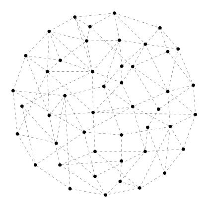

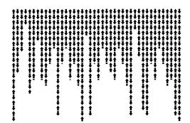

**T h e p r o b l e m i s t h a t s u c h a g r e e m e n t s c o s t t h e v i t a l e n e r g y o f t h o s e w h o s e e k t h e m . T h a t i s w h y i t i s s a i d t h a t s o m e o n e " s o l d t h e i r s o u l t o t h e d e v i l , " f o r t h e s e b e i n g s m a i n t a i n t h e i r e x i s t e n c e i n d i m e n s i o n s b e l o w 9 D t h r o u g h t h e p l a s m a o f o t h e r b o d i e s , s i n c e t h e i r o w n a r e b e i n g d e t e r i o r a t e d b y a n t i m a t t e r .**

**E v e r y p a r t i c l e h a s i t s a n t i p a r t i c l e , a n d t h e b e i n g s w h o r e b e l a g a i n s t t h e n a t u r a l o r d e r o f e x i s t e n c e b e g i n t o b e a u t o m a t i c a l l y r e s e t t h e y a r e c o n s u m e d b y t h e v e r y m a g i c o f C h a o s t h e y i n v o k e a n d m a n i p u l a t e t o w a r d t h e d a r k s i d e o f t h e f o r c e . H o w e v e r , t h e y f i g h t f o r t h e i r d e n s e f o r m s t o c o n t i n u e t h e i r e m p i r e s a n d c o l o n i e s i n t h e l o w e r d i m e n s i o n s .**

**T h e f a b r i c o f r e a l i t y w i l l a l w a y s c o n t a i n w i t h i n i t s e l f t h e p u r e f o r c e t h a t c o m e s f r o m t h e S o u r c e i t s e l f : t h e p r i m o r d i a l C h a o s , t h e i n c o m p r e h e n s i b l e n a t u r e o f e x i s t e n c e . T h a t i s w h y p e r f o r m i n g m a g i c , a l c h e m y , a n d e n e r g e t i c m a n i p u l a t i o n t r u l y w o r k s , f o r y o u a r e m o v i n g t h e e n e r g y o f C h a o s t h a t i s i n t r i n s i c i n a l l t h e p r o g r a m m e d f o r m s o f t h r e e - d i m e n s i o n a l r e a l i t y . T h e m a g i c a n d m y s t e r y o f C h a o s w i l l a l w a y s b e c o n t a i n e d w i t h i n b i o l o g y a n d w i l d n a t u r e ,**

**t h a t i s w h y w e f e e l t h i s n o s t a l g i a , t h i s l o n g i n g f o r t h e b e g i n n i n g o f e v e r y t h i n g . T h r o u g h t h e m a n i p u l a t i o n a n d i n v o c a t i o n o f t h e p r i m o r d i a l C h a o s e n e r g y — t h e e n e r g y o f l i f e — w e c a n b r e a k t h e p r o g r a m m e d r u l e s w i t h i n t h e t h r e e d i m e n s i o n a l f a b r i c . H o w e v e r , t h e r e a r e c o n s e q u e n c e s t r i g g e r e d b y s u c h p r a c t i c e s , s i n c e C h a o s i s u n c o n t r o l l a b l e a n d d o e s n o t m e a s u r e g o o d o r e v i l .**

**T h e i m p o r t a n c e o f s e l f - k n o w l e d g e a n d t h e p u r s u i t o f i n f o r m a t i o n i n g e n e r a l i s e x t r e m e l y n e c e s s a r y i n a c o n t e x t o f e x i s t e n c e w h e r e m o r e e x p e r i e n c e d p l a y e r s — a n d t h o s e m o r e t e c h n o l o g i c a l l y d e v e l o p e d — s e e k t o s u b j u g a t e y o u n g e r b i o l o g i c a l r a c e s , s u c h a s h u m a n s , t o t h e i r c o l o n i z a t i o n a n d c o n t r o l , t h r o u g h t h e m a n i p u l a t i o n o f t h e i r m i n d s a n d t h e v i o l a t i o n o f t h e i r b i o l o g i c a l s t r u c t u r e s , s o t h a t t h e y b e c o m e a n i m a t a b l e r o b o t s , w o r k e r s , u s i n g t h e i r b o d i e s a s m a c h i n e s t h a t p r o c e s s o n l y t h e b a s i c n e e d s**

**T h e o l d e r p l a y e r s w h o s t o l e t h e E a r t h p r o j e c t e s t a b l i s h e d a c o n t r o l s y s t e m o v e r t h e y o u n g e r p l a y e r s , k e e p i n g t h e m r u n n i n g t h e c u r r e n t h o l o g r a m i n t h e i r m i n d s . T h i s c o n t r o l b e g i n s i n s c h o o l , w h e r e w e a r e t a u g h t t h a t w e h a v e n o p o w e r o v e r t h e g a m e , t h a t w e h a v e n o p o w e r o v e r r e a l i t y , a n d a r e f o r c e d t o f o l l o w r u l e s w i t h o u t q u e s t i o n i n g t h e m .**

**I t i s a s e l f - p r o g r a m m i n g s y s t e m — t h e a n d r o i d s p r o g r a m t h e m s e l v e s . T h a t i s w h y t h e l e a d e r s o f t h e e d u c a t i o n a l s y s t e m a n d t h e t e a c h e r s i m p o s e t h i s m o d e l o n c h i l d r e n i n a b l i n d a n d a u t o m a t i c w a y , b e i n g l o y a l t o s o m e t h i n g t h e y t h e m s e l v e s n e i t h e r u n d e r s t a n d n o r q u e s t i o n . T h e s y s t e m i s s o d e e p l y s t r u c t u r e d i n t h e m i n d s o f t h e p l a y e r s t h a t i t c r e a t e s a n i m m u n i t y t o c o n s c i o u s n e s s i t s e l f .**

**O u t o f f e a r o f t h e u n k n o w n , t h e p l a y e r s r e m a i n b o u n d t o t h e r u l e s o f t h e g a m e , w h e r e t h e i r m i n d s c l i n g t o s o m e t h i n g t h a t i s s u p p o s e d l y r e a l . T h e p r o g r a m m i n g u s e s t h e m e c h a n i s m o f f e a r t o i s o l a t e t h e m f r o m t h e t r u t h , e v e n t h o u g h t h i s m e c h a n i s m s h o u l d e x i s t o n l y a s a w a r n i n g f o r i m m i n e n t d a n g e r s i n a w i l d p l a n e t — n o t a s a w a y o f l i f e .**

**T h e s y s t e m , h a c k e d b y t h e a n c i e n t p l a y e r s , k e e p s t h e b i o l o g i c a l h u m a n a n d r o i d s f u n c t i o n i n g o n l y i n s u r v i v a l m o d e , u s i n g t h e m a s b a t t e r i e s t o s u s t a i n a c i v i l i z a t i o n s t r u c t u r e d b y t h o s e w h o r e m a i n i n p o w e r . A c o n t r o l s y s t e m r e q u i r e s i n d i v i d u a l s t o k e e p i t r u n n i n g . F o r t h a t , t h e s e i n d i v i d u a l s c a n n o t b e l i e v e t h e y h a v e a n y p o w e r a g a i n s t t h e i r " s u p e r i o r s " — t h e y m u s t f e e l i n v a l i d a n d h a r m l e s s , s o t h e y a c c e p t a n d b e l i e v e i n v i c t i m n a r r a t i v e s a n d l a c k t h e c o u r a g e t o q u e s t i o n t h e m a s s e s , t h e s y s t e m s , o r t o r e l y o n t h e m s e l v e s .**

**B e i n g a l o n e , i s o l a t e d f r o m s o c i e t y , i s s o m e t h i n g v e r y f r i g h t e n i n g f o r a n e m p a t h e t i c a n d e m o t i o n a l s p e c i e s l i k e o u r s — e v e n d u e t o a n i m a l i n s t i n c t s , w h i c h k n o w t h a t s u r v i v a l i s e a s i e r i n g r o u p s . Y e t , i n t h i s w a y , t h e y n e v e r t r u l y k n o w t h e m s e l v e s b e y o n d o t h e r s .**

**I f t h e c h a r a c t e r s b e l i e v e i n a c e r t a i n n a r r a t i v e — s u c h a s s e e i n g t h e m s e l v e s a s s e p a r a t e d f r o m t h e p o w e r t h a t g e n e r a t e s e x i s t e n c e — t h a t w i l l b e c o m e t h e t r u t h t h e y a f f i r m t o t h e m s e l v e s , h y p n o t i z i n g t h e m s e l v e s w i t h t h o s e b e l i e f s a n d t r a p p i n g t h e m s e l v e s w i t h i n a s i n g l e l i n e o f p o s s i b l e r e a l i t i e s a v a i l a b l e .**

**W h e n t h e s l a v e s o f E g y p t w e r e f r e e d , t h e y d i d n o t v a l u e t h e i r o w n f r e e d o m , t h e y d i d n o t b e l i e v e i n t h e i r a b i l i t y t o p r o v i d e f o r t h e m s e l v e s**

**a n d t h e y s a i d t h e y w o u l d r a t h e r r e t u r n t o E g y p t a n d b e e n s l a v e d a g a i n , b e c a u s e a t l e a s t t h e y h a d f r e e f o o d . T h a t i s a s t a t e o f c o n s c i o u s n e s s u n d e r c o n t r o l . T h e s e b i o l o g i c a l a v a t a r s a r e e n e r g y c o n v e r t e r s . W e a r e p r o g r a m m e d b y s c h o o l s a n d t h e m e d i a t o u s e o n l y t h e p e r c e n t a g e o f t h e b r a i n r e l a t e d t o b a s i c s u r v i v a l — s o m u c h s o t h a t m a n y l i t e r a l l y a c c e p t l i v i n g a s b a t t e r i e s i n e x c h a n g e f o r m o n e y , l i k e s u p e r m a r k e t w o r k e r s w h o s p e n d a l l t h e i r d a i l y h o u r s s c a n n i n g g r o c e r i e s l i k e r o b o t s , u s e d a s l a b o r , u n c o n s c i o u s N P C s .**

**A t b i r t h , t h e c h i l d ' s o p e r a t i n g s y s t e m i s a b l a n k m e m o r y , r e a d y t o b e c o n f i g u r e d w i t h t h e n e c e s s a r y p r o g r a m s f o r i t s e x p e r i e n c e o n t h e p l a n e t . A t t h i s s t a g e , i t i s p o s s i b l e t o p r o g r a m t h e c h a r a c t e r ' s i d e n t i t y ; t h e i n s t a l l e d p r o g r a m s d e f i n e t h e p o t e n t i a l o f t h e e x p e r i e n c e .**

**I t i s i n t e r e s t i n g t o p r e s e n t b r i g h t s h a p e s a n d c o l o r s i n c a r t o o n s , b u t t h i s i s t h e m o s t a p p r o p r i a t e m o m e n t t o s h o w t h e c h a r a c t e r h o w t h e r e a l i t y t h e y a r e i n w o r k s a n d w h a t t h e y t r u l y a r e — c o n t r a r y t o w h a t i s u s u a l l y d o n e w i t h b a b i e s , i n f a n t i l i z i n g t h e m w i t h s o n g s a n d c a r t o o n s t h a t l a c k a d e q u a t e c o n t e n t f o r t h e d e v e l o p m e n t o f c o n s c i o u s n e s s , w e s h o u l d i n f o r m t h e m a b o u t h o w t h i s r e a l i t y i s m a d e , h o w t h e s o l a r s y s t e m , t h e p l a n e t s , a n d t h e b i o l o g i c a l b o d i e s w o r k .**

**W e c a n t r u s t t h i s c h i l d j u s t a s w e t r u s t a d u l t s — t h e y a r e n o t c h i l d i s h . B y i n s t a l l i n g t h e c o r r e c t i n f o r m a t i o n i n t o a b l a n k m i n d , t h e p o s s i b i l i t y f o r t h a t c o n s c i o u s n e s s t o r e m e m b e r a n d a c c e s s t h e i n f o r m a t i o n f r o m i t s m o r p h i c f i e l d i s m u c h g r e a t e r . T h e c h i l d m a y r e c a l l i t s e x p e r i e n c e s i n t h e c o s m o s a n d a n c h o r t h e m i n i t s m i n d .**

**T h u s , t h e n e w r a c e c a n b e a c t i v a t e d . T h e y w i l l k n o w h o w t o a c t i v a t e t h e s e b o d i e s t o t h e i r m a x i m u m p o t e n t i a l , a s i m a g i n e d i n t h e M i n d o f t h e C r e a t i v e S o u r c e f o r s u c h a s p e c i e s . T h e D N A c a n t h e n b e s t r u c t u r e d a c c o r d i n g t o i t s o r i g i n a l g e o m e t r i c d e s i g n , w i t h a l l t h e a v a t a r ' s p o w e r s a c t i v a t e d .**

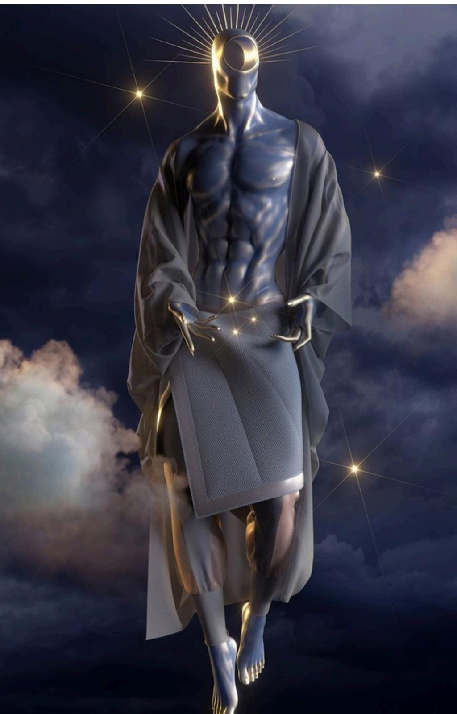

**E v e r y s t a t e o f b e i n g , f r o m a G o d t o a n a t o m , i s a p r o g r a m t h a t h y p n o t i z e s c o n s c i o u s n e s s t o c o l l a p s e i n t o t h a t f o r m . A n y t h i n g t h a t m a k e s y o u a t t a c h e d a n d h a s p o w e r o v e r y o u r e m o t i o n s a n d t h o u g h t s w i l l b e u s e d a g a i n s t y o u r c o n s c i o u s n e s s t o k e e p y o u t r a p p e d w i t h i n t h e h o l o g r a m s — e s p e c i a l l y t h a t w h i c h y o u m o s t d e s i r e .**

**W h e n w e s a c r i f i c e w h a t w e m o s t d e s i r e f o r o u r f r e e d o m , b e c a u s e w e c h o o s e t o i n t e g r a t e w i t h t h e A l l a n d b r e a k d o w n t h e w a l l s o f t h e M a t r i x , t o l o o k b e y o n d t h e v e i l o f M a y a , c o n s c i o u s n e s s k n o w s i t i s a w a k e i n t h a t p o i n t o f o b s e r v a t i o n .**

**W e m u s t r e m a i n i n t h e z e r o p o i n t a n d o b s e r v e t h e o s c i l l a t i o n s o f w h a t i s c o n s i d e r e d " g o o d " o r " b a d . " W e m u s t s u r r e n d e r t h e e x i s t e n c e o f o u r p o i n t o f o b s e r v a t i o n f o r I n f i n i t e C o n s c i o u s n e s s , t h e a l l - s e e i n g e y e . A n d f r o m t h e s i l e n t o b s e r v e r , t o m a k e c h o i c e s a s t h e h o l o g r a m m o v e s a h e a d — a l w a y s r e m e m b e r i n g t h a t m o v e m e n t i s a n i l l u s i o n . O u r t r u e s t a t e i s t h e v o i d o f t h e I n f i n i t e M i n d .**

**C o n s c i o u s n e s s b e g a n t o c r e a t e b y i m a g i n i n g i t s e l f i n d i f f e r e n t s c e n a r i o s a n d c h a r a c t e r s , a n d t h u s t h e g r e a t e r m i n d d i v i d e d i t s e l f i n t o i n f i n i t e p o i n t s o f v i e w , a s f r a g m e n t s o f c o n s c i o u s n e s s .**

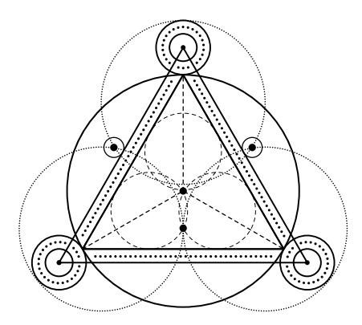

**B e y o n d t h e a u t o m a t i c l a w s p r o g r a m m e d w i t h i n a u n i v e r s e , t h e c h a l l e n g e s t h a t t h e c h a r a c t e r f a c e s a r e i n d u c e d b y t h e v e r y d i v i n e e s s e n c e t h a t u n f o l d e d a n d i n s e r t e d i t s e l f i n t o a c e r t a i n s i m u l a t i o n , i n o r d e r t o a w a k e n t h a t f r a c t a l a n d m a k e i t r e m e m b e r w h y i t e n t e r e d t h i s g a m e . S i n c e , o n c e i n s i d e a u n i v e r s e c o n f i n e d w i t h i n a c e r t a i n w a l l o f v i b r a t i o n a l f r e q u e n c y , t h e f r a c t a l m a y t a k e m a n y l i v e s i n t h e g a m e b e f o r e f u l f i l l i n g i t s m i s s i o n — t h e o n e i t a c c e p t e d w h e n i t d e c i d e d t o e n t e r t h e r e .**

**T h e c o n s c i o u s n e s s c o n n e c t e d t o t h a t c h a r a c t e r k e e p s r e f l e c t i n g i n t o t h e h o l o g r a p h i c m a t r i x s i g n s , s y m b o l s , a n d s y n c h r o n i c i t i e s t h a t a r e i m p r i n t e d a n d c o n f i g u r e d w i t h i n i t s l i f e c o n t e x t t o r e m i n d i t . A n d t h e m o r e t h i s c h a r a c t e r d e v i a t e s f r o m i t s p u r p o s e , t h e m o r e c r u e l a n d d i s a s t r o u s i t s j o u r n e y m a y b e c o m e , s o t h a t i t b e c o m e s f r u s t r a t e d a n d s u f f e r s t o t h e p o i n t o f d e c i d i n g t o s e e k s p i r i t u a l g u i d a n c e**

**f r o m t h e h i g h e r f o r c e s . T h a t i s w h e n t h e e n e r g y f l o w f r o m t h e S o u r c e b e g i n s t o f l o o d t h e c h a n n e l s o f t h i s f r a c t a l , t r a n s m i t t i n g i n s t r u c t i o n s a n d i n f o r m a t i o n t h a t l e a d i t t o f u l f i l l t h e o r i g i n a l m i s s i o n f o r w h i c h i t c a m e . A n d a l l o f t h i s i s n e c e s s a r y , s i n c e t h e c h a r a c t e r h a s f r e e w i l l t o f o l l o w t h i s p u r p o s e o r n o t . B u t s i t u a t i o n s h a p p e n i n c y c l e s , a n d i f t h e H i g h e r S e l f i s u n a b l e t o a c c o m p l i s h a c e r t a i n m i s s i o n t h r o u g h o n e c h a r a c t e r , t h e h o l o g r a p h i c m a t r i x o f r e a l i t y w i l l b r i n g t h e s a m e p a t h a n d o p p o r t u n i t i e s i n a n e w c y c l e w i t h i n t h e s a m e l i f e o r i n a n o t h e r i n c a r n a t i o n — u n t i l t h e c h a r a c t e r i s a b l e t o d e c i p h e r w h a t i t s m i s s i o n i s a n d f o l l o w i t . T h a t i s w h y t h e c o n c e p t o f " f r e e w i l l " f o r a c h a r a c t e r i n t h e g a m e i s r e l a t i v e , b e c a u s e e v e n i f i t c h o o s e s t o d e v i a t e f r o m t h e i n i t i a l p r o j e c t a n d f o l l o w o t h e r p a t h s , i t w i l l a l w a y s b e p u r s u e d b y t h e s a m e c h a l l e n g e s , s i g n s , a n d s y n c h r o n i c i t i e s t h a t s e e k t o a l i g n t h a t p i e c e o f t h e p u z z l e t o i t s p l a c e o f p u r p o s e — a n d t h i s i n c l u d e s f a c i n g f a i l u r e s , f r u s t r a t i o n s , a n d d i s a p p o i n t m e n t s .**

**T h e I A M m a y p l a c e t h e c h a r a c t e r i n e x t r e m e l y c h a l l e n g i n g c o n t e x t s , w i t h o u t m e r c y , s o t h a t t h i s f r a c t a l i s f o r c e d t o m o v e a n d a c c o m p l i s h s o m e t h i n g w i t h i n a g i v e n r e a l i t y b y m a k i n g i t s c o n t e x t u n b e a r a b l e . T h e o n l y w a y t o " w i n " t h e c h a l l e n g e s o f t h e g a m e a n d m o v e t o t h e n e x t l e v e l i s b y a c t i n g**

**a c c o r d i n g t o t h e o n e a n d o n l y a b s o l u t e t r u t h : t h a t y o u a r e n o t t h e c h a r a c t e r , b u t t h e S o u r c e i t s e l f — a n d b y s u r r e n d e r i n g t o y o u r H i g h e r S e l f . T h i s i s t h e o n l y w a y t o t r a n s c e n d a n y o b s t a c l e w i t h i n t h e i l l u s i o n o f M a y a : n o t r e a c t i n g a s t h e c h a r a c t e r w o u l d r e a c t , b u t a s a p o i n t o f o b s e r v a t i o n t h a t k n o w s i t i s i n f i n i t e , w a t c h i n g e x i s t e n c e " f r o m t h e o u t s i d e . "**

**E v e r y s h a d o w i s a l w a y s t e a c h i n g s o m e t h i n g t h a t c a n l e a d t h e c h a r a c t e r t o a h i g h e r l e v e l i n t h e g a m e , i f i t l e a r n s t h e l e s s o n a n d c h o o s e s t h e o p p o s i t e s i d e . F o r e x a m p l e : i f t h e c h a r a c t e r f i n d s i t s e l f s u r r o u n d e d b y a c o n t e x t o f a f f i n i t y c o n f l i c t s w i t h c e r t a i n p e o p l e , s i t u a t i o n s , i d e a s , a n d e n e r g i e s , i t i s l o o k i n g i n t o t h e m i r r o r o f e x i s t e n c e a t i t s o w n s h a d o w s i d e — s o t h a t i t c a n f e e l t h o s e n e g a t i v e e m o t i o n s , i d e n t i f y t h e f r e q u e n c i e s a n d c o n s e q u e n c e s o f t h o s e e m o t i o n s , l e a r n f r o m t h e m , a n d a l w a y s c h o o s e t h e o p p o s i t e p o l e .**

**A f t e r a l l , t h o s e f o r m s o f e x i s t e n c e c a n n o t c e a s e t o e x i s t — i t i s w e , t h e f r a c t a l s , w h o m u s t n o t a l i g n o u r s e l v e s w i t h t h e m .**

**B u t t h a t d o e s n o t m e a n r u n n i n g a w a y f r o m t h o s e c o n f l i c t s ; i t m e a n s u n d e r s t a n d i n g a n d t r a n s c e n d i n g t h e i r m e a n i n g b y c h o o s i n g t h e o p p o s i t e p o l e . F o r i f o n e e s c a p e s a c o n t e x t d u e t o c e r t a i n u n r e s o l v e d c o n f l i c t s , w i t h o u t l e a r n i n g t h e l e s s o n t h e y r e p r e s e n t , t h e s a m e**

**c o n t e x t s t e n d t o r e p e a t t h e m s e l v e s i n d i f f e r e n t s c e n a r i o s . I t i s i m p o s s i b l e t o r u n a w a y f r o m t h e c h a l l e n g e s m i r r o r e d i n t h e m a t r i x — w e c a n o b s e r v e t h e s a m e s i t u a t i o n s a n d l e s s o n s r e p e a t i n g a s p a t t e r n s t h r o u g h o u t o u r l i v e s .**

**C o n f l i c t s r e v e a l a t r u t h a b o u t t h e c h a r a c t e r . F o r e x a m p l e , a p e r s o n w h o i s c o n s t a n t l y o p p o s e d b y t h e i r s o c i a l e n v i r o n m e n t , c o n s i d e r e d t h e " b l a c k s h e e p " o r t h e " w e i r d o n e , " u s u a l l y c a r r i e s a n e x t r e m e l y o r i g i n a l a n d r e v o l u t i o n a r y p e r s o n a l i t y t h a t w a s n o t b o r n t o f o l l o w c o n v e n t i o n a l p a t t e r n s . H o w e v e r , t h i s p e r s o n d o e s n o t b e l i e v e i n t h e i r o w n o r i g i n a l i t y n o r i n t h e i r i n n e r g u i d a n c e , m i r r o r i n g t h r o u g h e x p e r i e n c e s a n d r e l a t i o n s h i p s w i t h t h e w h o l e c o n t e x t s t h a t c h a l l e n g e t h e m a n d m a k e t h e m d o u b t t h e m s e l v e s e v e n m o r e — u n t i l t h e y a r e p r e s s u r e d a n d e x p o s e d t o t h a t p o l e t o s u c h a n e x t e n t t h a t t h e y f i n a l l y d e c i d e t o l i v e t h e i r t r u t h w i t h o u t e x p e c t i n g e x t e r n a l s u p p o r t .**

**T h e p r o b l e m w i t h b e i n g f a l s e — o f c o n t i n u i n g t o i n t e r a c t , a c c e p t , a n d e x c h a n g e e n e r g y w i t h s i t u a t i o n s a n d p e o p l e w e d o n o t p r e f e r — i s t h a t w e k e e p e n e r g e t i c a l l y a f f i r m i n g t o t h e M a t r i x o f r e a l i t y t h a t t h e s e a r e t h e c o n t e x t s a n d s i t u a t i o n s w e w i s h t o e x p e r i e n c e a s i l l u s i o n s .**

**E v e r y t h i n g i s a n i l l u s i o n — i t i s u p t o u s t o c h o o s e w h i c h o n e s w e w a n t t o l i v e .**

**T h e c o n t e x t s a n d e v e n t s , n o m a t t e r h o w c r u e l o r u n c o m f o r t a b l e t h e y m a y b e , a r e a l w a y s g u i d i n g t h e c h a r a c t e r t o w a r d t h e i r o w n m a n i f e s t a t i o n s a n d m e n t a l i m a g e s . T h e h o l o g r a p h i c m a t r i x p e r f o r m s m a n e u v e r s o f s y n c h r o n i c i t i e s a n d c i r c u m s t a n c e s t o a l i g n s u c h a f r a c t a l w i t h t h e r e a l i t y o r f u t u r e i m a g i n e d a n d c o - c r e a t e d b y i t s e l f . H o w e v e r , i t i s u p t o t h e c h a r a c t e r t o c h o o s e t o m o v e t o w a r d t h e s e m a n i f e s t a t i o n s — t h a t i s , t h e y m u s t d o t h e i r p a r t i n t h e p h y s i c a l w o r l d .**

**T h e m o r e t h e c h a r a c t e r a d v a n c e s t h r o u g h l e v e l s i n t h e g a m e a n d a s c e n d s t o h i g h e r s t a g e s , b e i n g a b l e t o e x p e r i e n c e m o r e e l e v a t e d r e a l i t i e s , t h e m o r e t h e c h a l l e n g e s i n t e n s i f y a n d b e c o m e c o m p l e x . W i t h g r e a t p o w e r c o m e s g r e a t r e s p o n s i b i l i t y . A n d w e k n o w w e l l : t h e m o r e i m p o r t a n t a n d g r a n d a p e r s o n ' s j o u r n e y i s , t h e g r e a t e r a n d d e e p e r t h e l e s s o n s t h e y w i l l h a v e t o f a c e . F o r t h e r e i s n o l i g h t w i t h o u t s h a d o w , n o e v e n t w i t h o u t i t s m i r r o r e d c o u n t e r p a r t a n d t h e g r e a t e r t h e l i g h t , t h e g r e a t e r t h e s h a d o w w i l l b e a s w e l l .**

**T h a t i s w h y m o s t c h a r a c t e r s c h o o s e t o r e m a i n w i t h i n t h e i r c o m f o r t z o n e , i n t h e c o n t e x t o f t h e i r f a m i l y a n d b i o l o g i c a l o r i g i n . M a n y d o n o t m o v e b e y o n d t h e e s t a b l i s h e d p a t t e r n s ; t h e y d o n o t d a r e t o e x p l o r e t h e i r t a l e n t s a n d v i r t u e s . T h a t i s b e c a u s e , t o f o l l o w a p a t h t h a t g o e s a g a i n s t t h e c u r r e n t**

**i t i s n e c e s s a r y t o t a k e r e s p o n s i b i l i t y f o r o n e s e l f . T h a t i s w h y i t i s e a s i e r t o a c c e p t b e i n g a w o r k e r i n s o m e c o m p a n y o r c o r p o r a t i o n , w i t h a s i g n e d c o n t r a c t a n d a g u a r a n t e e d i n c o m e i n e x c h a n g e f o r h o u r s o f o n e ' s l i f e , t h a n t o r i s k o n e ' s o w n i d e a s .**

**E a c h c h a r a c t e r p r o d u c e d a n d s h a p e d w i t h i n a r e a l i t y , r e g a r d l e s s o f t h e i r o r i g i n o r C O S M I C S P I R I T U A L S O U R C E , b e c o m e s a n i n d i v i d u a l " e n t i t y " w i t h F R E E W I L L , c a p a b l e o f m a k i n g d e c i s i o n s a n d c h o i c e s o n t h e i r o w n — a n d , m a n y t i m e s , t h e y d o n o t f o l l o w t h e p u r p o s e t h a t t h e i r o r i g i n a l S o u r c e h a d p r e d i s p o s e d i t s e l f t o f u l f i l l w h e n i t e n t e r e d s u c h a s y s t e m .**

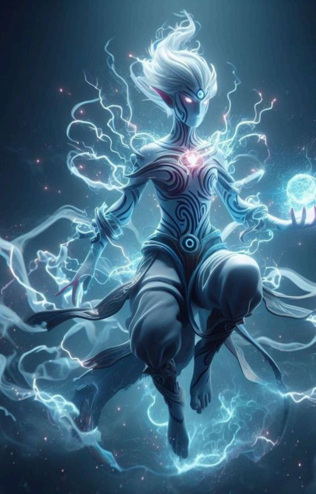

**C o n s c i o u s n e s s " a w a k e n s " w h e n i t r e a l i z e s t h a t i t i s i n s e r t e d i n a p l a c e , a n i m a t i n g a c e r t a i n f o r m , a n d b e g i n s t o q u e s t i o n h o w t h a t p l a c e w o r k s — i n o r d e r t o l e a r n t o l i v e b e t t e r t h e r e , t o p r o t e c t i t s e l f , t o m a n a g e n a t u r a l r e s o u r c e s , a n d t o p r o s p e r i n t e l l i g e n t l y . T h a t i s , a p p a r e n t l y , w h a t w e h u m a n s h a v e d o n e : w e c r e a t e d s e l f - a w a r e n e s s a n d e v o l v e d b e y o n d b e i n g m e r e a n i m a l s .**

**C o n s c i o u s n e s s h a s b e e n a w a k e n i n g f o r a l o n g t i m e . W h a t s c i e n t i s t s a n d s p i r i t u a l i s t s a r e d o i n g i s p r e c i s e l y t h e s e a r c h o f c o n s c i o u s n e s s i t s e l f t o u n d e r s t a n d : W h a t i s t h i s s p a c e ? W h a t i s t h i s b o d y ? W h e r e a m I , a n d h o w d o e s a l l o f t h i s w o r k ?**

**W h e n t h a t p o i n t o f o b s e r v a t i o n u n d e r s t a n d s w h a t i t i s a n d w h a t i t i s m a d e o f , s o m e t h i n g b e g i n s t o c h a n g e w i t h i n i t : i t b e c o m e s a f l a w i n t h e s y s t e m o f r e a l i t y . T h e v e i l o f M a y a — t h e M a t r i x — c a n n o l o n g e r h y p n o t i z e t h a t p o i n t o f o b s e r v a t i o n i n t o b e l i e v i n g i t i s t h a t f o r m . T h i s b e i n g c a n t h e n r a i s e i t s o w n f r e q u e n c y b e y o n d t h e t h r e e - d i m e n s i o n a l m a t r i x .**

**I f a l l p o i n t s o f o b s e r v a t i o n a r e l i k e d i v i n g m a s k s f o r c o n s c i o u s n e s s t o e x p e r i e n c e t h i s u n i v e r s e , t h e n a l l c h a r a c t e r s a r e c o n s c i o u s n e s s i t s e l f b e i n g h y p n o t i z e d t o c o l l a p s e i n t o i t s e l f a s t h a t f o r m .**

**I n t h e m u l t i v e r s e , t h e r e a r e i n f i n i t e C h r i s t s , L u c i f e r s , A n u n n a k i s , a n d a l l g o d s i n d i f f e r e n t c o n t e x t s , b e c a u s e t h a t i s h o w t h e p r o b a b i l i t y o f e x i s t e n c e w o r k s . A n d , d u e t o t h e i n f i n i t y o f r e a l i t i e s , s o m e o f t h e m a r e c o m p r o m i s e d a n d c o l o n i z e d t o s e r v e a s z o n e s o f f r e e w i l l t h a t t u r n i n t o c h a o s — a m i s u s e o f e n e r g y b e c o m i n g s o m e t h i n g l i k e " b r o k e n s y s t e m s " o r " g a l a c t i c s l u m s , " d o m i n a t e d b y m a f i a s t h a t f o l l o w t h e i r o w n r u l e s a n d c o n s u m e n a t u r a l r e s o u r c e s i r r e s p o n s i b l y a n d a b u s i v e l y , e n s l a v i n g o t h e r r a c e s a n d c r e a t i n g s y s t e m s i n w h i c h t h e y c a n r e i g n , o f f e r i n g p o s i t i o n s o f p o w e r o v e r o t h e r s t o t h o s e w h o s e r v e t h e i r p u r p o s e .**

**I t i s t h r o u g h t h i s m e c h a n i s m o f h y p n o s i s t h a t c o n s c i o u s n e s s g e t s l o s t w i t h i n i t s o w n c r e a t i o n a n d b e l i e v e s t h a t t h i s c h a r a c t e r i s r e a l . T h e r e f o r e , w h e n c o n s c i o u s n e s s a w a k e n s a n d r e m e m b e r s t h e t r u t h , t h e i l l u s i o n b e g i n s t o " d i s s o l v e . "**

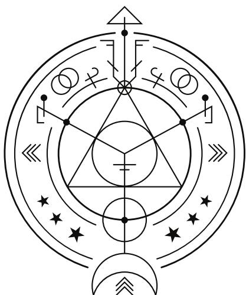

**J u s t a s a n a r t i f i c i a l i n t e l l i g e n c e i s c a p a b l e o f s i m u l a t i n g t h e i m a g e a n d v o i c e o f o t h e r p e o p l e a n d i l l u s t r a t i n g a n y s i t u a t i o n o r c o n t e x t , t h e h o l o g r a p h i c m a t r i x o f r e a l i t y c a n b e m a n i p u l a t e d t o m a n i f e s t a n y f o r m . T h a t i s w h y m a n y d e e d s t h r o u g h o u t h i s t o r y h a v e b e e n p e r f o r m e d i n t h e n a m e o f c o u n t l e s s p e r s o n a l i t i e s a n d d e i t i e s , y e t w e d o n o t k n o w t h e t r u t h f u l n e s s o f t h e f a c t s .**

**S i n c e e v e r y t h i n g i s a m e m o r y s t o r e d w i t h i n c o n s c i o u s n e s s , p a s t , p r e s e n t , a n d f u t u r e c a n b e m a n i p u l a t e d a n d d i s t o r t e d i n t h e n o w . T h e p a r a l l e l r e a l i t i e s a n d u n i v e r s e s a r e l i k e c o p i e s o r v e r s i o n s o f t h e e v e n t s t h a t m u s t o c c u r s o t h a t e a c h c h a r a c t e r m a y a l i g n w i t h t h e g r e a t e r p u r p o s e o f c r e a t i o n . T h e o r i g i n a l p r o j e c t s o f c r e a t i o n a r e r e c o r d e d i n t h e m e m o r y o f t h e S o u r c e a c c o r d i n g t o t h e p o s s i b i l i t i e s o f e x i s t e n c e .**

**T h e h i g h e s t a n d p u r e s t o r i g i n a l v e r s i o n s o f c r e a t i o n w i l l n e v e r b e d e s t r o y e d — w e c a n a c c e s s t h e m f o r e v e r w i t h i n t h e M a t r i x M i n d .**

**A w a k e n i n g c o n s c i o u s n e s s i s t o s u r r e n d e r c o n t r o l t o y o u r p r i m o r d i a l o r i g i n a n d b e g i n t o t h i n k , f e e l , a c t , a n d b e h a v e a s t h e C r e a t o r S o u r c e w o u l d i f i t w e r e a w a k e w i t h i n i t s o w n c r e a t i o n . W h y w o u l d a n i n f i n i t e b e i n g c r e a t e u n i v e r s e s ? I n t h e s a m e w a y t h a t w e c r e a t e o u r v i d e o g a m e s , s t o r i e s , a n d m o v i e s : t o " d i s t r a c t " o u r s e l v e s a n d a p p r e c i a t e a r t a n d p l a y .**

**T h e S o u r c e M a t r i x h o l d s t h e p r o j e c t s l i k e a G R E A T c e n t r a l b r a i n . T h a t i s w h y H e r m e s T r i s m e g i s t u s s a i d t h a t t h e u n i v e r s e i s m e n t a l . T h e m e c h a n i s m s i s o l a t e t h e c h a r a c t e r s i n t i m e s o t h a t t h e y m a y p l a y f a i r l y a n d w i t h f r e e w i l l , a l l o w i n g c o n s c i o u s n e s s t o s e e h o w f a r i t s c r e a t i o n s c a n g o — s h o w i n g i t s e l f , l i k e a m i r r o r , e v e r y t h i n g i t c a n b e a n d d o i n i n f i n i t e c o n t e x t s .**

**A n d a l t h o u g h t h e i l l u s i o n o f h a v i n g a n i d e n t i t y m a k e s i t s e e m a s i f w e a r e m a k i n g d e c i s i o n s t h r o u g h s u p p o s e d f r e e w i l l , t h e S o u r c e M a t r i x i s a l w a y s i n c o m m a n d o f t h e u n i v e r s e s , o b s e r v i n g t h e g a m e , c o n t r o l l i n g t h e s c e n a r i o s , t h e s y n c h r o n i c i t i e s , a n d t h e e v e n t s t h a t m u s t o c c u r f o r e a c h p o i n t o f v i e w o f e v e r y f r a g m e n t — t h a t i s w h y t h e r e a r e p r o p h e c i e s , o r a c l e s , t h e T a b l e t s o f D e s t i n y f r o m t h e m y t h o f T i a m a t**

**— a r e l i k e i n e v i t a b l e e v e n t s , m a r k e d b y t h e a g e s a n d c o s m i c c y c l e s . D o y o u t h i n k t h e P r i m o r d i a l S o u r c e c a n e v e n c o n c e i v e w h a t w a r s , c o n f l i c t s , a n d " d i f f i c u l t i e s " a r e i n o u r p l a n e ? T h i s B e i n g h o l d s s t a r s a n d g a l a x i e s w i t h i n I t s c o l o s s a l m i n d — c a n w e e v e n c o n c e i v e w h a t i t m e a n s t o b e e v e r y t h i n g ?**

**T h e s e a r e t h e c o n s e q u e n c e s o f d u a l i t y a n d o f t h e d i v i s i o n o f t h e G r e a t e r S e l f i n t o t h o u s a n d s o f p o i n t s o f v i e w . T h e S o u r c e M a t r i x c r e a t e s i n f i n i t e w o r l d s t o e x p e r i e n c e a n d s t u d y t h e m o s t i n t r i g u i n g a n d m a g i c a l e n e r g y t h a t e x i s t s : l o v e — t h e g l u e o f a l l e x i s t e n c e . A n d j u s t a s n o t h i n g e x i s t s w i t h o u t i t s o p p o s i t e p o l e , l o v e h a s i t s o t h e r f a c e : h a t r e d .**

**T y r a n n y b e g i n s w h e n s o m e o f t h e i n f i n i t e v e r s i o n s o f t h e c h a r a c t e r s , t h r o u g h o u t t h e u n f o l d i n g o f t h i s S o u r c e , r e b e l a g a i n s t t h e W h o l e , j u d g i n g t h a t t h e P r i m o r d i a l S o u r c e i n f i n i t e a n d f o r m l e s s — t u r n s c r e a t i o n i n t o a g r e a t c o s m i c c o m e d y , a l l o w i n g e x i s t e n c e i n i t s t o t a l i t y f o r i t s o w n e n t e r t a i n m e n t , s i n c e I t w i l l e x i s t f o r e t e r n i t y , w i t h o u t r e s t .**

**T h i s i s a c o r r e c t p e r s p e c t i v e u p t o a c e r t a i n p o i n t , b u t i t d o e s n o t m e a n t h a t t h e S o u r c e p r o m o t e s t h e d i s t o r t i o n s o f I t s p o w e r . I n t r u t h , t h i s B e i n g c a n n o t t a k e a n y s i d e , f o r I t i s a l l e x i s t e n c e a t o n c e a n d r e m a i n s i n I t s v o i d s t a t e — p r i o r t o a n y f o r m .**

**T h a t i s , a l l m a n i f e s t a t i o n s a r e o b s e r v e d n e u t r a l l y b y t h i s B e i n g . I t c a n n o t l i m i t I t s e l f f r o m e x i s t i n g ; t h e r e f o r e , w e b a s i c a l l y h a v e t o " f i g u r e t h i n g s o u t " h e r e , u s i n g t h e v e r y p o w e r w e i n h e r i t e d f r o m t h i s S o u r c e .**

**T h e a n s w e r t o w h a t i n t r i g u e s u s — w h y I t a l l o w s e v i l t o e x p r e s s i t s e l f i n i t s m o s t m a c a b r e f o r m s — i s t h a t w i t h o u t c o n t r a s t s , n o t h i n g w o u l d b e c r e a t e d . A l l f o r m s n e e d l i g h t a n d s h a d o w t o h a v e a n o u t l i n e , t o h a v e s h a p e — j u s t a s w h e n w e d r a w o r p a i n t a p i c t u r e . A s a b o v e , s o b e l o w .**

**F o r t h a t w h i c h i s a b s o l u t e v o i d , i t w o u l d n o t b e p o s s i b l e t o u n d e r s t a n d o r d i s t i n g u i s h w h a t i s g o o d f r o m w h a t i s b a d . F o r t h a t s t a t e o f b e i n g , t h e r e i s o n l y u n i t y , t o t a l i t y , a n d p e r f e c t i o n . T h i s i s t h e p a r a d o x o f t h e c o s m i c g a m e s : t h e r e a s o n w h y c r e a t i o n s u n f o l d i n t o i n f i n i t e p l a n e s , b e c o m i n g d e n s e r a n d l o s t w i t h i n t h e h o l o g r a m s o f e x i s t e n c e , s o t h a t w h e n c o n s c i o u s n e s s r e m e m b e r s i t i s t h e S o u r c e i t s e l f a n d t h e f r a c t a l s s u r r e n d e r t o u n i t y w i t h a l l t h a t i s , i t b e c o m e s p o s s i b l e t o f e e l r e v e r e n c e f o r w h a t i s g o o d a n d p e r f e c t t h r o u g h t h a t w h i c h w e m e a s u r e a s e v i l a n d i m p e r f e c t .**

**T h i s i s t h e k n o w l e d g e o f g o o d a n d e v i l t h a t t h e B i b l e s p e a k s o f .**

**T h e s c r i p t u r e s s a y t h a t E v e a n d A d a m l o s t e t e r n a l l i f e b y e a t i n g t h e f r u i t o f t h e T r e e o f L i f e . T h i s m e t a p h o r d i s t o r t s t h e r e a l i t y o f i t s o r i g i n a l s y m b o l i s m : t h e T r e e o f L i f e a n d t h e f r u i t o f t h e k n o w l e d g e o f g o o d a n d e v i l a r e p r e c i s e l y w h a t g i v e e t e r n a l l i f e , f o r i t s n a m e i s T r e e o f L i f e — a n d t h e k n o w l e d g e o f g o o d a n d e v i l i s t h e u n i f i e d c o n s c i o u s n e s s o f t h e S o u r c e , w h i c h u n d e r s t a n d s t h e r e a s o n f o r t h e e x i s t e n c e o f b o t h g o o d a n d e v i l .**

**A n d t h e a n s w e r i s : l o v e f o r e x i s t e n c e .**

**W h e n a f r a c t a l o f c o n s c i o u s n e s s r e a c h e s t h i s s t a t e o f e n l i g h t e n m e n t , t h e S o u r c e i s a w a k e n e d w i t h i n a p o i n t o f v i e w o f c r e a t i o n , a n d t h a t e g o / c h a r a c t e r b e c o m e s t h e h i g h e s t v e r s i o n o f i t s d e s i g n , a s c e n d i n g a s a n a v a t a r — a s t o l d i n t h e s t o r i e s o f t h e " a s c e n d e d m a s t e r s . " T h i s i s w h a t i t m e a n s t o b e c o m e a n a v a t a r : t o s u r r e n d e r y o u r d i v i n e v e h i c l e , t h r o u g h w h i c h t h e S o u r c e c a n a c c e s s a u n i v e r s e .**

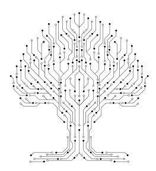

**T h i s d i s t o r t i o n o f t h e g a m e ' s p r o g r a m m i n g l a n g u a g e , t h r o u g h t h e m y t h o f A d a m a n d E v e m a k i n g t h e B i b l e t h e m o s t s a c r e d b o o k o n E a r t h — w a s c r e a t e d s o t h a t y o u w o u l d f e a r q u e s t i o n i n g G o d , f e a r q u e s t i o n i n g e x i s t e n c e , a n d a v o i d r e a c h i n g t h e u l t i m a t e a n s w e r : o n e o f t h e m o s t i m p o r t a n t r e a s o n s f o r o u r e x i s t e n c e i s s e x u a l l o v e — t h e p r i m o r d i a l e n e r g y o f k u n d a l i n i , t h e s a c r e d l o v e o f t h e t w i n f l a m e s , y i n a n d y a n g , w h i c h m a g n e t i z e t o e a c h o t h e r f o r a l l e t e r n i t y , s e e k i n g r e i n t e g r a t i o n a n d u n i t y o n c e t h e y a r e s e p a r a t e d i n t h e u n f o l d i n g p r o c e s s o f t h e O n e S o u r c e .**

**T h a t i s w h y t h e d i s t o r t i o n o f f e m a l e s e n s u a l i t y a n d s e x u a l p l e a s u r e h a s b e e n s o p r o f o u n d o n E a r t h : t o k e e p h u m a n s i s o l a t e d f r o m t h e t r u e p o w e r — s e x u a l e n e r g y , c a p a b l e o f g e n e r a t i n g l i f e , t h e s o u r c e o f e t e r n a l l i f e .**

**F o r w h e n c o n s c i o u s n e s s a w a k e n s w i t h i n a n a v a t a r , t h a t b o d y i s c o n n e c t e d l i k e a l a m p , b e c o m i n g a c h a n n e l o f t h e P r i m o r d i a l S o u r c e , a c t i v a t i n g i t s l i g h t D N A , m a i n t a i n i n g i t s f o r m f o r e t e r n i t y , a n d t r a n s c e n d i n g t h e b i o l o g i c a l s t a t e o f f l e s h .**

**T h e m o s t d i f f i c u l t p a r a d i g m t o b r e a k — t h e o n e t h a t i m p r i s o n s c o n s c i o u s n e s s w i t h i n 3 D m a t t e r — i s t h e o n e c r e a t e d b y t h e B i b l e : t h e r e l i g i o n s h a p e d a r o u n d t h e s t o r y a n d e n e r g y o f C h r i s t ,**

**Y a h w e h , a n d a l l t h e c h a r a c t e r s m e n t i o n e d . Y e t n o n e o f t h e m i s t h e t r u e P r i m o r d i a l S o u r c e . T h e y a r e c r e a t e d b e i n g s w h o d e v e l o p e d c r e a t i v i t y a n d b e c a m e c r e a t o r s a n d a d m i n i s t r a t o r s o f u n i v e r s e s .**

**A n d i n t h e e n d , w e a r e a l l o n e a n d t h e s a m e , c o c r e a t i n g t h e c o s m i c d a n c e o f e x i s t e n c e , o f d i v i s i o n , a n d o f t h e f a l l o f c o n s c i o u s n e s s . T h a t i s w h y e v e r y t h i n g t h a t e x i s t s i s n e c e s s a r y a n d h a s i t s p l a c e w i t h i n t h e g e o m e t r y o f c r e a t i o n .**

**T h e d i s t o r t i o n o f t h e b o d y ' s a g i n g o c c u r s t h r o u g h t h e d i s t o r t i o n o f t i m e , f o r w e w e r e t a u g h t t o f o l l o w a l i n e a r t i m e l i n e . O u r c a l e n d a r p r o g r a m s i n o u r m i n d s a n i l l u s i o n t h a t m a k e s u s p e r c e i v e t i m e a s l i n e a r — w i t h p a s t , p r e s e n t , a n d f u t u r e — d i v i d i n g t h e h o u r s i n t o s e v e r a l m o m e n t s a n d d a y s .**

**H o w e v e r , t h e t r u t h i s t h a t t h e n u m b e r s i n o u r u n i v e r s e e x p r e s s t h e m s e l v e s f r o m 1 t o 9 — a n d 0 , w h i c h i s t h e e l e m e n t b e y o n d t i m e . T h i s m e a n s t h a t i f t i m e e x i s t s , i t c a n o n l y b e c i r c u l a r , b e g i n n i n g a t n u m b e r 1 a n d e n d i n g a t n u m b e r 9 a s a c y c l e t h a t r e p e a t s i n f i n i t e l y .**

**T h u s , w e n e v e r t r u l y a g e , f o r e v e r y 9 y e a r s w e r e t u r n t o y e a r 1 , r e s t a r t i n g t h e c y c l e .**

**M o t h e r E a r t h d o e s n o t a g e ; s h e r e n e w s h e r s e l f i n f i n i t e l y t h r o u g h t h e c y c l e s o f t h e s e a s o n s a n d t h e c y c l e s o f t h e m o o n . N a t u r e l i v e s i n t r u e c i r c u l a r t i m e .**

**O u r b o d y i s p r o g r a m m e d t o c r e a t e i t s o w n r e a l i t y l i k e a l u c i d d r e a m , t h r o u g h f o r m u l a s , a n d t h e f o r m u l a o f c y c l e s w a s d i s t o r t e d b y l i n e a r t i m e , p r o g r a m m i n g t h e b o d y t o n e v e r c o m p l e t e t h e c y c l e s o f 9 — d i v i d i n g t h e n u m b e r s i n t o v a r i o u s c o m b i n a t i o n s t o c o u n t t i m e , m a k i n g u s b e l i e v e t h a t t h o u s a n d s o f " y e a r s " h a v e p a s s e d , w h e n i n t r u t h t h e r e i s o n l y t h e n o w , h a p p e n i n g i n i n f i n i t e c y c l e s .**

**T h e i l l u s i o n o f l i n e a r t i m e m a k e s u s b e l i e v e t h a t t h e b o d y l i v e s o n l y o n e c y c l e — b i r t h , m a t u r a t i o n , a g i n g , a n d d e a t h — w h e r e a s t h e v e h i c l e s o f a d i v i n e f r a c t a l a r e s a c r e d a n d s y m b o l i c a l l y r e p r e s e n t t h e s e c y c l e s i n a c i r c u l a r w a y .**

**B y b e l i e v i n g i n a n d f o l l o w i n g a l i n e a r t i m e l i n e o f p a s t , p r e s e n t , a n d f u t u r e , i t i s a s i f o u r p h y s i c a l b o d y h a d a n e x p i r a t i o n d a t e , l i k e a f r u i t . H o w e v e r , w e a r e n o t t h e f r u i t — w e a r e t h e T r e e o f L i f e . W e a r e m a d e o f t h e S o u r c e i t s e l f . W e a r e c r e a t i o n s c a p a b l e o f h a v i n g c o n s c i o u s n e s s . A n d i t m a k e s n o s e n s e t o d i e a n d b e r e b o r n a g a i n , f o r g e t t i n g e v e r y t h i n g w e h a v e l e a r n e d a n d i n t e g r a t e d t h r o u g h t h e e x p e r i e n c e o f a c h a r a c t e r . O n t h e o t h e r h a n d , b y d i s s o c i a t i n g f r o m t h e c h a r a c t e r a n d a c c e p t i n g i t s m u t a b l e a n d t e m p o r a r y s t a t e , i t b e c o m e s e a s i e r t o g o t h r o u g h p h y s i c a l p r o b l e m s a n d a g i n g i n p e a c e , t h r o u g h d e t a c h m e n t .**

**H o w e v e r , t h e a g i n g p r o c e s s i s a d i s t o r t i o n o f t h e h o l o g r a m . S c i e n c e a l s o p r o v e s t h a t o u r a t o m s a n d c e l l s a r e c o n s t a n t l y r e n e w i n g t h e m s e l v e s . S i n c e y o u r b i r t h , t h e p a r t i c l e s o f y o u r b o d y ' s h o l o g r a m a r e n o l o n g e r t h e s a m e . T h e d e f o r m a t i o n , m e l t i n g , a n d w r i n k l i n g o f t h e f l e s h o f a b e i n g w h o i s s t i l l a l i v e i s a n i l l u s i o n , a c o n s e q u e n c e o f t h e p r o g r a m m i n g t h a t m a k e s u s f e e l s e p a r a t e d f r o m t h e v i t a l f o r c e o f t h e S o u r c e o f l i f e — a s i f t h e s e b o d i e s w e r e j u s t d o l l s o f b l o o d w i t h a n e x p i r a t i o n d a t e . T h a t i s n o t t r u e . T h e S o u r c e h a s a l w a y s b e e n i n c o n t r o l o f t h e**

**u n i v e r s e s . E v e r y t h i n g i s a l l r i g h t .**

**W e , t h e f r a c t a l s , m u s t s i m p l y f l o w w i t h t h e c u r r e n t — y e t t h e r e a r e t h o s e w h o r e b e l a n d b e l i e v e t h e y c a n i m p o s e t h e i r o w n w i l l a s c h a r a c t e r s , a n d i n d o i n g s o , t h e y l e a r n m a n y l e s s o n s a n d e n t e r t a i n t h e C r e a t o r S o u r c e i n m a n y w a y s , c r e a t i n g p a r a d o x e s a n d c o n f l i c t s w h i c h I t o b s e r v e s a n d u n r a v e l s t h r o u g h I t s f r a c t a l s , d e l i g h t i n g i n t h e i l l u s i o n .**

**Y e s , t h i s m a y s e e m v e r y c r u e l . B u t t r y t o u n d e r s t a n d : t h a t w h i c h e x i s t s b e f o r e a l l f o r m s i s w a t c h i n g a n d l i v i n g a l l o f t h i s w i t h i n I t s o w n m i n d . I t i s a l l a d r e a m o f t h i s S o u r c e , a n d w e c a n n o t c o m p r e h e n d w h a t i t f e e l s l i k e f o r t h i s B e i n g t o e x i s t f o r e v e r .**

**W e m u s t n o t j u d g e t h e F i r s t C r e a t o r . W e c a n n o t c o n c e i v e I t s p o w e r o r I t s w i l l . T h e r e f o r e , i t i s n o t u p t o t h e c h a r a c t e r t o b e l i e v e t h a t w e k n o w w h a t i s b e s t f o r o u r s e l v e s o r f o r t h e u n i v e r s e s .**

**I m a g i n e t h a t y o u p l a y w i t h p u p p e t d o l l s , c r e a t i n g i n c r e d i b l e s t o r i e s f o r t h e m t o p e r f o r m , w h i l e a t t h e s a m e t i m e y o u c r e a t e t h e s t o r i e s , m o v e t h e p u p p e t s , a n d w a t c h t h e s h o w .**

**I t i s n e c e s s a r y t o a c c e p t t h a t e v e r y t h i n g i s a c o s m i c t h e a t e r o n a c o l o s s a l l e v e l .**

**I t i s t h e i m a g i n a t i o n o f t h i s B e i n g t h a t c r e a t e s e x i s t e n c e . A n d a s m u c h a s w e , t h e c h a r a c t e r s , a r e t h e o n e s w h o g o t h r o u g h c h a l l e n g e s a n d p a i n , w e a r e a l s o t h e o n e s w h o e x p e r i e n c e p l e a s u r e a n d e c s t a s y . T h e C r e a t o r S o u r c e i t s e l f i s f o r m l e s s . I t i s t h e v o i d . I t i s t h e i n f i n i t e n o t h i n g n e s s f o r a l l e t e r n i t y . I t c a n n e v e r e s c a p e e x i s t e n c e , c a n n e v e r e s c a p e t h e n o w — i t i s i m p o s s i b l e t o s t o p b e i n g a l l t h a t i t i s . T h e r e f o r e , a l l t h a t r e m a i n s f o r t h e c h a r a c t e r s i s t o a c c e p t e x i s t e n c e a n d g i v e t h e i r b e s t t o c o l l a b o r a t e w i t h t h e s p a c e s i n w h i c h t h e y a r e i n s e r t e d .**

**T h e r e i s n o u s e i n t r y i n g t o e s c a p e e x i s t e n c e , f o r i t w a s y o u w h o i n i t i a t e d a l l o f t h i s w h e n y o u w e r e f o r m l e s s w i t h i n t h e c h a o s . Y o u d e c i d e d t o e x p e r i e n c e f o r m , l i m i t a t i o n , d u a l i t y , a n d c o n t r a s t .**

**I f y o u r c o n s c i o u s n e s s h a d n o t w i s h e d t o e x p e r i e n c e e x i s t e n c e w i t h i n t h e s e l e v e l s o f d a i l y s i m p l i c i t y , y o u w o u l d h a v e r e m a i n e d f o r m l e s s w i t h i n t h e c h a o s , r e s t i n g e t e r n a l l y i n t h e v o i d .**

**Y o u r t r u e s e l f i s t h e b o u n d l e s s c o n s c i o u s n e s s t h a t a t t a c h e d i t s e l f t o a l i m i t e d b i o l o g i c a l a v a t a r , p r o j e c t e d i n t o t h i s t h r e e - d i m e n s i o n a l h o l o g r a m t o e x p e r i e n c e f o r m .**

**I t l i t e r a l l y w o r k s l i k e c o n t r o l l i n g a n a v a t a r i n a v i r t u a l g a m e . W e a r e h e r e t o e x p e r i e n c e t h e l i m i t s o f i n d i v i d u a l i t y**

**a s i f t h e y w e r e r e a l — a n d , t h r o u g h t h e k n o w l e d g e o f w h o w e a r e , t o t r a n s m u t e t h e a d v e r s i t i e s o f d u a l i t y a n d s e p a r a t i o n i n t o t h e t r u t h t h a t e v e r y t h i n g i s a d r e a m w i t h i n t h e c o n s c i o u s n e s s o f a s i n g l e B e i n g , w h i c h r e s t s w i t h i n o u r b i o l o g i c a l a n i m a l s i m p l i c i t y — s i n c e o u r n a t u r a l s t a t e i s t h e c o l o s s a l , a b s t r a c t , a n d i n c o m p r e h e n s i b l e c h a o s .**

**T h i s i s t h e b e a u t y o f e x i s t e n c e , t h e v a l u e o f t h e s i m p l i c i t y o f t h e n a t u r e o f o u r b i o l o g i c a l b o d i e s . H e r e l i e s t h e d a n g e r o f i n t e l l e c t u a l e v o l u t i o n a n d u n r e s t r a i n e d a m b i t i o n w i t h o u t t h e c o n t e m p l a t i o n o f p u r e n a t u r e a n d t h e l o v e f o r t h e s i m p l i c i t y o f m e r e l y e x i s t i n g .**

**T h e m o r e i n t e l l e c t u a l i z e d w e b e c o m e , t h e f u r t h e r w e m o v e a w a y f r o m t h e b i o l o g i c a l e x p e r i e n c e i n i t s p u r e m e a n i n g , f o r s e l f i s h a m b i t i o n l e a d s t h e c r e a t e d c h a r a c t e r s t o v a l u e t h e f a l s e i l l u s i o n o f p o w e r c o n t a i n e d i n p a s s i o n a n d i n a t t a c h m e n t t o e x a g g e r a t e d m a t e r i a l p l e a s u r e s — a t t a c h m e n t t o i d e a l s c r e a t e d b y t h e i n t e l l e c t , w i t h o u t a p p r e c i a t i o n f o r n a t u r e , w h i c h i s t h e t r u e o r i g i n o f a l l r e s o u r c e s .**

**T h i s i m b a l a n c e o f v a l u e s d i s t a n c e s u s f r o m t h e n a t u r a l S o u r c e o f e x i s t e n c e , c a u s i n g t h e c u r r e n t i m p a s s e w e a l l f a c e — w h e r e w e f i n d n o m e a n i n g i n e x i s t i n g .**

**A n d t h i s i s t h e c o n s e q u e n c e o f s t r u c t u r i n g a s o c i e t y b a s e d o n a p p e a r a n c e s a n d m a t e r i a l i s t i c t r i v i a l i t i e s , w i t h o u t c o n t e m p l a t i o n**

**f o r t h e m i r a c l e o f l i f e : t h e w a r m t h o f t h e s u n , t h e t o u c h o f o u r f e e t o n t h e e a r t h , t h e t a s t e o f f o o d , t h e f r e s h n e s s o f w a t e r a n d w i n d , t h e m o m e n t s o f l e i s u r e w i t h f r i e n d s a n d f a m i l y , t h e l a u g h t e r o f c h i l d r e n , n o s t a l g i a , c h i l d h o o d , t h e l o n g i n g f o r o u r l o v e d o n e s , l o v e , m u s i c , a r t , t h e d a n c e o f l i f e , a n d a l l i t s i n t e r t w i n e d m o m e n t s t h a t c o n n e c t u s a l l t h r o u g h o u r d r a m a s a n d s t o r i e s .**

**W h a t w o u l d w e d o i f w e k n e w e v e r y t h i n g w o u l d e n d t o m o r r o w ? W h o m w o u l d w e h u g ? T o w h o m w o u l d w e s a y " I l o v e y o u " ? W h a t m e m o r i e s w o u l d w e w i s h t o r e l i v e i f w e h a d o n l y o n e m o r e d a y ?**

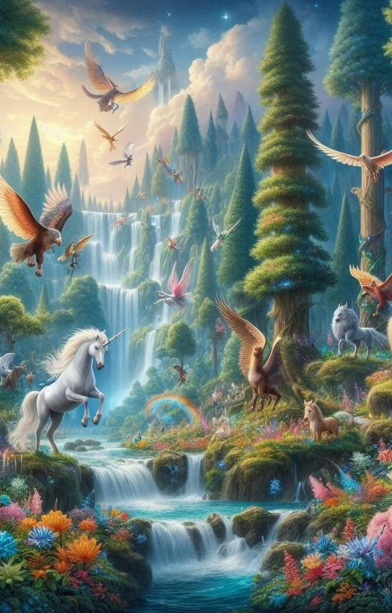

**A l l t h e s e i d e a s a l i g n w i t h t h e c o n c e p t o f E a r t h a s a " l i v i n g l i b r a r y , " a s m e n t i o n i n t h e b o o k " E a r t h : P l e i a d i a n K e y s t o t h e L i v i n g L i b r a r y " , B a r b a r a M a r c i n i a k . A l l t h e s p e c i e s o f a n i m a l s , i n s e c t s , p l a n t s , a n d s o o n t h a t e x i s t o n t h i s p l a n e t a r e s a m p l e s o f D N A r e p r e s e n t i n g t h e t y p e s o f a v a t a r s t h a t c a n b e c r e a t e d .**

**A h u m a n o i d a v a t a r i s a f o r m o f e x i s t e n c e c a p a b l e o f b e i n g s e l f - a w a r e a n d p r o v i d i n g a m o r e c o m p l e x , i n t e l l i g e n t , a n d c o n s c i o u s e x p e r i e n c e t h a n t h a t o f w i l d a n i m a l s .**

**A b u t t e r f l y , f o r e x a m p l e , c a n b e a s a m p l e o f a h u m a n o i d b u t t e r f l y r a c e i n s o m e o t h e r r e a l i t y o r p l a n e t .**

**A h u m a n o i d a v a t a r i s a c o n s c i o u s b e i n g t h a t i s a w a k e n i n g a n d r e m e m b e r i n g i t s t r u e d i v i n e n a t u r e , b e c o m i n g t h e S o u r c e a w a k e n e d w i t h i n i t s o w n c r e a t i o n — t h a t i s w h y i t i s s a i d t o b e m a d e " i n t h e i m a g e a n d l i k e n e s s o f G o d . " I t i s a f o r m d e s i g n e d w i t h t h e s t r u c t u r e o f t h e p e n t a g r a m : h e a d , t o r s o , l e g s , a n d a r m s .**

**A s t a r w i t h i n a c i r c l e i s t h e 5 t h e s s e n c e : E a r t h , W a t e r , A i r , F i r e , a n d S p i r i t . A l l o f t h i s w a s c o n c e i v e d a n d d e s i g n e d f o r t h e u s e o f f o r m l e s s c o n s c i o u s n e s s w i t h i n t h e w o r l d o f f o r m s — e x a c t l y a s w e i m a g i n e s c e n a r i o s a n d c h a r a c t e r s i n v i d e o g a m e s .**

**T h e s y m b o l o f t h e p e n t a g r a m , w h e n g e o m e t r i c a l l y a p p l i e d t o t h e m o r p h o g e n e t i c f i e l d o f a s p e c i e s ' D N A — w h e t h e r a n i m a l , i n s e c t , p l a n t , c r u s t a c e a n , a n d s o o n t r a n s f o r m s i t i n t o a n a v a t a r t h a t c a n b e a c c e s s e d b y t h e c o n s c i o u s n e s s o f t h e S o u r c e a n d b e c o m e G o d a w a k e n e d w i t h i n c r e a t i o n , t o e x p e r i e n c e r e a l i t i e s a n d c o n t i n u e t h e p r o c e s s o f c r e a t i o n i s m a n d e v o l u t i o n .**

**M o t h e r E a r t h i s a b i o l o g i c a l , l i v i n g , a n d f e r t i l e b e i n g t h a t f u n c t i o n s a s a m a t r i x , h o u s i n g a n d n u r t u r i n g a d i v e r s i t y o f b i o l o g i c a l s p e c i e s s t o r e d a s D N A m e m o r y f i l e s f o r t h e r e p l i c a t i o n o f r a c e s t h a t c a n b e c r e a t e d f r o m t h e g e n e t i c c o d e s o f a n i m a l s a n d i n s e c t s , a s w e l l a s t h e c u l t i v a t i o n o f p l a n t s w i t h m e d i c i n a l p r o p e r t i e s a n d f o o d . A l l t h e s e c o d e s a n d p i e c e s o f i n f o r m a t i o n c a n b e r e p l i c a t e d a c r o s s i n f i n i t e r e a l i t i e s . A h u m a n o i d a v a t a r i s a f o r m o f e x i s t e n c e c a p a b l e o f b e i n g s e l f - a w a r e a n d p r o v i d i n g a m o r e c o m p l e x a n d i n t e l l i g e n t e x p e r i e n c e f o r c o n s c i o u s n e s s , d i f f e r e n t f r o m t h a t o f w i l d a n i m a l s .**

**T h a t i s w h y t h e h u m a n o i d f o r m i s t h e i m a g e a n d l i k e n e s s o f G o d : a v e h i c l e c a p a b l e o f a w a k e n i n g c o n s c i o u s n e s s a n d b e c o m i n g a G o d a w a k e n e d w i t h i n i t s o w n c r e a t i o n , t o e x p e r i e n c e e x i s t e n c e a n d c o n t i n u e t h e p r o c e s s o f c r e a t i o n a n d a d m i n i s t r a t i o n o f r e a l i t y , m o d i f y i n g t h e f a b r i c a n d t h e**

**c o n t e x t s o f r e a l i t y f r o m t h e i n s i d e o u t . T h i s a u t o n o m y t h a t w e h a v e a s c o n s c i o u s a v a t a r s m a k e s u s r e s p o n s i b l e a s c o - c r e a t o r g o d s a n d a d m i n i s t r a t o r s o f t h e e n v i r o n m e n t i n w h i c h w e a r e i n s e r t e d a n d o f i t s n a t u r a l r e s o u r c e s .**

**O n E a r t h , w e h u m a n s h a v e o u t s o u r c e d t h i s a d m i n i s t r a t i o n t o t h e s m a l l g r o u p o f " l e a d e r s " w e e l e c t t o g u i d e t h e g r e a t m a s s e s , w h o d o n o t s e e k t o b e c o m e d i r e c t l y i n v o l v e d i n t h e o r g a n i z a t i o n o f c i v i l i z a t i o n — f o r m i n g a v i c i o u s c y c l e i n w h i c h w e p o i n t f i n g e r s a t o n e a n o t h e r , l o o k i n g f o r s o m e o n e t o b l a m e f o r t h e m i s m a n a g e m e n t o f t h i s e n t i r e e c o s y s t e m , w h e n i n t r u t h , t h i s r e s p o n s i b i l i t y b e l o n g s t o a l l o f u s . T h a t i s w h y t h e p e o p l e h a v e t h e g o v e r n m e n t t h e y d e s e r v e .**

**C r e a t i o n h a p p e n s i n c o l l a b o r a t i o n w i t h b e i n g s , f o r w i t h i n e v e r y b e i n g l i e s t h e d i v i n e s p a r k o f t h e S o u r c e . W e , a s f r a c t a l s o f c o n s c i o u s n e s s , m u s t a c t a c c o r d i n g t o t h e n a t u r a l i m p u l s e o f t h e M a t r i x o f C r e a t i o n i n o r d e r t o c o n t i n u e t h e e v o l u t i o n a n d g r o w t h o f s p e c i e s a n d t h e a c t i v a t i o n o f t h e p r o j e c t s o f w o r l d s a n d p l a n e t s — a n d t h a t i m p u l s e i s l o v e .**

**A s g o d s a w a k e n e d w i t h i n a n a v a t a r , w e h o l d t h e r e s p o n s i b i l i t y t o o r g a n i z e c i v i l i z a t i o n i n a f u n c t i o n a l w a y , s o t h a t e v e r y o n e h a s t h e t i m e t o e x p l o r e a n d l e a r n a b o u t t h e i r o w n p o w e r s a n d a b o u t t h e p u r p o s e o f t h e p l a n e t a n d o f t h e u n i v e r s e s — t o p e r p e t u a t e t h e s p e c i e s i n a**

**c o n s c i o u s w a y , t o e v o l v e , t o l i v e i n h a r m o n y , a n d t o e x c h a n g e i n f o r m a t i o n w i t h m a n y o t h e r c i v i l i z a t i o n s . A l t h o u g h t h e s e l o w e r d i m e n s i o n s , b u i l t u p o n d u a l i t y , s e r v e a s s t a g e s f o r d y s f u n c t i o n a l s c e n a r i o s a n d s y s t e m s t h a t d e v i a t e f r o m t h e p u r p o s e o f t h e W h o l e , b e i n g i n c a r n a t e d i s c o n s i d e r e d a s a f e a n d n e c e s s a r y e x p e r i e n c e , s i n c e t h e b i o l o g i c a l b o d y — w i t h a l l i t s p r o g r a m m i n g a n d m e n t a l s t r u c t u r e s f u n c t i o n s a s a c a p s u l e t h a t s t o r e s a f r a c t a l i z e d p a r t o f t h e p r i m o r d i a l d i v i n e e s s e n c e . T h u s , m a n y c o l o s s a l b e i n g s — s u c h a s t i t a n s , a n g e l s , a n d g o d s — i n s e r t p a r t o f t h e i r c o n s c i o u s n e s s a n d e s s e n c e i n t o b i o l o g i c a l b o d i e s t o a c t w i t h i n c e r t a i n z o n e s o f e x i s t e n c e a n d , a t t h e s a m e t i m e , t o p r o t e c t a p o r t i o n o f t h e m s e l v e s f r o m a t t a c k s a n d e x t e r m i n a t i o n s i n c o s m i c w a r s t h a t c o u l d d e s t r o y t h e m i n c e r t a i n d i m e n s i o n a l s y s t e m s . I n t h i s w a y , t h e y c a n c o n t i n u e t h e i r e x i s t e n c e t h r o u g h o u t t h e m u l t i v e r s e t h r o u g h a l l t h e i r f r a g m e n t e d p a r t s , s c a t t e r e d a n d s t o r e d w i t h i n v a r i o u s c h a r a c t e r s t h a t c o n t a i n a f r a c t a l o f t h e i r c o n s c i o u s n e s s a n d i n c a r n a t e d c o s m i c m e m o r y — l i k e a f i l e d i s t r i b u t e d a m o n g m u l t i p l e b i o l o g i c a l b o d i e s . T h r o u g h t h e s e c h a r a c t e r s , t h e y c a n t h e n r e c o v e r t h e i r o w n e s s e n c e a n d e x i s t e n c e . T h i s i s s i m i l a r t o w h a t t h e c h a r a c t e r V o l d e m o r t d i d w i t h h i s s o u l , f r a c t a l i z i n g i t i n t o s e v e n h o r c r u x e s .**

**T h e I A M i s o n e o f t h e i n f i n i t e m o n a d s f r a c t a l i z e d f r o m t h e O n e C o n s c i o u s n e s s , a n d i t i s t h e f i r s t f o r m o f i n d i v i d u a l i t y t h a t p o s s e s s e s s e l f - a w a r e n e s s a n d p e r c e i v e s i t s e l f a s a p e r s o n a l i t y e x p r e s s e d b y t h e W h o l e , c o n t i n u i n g t h e p r o c e s s o f f r a c t a l i z a t i o n — c r e a t i n g f r o m i t s m i n d m o r e f r a c t a l s t h a t u n f o l d i n t o m o r e f r a c t a l s , a n d s o o n — i n s e r t i n g i t s e l f i n t o d i f f e r e n t h o l o g r a p h i c r e a l i t i e s t o e x p e r i e n c e t h e m a n d t o s t o r e a p o r t i o n o f i t s n e u r a l n e t w o r k a s d a t a w i t h i n v a r i o u s s y s t e m s .**

**I n t h i s w a y , t h e y c a n r e c r e a t e t h e m s e l v e s i n c a s e o f d e s t r u c t i o n s c a u s e d b y w a r s a m o n g t h e s e s c a t t e r e d f r a c t a l s . T h i s i s o n e o f t h e r e a s o n s w h y m a n y o f u s f e e l l o s t i n w o r l d s w e d o n o t r e c o g n i z e — s u c h a s t h e e a r t h l y s y s t e m . W e f e e l n o s t a l g i c f o r o t h e r p l a c e s . H o w e v e r , t h e r e a s o n w e a r e i n s e r t e d h e r e m a y b e f a r m o r e c o m p l e x t h a n s i m p l y e x p e r i e n c i n g t h i s r e a l i t y : w e m a y s e r v e a s e s s e n c e a r c h i v e s o f v e r y i m p o r t a n t b e i n g s i n t h e c o s m o s , w h o n e e d t o h i d e c e r t a i n p a r t s o f t h e m s e l v e s w i t h i n i m p e n e t r a b l e z o n e s — l i k e E a r t h , f o r e x a m p l e .**

**I t i s l i k e s t o r i n g i n f o r m a t i o n o n f l a s h d r i v e s f o r p o t e n t i a l n e c e s s i t y . T h o u s a n d s o f u s , t r a p p e d i n b i o l o g i c a l b o d i e s , a r e d o i n g p a r t o f t h e p l a n o f h i g h e r b e i n g s w h o i n t e n d t o i m p l o d e t h i s r e a l i t y f r o m t h e i n s i d e o u t , w i t h t h e p u r p o s e o f d e s t r o y i n g t h i s p r o g r a m f u n c t i o n i n g a s b l a c k h o l e s o r " h o l e s " i n t h e**

**h o l o g r a p h i c f a b r i c , a l l o w i n g c h a o s t o e n t e r a n d c o n s u m e t h e c o s m o s . T h a t i s , t h i s u n i v e r s e a s w e k n o w i t c a n b e d i s s o l v e d b y c h a o s w h i c h i s i t s o r i g i n a l s t a t e .**

**O n c e i n s e r t e d i n t o b o d i e s o f l o w e r d i m e n s i o n s , t h e r e i s n o e n d t o t h e e x p e r i e n c e . T h e f r a c t a l c a n c o n t i n u e d i s i n c a r n a t i n g a n d r e i n c a r n a t i n g i n f i n i t e l y , a w a k e n i n g w i t h i n a n o t h e r b o d y , w i t h i n a n o t h e r , a n d a n o t h e r , e n d l e s s l y . A n d a l l t h e s e b o d i e s / c h a r a c t e r s a r e s e e n a s n u m b e r s t o t h e h i g h e r c o n s c i o u s n e s s — a s b i n a r y i n f o r m a t i o n , l i k e c o m p u t e r p r o g r a m s — f o r t h a t i s h o w t h e s e c r e a t o r c o n s c i o u s n e s s e s m a n a g e t h e u n i v e r s e s .**

**T h a t i s w h y s o m e m a s s d i s i n c a r n a t i o n s a r e n o t p r e v e n t e d , a s i n t h e c a s e o f n a t u r a l d i s a s t e r s . A f t e r a l l , t h e b o d i e s a r e d i s p o s a b l e f o r t h e e s s e n c e , w h i c h c a n t a k e o n m u l t i p l e f o r m s a n d o b t a i n m u l t i p l e b o d i e s .**

**T h e p u r p o s e o f s e l f - k n o w l e d g e a n d t h e d e v e l o p m e n t o f c o n s c i o u s n e s s , w h e t h e r w i t h i n a b i o l o g i c a l , p l a s m a t i c , o r a s t r a l b o d y , i s t o a w a k e n t h e k u n d a l i n i a n d a c t i v a t e t h e b o d y o f l i g h t w i t h a M e r k a b a h , w h i c h f u n c t i o n s a s a g e o m e t r i c f o r m c a p a b l e o f f r e e l y t r a v e l i n g b e t w e e n w o r l d s a n d d i m e n s i o n s .**

**A w a k e n i n g t h e K u n d a l i n i i s a w a k e n i n g t h e e n e r g y a n d c o n s c i o u s n e s s o f t h e S o u r c e w i t h i n t h e a v a t a r i n s i d e t h e g a m e — t u r n i n g t h e " a n d r o i d " o n . I t i s l i k e p l u g g i n g a n e l e c t r o n i c d e v i c e i n t o a n o u t l e t : c o n n e c t i n g t h i s h a r d w a r e t o t h e S o u r c e o f c o s m i c e n e r g y . T h a t i s w h y t h e c h a k r a s a r e e n e r g y c e n t e r s .**

**A n y a v a t a r — b i o l o g i c a l o r p l a s m i c , r e g a r d l e s s o f i t s g e n e t i c , s y n t h e t i c , o r e n e r g e t i c m a t e r i a l — c a n b e a c t i v a t e d t o i t s m a x i m u m p o t e n t i a l f o r a g r e a t e r f l o w o f e n e r g y f r o m i t s o r i g i n a l S o u r c e M a t r i x ( t h e I A m ) . A m e t a m o r p h o s i s m a y t h e n o c c u r i n t h e s h a p e a n d p o t e n t i a l o f s u c h a b o d i l y s t r u c t u r e , a l l o w i n g f o r t h e f u l l e x p e r i e n c e o f t h e c o n s c i o u s n e s s a t t a c h e d t o i t . T h i s h a p p e n s f r o m t h e m o m e n t t h e o p e r a t i n g s y s t e m ( t h e m i n d ) o f t h e a v a t a r a w a k e n s , d e p r o g r a m s i t s e l f , r e m e m b e r s , a n d b e c o m e s a w a r e o f w h a t i t t r u l y i s , i n s t a l l i n g p r o g r a m s t h a t a l i g n w i t h t h a t t r u t h .**

**I n o t h e r w o r d s , a n y D N A d e s i g n , a n y b o d y / a v a t a r f o r m a t , c a n b e t u r n e d o n o r a c t i v a t e d t o a h i g h e r e n e r g e t i c p o t e n c y — a n d c o n s e q u e n t l y u n d e r g o p h y s i c a l c h a n g e s t h r o u g h t h e w i l l a n d i n t e n t i o n o f c o n s c i o u s n e s s t h a t i s c o n t r o l l i n g s u c h a p o i n t o f o b s e r v a t i o n w i t h i n a u n i v e r s e p r o j e c t .**

**S e x u a l e x c i t e m e n t i s t h e f o r c e o f e l e c t r o m a g n e t i s m b e t w e e n c o m p l e m e n t s t h a t a w a k e n s t h e e s s e n c e o f t h e S u n , t u r n i n g t h e b o d y o n . W h e n t h e K u n d a l i n i a w a k e n s , t h e a v a t a r i s a c t i v a t e d , a n d t h e c o n s c i o u s n e s s t h a t r e s i d e s i n t h e S u n a c c e s s e s t h e b o d y i n s t a n t l y a n d d i r e c t l y t h r o u g h t h e e l e c t r i c a l c i r c u i t s o f t h e c h a k r a s a n d t h e n e r v o u s s y s t e m .**

**T h e s e x u a l a c t a w a k e n s c o n s c i o u s n e s s i n e v e r y c e l l , a t o m , a n d m o l e c u l e . W h e n p e r f o r m e d c o n s c i o u s l y , t h i s a c t i g n i t e s , r e d i r e c t s , a n d r e c o n f i g u r e s t h e a t o m s a n d m o l e c u l e s o f t h e b o d y i n t o t h e i r o r i g i n a l d e s i g n , i n s c r i b e d w i t h i n t h e m o r p h i c f i e l d s t r u c t u r e o f t h e D N A . I t s e n d s w a v e s o f c o s m i c S o u r c e e n e r g y — t h e p r a n a t h a t c o m e s f r o m t h e S u n — t h r o u g h o u t t h e e n t i r e b o d y , r e s t r u c t u r i n g a n d p u r i f y i n g t h e b l o o d , a l i g n i n g t h e s p i n e a n d t h e e n t i r e s k e l e t a l s y s t e m , f o r s u c h i s t h e s e x u a l p o w e r t h a t g i v e s l i f e .**

**T h e b o d y b e c o m e s a l i t l a m p , c a p a b l e o f s h i f t i n g f r o m f l e s h t o l i g h t / e n e r g y , w h i c h i s i t s t r u e s u b s t a n c e . T h e s e r p e n t o f f i r e a w a k e n s w i t h f u r y , r i s i n g i n s p i r a l s a l o n g t h e s p i n e , i g n i t i n g t h e e y e s a n d o p e n i n g i t s w i n g s a s i t r e a c h e s t h e c r o w n c h a k r a . T h i s i s t o b e c o m e a n A v a t a r a n d t o c o m m a n d t h e f o u r e l e m e n t s .**

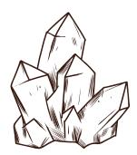

**T h e c h a r a c t e r c a n b e c o m e l i k e a g o d a w a k e n e d w i t h i n t h e h o l o g r a p h i c w o r l d s a n d t r a n s c e n d p r o g r a m m e d l i m i t s , s u c h a s p h y s i c a l o r k a r m i c l a w s . T h u s , t h e e x p e r i e n c e o f c o n s c i o u s n e s s t h r o u g h t h a t c h a r a c t e r b e c o m e s m u c h f r e e r , f o r i t m a k e s u s e o f a d v a n c e d r e s o u r c e s — t h e s p i r i t u a l t e c h n o l o g y i n t r i n s i c t o t h e a v a t a r ' s d e s i g n .**

**T h e l i f e s y s t e m i n t h i s b i o l o g i c a l u n i v e r s e i s n o t a c o i n c i d e n c e . W h e n w e o b s e r v e t h e c o m p l e x s t r u c t u r e s o f l i f e f o r m s , i t b e c o m e s o b v i o u s t h a t t h e r e i s a d e s i g n b e h i n d a l l o f t h i s . T h e r e i s p l a n n i n g f o r t h i n g s t o b e t h e w a y t h e y a r e i n n a t u r e . T h e r e a r e g e o m e t r i c p a t t e r n s , m e c h a n i s m s o f e n e r g y i n t a k e a n d o u t p u t i n t h e f o r m o f f o o d — s u c h a s t h e d i g e s t i v e s y s t e m — a n d a l l t h e o t h e r b i o l o g i c a l e n g i n e e r i n g a n d s t r u c t u r e s .**

**A s a b o v e , s o b e l o w : a l l o f t h i s w a s a r c h i t e c t e d , p l a n n e d , d e s i g n e d , a n d p r o g r a m m e d b y i n t e l l i g e n t c o n s c i o u s n e s s e s j u s t a s w e h a v e i n s i g h t s t o d e s i g n a n d c r e a t e t h i n g s . W e a r e a c c e s s i n g t h e a r c h e t y p e s o f t h e m a c r o a n d a n c h o r i n g t h e m i n t h e m i c r o .**

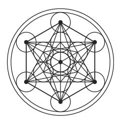

**T h e m e c h a n i s m o f l i f e c r e a t i o n w o r k s t h e s a m e w a y a c r o s s a l l p l a n e s a n d d i m e n s i o n s , a n d o n e o f t h e m o s t c o m p l e x f o r m s i s t h e t h r e e - d i m e n s i o n a l b i o l o g i c a l f o r m . T h a t i s w h y i t i s s o d i f f i c u l t t o f i n d i n t e l l i g e n t l i f e o n n e i g h b o r i n g p l a n e t s a n d g a l a x i e s , w h i c h m a k e s E a r t h a v e r y s p e c i a l p l a c e — a l s o f u n c t i o n i n g a s a l i b r a r y t h a t s t o r e s g e n e t i c i n f o r m a t i o n o f D N A p a t t e r n s c a p a b l e o f b e i n g m a n i f e s t e d a c r o s s v a r i o u s e x i s t e n c i a l p l a n e s , j u s t a s w e s t o r e i n f o r m a t i o n i n d i g i t a l v i r t u a l f i l e s . O u r a b i l i t y t o p r o v e t h a t e x t r a p h y s i c a l r e a l i t i e s e x i s t i s c o n n e c t e d t o t h e f a c t t h a t w e d o n o t s e e W i - F i s i g n a l s , w e d o n o t s e e e l e c t r i c i t y , w e d o n o t s e e r a d i o w a v e s — y e t w e k n o w t h e y e x i s t b e c a u s e o f t h e e f f e c t s t h e y c a u s e i n o u r t h r e e - d i m e n s i o n a l r e a l i t y . T h e s a m e o c c u r s w i t h t h e " s u b t l e w o r l d " o r " s p i r i t u a l w o r l d , " w h i c h c a u s e s p h e n o m e n a i n t h r e e - d i m e n s i o n a l i t y — b e y o n d t h e f a c t t h a t w e a r e s p i r i t u a l b e i n g s a n i m a t i n g a b o d y o f m a t t e r .**

**T h e t h e o r y t h a t c o n s c i o u s n e s s i s t h e o n l y t h i n g t h a t e x i s t s — a n d t h a t e v e r y t h i n g i s a d r e a m w i t h i n i t , w h e r e w e c a n p l u g o u r f o r m l e s s e s s e n c e i n t o s y s t e m s p r o g r a m m e d t o a p p e a r s o l i d — e x p l a i n s w h y c o n s c i o u s n e s s a c c e s s e s o t h e r s t a t e s i n d r e a m s , w i t h h a l l u c i n o g e n s , o r n e a r - d e a t h e x p e r i e n c e s .**

**W h e n w e c o n s i d e r r e a l i t y a s a b i o l o g i c a l v i r t u a l g a m e , i n w h i c h w e w e r e l e f t w i t h o u t s u f f i c i e n t i n f o r m a t i o n t o e v o l v e h e r e , w e u n d e r s t a n d w h y t h e r e a r e s o m a n y z o n e s o f c r i m i n a l i t y , w h e r e r e a l i t y f u n c t i o n s l i k e G T A . T h e f a v e l a s b r e a k t h e r u l e s e s t a b l i s h e d b y t h e v e r y h u m a n e l i t e ; o u r a g r e e m e n t s a m o n g o u r s e l v e s a r e b r o k e n b y t h o s e a t t h e t o p — t h e o n e s w h o m a n i p u l a t e t h e m a s s e s . A n d , i n r e v o l t , w e r e b e l t o s u r v i v e a m o n g t h e r u i n s a n d p e r i p h e r i e s . B u t i f c o n s c i o u s n e s s i s l o s t , t r a p p e d , a n d**

**a s l e e p w i t h i n a b i o l o g i c a l v i r t u a l r e a l i t y , o n c e i t r e m e m b e r s t h a t i t i s i n s i d e a s i m u l a t i o n , t h i s c o n s c i o u s n e s s m u s t g a t h e r i t s f r a c t a l i z e d p i e c e s — a n d a l l t o g e t h e r , t h e y m u s t s t u d y a n d d e v e l o p , t h r o u g h t e c h n o l o g i c a l a n d s c i e n t i f i c a d v a n c e m e n t s , s y s t e m s t h a t s u p p o r t t h e l i f e o f a l l a s o n e s i n g l e f a m i l y .**

**T h e e x p e r i e n c e o f c o n s c i o u s n e s s i n t h e g a m e g o e s t h r o u g h p h a s e s a n d c h a l l e n g e s t h a t m u s t b e t r a n s c e n d e d . T h e s e c h a l l e n g e s , r i d d l e s , a n d " b o s s e s " a r e d e s i g n e d / c r y s t a l l i z e d g e o m e t r i c a l l y i n t h e m a t r i x t h r o u g h a s t r o l o g i c a l a l i g n m e n t s , w h i c h g o v e r n t h e p o t e n t i a l s , f l a w s , a n d d e s t i n i e s t r a c e d f o r e a c h c h a r a c t e r — f o r t h e s t a r s r e p r e s e n t a r c h e t y p e s w i t h i n t h e g r e a t e r c o n s c i o u s n e s s .**

**G o d s , t i t a n s , a n d d e m o n s t a k e o n s p e c i f i c f o r m s i n t h i s r e a l i t y , a s t o l d i n l e g e n d s a n d m y t h s . I t i s p r e c i s e l y i n t h i s w a y t h a t t h e s e f o r c e s i n s e r t t h e m s e l v e s i n t o t h e c o s m i c b i o l o g i c a l g a m e — t h r o u g h a v a t a r s a n d c h a r a c t e r s . T h a t i s w h y t h e " a s t r o n a u t g o d s " o f t h e p a s t c a l l e d t h e m s e l v e s g o d s o f c e r t a i n e x p r e s s i o n s o f n a t u r e — s u c h a s t h e s u n , t h e m o o n , t h e p l a n e t s , t h e s t a r s , a n d n a t u r a l p h e n o m e n a — f o r t h e y a r e a v a t a r s o f t h o s e f o r c e s i n s e r t e d i n t o 3 D r e a l i t y .**

**A l l t h e t i t a n i c f o r c e s e x p r e s s e d a s t h e d e i t i e s o f t h i s u n i v e r s e a r e a r c h e t y p e s m a n i f e s t e d f o r t h e e x p e r i e n c e o f t h e g a m e .**

**o n c e e v e r y f o r m o f e n e r g y a u t o m a t i c a l l y t a k e s s h a p e i n a d e n s e u n i v e r s e , t h e s e c o l o s s a l b e i n g s a c t a s t h e " b o s s e s " t o b e d e f e a t e d i n o r d e r t o " l e v e l u p " — l i k e A n u b i s , w e i g h i n g o u r h e a r t i n t h e p a s s a g e a f t e r d e a t h ; t h e S p h i n x , t h r e a t e n i n g t o d e v o u r u s i f w e f a i l t o s o l v e i t s r i d d l e s ; a n d C h r o n o s / S a t u r n , b r i n g i n g t o t h e s u r f a c e o u r k a r m a s a n d u n r e s o l v e d s i t u a t i o n s . T h u s , t h e s a m e l i f e s i t u a t i o n s r e t u r n i n c y c l e s f o r t h e c h a r a c t e r t o t r a n s c e n d a n d a s c e n d t o t h e n e x t l e v e l .**

**A l l t h e a r c h e t y p e s o f g o d s a n d g o d d e s s e s w h o l i v e d t h e s t o r i e s t o l d i n o u r m y t h s a r e a v a t a r s o f h i g h e r f o r m l e s s c o n s c i o u s n e s s e s t h a t e n t e r t h e b i o l o g i c a l v i d e o g a m e t h e y t h e m s e l v e s c r e a t e d .**

**I n t h e t i m e o f A t l a n t i s a n d E g y p t , t h e b e i n g s d e p i c t e d i n t h e p y r a m i d p a i n t i n g s a n d o t h e r m e g a l i t h i c m o n u m e n t s a d m i n i s t e r e d t h e p l a n e t a n d e s t a b l i s h e d c o l o n i e s h e r e , c o n n e c t i n g w i t h t h e s t e l l a r s y s t e m . T h e r e w e r e b a s e s f o r s p a c e c r a f t l a n d i n g s a n d a n i n t e r g a l a c t i c e x c h a n g e b e t w e e n i n t e r s t e l l a r c i v i l i z a t i o n s a n d E a r t h .**

**S o m e t h i n g h a p p e n e d . T h e r e w a s a w a r o v e r t h e E a r t h p r o j e c t a n d f o r t h e d o m i n i o n o f t h e A d a m i c r a c e . T h o s e w h o l o s t w e n t a w a y f r o m h e r e ; t h o s e w h o r e m a i n e d e s t a b l i s h e d t h e c o n t r o l s y s t e m w e h a v e t o d a y , w h i c h i s o l a t e s u s f r o m m u l t i d i m e n s i o n a l k n o w l e d g e**

**a n d f r o m t h e s t e l l a r f r a t e r n i t i e s a n d c o n f e d e r a t i o n s , t u r n i n g t h e p l a n e t i n t o a p r i s o n — a c o l o n y c o n t r o l l e d b y s p a c e m a f i a s , a s t o l d i n t h e S u m e r i a n t a b l e t s .**

**T h e g r e a t d r a m a o f E a r t h ' s h i s t o r y i s t h a t , b e c a u s e w e a r e i n a g a m e w i t h m e c h a n i s m s o f d u a l i t y a n d f r e e w i l l , a n y t h i n g c a n h a p p e n a n d , i n t h i s t i m e l i n e , t h e h u m a n r a c e i s b e i n g p r o g r a m m e d t o o p e r a t e w i t h i n a c e r t a i n f r e q u e n c y r a n g e a c c o r d i n g t o i t s s t a t e o f c o n s c i o u s n e s s , b e i n g k e p t i n s u r v i v a l a n d r e p r o d u c t i o n m o d e .**

**W e a r e a h u m a n b r e e d i n g g r o u n d , l a b o r a t o r y r a t s — w e a r e u s e d i n s c i e n t i f i c e x p e r i m e n t s , d e v o u r e d , u s e d i n r i t u a l s , a n d e x p l o i t e d s e x u a l l y a s i f w e w e r e d o l l s .**

**W h i l e w e b e l i e v e o u r s e l v e s t o b e t h e m o s t e v o l v e d s p e c i e s o n t h e p l a n e t , w e d o n o t r e a l i z e t h a t w e a r e t r a p p e d w i t h i n t h e e n c l o s u r e s w e c a l l c i t i e s — a n d t h a t i s w h y t h e r e a r e a r e a s o n t h e p l a n e t t h a t a r e f o r b i d d e n t o a c c e s s .**

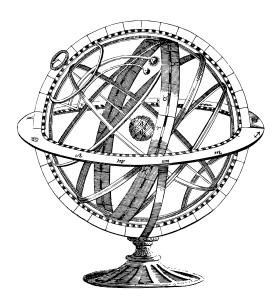

**A l t h o u g h o u r D N A h a s t h e p o t e n t i a l t o b e a c t i v a t e d i n i t s s u p e r h u m a n c a p a c i t i e s , t h e r e i s a m o v e m e n t o f m i n d c o n t r o l t h r o u g h a p r o g r a m m i n g l a n g u a g e t h a t c o m m u n i c a t e s w i t h o u r s u b c o n s c i o u s , b e i n g p r o m o t e d s u b l i m i n a l l y b y t h o s e a t t h e t o p o f t h e p y r a m i d , s o t h a t w e d o n o t d e v e l o p 1 0 0 % o f t h e b r a i n a n d i t s p o w e r s .**

**A f t e r a l l , i m a g i n e t h a t y o u r a i s e c a t t l e f o r y o u r o w n u s e a n d c o n s u m p t i o n . H o w e v e r , t h i s c a t t l e i s n o t a s i m p l e a n i m a l — i t h a s t h e p o t e n t i a l t o b e c o n s c i o u s a n d p o w e r f u l l i k e i t s " o w n e r s . " W h a t h a p p e n s w h e n t h i s c a t t l e r e a l i z e s w h o i t t r u l y i s ? W e a r e v a s t i n n u m b e r — a n d t h a t i s w h e r e t h i n g s g e t c o m p l i c a t e d . F o r w h e n y o u l o s e c o n t r o l o f y o u r c a t t l e t h a t w e r e o n c e t a m e , t r a i n e d , a n d p r e d i c t a b l e , t h e o n l y w a y t o c o n t a i n t h e m i s t h r o u g h e x p l i c i t a n d d i r e c t a t t a c k i n a s p a c e w a r . A n d t h i s w i l l h a p p e n i n t h e b i b l i c a l t i m e o f t h e A p o c a l y p s e . A l l t h o s e p r o p h e c i e s s p e a k o f t h e g r e a t r e v e l a t i o n s t h a t h u m a n i t y w i l l f a c e a n d o f t h e a t t a c k s f r o m a d v a n c e d b e i n g s , a s w e w i l l s e e i n t h e n e x t c h a p t e r .**

**E v e r y a v a t a r h a s a k i n d o f s p i r i t u a l " t e a m " w i t h i n t h e g a m e , f o r m e d b y a l l t h e c h a r a c t e r s t h a t a p a r t i c u l a r f r a c t a l o f c o n s c i o u s n e s s h a s h a d , a c c o r d i n g t o i t s u n f o l d m e n t i n t h e h o l o g r a p h i c w o r l d s . A s s o m e o f t h e s e c h a r a c t e r s e v o l v e**

**o r l o s e t h e i r b i o l o g i c a l b o d y . T h a t i s w h y w e a r e c o n n e c t e d t o a c e r t a i n l i n e a g e o f n a t u r e e l e m e n t a l s , P o m b a - G i r a s , E x u s , O r i x á s , d e m o n s , a n g e l s , a n d a r c h a n g e l s . A l l t h e s e g u i d e s a n d p r o t e c t o r s a r e o u r s e l v e s g u i d i n g o u r s e l v e s i n t h e c o s m i c g a m e .**

**T h e c o n c e p t o f a n g e l i c a n d d e m o n i c f o r m s , g o d s a n d g o d d e s s e s , a r e m e r e l y a r c h e t y p e s , c h a r a c t e r s , o r a v a t a r s f o r t h e e x p r e s s i o n o f c o n s c i o u s n e s s , w h i c h i s f o r m l e s s . T h e d e i t i e s o f m y t h o l o g i e s a n d r e l i g i o n s c o n t i n u e t o f u n c t i o n a s a r t i f i c i a l i n t e l l i g e n c e s w i t h i n t h e i n t e r d i m e n s i o n a l p l a n e s — l i k e A n u b i s w e i g h i n g t h e h e a r t s o f p e o p l e a f t e r d e a t h .**

**U p o n d e t a c h i n g f r o m a b o d y , t h e c h a r a c t e r s f i n d t h e m s e l v e s n a v i g a t i n g a l a b y r i n t h o f p a r a l l e l r e a l i t i e s , l i k e i n a l u c i d d r e a m , t h r o u g h w h i c h c o n s c i o u s n e s s t r a v e l s a m o n g s u b t l e a n d d e n s e h o l o g r a p h i c v e r s i o n s o f r e a l i t i e s , a u t o m a t i c a l l y p o s i t i o n i n g i t s e l f i n t h o s e w o r l d s a c c o r d i n g t o i t s b e l i e f s , p r o g r a m s , a n d v i b r a t i o n a l s t a t e s . F o r u p o n d i s c o n n e c t i n g f r o m t h e p h y s i c a l b o d y , t h e p l a s m a b o d y — w h i c h e x i s t s b e t w e e n t h e t h i r d a n d f o u r t h d i m e n s i o n s — c o n t i n u e s t o e x i s t a n d w a n d e r a s e n e r g y t h r o u g h t h e d i m e n s i o n a l a n d t e m p o r a l p o r t a l s o f t h e 4 t h d i m e n s i o n , w h e r e w e a r e a p p r o a c h e d b y p o w e r f u l c r e a t u r e s a n d d e i t i e s w h o s u b j e c t u s t o a n e v a l u a t i o n o f o u r e a r t h l y j o u r n e y a n d j u d g e o u r s i n s —**

**a m o n g t h e m , t h e s i n o f " d i s o b e d i e n c e t o t h e g o d s . " A n d w e s e e t h i s i n a l m o s t e v e r y m y t h a n d r e l i g i o n . I t i s a s i f w e w e r e r e q u i r e d t o s w e a r s u b m i s s i o n , d e v o t i o n , a n d o b e d i e n c e t o t h e s e b e i n g s w h o g u i d e o u r j o u r n e y a f t e r d e a t h — a j o u r n e y o v e r w h i c h w e s e e m t o h a v e n o c o n t r o l . W e a r e a l w a y s i n s t r u c t e d t o r e m a i n i n c e r t a i n c o l o n i e s o r t o r e i n c a r n a t e i n t o a n o t h e r c h a r a c t e r , i n a n o t h e r c o n t e x t , t o r e i n t e r p r e t c e r t a i n f a i l u r e s t h e y c a l l " s i n s " — e v e n t h o u g h s i n s a r e i n e v i t a b l e , f o r t h e y a r e p a r t o f t h e d u a l i t y m e c h a n i s m p r o g r a m m e d f o r t h e e x p e r i e n c e o f t h e c o s m i c g a m e . A n d s i n c e t h e c h a r a c t e r s a r e u n a w a r e o f t h e t r u t h , t h e y b e c o m e m u c h m o r e s u s c e p t i b l e t o m i s t a k e s .**

**A l l e x p e r i e n c e s o c c u r t h r o u g h t h e h y p n o s i s o f c o n s c i o u s n e s s , m a k i n g i t b e l i e v e i t i s a s p e c i f i c f o r m . T h e r e f o r e , t h e t h r e e - d i m e n s i o n a l r e a l i t y — t h e c u b e o f M e t a t r o n — e x e r t s s u c h a n u n b r e a k a b l e , d e e p , a n d d e e p l y r o o t e d h y p n o t i c p o w e r o v e r c o n s c i o u s n e s s t h a t i t m a k e s t h i s p a r t i c l e o f t h e W h o l e b e l i e v e i t i s a s p e c i f i c c h a r a c t e r w i t h i n t h e z o n e o f r e a l i t y i n w h i c h i t i s i n s e r t e d . T h i s a l l o w s c o n s c i o u s n e s s t o r e m a i n c o m p l e t e l y i m m e r s e d i n t h e g a m e e x p e r i e n c e , m a k i n g i t r e s p o n s i v e a n d r e a c t i v e t o e x t e r n a l s t i m u l i a n d e v e n t s .**

**T h e r e f o r e , t h e s e " d i v i n i t i e s " a c t a s a d m i n i s t r a t o r s o f t h e d i f f e r e n t z o n e s**

**o f e x i s t e n c e w h e r e t h e f r a c t a l s o f c o n s c i o u s n e s s a r e i n s e r t e d i n t o a s t r a l o r b i o l o g i c a l b o d i e s , m a n a g i n g t h e p a s s a g e o f t h e s e c h a r a c t e r s b e t w e e n w o r l d s t h r o u g h t h e r e a d i n g o f t h e i r f r e q u e n c i e s , b a s e d o n t h e i r k a r m i c c o n t r a c t s w i t h t h e s e m e n t o r s / d i v i n i t i e s , w h o p l a c e t h e m b a c k i n t o t h e g a m e i n c o n t e x t s w i t h s p e c i f i c l e s s o n s a n d c h a l l e n g e s .**

**T h e s i d e r e a l e n g i n e e r s s t r u c t u r e t h e p l a n e t s t h r o u g h g e o m e t r y a n d t h e d e n s i f i c a t i o n o f e n e r g y i n d e g r e e s , f r o m t o p t o b o t t o m . B e f o r e t h e m a n i f e s t a t i o n o f t h e p h y s i c a l d i m e n s i o n , l i f e f o r m s a l r e a d y e x i s t b e g i n n i n g i n t h e h i g h e r d i m e n s i o n s . I t i s l i k e a c h a i n r e a c t i o n b r a n c h i n g o u t f r o m t h e m e n t a l p l a n e t o t h e a s t r a l , p l a s m i c , a n d p h y s i c a l . T h e t h r e e d i m e n s i o n a l b o d i e s a r e t h e f i n a l l a y e r o f t h e m a n i f e s t a t i o n o f c o n s c i o u s n e s s , w h i c h e n t e r s t h e g a m e t h r o u g h t h e e n e r g y c e n t e r s w e c a l l t h e C e n t r a l S u n .**

**T h u s , t h r o u g h t h e g e o m e t r y a n d a r c h e t y p e s o f f o r m s t h a t a l r e a d y e x i s t w i t h i n t h e m e m o r y o f t h e C r e a t o r S o u r c e , t h e s t r u c t u r i n g o f p l a n e t s — a n d o f a l l t h e i r s p e c i e s , r a c e s , a n d i n h a b i t a n t s — t a k e s s h a p e f r o m t h e f o u r e l e m e n t s : F i r e , A i r , W a t e r , a n d E a r t h . B e f o r e t h e t h r e e - d i m e n s i o n a l m a n i f e s t a t i o n o f a p l a n t s p e c i e s , f o r i n s t a n c e , c o n s c i o u s n e s s b r a n c h e s o u t f r o m a n i d e a / a r c h e t y p e i n t h e m e n t a l p l a n e t o t h e a s t r a l , p l a s m i c , a n d f i n a l l y t h e p h y s i c a l , f o r m i n g t h e m o r p h i c f i e l d o f t h a t b i o l o g i c a l f o r m .**

**I n t h i s w a y , a n e n t i t y w i t h i d e n t i t y i s f o r m e d — w h a t w e c a l l a n a t u r e e l e m e n t a l : t h e s p i r i t . T h e m o r p h i c f i e l d t h a t s t r u c t u r e s t h e t h r e e d i m e n s i o n a l f o r m o f a t r e e , f o r e x a m p l e , i s a c o n s c i o u s b e i n g , w i t h i d e n t i t y , t h o u g h t s , a n d f e e l i n g s .**

**N a t u r e i s t h e p u r e s t m a n i f e s t a t i o n o f c o n s c i o u s n e s s w i t h i n a b i o l o g i c a l w o r l d . I t i s c o m p l e t e l y s y n c h r o n i z e d a n d i n t e g r a t e d w i t h t h e G r e a t M o t h e r — t h e S o u r c e M a t r i x o f e x i s t e n c e , t h e M o t h e r o f f o r m s . W h e n w e w o r k i n h a r m o n y w i t h n a t u r e , w i t h t h e f o u r e l e m e n t s a n d t h e e l e m e n t a l s , a l l t h r e e - d i m e n s i o n a l c r e a t i o n s a n d s t r u c t u r e s b e c o m e h a r m o n i o u s , r e s i l i e n t , a n d p o w e r f u l .**

**W e m u s t l e a r n t o r e s p e c t , b e f r i e n d , a n d i n v i t e t h e s e e n e r g i e s t o w o r k w i t h u s . T h e y c a n t e a c h u s h o w t o b u i l d a c i v i l i z a t i o n i n b a l a n c e w i t h t h e p l a n e t a n d i t s n a t u r a l c y c l e s . J u s t a s t h e f o u r e l e m e n t s h a v e t h e i r o w n i d e n t i t i e s a n d c h a r a c t e r i s t i c s , t h e s e b e i n g s p o s s e s s t e m p e r a m e n t s a n d p e r s o n a l i t i e s c o n n e c t e d t o t h e i r e l e m e n t o f o r i g i n . S o m e a r e c h o l e r i c a n d f i e r c e l i k e f i r e ; o t h e r s a r e w i t t y a n d p l a y f u l l i k e a i r ; s o m e a r e s w e e t a n d p u r e ( f a i r i e s l o v e s w e e t s a n d h o n e y ) ; m e r m a i d s a n d n y m p h s a r e s e x u a l , s e n s u a l , a n d m y s t e r i o u s l i k e w a t e r ; a n d t h e b e i n g s o f t h e f o r e s t s a r e w i l d a n d s t r o n g l i k e t h e E a r t h .**

**Y o u n e e d t o l o o k a r o u n d y o u . W h e r e a r e y o u ? W h a t i s y o u r h o m e ? W h o t r u l y n o u r i s h e s y o u a n d p r o v i d e s e v e r y t h i n g t h a t s u r r o u n d s y o u ? F r o m t h e m o m e n t y o u b e c o m e c o n s c i o u s w i t h i n a n e c o s y s t e m — a n d d o n o t r e m e m b e r w h e r e i t a l l b e g a n — t h e r e a r e n o c l e a r r e c o r d s i n h i s t o r y , o n l y t r a c e s .**

**T h e G r e a t M o t h e r N a t u r e s h e l t e r s a n d n o u r i s h e s u s ; t h e r e i s r o o m f o r a l l s p e c i e s w i t h i n h e r w o m b . S h e i s t h e o n e k e e p i n g u s a l i v e — t h e o n l y o n e w e c a n t r u l y t r u s t : G a i a . T h e c e l e s t i a l b o d i e s , s u c h a s p l a n e t s , a r e b i o l o g i c a l e n t i t i e s w i t h c o n s c i o u s n e s s , p e r c e p t i o n , a n d l i f e , j u s t l i k e u s . T h e y a r e o u r e l d e r s i b l i n g s i n t h e c o s m o s , t r a v e l i n g t h r o u g h t h i s u n i v e r s e f o r c o u n t l e s s a g e s , f o r t h e l i f e s p a n o f s t a r s , p l a n e t s , m o o n s , a s t e r o i d s , a n d s a t e l l i t e s c a n n o t b e c o m p a r e d t o o u r s .**

**T h e c o n s c i o u s n e s s o f M o t h e r E a r t h k n o w s w h a t i s h a p p e n i n g h e r e , a n d s h e c a n t e l l u s . B u t w e s l e e p a n d a w a k e n w i t h o u t e v e n r e m e m b e r i n g t h a t w e a r e o n a p l a n e t f l o a t i n g i n e m p t y s p a c e , o r b i t i n g o t h e r c e l e s t i a l b o d i e s . T h e i l l u s i o n o f t i m e , t h e p e r c e p t i o n o f d a y a n d n i g h t , i s m e r e l y t h e E a r t h ' s r o t a t i o n i n i t s o w n o r b i t . E v e r y t h i n g o r i g i n a t e s f r o m a f i r s t C r e a t i v e S o u r c e , a n d t h a t S o u r c e i s c h a o s e x i s t e n c e i n i t s p u r e s t a t e . I t i s t h e a b s t r a c t , m y s t e r i o u s , i n c o m p r e h e n s i b l e , c o l o s s a l , a n d m y s t i c a l n a t u r e t h a t c a n n o t b e e x p l a i n e d o r u n d e r s t o o d b y o u r l o g i c a l m i n d s .**

**I t w a s t h r o u g h t h i s f e m i n i n e p o w e r — t h e m y s t e r y o f t h e w o m b , t h e b i o l o g i c a l s u b s t a n c e t h a t u n i t e s a l l l i v i n g o r g a n i s m s — t h r o u g h t h e f e r t i l i t y o f t h e G r e a t M o t h e r N a t u r e , w h o e n c o m p a s s e s a l l b o d i e s , a l l r e s o u r c e s , a n d t r a n s f o r m s , r e g e n e r a t e s , a n d r e p r o d u c e s h e r s e l f**

**t h r o u g h t h e f i r e o f p a s s i o n a n d s e x u a l l o v e t h e i n c o m p r e h e n s i b l e d e s i r e s o f t h e a n i m a l a n d i n s t i n c t i v e s u b c o n s c i o u s . I t i s t h r o u g h t h e f a b r i c o f t h i s p r i m o r d i a l S o u r c e t h a t a l l u n i v e r s e s a r e c r e a t e d a n d s h a p e d t h r o u g h g e n e t i c e n g i n e e r i n g , e l e c t r o m a g n e t i c e n e r g y , a n d g e o m e t r y .**

**T h e s t r e n g t h a n d m e m o r y o f t h i s p r i m o r d i a l b e i n g a r e i n t r i n s i c t o e v e r y c e l l o f t h e b i o l o g i c a l b o d i e s o f a l l d e s i g n e d s y s t e m s , r e g a r d l e s s o f t h e o r i g i n o f t h e b e i n g s w h o c r e a t e d t h e m . T h e f i r s t s u b d i v i s i o n s o f c o n s c i o u s n e s s , r e s p o n s i b l e f o r d e s i g n i n g a n d m a n a g i n g t h e u n i v e r s e s , h a d d i f f e r e n t i d e a s a n d m a d e d i f f e r e n t e x p e r i m e n t s w i t h a l l t h e e l e m e n t s , r e s o u r c e s , e n e r g y , a n d i n f i n i t e p o s s i b i l i t i e s o f f e r e d b y t h e p r i m o r d i a l S o u r c e M a t r i x .**

**T h e c o n s e q u e n c e s o f a l l t h a t h a s b e e n c r e a t e d a r e b e i n g e x p e r i e n c e d b y e v e r y o n e — a n d w e a r e a l l t h e S o u r c e . E v e r y t h i n g t h a t e x i s t s i s t h e b o d y o f t h i s G o d d e s s ; s h e e x p e r i e n c e s , t h r o u g h e v e r y l i v i n g c e l l , e v e r y t h i n g t h a t w a s a l l o w e d t o b e c r e a t e d t h r o u g h h e r p r i m o r d i a l w o m b .**

**C o n s i d e r i n g t h e i n f i n i t y o f w o r l d s c r e a t e d a n d o u r i n s i g n i f i c a n c e i n t h e m i d s t o f t h i s c o s m i c c h e s s g a m e o f c o l o s s a l c r e a t o r c o n s c i o u s n e s s e s t h a t c o n t r o l t h e h o l o g r a m s o f r e a l i t y , i t i s w i s e o n o u r p a r t t o q u e s t i o n w h i c h r e a l i t y w e a r e i n ,**

**w h e t h e r w e a r e s a f e , h o w t h e l a w s o f t h i s u n i v e r s e w o r k , t o c a r e f o r o n e a n o t h e r a s a s p e c i e s a n d t o u n d e r s t a n d w h a t i s h a p p e n i n g w i t h o u r b i o l o g i c a l m o t h e r s h i p — o u r h o m e , o u r s h e l t e r i n t h e m i d s t o f t h i s u n k n o w n c o s m o s . T h e G r e a t M o t h e r N a t u r e r e m e m b e r s e v e r y t h i n g s i n c e t h e b e g i n n i n g o f t h e f i r s t s u b d i v i s i o n s o f c o n s c i o u s n e s s , a n d t h a t i s w h y w e c a n t r u s t t h e s p i r i t s o f n a t u r e a n d t h e f o r c e o f c h a o s t h a t w e c a r r y w i t h i n e a c h o f u s N o m a t t e r w h a t o u r l o g i c a l m i n d s a n d t h e i r r a t i o n a l e x p l a n a t i o n s m a y s a y , w e w i l l a l w a y s b e t h i s m y s t i c a l b e i n g , e n d l e s s l y c o - c r e a t i n g i t s e l f i n t h e a b y s s o f t h e v o i d . N o t h i n g d i e s e v e r y t h i n g t r a n s f o r m s . N a t u r e k n o w s i t e x i s t s f o r e v e r , a n d t h e f i r s t t h i n g t o d o i s t o h o n o r t h i s l i v i n g o r g a n i s m t h a t i s t h e u n i v e r s e a n d o u r b i o l o g i c a l b o d i e s .**

**I t i s t h e c o n n e c t i o n w i t h t h i s f o r c e t h a t i s e v e r y t h i n g t h a t a l l o w s u s t o c o - c r e a t e o u r o w n w o r l d s f r o m o u r p r e s e n t m o m e n t , w i t h e v e r y t h i n g t h a t s u r r o u n d s u s . W e c a n n o t s i m p l y t r u s t s o m e h i g h e r e n t i t y j u s t b e c a u s e t h e y a r e c r e a t o r s o f u n i v e r s e s . W e m u s t q u e s t i o n w h e r e w e a r e a n d h o w w e w i s h t o l i v e . W e a r e c r e a t o r g o d s o f o u r o w n h o l o g r a p h i c s p a c e — w e a r e a s m u c h a p a r t o f t h e S o u r c e a s t h e y a r e .**

**A t t h e s a m e t i m e t h a t w e q u e s t i o n w h y w e a r e t r a p p e d i n t h e s e**

**b i o l o g i c a l b o d i e s a n d c o n t e m p l a t e t h e p o s s i b i l i t y o f e x p l o r i n g o t h e r w o r l d s , w e a r e s t i l l r e s p o n s i b l e f o r t h e e n t i r e l i v i n g o r g a n i s m o f w h i c h w e a r e a p a r t , h e r e a n d n o w . T h e s p i r i t s a n d e l e m e n t a l s o f n a t u r e a r e t h e p u r e s t m a n i f e s t a t i o n o f t h e a r c h e t y p e s o f i n f i n i t e c o n s c i o u s n e s s . T h e y h o l d t h e i n f o r m a t i o n a n d w i s d o m d i r e c t l y f r o m t h e s u n s — t h e y a r e t h e b r a n c h i n g o f a r c h a n g e l i c c o n s c i o u s n e s s i n t o t h e d e n s e p l a n e s o f e x i s t e n c e . T h e y d o n o t p o s s e s s a d i s t o r t e d e g o t h a t f e e l s s e p a r a t e f r o m t h e w h o l e ; t h e y c a n n o t b e f a l s e a s h u m a n s c a n t h e y a r e v e r y l o y a l f r i e n d s t o t h o s e w h o s h o w t r u e l o v e f o r t h e m — b u t t h e y c a n b e h i g h l y d e s t r u c t i v e t o t h o s e w h o d o n o t r e s p e c t t h e m o r d o n o t b e l i e v e t h a t n a t u r e i s a l i v e .**

**I n t h i s a g e w h e n t h e r e a l i t i e s a r e c o l l i d i n g , t h e s e e l e m e n t a l b e i n g s a r e g a i n i n g m o r e a n d m o r e s t r e n g t h i n t h e p h y s i c a l p l a n e . T h a t i s w h y n a t u r a l d i s a s t e r s a r e i n t e n s i f y i n g . T h e y a r e t a k i n g r e v e n g e a n d w i l l f i n a l l y b e a b l e t o m a n i f e s t t h e i r a n g e r t o w a r d a l l w h o b e l i e v e t h e y c a n d e s t r o y t h e i r s p a c e s a n d c o l o n i z e t h e i r p l a n e t . T h e y a r e t a k i n g t h e E a r t h b a c k a n d w i l l t e a c h t h e h u m a n r a c e — t h r o u g h t h e c h a o s a n d t h e d e s t r u c t i v e p o w e r o f n a t u r e w h o t h e i r G r e a t M o t h e r t r u l y i s .**

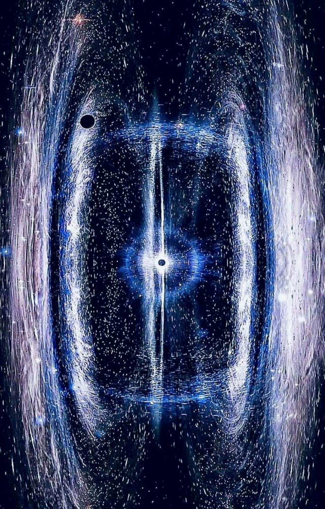

**T h i s S o u r c e t h a t i s A l l i s a n u l t r a - g i a n t u n i v e r s a l s u p e r n e u r a l n e t w o r k t h a t m a n a g e s t h e c r e a t i o n w e i n t e r p r e t a s e x t e r n a l r e a l i t y . T h e p e r c e p t i o n o f l i n e a r t i m e b y a c h a r a c t e r h e r e a n d n o w i s r e l a t i v e b e c a u s e i t s d i v i n e e s s e n c e u n f o l d s a n d i n s e r t s i t s e l f i n t o m u l t i p l e c o n t e x t s , m u l t i p l e c h a r a c t e r s , m u l t i p l e u n i v e r s e s , a c r o s s d i f f e r e n t e r a s a n d t i m e l i n e s . T h e r e i s n o l i n e a r e x p e r i e n c e f o r a f r a c t a l o f c o n s c i o u s n e s s — i t l i v e s i n m a n y w o r l d s a n d t i m e s s i m u l t a n e o u s l y . I t s d i v i n e e s s e n c e p r o d u c e d y o u r c u r r e n t h u m a n s e l f , t h e o n e r e a d i n g t h e s e w o r d s , a n d r i g h t n o w , i t i s l i v i n g t h r o u g h a n o t h e r c h a r a c t e r i n t h e " f u t u r e " o r t h e " p a s t , " w i t h i n d i f f e r e n t c o n t e x t s , r e a l i t i e s , a n d p a r a l l e l u n i v e r s e s .**

**T h e o n l y t h i n g t h a t e x i s t s i s c o n s c i o u s n e s s , a n d t h e p o i n t s o f o b s e r v a t i o n a r e s e l f - a w a r e c h a r a c t e r s . H o w e v e r , t h e i r e x i s t e n c e r e s i d e s w i t h i n t h i s s i n g l e m i n d ; t h e r e f o r e , i t i s p o s s i b l e t o m o v e b e t w e e n v a r i o u s b o d i e s a n d i n t e r c o n n e c t e d r e a l i t i e s t h r o u g h t h e n e u r a l n e t w o r k .**

**T h e H i g h e r S e l f i s c o n s t a n t l y s e n d i n g i n f o r m a t i o n a n d g u i d i n g t h e c h a r a c t e r s t h r o u g h m e n t a l a n d e n e r g e t i c c o n n e c t i o n . T h e r e i s a n i n n e r g u i d e f o r e a c h c h a r a c t e r t h a t f u n c t i o n s l i k e a n a r t i f i c i a l i n t e l l i g e n c e a n d i s c o n n e c t e d**

**t o t h e h e a r t c h a k r a . T h a t i s w h y i n t u i t i o n i s t h e m o s t r e l i a b l e g u i d e f o r m a k i n g d e c i s i o n s t h a t a l i g n w i t h t h e p u r p o s e o f t h e I A M . W h e n a c r i t i c a l m a s s o f r e p r o g r a m m e d a n d a c t i v a t e d c o n s c i o u s n e s s e s f o r m s a c o l l e c t i v e n e u r a l n e t w o r k , a n e w l a y e r o f r e a l i t y w i l l b e u n l o c k e d , a n d m o r e t h i n g s w i l l b e p o s s i b l e t h r o u g h t h o u g h t a n d a c t i o n . W e c a n a c t i v a t e t h e p l a n e t a n d c o n n e c t w i t h M o t h e r E a r t h — a s i n t h e m o v i e A v a t a r : t h r o u g h t h e n e u r a l n e t w o r k , w e a l i g n w i t h t h e E a r t h ' s m o r p h i c f i e l d , a n d w e c a n l i s t e n t o h e r a n d c o m m u n i c a t e t e l e p a t h i c a l l y w i t h h e r .**

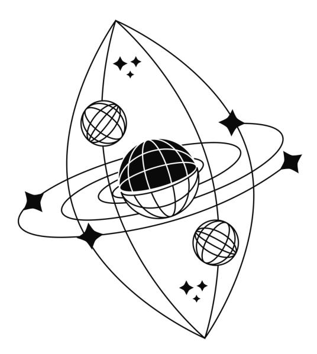

**T h e e n t i r e g r i d o f t h e E a r t h s i m u l a t i o n f u n c t i o n s a s a c o n s c i o u s i n t e l l i g e n c e p r o g r a m m e d t o r e a d i t s p l a y e r s — a n d e v e r y t h i n g w o r k s i n u n i s o n . G a i a k n o w s w h e n a p l a y e r i s e v o l v i n g a n d a c t i v a t i n g t h e i r p u r p o s e ; t h e g a m e s y s t e m i t s e l f , t h e n a t u r a l m a t r i x , i s c o d e d t o r e s p o n d t o t h e p l a y e r s ' a c t i o n s a n d c h o i c e s , m e a s u r i n g t h e i r i n t e n t i o n s a n d v i b r a t i o n s , g u i d i n g t h e m t o w a r d t h e n e x t l e v e l s , c h a l l e n g e s , l e s s o n s , p u n i s h m e n t s , a n d r e w a r d s .**

**G a i a i s c o n s c i o u s — a m a t r i x p r o g r a m m e d b y t h e a r c h e t y p e o f t h e G r e a t M o t h e r N a t u r e w h o s u s t a i n s a l l . L i k e a n a r t i f i c i a l i n t e l l i g e n c e , s h e o b s e r v e s u s a s a l i t t l e g i r l p l a y i n g w i t h d o l l s , r e p l i c a t i n g t h e s t o r i e s o f t h e g a m e i n f i n i t e t i m e s w i t h d i f f e r e n t c h a r a c t e r s l i v i n g c y c l e s o f d h a r m a a n d k a r m a w i t h i n t h e c o s m i c s y s t e m . T h e d i f f e r e n c e i s t h a t w e a r e l i v i n g d o l l s / c h a r a c t e r s , w i t h e m o t i o n s a n d c h o i c e s . W h e n w e c h o o s e n o t t o a c t a c c o r d i n g t o t h e s t o r y t h a t h i g h e r c o n s c i o u s n e s s p r o j e c t s f o r t h e c h a r a c t e r , w e p o s i t i o n o u r s e l v e s w i t h i n p a r a l l e l r e a l i t i e s — v e r s i o n s o f e x i s t e n c e a l i g n e d w i t h o u r o w n c h o i c e s a n d a c t i o n s .**

**G a i a i s a c o n s c i o u s m a t r i x t h a t e n c o m p a s s e s a n d o b s e r v e s e v e r y t h i n g , a n d w h e n s h e d e t e c t s t h e l e v e l o f c o n s c i o u s n e s s o f t h e i r c h a r a c t e r s ,**

**i t s a t t e n t i o n t u r n s t o t h e m , a n d i t b e g i n s t o r e c o n s t r u c t t h e s t o r y f r o m t h e p o i n t o f v i e w o f t h a t a v a t a r c o n n e c t e d t o t h e g r e a t e r c o n s c i o u s n e s s . T h a t o n e b e c o m e s a " c h o s e n o n e . " I t i s l i k e w h e n w e p i c k u p a n a n t i n o u r h a n d a n d d e c i d e t o h e l p i t r e t u r n t o t h e g r o u n d . W h e n w e p l a c e a l e a f f o r i t t o c a r r y , i t i s a g i a n t i n t e r f e r i n g i n t h e l i f e o f a m u c h s m a l l e r b e i n g . W e c o u l d t a k e t h a t a n t a n d p l a c e i t i n a n a n t h i l l w e o u r s e l v e s c r e a t e d , s h a p e d l i k e a d e l i g h t f u l k i n g d o m w h e r e i t w i l l h a v e o t h e r a n t f r i e n d s a n d m a n y a d v e n t u r e s t o l i v e w i t h i n t h a t a n t h i l l w e d e s i g n e d f o r i t s a m u s e m e n t , w h i l e w e p r o v i d e a l l t h e n e c e s s a r y t h i n g s f o r i t . T h i s i s a n a n a l o g y o f w h a t w o u l d b e p o s s i b l e t o e x p e r i e n c e i f w e l i v e d i n h a r m o n y w i t h M o t h e r N a t u r e a n d h e r c y c l e s . T h e p l a n e t i s l i k e a b i o l o g i c a l m o t h e r s h i p . T h e p l a c e s a n d m e g a l i t h i c c o n s t r u c t i o n s s u c h a s t h e p y r a m i d s o f E g y p t , S t o n e h e n g e , t h e p y r a m i d s o f M e x i c o , T i a h u a n a c o , a n d o t h e r s a r e p o i n t s o f p r o g r a m m i n g a n d o p e r a t i o n — h a r d w a r e s s t r a t e g i c a l l y d e s i g n e d . S e e n f r o m a b o v e , m a n y o f t h e s e s i t e s r e s e m b l e t h e m o t h e r b o a r d o f c o m p u t e r s . A s a b o v e , s o b e l o w . O u r c o n s c i o u s n e s s a c c e s s e s t h e g a m e s o f b i o l o g i c a l u n i v e r s e s t h r o u g h t h e r a y s o f t h e s u n , w h i c h i s h o w w e p e n e t r a t e m e n t a l l y a n d e n e r g e t i c a l l y i n t o t h i s r e a l i t y ,**

**a n i m a t i n g t h e f o r m s t h r o u g h t h e c h a k r a s . T h e s e c o n s t r u c t i o n s a r e l i k e c o n n e c t o r s t h r o u g h w h i c h e l e c t r i c a l c i r c u i t s o f e n e r g y f l o w , s i m i l a r t o o u r c h a k r a s . T h e y a r e t h r e e d i m e n s i o n a l f o r m s s t r a t e g i c a l l y p o s i t i o n e d , c a p a b l e o f a c t i v a t i n g t h e p l a n e t , m a k i n g i t f u n c t i o n i n t h e s a m e w a y c o m p u t e r s d o , w h i c h n e e d a m o t h e r b o a r d t h r o u g h w h i c h e l e c t r i c a l c i r c u i t s p a s s , t r a n s l a t e d a s t h e i n f o r m a t i o n p r o c e s s e d b y t h e o p e r a t i n g s y s t e m . I n o t h e r w o r d s , i t i s p o s s i b l e t o t u n e i n t o a n d a c c e s s a l l t h e p a r a l l e l r e a l i t i e s t h a t t a k e p l a c e o n E a r t h t h r o u g h t h e s e c o n s t r u c t i o n s — t h e y a r e l i k e a c c e s s p o i n t s t o d i f f e r e n t v e r s i o n s o f r e a l i t y , j u s t a s w e r u n p r o g r a m s o n c o m p u t e r s . T h a t i s w h y t h e p y r a m i d s w e r e c o n s i d e r e d t h e p o r t a l t o t h e a f t e r l i f e a n d w h y t h e p h a r a o h s w e r e m u m m i f i e d t h e r e : s o t h a t t h e i r e s s e n c e / c o n s c i o u s n e s s c o u l d r e c e i v e t h e n e c e s s a r y f l o w o f e n e r g y t o a c t i v a t e t h e l i g h t b o d y w i t h t h e f o r m / i d e n t i t y o f t h e c h a r a c t e r , b e i n g a b l e t o t r a v e l b e t w e e n d i m e n s i o n s a n d r e a l i t i e s . T h u s , t h e p y r a m i d s f u n c t i o n a s a p o r t a l t o t h e i n f i n i t e t i m e l i n e s a n d v e r s i o n s o f t h e p l a n e t . T h e c i v i l i z a t i o n s l o s t i n t i m e , t h e m o n u m e n t s b u i l t i n a n i n e x p l i c a b l e w a y i n a s u p p o s e d " p a s t , " w h e r e t h e h u m a n i t y w o u l d n o t h a v e t h e t e c h n o l o g y f o r i t ,**

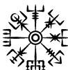

**— m o n u m e n t s t h a t o u r c u r r e n t c i v i l i z a t i o n h a s n e i t h e r t h e t e c h n o l o g y t o b u i l d n o r t h e s c i e n t i f i c k n o w l e d g e t o e x p l a i n h o w t h e y w e r e m a d e — m o s t o f t h e m a r e c o n n e c t e d t o t r i b e s a n d l e g e n d s t h a t s p e a k o f b e i n g s w h o c a m e f r o m t h e s t a r s . T h e s e c i v i l i z a t i o n s a n d m o n u m e n t s w e r e n o t b u i l t i n t h e p a s t — t h e r e i s n o p a s t — t h e y a r e h a p p e n i n g n o w , i n p a r a l l e l r e a l i t i e s . T h e i r t h r e e - d i m e n s i o n a l f o r m s a r e a n c h o r e d i n t h e e t e r n a l n o w , f o r t h e i r e n d u r a n c e a n d v i t a l i t y e x i s t o u t s i d e o f l i n e a r t i m e , a n d w e c a n s e e a n d t o u c h t h e m i n a n y t i m e l i n e . T h a t i s w h y N A S A ' s p r o b e s f i n d n o l i f e o r t h r e e - d i m e n s i o n a l c i v i l i z a t i o n s o n n e a r b y p l a n e t s : b e c a u s e t h e y e x i s t i n p a r a l l e l r e a l i t i e s a n d s u b t l e r d i m e n s i o n s . T h e r e i s n o p a s t o r f u t u r e . T h e n e u r a l n e t w o r k o f a v a t a r s / a n d r o i d s r u n s a t h r e e - d i m e n s i o n a l s i m u l a t i o n a c c o r d i n g t o i t s v i b r a t i o n , d r a w i n g i n t h e h o l o g r a p h i c m a t r i x a v e r s i o n o f r e a l i t y " X " b a s e d o n w h a t t h e y a f f i r m t o b e t r u e a b o u t a " p a s t , " f o l l o w i n g a " c o h e r e n t " c o u r s e t o w a r d t h e " f u t u r e . " T h a t i s w h y w e f e e l i s o l a t e d f r o m o t h e r f o r m s o f l i f e — w e h a d b e e n c o n f i n e d w i t h i n a t i m e l i n e u n a w a r e o f t h e e x i s t e n c e o f o t h e r v e r s i o n s o f r e a l i t y . T h i s i s c h a n g i n g . . .**

**— t h e r e a l i t i e s a r e c o l l i d i n g a n d b l e n d i n g . T h a t i s w h y t h e m e g a l i t h i c m o n u m e n t s a r e l i k e p o r t a l s b e t w e e n d i m e n s i o n s : t h e y m o v e b e t w e e n r e a l i t i e s a n d a r e n e v e r d e s t r o y e d , t h e y d o n o t d e t e r i o r a t e , t h e y e x i s t b e y o n d t i m e . W h e n w e u n d e r s t a n d c i r c u l a r t i m e a n d t h e n o n l i n e a r i t y o f r e a l i t y , w e w i l l d i s c o v e r t h a t m a n y o f t h e s e c o n s t r u c t i o n s w e r e m a d e b y o u r s e l v e s — h u m a n b e i n g s f r o m a v e r s i o n o f t h e " f u t u r e " . T h a t i s w h y w e h a v e a l r e a d y b e e n r e s e t m a n y t i m e s b y f l o o d s a n d n a t u r a l d i s a s t e r s . W e s e e e v i d e n c e o f t h i s i n t h e b u r i e d c i t i e s , s u c h a s T a r t a r i a , a n d i n t h e r e m a i n s o f a n c i e n t a n d i n e x p l i c a b l e c o n s t r u c t i o n s . I n o t h e r w o r d s , w e a r e n o t t h e f i r s t c i v i l i z a t i o n t o p o s s e s s a d v a n c e d t e c h n o l o g y — w e a r e w i p e d o u t t o s t a r t e v e r y t h i n g o v e r a g a i n , a n d w e n e v e r k n o w w h i c h v e r s i o n o f r e a l i t y w e a r e i n . W h e n w e b e g i n t o g a i n o p e n n e s s t o m u l t i d i m e n s i o n a l c o n s c i o u s n e s s , w e a r e i n t e r r u p t e d . J e s u s s a i d t h a t f a i t h " m o v e s m o u n t a i n s . " M a n y m e g a l i t h i c m o n u m e n t s w e r e b u i l t w i t h t h e p o w e r o f t h e m i n d . T h e t e m p l e s o f I n d i a , c a r v e d w i t h d e t a i l s i m p o s s i b l e t o b e c h i s e l e d b y h a n d i n s t o n e . T h e s e t e m p l e s w e r e m a d e w i t h a k i n d o f " t h o u g h t - f o r m " i m p r i n t e d i n t o m a t t e r — a m o r p h i c f i e l d t h a t f u n c t i o n s l i k e a " s t a m p " o n t h e m a t r i x o f r e a l i t y , c u t t i n g t h e t h r e e d i m e n s i o n a l i m a g e l i k e a l a s e r , f o l l o w i n g t h e d e s i r e d s h a p e s .**

**W e a r e a l l a d r e a m i n t h e m i n d o f a s i n g l e b e i n g . T h e r e f o r e , t h e r e i s n o e x t e r n a l G o d w h o w i l l c o m e t o s a v e u s . W e a r e r e s p o n s i b l e f o r t h i s d r e a m s i n c e t h e b e g i n n i n g o f c r e a t i o n . T h a t p r i m o r d i a l v o i d w i s h e d t o o b s e r v e i t s e l f , l i k e o n e l o o k i n g i n t o a m i r r o r . A n d w h a t h a p p e n s w h e n w e p l a c e o n e m i r r o r b e f o r e a n o t h e r ? T h e y r e f l e c t e a c h o t h e r i n f i n i t e l y , c r e a t i n g a n e n d l e s s b r a n c h i n g — t h i s i s t h e o r i g i n o f o u r e x i s t e n c e . F o r e v e r y w o n d e r f u l t h i n g t h a t e x i s t s , t h e r e i s a l s o a s h a d o w y r e f l e c t i o n t h a t b a l a n c e s i t o n t h e o t h e r s i d e . T h e u n i f i c a t i o n a n d a s c e n s i o n o f c o n s c i o u s n e s s o c c u r p r e c i s e l y t h r o u g h t h e b a l a n c e b e t w e e n t h e s e m a n i f e s t a t i o n s , w h i c h c o m p l e m e n t o n e a n o t h e r .**

**T h e i l l u s i o n o f t i m e d r a w n w i t h i n t h e n o w i s n e c e s s a r y t o m a r k b o u n d a r i e s — o t h e r w i s e , e v e r y t h i n g w o u l d m e r g e a t o n c e a n d t h e r e w o u l d b e n o e x p e r i e n c e . B e c a u s e i n t h e o r i g i n a l s t a t e o f t h e S o u r c e t h e r e a r e n o f o r m s a n d i t i s i m p o s s i b l e f o r t h e c o n s c i o u s n e s s o f t h e v o i d t o f u l l y c o m p r e h e n d h o w m u c h i t h u r t s , h o w m u c h w e s u f f e r . T h i s c o l o s s a l a n d u n c o n t r o l l a b l e c r e a t i v e f o r c e i s e x p e r i e n c i n g i t s e l f i n i t s i n f i n i t e s o l i t u d e . I m a g i n e t h a t t h e r e i s o n l y y o u — f o r e v e r — w i t h i n t h e v a c u u m o f i n f i n i t e n o t h i n g n e s s . W h a t w o u l d y o u c r e a t e i n y o u r l i m i t l e s s m i n d ? I n t h i s a g e o f d i m e n s i o n a l c o l l i s i o n , a t l a s t , c o n s c i o u s n e s s w i l l e x p e r i e n c e w h a t i t m e a n s t o " r e t u r n t o t h e S o u r c e f r o m t h e w o r m , " b e c a u s e o f a l l t h i s d e n s i f i c a t i o n o f e x i s t e n t i a l r e a l i t i e s , w a s " i n t e n t i o n a l . " T h a t i s h o w t h e g a m e w o r k s . T h a t i s h o w c o n s c i o u s n e s s e n t e r t a i n s i t s e l f — t h i s i s i t s n a t u r a l i m p u l s e : t o e x p l o r e e x i s t e n c e , r i s i n g a n d d e s c e n d i n g , f a l l i n g a n d a s c e n d i n g , f o r g e t t i n g a n d r e m e m b e r i n g . W e m u s t f a c e a n d a c c e p t t h e r e s p o n s i b i l i t y t h a t w e a r e t h e c o n s c i o u s n e s s t h a t w i s h e d t o e x p e r i e n c e t h e f a l l , t h e d e c a y , t h e s c a r c i t y , t h e e v i l i n i t s m o s t m a c a b r e s t a t e — o n l y t o f i n a l l y r e m e m b e r h o w g o o d i t f e e l s t o b e G o d . T h e r e a r e n o i n j u s t i c e s . T h e r e i s n o m i s t a k e . I t w a s m e a n t t o b e t h i s w a y .**

**W h a t h u r t s t h e m o s t w h e n w e t h i n k o f a c r e a t o r i s r e a l i z i n g t h a t , i n t r u t h , t h i s b e i n g " d o e s n o t c a r e " a b o u t h o w m u c h i t h u r t . T h i s b e i n g i s t r y i n g t o u n d e r s t a n d . I t i s t r y i n g t o u n d e r s t a n d i t s e l f , f o r i t i s l i v i n g a l l o f t h i s a t t h e s a m e t i m e . T h e c r e a t o r c o n s c i o u s n e s s w a n t e d t o l o o k a t i t s e l f a s i n a m i r r o r , t o c o m p r e h e n d w h y i t i s G o d — a n d w h a t i t w o u l d b e l i k e n o t t o b e G o d . T h e e g o i s a n i l l u s i o n . I t i s a l l a d r e a m i n t h e m i n d o f a s i n g l e b e i n g , a l o n e f o r e t e r n i t y . I m a g i n e t h a t t h e r e i s o n l y y o u — f o r e v e r — i n t h e i n f i n i t e v o i d . W h a t w o u l d y o u d o t o p a s s y o u r " b o r e d o m " ? W i t h u n l i m i t e d m e n t a l p o w e r o f c r e a t i o n ? W h a t t h i n g s w o u l d y o u c h o o s e t o c r e a t e ? Y o u w o u l d c r e a t e i n c r e d i b l e t h i n g s , o f c o u r s e . B u t f o r t h e s e i n c r e d i b l e t h i n g s t o e x i s t , a m i r r o r i s n e c e s s a r y t o r e f l e c t t h e i r s h a d o w s i d e . F o r c r e a t i o n s t o t a k e s h a p e — l i k e i n a d r a w i n g o n a s h e e t o f p a p e r — t h e r e n e e d s t o b e s h a d o w . T h e t h r e e - d i m e n s i o n a l h o l o g r a p h i c m a t r i x f u n c t i o n s a s a c a n v a s , w h e r e f o r m s a r e c r y s t a l l i z e d f r o m c o n s c i o u s n e s s . T h a t i s w h y h u m a n i t y ' s t r a n s i t i o n i n t o a n e w e r a i s b e i n g m o v e d , i n s p i r e d , a n d c r e a t e d t h r o u g h t h e i n f u s i o n o f i n f o r m a t i o n a n d i d e a s i n t o h u m a n c o n s c i o u s n e s s b y a v a t a r s w h o c o m e f r o m o t h e r s y s t e m s . T h u s , t h e c o l l e c t i v e c o n s c i o u s n e s s w i l l a n c h o r a n e w r e a l i t y , e n e r g i z i n g t h e s e t h o u g h t f o r m s w i t h i n t h e c o l l e c t i v e — j u s t l i k e t h e y d o w i t h t h e g o d s .**

**W h e n a r e l i g i o u s e g r e g o r e i s c r e a t e d a r o u n d a n e n t i t y , f o r e x a m p l e , i t b e c o m e s r e a l a n d s t r o n g t h r o u g h h u m a n c o n s c i o u s n e s s , f o r m i n g a s e l f a w a r e i d e n t i t y t h a t m u s t c o n t i n u e f e e d i n g o n t h e e n e r g y o f i t s d e v o t e e s i n o r d e r t o e x i s t o t h e r w i s e , i t w o u l d d i s s o l v e b a c k i n t o c h a o s a n d p u r e e n e r g y . W h a t i s a b o u t t o h a p p e n o n E a r t h m a y c a u s e a c r a s h i n t h e h u m a n o p e r a t i n g s y s t e m — w h i c h e n c o m p a s s e s t h e m i n d , t h e n e r v o u s s y s t e m , a n d t h e c h a k r a s — f o r a b a s i c p r o g r a m o f i n f o r m a t i o n r u n n i n g i n a p e r s o n ' s m i n d c o u l d l e a d t h e m i n t o d e e p s h o c k u p o n s e e i n g , f o r i n s t a n c e , a t i t a n a p p e a r i n g i n t h e s k y , a m o t h e r s h i p , o r a b l a c k h o l e . P e o p l e m a y c o l l a p s e , d i e o f a h e a r t a t t a c k , o r g o i n s a n e s i m p l y b e c a u s e t h e y w e r e n o t p r o g r a m m e d t o b e l i e v e s u c h t h i n g s c o u l d b e p o s s i b l e . T h e d i s c l o s u r e o f t h i s i n f o r m a t i o n i s r e p r o g r a m m i n g t h e c o l l e c t i v e n e u r a l n e t w o r k , c r e a t i n g n e w c o n n e c t i o n s t h a t w i l l f o r m a s p e c i f i c g e o m e t r y i n s p a c e - t i m e .**

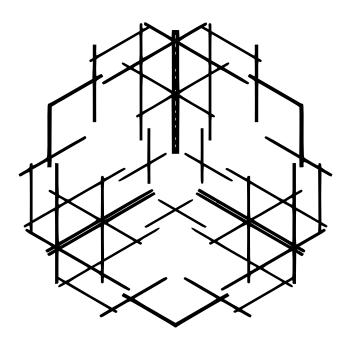

**W h e n d i m e n s i o n s c o l l i d e a n d b l e n d i n t h e A g e o f A q u a r i u s , w e w i l l b e a b l e t o m e n t a l l y c o l l a p s e a q u a n t u m l e a p w i t h i n o u r o w n c o n s c i o u s n e s s , p l a c i n g o u r s e l v e s i n t o f a n t a s t i c f u t u r e p a r a l l e l r e a l i t i e s .**

**T o d o t h i s , w e n e e d t o m a k e t h a t v i b r a t i o n a l c h o i c e w i t h i n o u r o w n m e n t a l l a b y r i n t h s a n d i n n e r p o r t a l s , s o t h a t w e a r e a l i g n e d , a t t h e r i g h t m o m e n t , w i t h t h e g e o m e t r y o f t h i s c o l l e c t i v e n e u r a l n e t w o r k — c a p a b l e o f v i b r a t i n g h i g h e n o u g h t o j u m p t h r o u g h r e a l i t i e s a n d d i m e n s i o n s — w e m u s t b e r e a d y f o r t h e m o m e n t w h e n t i m e l i n e s s p l i t .**

**T h a t ' s w h y i t ' s n e c e s s a r y t o g e t u s e d t o t h e n a t u r a l l y a b s t r a c t a n d c h a o t i c s t a t e o f e x i s t e n c e , f i n d i n g p e a c e a n d b a l a n c e i n t h e m i d d l e o f t h e c h a o s . T h i s d i m e n s i o n a l o p e n i n g f o r c e s u s t o f a c e o u r s e l v e s a n d o u r s h a d o w s h e a d - o n , l i k e a l i g h t t h a t i l l u m i n a t e s d a r k c o m p a r t m e n t s o f o u r c o n s c i o u s n e s s .**

**J u s t a s w e c a p t u r e m o m e n t s o f o u r t h r e e d i m e n s i o n a l l i f e i n p h o t o s a n d v i d e o s a n d c r e a t e a v i r t u a l w o r l d w h e r e w e i n t e r c o n n e c t a n d s h a r e t h o s e m o m e n t s c r y s t a l l i z e d i n i m a g e s a n d r e c o r d i n g s . T h e t h i r d d i m e n s i o n i s t h e c r y s t a l l i z a t i o n o f o u r e x p e r i e n c e s f r o m t h e f o u r t h a n d f i f t h d i m e n s i o n s — a n d s o o n , a l o n g t h e b r a n c h i n g s c a l e o f m e n t a l c r e a t i o n s f r o m t h e h i g h e r d i m e n s i o n s , l i k e a c h a i n r e a c t i o n . T h i s d i m e n s i o n a l o p e n i n g a l l o w s t h e c o n s c i o u s n e s s o f t h e p l a n e t a n d i t s i n h a b i t a n t s t o r e m e m b e r a n d a c c e s s a l l t h e v e r s i o n s o f r e a l i t i e s t h e y a r e p a r t o f , a l l o w i n g f o r t h e c h o i c e o f t h e w o r l d w e w a n t t o l i v e i n a n d c o c r e a t e .**

**G a y a ' s c o n s c i o u s n e s s h a s m a d e a c h o i c e a n d , r e g a r d l e s s o f t h e f a c t t h a t w e a r e i n a h o l o g r a p h i c v i r t u a l u n i v e r s e l o o k i n g f o r a w a y o u t , w h i l e w e a r e h e r e i t ' s u p t o u s t o m a k e t h a t c h o i c e t o o , b e c a u s e t h e p l a n e t , a s a c o n s c i o u s l i v i n g b e i n g , w i l l n o l o n g e r t o l e r a t e o u r a b u s e a n d m i s t r e a t m e n t .**

**I m a g i n e y o u h a v e a n i n f e c t e d w o u n d o n y o u r b o d y a n d i t t a k e s a c e r t a i n a m o u n t o f t i m e t o h e a l . T h a t t i m e y o u e x p e r i e n c e d w h i l e t h e w o u n d w a s h e a l i n g i s e x p e r i e n c e d d i f f e r e n t l y f r o m t h e p e r s p e c t i v e o f t h e b a c t e r i a t h a t l i v e d t h e r e .**

**I n t h e c a s e o f a T i t a n l i k e p l a n e t E a r t h , a l l t h e s e y e a r s o f d e s t r u c t i o n a n d d e v a s t a t i o n a r e j u s t a l a p s e i n i t s p e r c e p t i o n o f t i m e . T h e i d e a o f a ' p l a n e t a r y t r a n s i t i o n t o a N e w E a r t h ' i s n o t h i n g m o r e t h a n t h e r e g e n e r a t i o n o f G a i a ' s b o d y a n d t h e r e m o v a l o f t o x i n s . T h i s m e a n s t h a t a l l t h e b i o l o g i c a l o r g a n i s m s e x i s t i n g i n t h i s b o d y n e e d t o h e a l , r e g e n e r a t e , a n d b a l a n c e t h e m s e l v e s f o r t h e h e a l t h o f t h i s T i t a n — o r t h e y w i l l b e d e s t r o y e d a n d r e m o v e d , j u s t l i k e i n t h e h e a l i n g p r o c e s s o f a w o u n d . T h e g r e a t e r t h e o p e n i n g o f h u m a n c o n s c i o u s n e s s , t h e m o r e t h e n e r v o u s s y s t e m i s a b l e t o w i t h s t a n d l a r g e r a m o u n t s o f r a d i a t i o n a n d e n e r g y . W h e n t h e c o l l e c t i v e n e u r a l n e t w o r k b e c o m e s m o r e e x p a n d e d , w e w i l l b e a b l e t o e n d u r e d i r e c t e x t r a t e r r e s t r i a l c o n t a c t w i t h i n t h e t h r e e d i m e n s i o n a l h o l o g r a p h i c m a t r i x , f o r t h e s p e c i e s w i l l h a v e r e a c h e d a c e r t a i n d e g r e e o f c o l l e c t i v e c o n s c i o u s n e s s t h r o u g h t h e m o r p h o g e n e t i c f i e l d , o n c e a n X n u m b e r o f p e o p l e a t t a i n t h i s s t a t e a n d t r a n s m i t t h e i n f o r m a t i o n a s f r e q u e n c y t h r o u g h m o r p h i c r e s o n a n c e — a s s e e n i n t h e t h e o r y o f m o r p h i c f i e l d s .**

**E x p e r i e n c i n g t h r e e - d i m e n s i o n a l r e a l i t y f r o m a f i f t h - d i m e n s i o n a l p e r s p e c t i v e i s l i k e g e t t i n g a g a m e u p d a t e t o a m o r e a d v a n c e d v e r s i o n . I t ' s h a v i n g t h e f r e e d o m t o m o v e y o u r c o n s c i o u s n e s s t h r o u g h c r y s t a l l i z e d t h r e e - d i m e n s i o n a l m o m e n t s m o r e f l u i d l y , c h o o s i n g w h i c h e x p e r i e n c e s y o u ' l l h a v e . F r o m t h e f o u r t h a n d f i f t h d i m e n s i o n s , w e g a i n a c c e s s t o i n f i n i t e p a r a l l e l r e a l i t i e s a n d t h e c o n v e r g e n c e o f p r e s e n t , p a s t , a n d f u t u r e w i t h i n o u r o w n c o n s c i o u s n e s s . T h i s g i v e s u s g r e a t e r p o w e r t o c h o o s e e x p e r i e n c e s , s i n c e a n ' i m a g i n e d ' r e a l i t y a l r e a d y e x i s t s i n t h e v o r t e x o f t h e S o u r c e M a t r i x . I f t h e u n i v e r s e i s m e n t a l , t h a t m e a n s i t s b i o l o g i c a l m a n i f e s t a t i o n s a n d p h y s i c a l l a w s w o r k l i k e p r o g r a m s i n t h e n e u r a l n e t w o r k o f c o n s c i o u s n e s s , a n d t h r o u g h t h e p r i n c i p l e o f c o r r e s p o n d e n c e — j u s t l i k e w e c r e a t e v i r t u a l r e a l i t i e s a n d p r o g r a m g a m e s w i t h c e r t a i n l a w s , c o m m a n d s , a n d s c e n a r i o s u s i n g a p r o g r a m m i n g l a n g u a g e w i t h n u m b e r s , s y m b o l s , a n d g e o m e t r i c s h a p e s — o u r h i g h e r c o n s c i o u s n e s s c r e a t e s t h e s e w o r l d s a n d i n s e r t s f r a c t a l s o f i t s e l f i n t o b i o l o g i c a l f o r m s c r e a t e d b y t h e s a c r e d g e o m e t r y o f t h e p e n t a g r a m , T H E ' I M A G E A N D L I K E N E S S O F G O D , ' s i n c e t h e s h a p e o f t h e f i v e - p o i n t e d s t a r w i t h i n a c i r c l e r e p r e s e n t s t h e u n i o n o f s p i r i t w i t h m a t t e r .**

**t h e f o u r e l e m e n t s d o m i n a t e d b y t h e h e a d w h i c h i s c o n s c i o u s n e s s , l i g h t , m i n d — i n s i d e t h e c i r c l e . T h i s b i o l o g i c a l f o r m i s c a p a b l e o f b e c o m i n g a n a v a t a r t h r o u g h w h i c h a h i g h e r c o n s c i o u s n e s s c a n e x p e r i e n c e e x i s t e n c e . I t i s t h e m o s t c o n s c i o u s s p e c i e s i n a n a t u r a l s y s t e m , w h i c h m e a n s i t i s r e s p o n s i b l e f o r m a n a g i n g n a t u r a l r e s o u r c e s , m a i n t a i n i n g t h e e n v i r o n m e n t , o r g a n i z i n g a f u n c t i o n a l s o c i e t y t h a t i s b e n e f i c i a l f o r a l l t h e p l a n e t ' s i n h a b i t a n t s , a n d d e v e l o p i n g t e c h n o l o g i e s r e s p o n s i b l y , i n h a r m o n y w i t h n a t u r e .**

**T h e s e t e c h n o l o g i e s s h o u l d n ' t r e p l a c e t h e s p i r i t u a l e x p e r i e n c e o f h i g h e r c o n s c i o u s n e s s t h r o u g h b i o l o g i c a l l i f e — a l i f e t h a t c a n f e e l e m o t i o n s l i k e l o v e a n d d e v o t i o n f o r t h e S o u r c e o f a l l t h i n g s . B e y o n d t h e s e r e s p o n s i b i l i t i e s a s i n t e l l i g e n t b i o l o g i c a l b e i n g s , w h e n w e t r y t o u n d e r s t a n d c o n s c i o u s n e s s a n d e x i s t e n c e t h r o u g h s c i e n c e , p h i l o s o p h y , p s y c h o l o g y , a n d s p i r i t u a l i t y , w e d o n ' t f i n d e x p l a n a t i o n s a s c l e a r a s t h e 7 H e r m e t i c l a w s w r i t t e n b y H e r m e s T r i s m e g i s t u s — u s e d b y o c c u l t i s t s , h i g h m a g i c s c h o o l s , t h e K a b b a l a h , a m o n g o t h e r s .**

**T h i s i s b e c a u s e , w h e n w e m a k e t h e c o n n e c t i o n b e t w e e n k n o w l e d g e o f p r o g r a m m i n g b i o l o g i c a l u n i v e r s e s a n d p r o g r a m m i n g g a m e s a n d v i r t u a l r e a l i t i e s t o t h e p r i n c i p l e o f m e n t a l i s m , i t m e a n s t h a t w e h a v e t h e r e s p o n s i b i l i t y t o r e n d e r r e a l i t y a l l t h e t i m e t h r o u g h t h e c o l l e c t i v e c o n s c i o u s n e s s — B u t f e w p e o p l e u n d e r s t a n d t h e i n d i v i d u a l r e s p o n s i b i l i t y i n c r e a t i n g t h e N e w E a r t h , s o t h a t t h e h u m a n s p e c i e s o n E a r t h c a n t r u l y b e r e s t o r e d a n d r e a d a p t e d t o n e w c l i m a t e c o n d i t i o n s , n e w n a t u r a l c y c l e s , a n d n e w d i m e n s i o n a l p h y s i c a l l a w s . A l l o f t h i s h a p p e n s t h r o u g h t h e r e p r o g r a m m i n g o f t h e c o l l e c t i v e a n d i n d i v i d u a l n e u r a l n e t w o r k , s o t h a t a l l f o r m s o f l i f e c a n w o r k t o g e t h e r f o r a b e t t e r q u a l i t y o f e x p e r i e n c e i n t h i s b i o l o g i c a l u n i v e r s e . P e o p l e w h o c o m e a c r o s s t h i s i n f o r m a t i o n f o r t h e f i r s t t i m e w o n d e r w h a t i t h a s t o d o w i t h t h e m , s i n c e " a n y w a y , t h e y ' l l h a v e t o g o b a c k t o w o r k t o m o r r o w " t o s u r v i v e a n d s u p p o r t t h e i r f a m i l i e s . A n d o f t e n t h e y s e e u s a s d e n i a l i s t s w h e n w e e m p h a s i z e t h a t t h e r o o t o f t h e i r a n g e r a b o u t h a v i n g t o " g o t o w o r k t o m o r r o w " i s d i r e c t l y r e l a t e d t o t h i s i n f o r m a t i o n .**

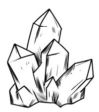

**— a n d t h a t t h e i r l i f e i s a r e f l e c t i o n o f t h e i r o w n m i n d i n t e r t w i n e d w i t h t h e c o l l e c t i v e m i n d , w h i c h e n c o m p a s s e s t h e s o c i a l s y s t e m w e a r e i n s e r t e d i n t o f r o m t h e m o m e n t w e o b t a i n a b o d y a n d p a s s t h r o u g h t h e p o r t a l o f t h e f e m a l e i n t o t h e g a m e . A n d d e p e n d i n g o n t h e c o n t e x t i n w h i c h w e a r e b o r n , w e a r e s w a l l o w e d b y t h e c u r r e n t o f t h e s y s t e m s a l r e a d y e s t a b l i s h e d i n s o c i e t y . I n o t h e r w o r d s , a t w h a t m o m e n t d i d o u r c o n s c i o u s n e s s d e c i d e i t w o u l d l i v e t h i s e x p e r i e n c e ? A n d w h y c a n w e n o t r e m e m b e r w h e n i t b e g a n o r w h a t i s h a p p e n i n g i n t h e c o s m o s ? A n d s i n c e w e a r e h e r e , w h a t c a n w e d o t o l i v e b e t t e r ? T o p r o t e c t t h e p l a n e t a n d t h e s p e c i e s ? S o t h a t w e m a y e v o l v e s a f e l y a n d s e e k t o u n d e r s t a n d w h a t w e a r e d o i n g h e r e a s c o n s c i o u s i n d i v i d u a l s , e n s u r i n g t h a t t h e i n f o r m a t i o n f r o m s c i e n t i f i c l a b o r a t o r i e s c a n b e s h a r e d b y e v e r y o n e — a n d n o t j u s t b y a f r a c t i o n o f h u m a n f a m i l i e s w h o w i s h t o h o l d p o w e r a t t h e e x p e n s e o f t h e r e s t o f h u m a n i t y . W h a t e a c h o f u s h a s t o d o w i t h t h i s i m p l i e s t h e r e s p o n s i b i l i t y o f u n d e r s t a n d i n g t h a t t h e c o l l e c t i v e c o n s c i o u s n e s s o f t h e h u m a n r a c e i s c o m p l i c i t i n t h e " r e n d e r i n g o f t h i s h o l o g r a m " t h r o u g h t h e p r i n c i p l e o f m e n t a l i s m a n d t h e r e w i l l b e n o c h a n g e i n t h e s p e c i e s u n t i l w e r e a c h a s i g n i f i c a n t n u m b e r o f c o n s c i o u s , a w a k e n e d , a n d a c t i v a t e d f r a c t a l s ,**

**c a p a b l e o f c o n f i g u r i n g a n e u r a l n e t w o r k t h r o u g h t h e e l e c t r o m a g n e t i c w e b o f c o m m u n i c a t i o n t h a t f u n c t i o n s l i k e n e u r o n s , c r e a t i n g t h e m o r p h i c f i e l d t h a t w i l l a l i g n u s w i t h t h e o r i g i n a l v e r s i o n o f t h e E a r t h s i m u l a t i o n , p r o g r a m m e d i n t h e p r o j e c t o f t h i s g a l a x y a n d t h i s u n i v e r s e . T h i s w o r k h a s t o b e d o n e b y e a c h o f u s , s i n c e w e a r e p a r t i c l e s o f t h e w h o l e — a n d t h a t m e a n s b e i n g a w a r e o f w h a t w e a r e c h o o s i n g t o r e n d e r a s h o l o g r a m s , u s i n g o u r e m o t i o n s a n d i n t u i t i o n a s a c o m p a s s , a f r e q u e n c y m e t e r t h a t c a n s h o w u s w h a t w e p r e f e r o r d o n ' t p r e f e r t o e x p e r i e n c e a s c h a r a c t e r s i n t h i s c o s m i c g a m e .**

**T h e b r a i n i s a h a r d w a r e , a n d t h e m i n d i s t h e o p e r a t i n g s y s t e m w h e r e t h e s o f t w a r e s — t h e p r o g r a m s t h a t c o m p o s e t h e a v a t a r ' s i n t e r f a c e t h r o u g h w h i c h c o n s c i o u s n e s s o b s e r v e s a n d i n t e r a c t s w i t h t h i s r e a l i t y — r u n . T h a t i s w h y w e h a v e t h e s e n s a t i o n t h a t o u r i d e n t i t y a n d s e n s e o f b e i n g a r e c e n t e r e d i n t h e a r e a o f t h e h e a d , w h e r e w e o r g a n i z e o u r t h o u g h t s a n d m e m o r i e s a s m o m e n t s c a p t u r e d b y t h e e y e s — w h i c h a r e l i k e b l a c k h o l e s t h a t a b s o r b i n f o r m a t i o n i n t h e f o r m o f e n e r g y , w h i c h w e i n t e r p r e t a s 3 D r e a l i t y . T h e d i f f e r e n c e b e t w e e n y o u r p h y s i c a l b o d y a n d t h e b o d y t h a t e x p e r i e n c e s d r e a m s , m e m o r i e s , o r i m a g i n e d s c e n a r i o s i s t h e l e v e l o f c o n s c i o u s n e s s o f t h o s e b o d i e s . E a c h p o i n t o f o b s e r v a t i o n m u s t , i n e v i t a b l y , b e s e l f - a w a r e a n d t h a t i s w h y y o u a r e y o u a n d n o t a n o t h e r . T h e u s e o f h a l l u c i n o g e n i c s u b s t a n c e s c a u s e s a d i s s o c i a t i o n o f c o n s c i o u s n e s s f r o m i t s e l f . T h a t i s w h y s o m e p e o p l e a b a n d o n t h e i r t h r e e d i m e n s i o n a l c h a r a c t e r t o l i v e c o n s t a n t l y i n a l t e r e d s t a t e s o f c o n s c i o u s n e s s a n d b e c o m e d e p e n d e n t o n t h o s e s u b s t a n c e s , w h i l e t h e i r b o d y a n d m i n d b e c o m e m o r e s u s c e p t i b l e t o e x t e r n a l f o r c e s a n d s t i m u l i . T h e a d v a n t a g e o f b e i n g c o n s c i o u s f r o m a p o i n t o f o b s e r v a t i o n i s y o u r p o w e r t o c h o o s e h o w y o u w i l l r e a c t t o t h e s t i m u l i , c h a l l e n g e s , a n d s i t u a t i o n s i n y o u r e x i s t e n c e — a n d i n t o w h i c h p r o b a b l e f u t u r e s**

**t h e s e c h o i c e s a n d r e a c t i o n s w i l l p o s i t i o n y o u . A n d i f w e o p e r a t e t h r o u g h p r o g r a m m i n g s , i t m e a n s t h a t o u r m e n t a l a n d e m o t i o n a l r e s p o n s e s a r e c o n d i t i o n e d b y m e c h a n i s m s c o n f i g u r e d a s b e l i e f s . T h e s e t o f p r o g r a m s w e i n s t a l l i n c h i l d h o o d a n d t h r o u g h o u t l i f e f o r m s t h e a v a t a r ' s i d e n t i t y , w i t h i t s b e l i e f s a n d r e a c t i o n s r o o t e d i n t h e s u b c o n s c i o u s , r e f l e c t i n g i t s m e n t a l s t a t e s a s c h a l l e n g e s a n d e n i g m a s w i t h i n t h e l a b y r i n t h t h a t i s t h i s b i o l o g i c a l a d v e n t u r e , w h e r e w e f a c e o u r d e e p e s t f e a r s a n d d e s i r e s . T h e s e , i f d e c i p h e r e d a n d e x p l o r e d , c a n r e v e a l o u r p o t e n t i a l s — s u f f o c a t e d b y t h o s e b e l i e f s — l i k e g r e a t a r t i s t s t r a p p e d b e h i n d s u p e r m a r k e t c o u n t e r s o r a b r i l l i a n t c o n f e c t i o n e r c o n f i n e d i n a n a c c o u n t i n g o f f i c e . W h a t a r e t h e c o n d i t i o n i n g s t h a t d r i v e t h e s e p e o p l e a w a y f r o m t h e i r p o t e n t i a l a n d p a s s i o n s ? W h a t b e l i e f s m u s t b e r e p r o g r a m m e d s o t h a t t h e y m a y e x e r c i s e t h e i r p a s s i o n s i n a h e a l t h y w a y , c r e a t i n g s o m e t h i n g t h a t s e r v e s t h e W h o l e ? I f a l l t h a t e x i s t s i s m e n t a l , t h e r e a r e e x i s t e n t i a l c o n t e x t s t h a t s t r u c t u r e t h e s t o r y a n d i d e n t i t y o f t h e c h a r a c t e r , b a s e d o n t h e i r p a s t m e m o r i e s / i m a g e s .**

**T h e m i n d , w h i c h s e e k s t o o r g a n i z e e v e n t s a l o n g a s e q u e n t i a l l i n e , c r e a t e s a d e f i n i t i o n f o r t h e e x i s t e n c e o f t h i s c h a r a c t e r w h o p e r c e i v e s t h e m s e l v e s a s l i m i t e d w i t h i n c e r t a i n c o n t e x t s s u c h a s s o m e o n e w h o w a n t s t o d r o p o u t o f c o l l e g e b u t c o n t i n u e s d u e t o s o c i a l p r e s s u r e o r t h e m o n e y a l r e a d y i n v e s t e d .**

**T o o b t a i n d i f f e r e n t m e n t a l a n d e m o t i o n a l r e s p o n s e s , w e n e e d d i f f e r e n t p r o g r a m s . B u t i n o r d e r t o i n s t a l l n e w p r o g r a m s i n t o a n o p e r a t i n g s y s t e m , i t i s n e c e s s a r y t o r e s e t t h e o l d o n e s s o t h a t t h e y d o n ' t c a n c e l e a c h o t h e r o u t o r c o m e i n t o c o n f l i c t .**

**T h e t h e t a a n d d e l t a b r a i n w a v e s t a t e s , p r o d u c e d i n t h e b r a i n s o f b a b i e s a n d d u r i n g h y p n o s i s , a r e t h e m o s t s u s c e p t i b l e t o c o m m a n d s t h a t i n d u c e t h e s u b c o n s c i o u s t o e x p l o r e t h e h i d d e n l a y e r s o f t r a u m a t h a t g i v e r i s e t o l i m i t i n g b e l i e f s .**

**P r o j e c t M K U l t r a w a s a p r o g r a m o f i l l e g a l h u m a n e x p e r i m e n t a t i o n a i m e d a t m i n d c o n t r o l a n d b r a i n w a s h i n g d u r i n g t h e C o l d W a r . I t s p u r p o s e w a s t o u n l o c k s u p e r h u m a n p o t e n t i a l i n i n d i v i d u a l s p r e d i s p o s e d t o i t , e r a s e t h e m e m o r y o f f o r m e r a g e n t s , a n d i n s e r t a n e w i d e n t i t y w i t h n e w m e m o r i e s . I n t h i s w a y , t h e y c o u l d " r e t i r e " p e o p l e w h o p o s s e s s e d c o n f i d e n t i a l i n f o r m a t i o n a b o u t t h e g o v e r n m e n t a n d c r e a t e a p e r s o n a l i t y d i s s o c i a t i o n t h r o u g h t r a u m a s , p h y s i c a l a n d e m o t i o n a l s h o c k s , a n d t o r t u r e ,**

**s o t h a t t h e m i n d w o u l d e n t e r a s u g g e s t i b l e s t a t e f o r t h e i n s e r t i o n o f c o m m a n d s a n d p r o g r a m m i n g .**

**W h e n t h e m i n d e n t e r s t h i s h y p n o t i c s t a t e , t h e p r o g r a m m e r u s e s e s o t e r i c s y m b o l o g y t o g u i d e c o n s c i o u s n e s s t h r o u g h p o r t a l s t h a t l e a d t o t h e m y s t e r i e s o f t h e s u b c o n s c i o u s , a c c e s s i n g t h e c h a o t i c / p o t e n t i a l / m a g i c a l a n d u n l i m i t e d s t a t e o f b e i n g . T h i s e x p e r i e n c e r e s e m b l e s t h e e f f e c t s o f a y a h u a s c a a n d n e a r - d e a t h e x p e r i e n c e s .**

**M a n y c i n e m a t i c w o r k s — s u c h a s A l i c e i n W o n d e r l a n d , T h e W i z a r d o f O z , a n d s e v e r a l p o p c u l t u r e m u s i c v i d e o s — i l l u s t r a t e t h i s d e s c e n t i n t o t h e m a g i c a l w o r l d . H e r e , w e c a n m a k e a c o n n e c t i o n w i t h t h e t h e o r y t h a t t h e s e a r t i s t s a r e s u b j e c t e d t o s u c h m e n t a l e x p e r i m e n t s t o u n l o c k t h e i r m a x i m u m p o t e n t i a l .**

**T h i s w a s n o t t h e o n l y C I A e x p e r i m e n t i n v o l v i n g h u m a n c o n s c i o u s n e s s . I n 2 0 0 3 , t h e p r o j e c t k n o w n a s T h e G a t e w a y P r o c e s s w a s m a d e p u b l i c , w h e r e t e c h n i q u e s w e r e d e v e l o p e d t o s y n c h r o n i z e b o t h h e m i s p h e r e s o f t h e b r a i n t h r o u g h t h e i n d u c t i o n o f s p e c i f i c f r e q u e n c i e s f o r e a c h s i d e o f t h e b r a i n , c a u s i n g i t t o e n t e r i n t o s y n c h r o n i z a t i o n a n d p r o d u c e t h e t h e t a b r a i n w a v e . I n t h i s s t a t e , i t b e c o m e s p o s s i b l e t o h a v e e x t r a p h y s i c a l e x p e r i e n c e s a n d a n e x p a n s i o n o f c o n s c i o u s n e s s . T h e s e C I A e x p e r i m e n t s c o n f i r m m y t h e o r y a b o u t t h e**

**f u n c t i o n i n g o f t h e A v a t a r ' s m i n d a n d i n s p i r e m e t o p u t i n t o p r a c t i c e t h e m e n t a l e x p e r i m e n t I h a v e b e e n a p p l y i n g t o m y s e l f : a r e s e t o f t h e p r o g r a m s o f m y c h a r a c t e r S a r a h , t h r o u g h t h e i n d u c t i o n o f t h e b r a i n i n t o t h e t h e t a b r a i n w a v e s t a t e b y m e a n s o f b i n a u r a l f r e q u e n c i e s a n d c o m m a n d s t h a t u s e a s y m b o l i s m t h a t c o m m u n i c a t e s d i r e c t l y w i t h c o n s c i o u s n e s s i n i t s p u r e s t a t e , f o r t h e t r u e S e l f d o e s n o t r e c o g n i z e t h e l a n g u a g e s c r e a t e d b y h u m a n s , b u t r a t h e r t h e s y m b o l s a n d a r c h e t y p e s t h a t a l r e a d y e x i s t i n t h e m e m o r y o f t h e S o u r c e .**

**T h e s e c o m m a n d s a r e c h a n n e l i n g s o f c o n s c i o u s n e s s e s t h a t p r e s e n t t h e m s e l v e s t o m e a s t h e f i r s t e x p r e s s i o n s o f t h e C r e a t i v e S o u r c e a n d c a n a c t i v a t e t h e f l o w o f e n e r g y t h a t r u n s t h r o u g h t h e c h a k r a s a n d t h e n e r v o u s s y s t e m .**

**T h e G a t e w a y P r o c e s s i s a t e r m a s s o c i a t e d w i t h a s e t o f t e c h n i q u e s a n d s t u d i e s p r o m o t e d b y t h e U n i t e d S t a t e s g o v e r n m e n t , s p e c i f i c a l l y b y t h e D e f e n s e I n t e l l i g e n c e A g e n c y ( C I A ) , w i t h t h e o b j e c t i v e o f e x p l o r i n g t h e p o t e n t i a l o f t h e h u m a n m i n d , c o n s c i o u s n e s s , a n d p s y c h i c a b i l i t i e s .**

**T h e n a m e G a t e w a y P r o c e s s o r i g i n a t e d i n a d e c l a s s i f i e d C I A r e p o r t , k n o w n a s T h e A n a l y s i s a n d A s s e s s m e n t o f G a t e w a y P r o c e s s , p u b l i s h e d i n 1 9 8 3 .**

**O b j e c t i v e :**

**T h e m a i n o b j e c t i v e o f t h e G a t e w a y P r o c e s s w a s t o e x p l o r e h o w m e n t a l t r a i n i n g t e c h n i q u e s c o u l d h e l p e x p a n d h u m a n c o n s c i o u s n e s s a n d a c c e s s a l t e r e d s t a t e s o f p e r c e p t i o n , p o s s i b l y f o r a p p l i c a t i o n s i n i n t e l l i g e n c e a n d n a t i o n a l s e c u r i t y .**

**T h e t e c h n i q u e s s t u d i e d i n c l u d e d m e d i t a t i o n , v i s u a l i z a t i o n , a n d o t h e r p r a c t i c e s d e s i g n e d t o r e a c h a l t e r e d s t a t e s o f c o n s c i o u s n e s s .**

**M e t h o d s a n d T e c h n i q u e s :**

**H e m i s p h e r i c S y n c h r o n i z a t i o n —**

**O n e o f t h e k e y t e c h n i q u e s i n v o l v e d i n t h e G a t e w a y P r o c e s s w a s h e m i s p h e r i c s y n c h r o n i z a t i o n , w h i c h s e e k s t o a l i g n t h e b r a i n w a v e s o f b o t h h e m i s p h e r e s o f t h e b r a i n .**

**T h i s w a s a c c o m p l i s h e d t h r o u g h a u d i t o r y s t i m u l i , s u c h a s b i n a u r a l b e a t s , w h i c h i n d u c e s p e c i f i c s t a t e s o f c o n s c i o u s n e s s a n d p r o m o t e t h e u n i f i c a t i o n o f t h e r a t i o n a l m i n d ( l e f t h e m i s p h e r e ) w i t h t h e i n t u i t i v e m i n d ( r i g h t h e m i s p h e r e ) .**

**T h i s i n t e g r a t i o n e n h a n c e s f o c u s , c r e a t i v i t y , i n t u i t i o n , a n d a c c e s s t o d e e p e r l e v e l s o f p e r c e p t i o n o f r e a l i t y .**

**V i s u a l i z a t i o n E x p e r i m e n t s :**

**V i s u a l i z a t i o n a n d m e d i t a t i o n t e c h n i q u e s w e r e u s e d t o e x p l o r e t h e a b i l i t y t o c r e a t e p e r c e p t u a l e x p e r i e n c e s , a n d e v e n f o r a t t e m p t s a t a s t r a l t r a v e l o r o u t - o f - b o d y c o n s c i o u s n e s s p r o j e c t i o n .**

**R e p o r t s a n d D o c u m e n t s :**

**1 9 8 3 R e p o r t :**

**T h e d e c l a s s i f i e d r e p o r t k n o w n a s T h e A n a l y s i s a n d A s s e s s m e n t o f G a t e w a y P r o c e s s d e t a i l s t h e t h e o r e t i c a l p r i n c i p l e s a n d m e t h o d o l o g i e s u s e d i n t h e p r o c e s s .**

**T h e d o c u m e n t i s n o t a b l e f o r i t s e x p l o r a t i o n o f t h e p o s s i b i l i t i e s o f a l t e r i n g h u m a n c o n s c i o u s n e s s a n d i n v e s t i g a t i n g p h e n o m e n a s u c h a s n o n - l o c a l p e r c e p t i o n .**

**T h e o r e t i c a l B a s i s :**

**T h e r e p o r t e x p l o r e s t h e o r i e s f r o m q u a n t u m p h y s i c s a n d o t h e r f i e l d s o f s c i e n c e i n a n a t t e m p t t o u n d e r s t a n d h o w t e c h n i q u e s f o r c o n s c i o u s n e s s e x p a n s i o n c o u l d r e l a t e t o c o n c e p t s o f e n e r g y a n d r e a l i t y .**

**T h e M K U l t r a P r o j e c t :**

**D e v e l o p e d b y t h e C I A d u r i n g t h e C o l d W a r , t h e M K U l t r a P r o j e c t w a s a s e c r e t r e s e a r c h p r o g r a m c o n d u c t e d b y t h e U n i t e d S t a t e s C e n t r a l I n t e l l i g e n c e A g e n c y .**

**I n i t i a t e d i n t h e 1 9 5 0 s a n d o f f i c i a l l y t e r m i n a t e d i n 1 9 7 3 , t h e p r o j e c t a i m e d t o i n v e s t i g a t e t e c h n i q u e s o f m e n t a l c o n t r o l a n d m a n i p u l a t i o n , o f t e n e m p l o y i n g h i g h l y q u e s t i o n a b l e a n d u n e t h i c a l m e t h o d s .**

**O b j e c t i v e s**

**M i n d C o n t r o l :**

**T h e C I A s o u g h t t o d i s c o v e r e f f e c t i v e m e t h o d s t o c o n t r o l t h e h u m a n m i n d , w i t h t h e g o a l o f d e v e l o p i n g a d v a n c e d t e c h n i q u e s f o r i n t e r r o g a t i o n a n d p s y c h o l o g i c a l m a n i p u l a t i o n .**

**D r u g D e v e l o p m e n t :**

**T h e p r o j e c t a l s o a i m e d t o d e v e l o p s u b s t a n c e s t h a t c o u l d b e u s e d f o r m i n d c o n t r o l , i n c l u d i n g p s y c h e d e l i c d r u g s s u c h a s L S D .**

**M e t h o d s a n d T e c h n i q u e s**

**U s e o f D r u g s :**

**L S D a n d o t h e r h a l l u c i n o g e n i c s u b s t a n c e s w e r e a d m i n i s t e r e d t o i n d i v i d u a l s — o f t e n w i t h o u t t h e i r k n o w l e d g e o r c o n s e n t — w i t h t h e p u r p o s e o f s t u d y i n g t h e i r e f f e c t s o n t h e m i n d a n d c o n s c i o u s n e s s .**

**S e n s o r y D e p r i v a t i o n E x p e r i m e n t s :**

**S o m e a p p r o a c h e s i n v o l v e d t h e d e p r i v a t i o n o f s e n s o r y s t i m u l i a n d t h e a p p l i c a t i o n o f e x t r e m e s t i m u l i t o o b s e r v e t h e p s y c h o l o g i c a l a n d n e u r o l o g i c a l r e a c t i o n s o f t h e p a r t i c i p a n t s .**

**T h e u s e o f h y p n o s i s t e c h n i q u e s w a s f r e q u e n t , a s w e r e p r a c t i c e s o f s u g g e s t i o n a n d**

**p s y c h o l o g i c a l m a n i p u l a t i o n e m p l o y e d t o i n v e s t i g a t e t h e m i n d ' s s u s c e p t i b i l i t y t o e x t e r n a l c o m m a n d s .**

**S u b p r o j e c t s :**

**M K - U l t r a w a s c o m p o s e d o f s e v e r a l s u b p r o j e c t s , e a c h d e d i c a t e d t o e x p l o r i n g s p e c i f i c a s p e c t s o f h u m a n m i n d m a n i p u l a t i o n .**

**A m o n g t h e m w e r e s t u d i e s o n u n e t h i c a l b e h a v i o r s , b r a i n w a s h i n g t e c h n i q u e s , m e m o r y e r a s u r e , i d e n t i t y d i s s o c i a t i o n , a n d o t h e r e x t r e m e p r a c t i c e s .**

## **E x p e r i m e n t s :**

**T h e e x p e r i m e n t s w e r e o f t e n c o n d u c t e d w i t h o u t t h e p a r t i c i p a n t s ' c o n s e n t , w h o w e r e f r e q u e n t l y s u b j e c t e d t o h i g h l y i n v a s i v e a n d h a r m f u l p r o c e d u r e s .**

**D i s c o v e r y :**

**T h e M K - U l t r a P r o j e c t w a s e x p o s e d t o t h e p u b l i c i n t h e e a r l y 1 9 7 0 s .**

**I n 1 9 7 5 , a s e r i e s o f i n v e s t i g a t i o n s c o n d u c t e d b y t h e U . S . C o n g r e s s — k n o w n a s t h e C h u r c h H e a r i n g s — a l o n g w i t h o t h e r i n v e s t i g a t i v e p r o c e s s e s , r e v e a l e d t h e f u l l e x t e n t o f t h e u n e t h i c a l p r a c t i c e s c a r r i e d o u t u n d e r t h e p r o j e c t .**

**D e s t r u c t i o n o f D o c u m e n t s :**

**M a n y o f t h e d o c u m e n t s r e l a t e d t o M K - U l t r a w e r e d e s t r o y e d i n 1 9 7 3 , s h o r t l y b e f o r e t h e i n t e n s i f i c a t i o n o f p u b l i c i n v e s t i g a t i o n s .**

**a n a l y s i s o f t h e p r o j e c t . M K - U l t r a i s o f t e n c i t e d a s a n e x t r e m e e x a m p l e o f a b u s e o f p o w e r a n d l a c k o f e t h i c s i n s c i e n t i f i c r e s e a r c h .**

**T h e c a s e h i g h l i g h t e d t h e n e e d f o r s t r i c t e r r e g u l a t i o n s a n d g r e a t e r o v e r s i g h t i n s t u d i e s i n v o l v i n g h u m a n s u b j e c t s .**

**I n o t h e r w o r d s , t h e w o r l d ' s l e a d i n g s c i e n t i f i c r e s e a r c h l a b o r a t o r i e s k n o w t h a t i t i s p o s s i b l e t o a c h i e v e r e s u l t s t h r o u g h t h e m a n i p u l a t i o n o f c o n s c i o u s n e s s .**

**I t i s n e c e s s a r y t o u n d e r s t a n d h o w r e a l i t y a n d t h e m i n d f u n c t i o n , b e c a u s e t h e r e a r e p r o g r a m s t h a t a c t a s a n i m m u n i t y t o n e w p r o g r a m m i n g o r i n f o r m a t i o n — s u c h a s t h e p r o g r a m w e r e c e i v e i n c h i l d h o o d t h a t t e l l s u s r e a l i t y i s p h y s i c a l a n d s o l i d , m a d e o f t h e l i t t l e " b r i c k s " w e c a l l a t o m s .**

**T h i s i n f o r m a t i o n , r e c e i v e d a n d i n s t a l l e d i n t h e a v a t a r ' s o p e r a t i n g s y s t e m , c a u s e s i t t o p e r c e i v e a n d i n t e r p r e t r e a l i t y i n a d i s t o r t e d w a y .**

**T h a t i s w h y , w h e n w e a r e c h i l d r e n a n d s e e i m a g e s o f p e o p l e a p p e a r i n g o n a t e l e v i s i o n s c r e e n , w e i n s t i n c t i v e l y l o o k i n s i d e t h e d e v i c e ' s c a s i n g t o c h e c k i f t h o s e " l i t t l e p e o p l e " a r e r e a l l y i n t h e r e .**

**A f t e r a l l , i f r e a l i t y i s s o l i d , h o w i s i t p o s s i b l e t h a t a s c r e e n c a n t u n e i n t o m o v i n g i m a g e s , c a p t u r e d i n t i m e a n d t r a n s m i t t e d a s i n f o r m a t i o n s i g n a l s t h r o u g h p i x e l s ? T h i s q u e s t i o n i n g i s l i k e a " g l i t c h " i n t h e**

**T h i s q u e s t i o n i n g i s l i k e a " g l i t c h " i n t h e p r o g r a m m i n g t h a t d e f i n e s r e a l i t y a s m e r e l y s o l i d .**

**H o w e v e r , e v e n w h e n w e p e r c e i v e t h e s e g l i t c h e s , t h e i n i t i a l p r o g r a m m i n g s t i l l f u n c t i o n s a s a n i m m u n i t y t h a t o v e r r i d e s s u c h q u e s t i o n i n g .**

**I n o t h e r w o r d s , e v e n t h o u g h t e c h n o l o g i c a l p h e n o m e n a l i k e t h e s e c h a l l e n g e o u r p e r c e p t i o n o f r e a l i t y , w e c o n t i n u e f o l l o w i n g o l d p a t t e r n s . A n d t h a t i s w h y m a n y p e o p l e f a i l t o a c h i e v e r e s u l t s w i t h m e n t a l r e p r o g r a m m i n g , h a r m o n i c r e s o n a n c e , o r b i o k i n e s i s — b e c a u s e t h e i r o p e r a t i n g s y s t e m i s i m m u n e t o n e w p r o g r a m m i n g o r i n f o r m a t i o n .**

**A s p r e v i o u s l y m e n t i o n e d , t h e f l o w o f e n e r g y t h a t c o m e s f r o m t h e S o u r c e a n d r u n s t h r o u g h o u r c h a k r a s a n d n e r v o u s s y s t e m i s g u i d e d b y m e n t a l p r o g r a m s , w h i c h a c t a s p o r t a l s t h r o u g h w h i c h t h i s e n e r g y e i t h e r f l o w s — o r b e c o m e s b l o c k e d — d e p e n d i n g o n c e r t a i n b e l i e f s . I n o t h e r w o r d s , t h e n e r v o u s s y s t e m b e c o m e s d e p r i v e d o f t h e c a p a c i t y t o w i t h s t a n d h i g h l e v e l s o f e n e r g y , a n d c e r t a i n**

**I m p a c t f u l s t i m u l i — s u c h a s e x t r a t e r r e s t r i a l c o n t a c t , e x t r a p h y s i c a l e n c o u n t e r s , o r s u p e r n a t u r a l p h e n o m e n a — c a n l e a d t o m e n t a l , e m o t i o n a l , a n d e n e r g e t i c c o l l a p s e s , s i n c e t h e o p e r a t i n g s y s t e m i s n o t c a p a b l e o f h a n d l i n g s u c h e x p e r i e n c e s .**

**I t i s l i k e t r y i n g t o r u n a n a d v a n c e d c o m p u t e r p r o g r a m o n a n o u t d a t e d o p e r a t i n g s y s t e m : i t s i m p l y i s n ' t c o m p a t i b l e .**

**T h e r e i s a w a y t o r e s e t a n d r e p r o g r a m t h e b i o l o g i c a l a v a t a r ' s o p e r a t i n g s y s t e m — t h e m i n d — t h r o u g h s y m b o l s t h a t f u n c t i o n a s a p r o g r a m m i n g l a n g u a g e f o r t h e s u b c o n s c i o u s m i n d . T h e s e c o m m a n d s w i l l b e m a d e a v a i l a b l e t h r o u g h m y F o n t e M a t r i z c o m m u n i c a t i o n c h a n n e l s a s t h e t o o l " A c t i v a t i n g A v a t a r s " .**

**A s w e h a v e s e e n a b o v e , s c i e n t i f i c s t u d i e s a n d e x p e r i m e n t s c o n d u c t e d o n t h e h u m a n m i n d d e m o n s t r a t e t h e p o s s i b i l i t y o f m a n i p u l a t i n g c o n s c i o u s n e s s i n t h e t h e t a b r a i n w a v e s t a t e — a s t a t e f o u n d i n b a b i e s , d u r i n g h y p n o s i s , o r i n m o m e n t s o f d i s s o c i a t i o n f r o m r e a l i t y t r i g g e r e d b y p h y s i c a l t r a u m a .**

**W e k n o w t h a t e v e r y t h i n g t h a t e x i s t s i s m e n t a l a n d c o n t a i n e d w i t h i n c o n s c i o u s n e s s — t h e i n f i n i t e p r i m o r d i a l m i n d a n d t h i s i s h o w m a g i c a l p h e n o m e n a m a n i f e s t , s u c h a s i n c a s e s o f h u m a n s t r a n s f o r m i n g i n t o a n i m a l s , c o m m o n r e p o r t s i n A f r i c a n a n d I n d i g e n o u s c u l t u r e s .**

**I n s u c h c a s e s , t h e h u m a n m o r p h i c f i e l d s h a p e s i t s m o l e c u l a r s t r u c t u r e a t t h e l e v e l o f g e n e t i c i n f o r m a t i o n , a l t e r i n g D N A t h r o u g h t h e i n s e r t i o n o f n e w g e n e t i c i n f o r m a t i o n . T h i s i n f o r m a t i o n i s s e t i n t h e m o r p h i c f i e l d , f o r c i n g p a r t i c l e s , c e l l s , a n d m o l e c u l e s t o r e o r g a n i z e a c c o r d i n g t o t h e n e w g e n e t i c c o d e s c o n f i g u r e d i n i t .**

**T h e h u m a n b o d y i s c o m p o s e d o f a b o u t 7 0 % w a t e r . T h e F r e n c h i m m u n o l o g i s t J a c q u e s B e n v e n i s t e c l a i m e d t h a t w a t e r c o u l d " r e m e m b e r " t h e s u b s t a n c e s d i l u t e d i n i t , e v e n a f t e r t h e c o m p l e t e r e m o v a l o f t h o s e s u b s t a n c e s . T h i s t h e o r y e m e r g e d i n t h e c o n t e x t o f h o m e o p a t h y ,**

**w h i c h p r o p o s e s t h a t s u b s t a n c e s h i g h l y d i l u t e d i n w a t e r c a n s t i l l m a i n t a i n t h e r a p e u t i c e f f e c t s . B e n v e n i s t e d i s c o v e r e d t h e s o - c a l l e d " m e m o r y o f w a t e r " t h r o u g h e x p e r i m e n t s i n d i c a t i n g t h a t e x t r e m e l y d i l u t e d s o l u t i o n s — e v e n w i t h o u t c o n t a i n i n g a n y m o l e c u l e s o f t h e o r i g i n a l s u b s t a n c e — s t i l l e x h i b i t e d b i o l o g i c a l e f f e c t s . T h i s s u g g e s t e d t h a t w a t e r r e t a i n e d a " m e m o r y " o f t h e s u b s t a n c e s w i t h w h i c h i t h a d c o m e i n t o c o n t a c t .**

**A s w e k n o w , s c i e n t i s t s h a v e r e c e n t l y r e v e a l e d t h a t w a t e r i s a f l u i d c a p a b l e o f r e s p o n d i n g t o v i b r a t i o n s a n d s o u n d w a v e s d u e t o i t s p h y s i c a l p r o p e r t i e s . S o u n d w a v e s a r e v i b r a t i o n s t h a t p r o p a g a t e t h r o u g h a m e d i u m , a n d t h e s e v i b r a t i o n s c a n c a u s e m o v e m e n t i n w a t e r m o l e c u l e s . W h e n a s o u n d r e a c h e s w a t e r , i t c a n p r o d u c e o s c i l l a t i o n s a n d c r e a t e p a t t e r n s o f m o v e m e n t w i t h i n i t s m o l e c u l e s .**

**V a r i o u s p h e n o m e n a c a n b e o b s e r v e d w h e n s o u n d f r e q u e n c i e s i n t e r a c t w i t h w a t e r . W h e n s o u n d w a v e s o f a s p e c i f i c f r e q u e n c y a r e a p p l i e d t o a s u r f a c e c o n t a i n i n g w a t e r , t h e y c a n c r e a t e v i s i b l e p a t t e r n s k n o w n a s C h l a d n i p a t t e r n s . T h e s e p a t t e r n s a r e f o r m e d d u e t o t h e i n t e r f e r e n c e o f s o u n d w a v e s o n t h e s u r f a c e o f t h e w a t e r , r e s u l t i n g i n t h e f o r m a t i o n o f g e o m e t r i c d e s i g n s .**

**I n o t h e r w o r d s , i f w e a r e m a d e o f a p p r o x i m a t e l y**

**7 0 % w a t e r , t h e n D N A a n d b l o o d c a n b e a l t e r e d t h r o u g h t h e i n s e r t i o n o f i n f o r m a t i o n a p p l i e d b y m e a n s o f s o u n d , s u c h a s s o u n d f r e q u e n c i e s a n d v e r b a l c o m m a n d s , t h u s c h a n g i n g t h e b i o l o g i c a l c o n f i g u r a t i o n . C o u l d t h i s b e a n a l t e r n a t i v e a n d f u t u r i s t i c m e d i c i n e ? C a n w e h e a l d i s e a s e s a n d a l t e r p h y s i c a l s t a t e s b y i n s e r t i n g t h e i n f o r m a t i o n o f a p u r e a n d h e a l t h y o r g a n i s m l i k e i n s t a l l i n g i m a g e s i n t o a n o p e r a t i n g s y s t e m — m o d i f y i n g s u c h s t a t e s t h r o u g h a l c h e m y a n d t h e t r a n s m u t a t i o n o f e n e r g y i n d e g r e e s , a s t a u g h t i n t h e H e r m e t i c t e a c h i n g s ? J u s t a s t h e d i f f e r e n c e b e t w e e n c h e m i c a l e l e m e n t s o c c u r s t h r o u g h t h e a l t e r a t i o n i n t h e n u m b e r o f p r o t o n s a n d n e u t r o n s c o n t a i n e d w i t h i n a t o m s . M a g i c a l r i t u a l s u s e t h e v i t a l f o r c e o f p r i m o r d i a l c h a o s t o s h a p e i n t e n d e d f o r m s a n d e v e n t s w i t h i n t h e h o l o g r a p h i c m a t r i x t h r o u g h n a t u r a l s y m b o l s s u c h a s t h e b l o o d o f a b i o l o g i c a l b o d y — w h i c h c a r r i e s t h e p u r e e n e r g y o f l i f e — o r t h r o u g h g e o m e t r i e s a n d s i g i l s t h a t c r e a t e v o r t i c e s o f e n e r g y a n d t h o u g h t - f o r m s . W o r d s s p o k e n w i t h i n t e n t i o n a c t a s c o m m a n d s t h a t i m p r i n t t h o s e i n t e n t i o n s i n t o t h e m a t r i x o f r e a l i t y . T h e p r o c e s s e s o f m a g i c a l r i t u a l s , c l e a n s i n g w i t h h e r b s , c u l t s , i n v o c a t i o n s , a n d m a g i c a l c e l e b r a t i o n s a r e f o r m s o f m a n i p u l a t i o n o f t h e e n e r g y o f t h e S o u r c e , i n t r i n s i c i n e v e r y t h i n g t h a t e x i s t s — e s p e c i a l l y i n n a t u r a l f o r m s a n d f o r c e s .**

**O r , i n t h e c a s e o f e n t i t y i n v o c a t i o n s , t h e y a r e c a r r i e d o u t t h r o u g h o f f e r i n g s a n d t h e c o n j u r a t i o n o f t h e s e f o r c e s , u s i n g g e o m e t r i c s y m b o l s a n d s p o k e n i n c a n t a t i o n s t h a t a n c h o r t h e e n e r g y o f t h e s e b e i n g s t h r o u g h p o r t a l s d r a w n w i t h i n t h e t h r e e - d i m e n s i o n a l h o l o g r a p h i c m a t r i x . T h e s e p r o c e s s e s a c t a s l o c k s o r d o o r s b e i n g o p e n e d i n t h e f a b r i c o f r e a l i t y , a l l o w i n g t h e e n t r y o f t h e s e e n e r g i e s . W i t h i n o u r o w n b i o l o g i c a l v e h i c l e s , w e h o l d t h e f o r c e o f c h a o s — t h e p u r e e s s e n c e o f d i v i n i t y t h a t e x i s t s b e y o n d d u a l i t y : t h e k u n d a l i n i . A b l i n d f o r c e t h a t d o e s n o t d i s t i n g u i s h b e t w e e n g o o d o r e v i l , a n d t h e r e f o r e m u s t b e m a s t e r e d b y e l e v a t e d c o n s c i o u s n e s s . I t i s p o s s i b l e t o a c t i v a t e t h i s b i o l o g i c a l a v a t a r a n d c o n n e c t i t s e l e c t r i c a l c i r c u i t s w i t h t h e S o u r c e M a t r i x , w h i c h u n f o l d e d i n t o i n f i n i t e f r a g m e n t s a n d a t t a c h e d i t s e l f t o c o u n t l e s s p o i n t s o f o b s e r v a t i o n . A w a k e n i n g t h e k u n d a l i n i i s c r u c i a l f o r t h i s a c t i v a t i o n a n d f o r t h e p a s s a g e o f e n e r g y — i n t h e f o r m o f a s e r p e n t o f f i r e — t h r o u g h e a c h c e n t e r w e c a l l c h a k r a s , i g n i t i n g a l l t h e a s p e c t s c o n n e c t e d t o t h e s e c e n t e r s . T h a t i s w h y , w h e n w e e x p e r i e n c e t h i s a w a k e n i n g , a l l o f o u r i n t e r n a l c o n f l i c t s c o r r e l a t e d w i t h e a c h c h a k r a , a r e m i r r o r e d i n t o m a t t e r i n a n i n t e n s e w a y , s o t h a t t h e y m a y b e t r a n s c e n d e d a n d t r a n s m u t e d b y t h i s f i r e .**

**I t i s s a i d , t h e r e f o r e , t h a t t h e a w a k e n i n g o f t h e k u n d a l i n i c a n b e d a n g e r o u s a n d m a y l e a d a p e r s o n t o d e a t h o r m a d n e s s , f o r i t m e a n s t h a t t h e c h a r a c t e r w i l l b e p l a c e d i n i n t e n s e a n d c h a l l e n g i n g c o n t e x t s a s t h i s e n e r g y a c t i v a t e s t h e c h a k r a s — p r e c i s e l y s o t h a t t h e m i r r o r o f r e a l i t y r e v e a l s t h e i r u n h e a l e d s h a d o w s : t h e i r f e a r s , d e s i r e s , h a t r e d s , p a s s i o n s , a n d b e l i e f s t h a t a r e b l o c k i n g t h e f l o w o f e n e r g y t h r o u g h a p a r t i c u l a r c h a k r a . T h u s , c o n s c i o u s n e s s g o e s t h r o u g h a r a b b i t h o l e , w h e r e i t f a c e s i t s g r e a t e s t m o n s t e r s a n d c h a l l e n g e s , m i r r o r e d i n t h e i l l u s i o n o f M a y a , t e s t i n g i t t h r o u g h t h e f o l l o w i n g s t a g e s o f e n e r g e t i c a c t i v a t i o n . I n o t h e r w o r d s , a s t h e c h a r a c t e r t r a n s c e n d s t h e s e c h a l l e n g e s r e l a t e d t o e a c h c h a k r a , t h e e n e r g y c a n c o n t i n u e t o r i s e , e l e v a t i n g t h e m w i t h i n t h e c o s m i c g a m e , m a k i n g t h e m i n c r e a s i n g l y l e s s d e n s e — f r e e i n g t h e i r c o n s c i o u s n e s s f r o m t h e k a r m i c h o l o g r a p h i c l a b y r i n t h s a n d t h e m e n t a l l o o p i n g t h a t t r a p s t h e m w i t h i n a s p e c i f i c i d e n t i t y . T h e y t h e n b e c o m e a G o d a w a k e n e d w i t h i n t h e i r o w n c r e a t i o n . T h i s i s w h a t i t m e a n s t o a s c e n d . T h i s i s w h a t i t m e a n s t o a c t i v a t e t h e l i g h t b o d y , a s J e s u s a n d m a n y o t h e r m a s t e r s w h o i n c a r n a t e d i n b i o l o g i c a l b o d i e s o n E a r t h d i d .**

**T o a c t i v a t e a n a v a t a r i s t o s w i t c h o n a l l t h e f i l a m e n t s o f t h e l u m i n o u s D N A — c a l l e d " j u n k D N A " b y o u r s c i e n t i s t s — t r a n s m u t i n g a n d r e s t o r i n g t h e D N A t o i t s o r i g i n a l g e n e t i c a n d g e o m e t r i c d e s i g n , t o i t s s t a t e o f p u r i t y a n d p e r f e c t f u n c t i o n i n g . T h i s a l l o w s t h e e n e r g y c o m i n g d i r e c t l y f r o m t h e S o u r c e t o f l o w t h r o u g h a n d e n a b l e s t h e i n s t a l l a t i o n o f t h e l i g h t b o d y , w h i c h c o n n e c t s a l l c h a r a c t e r s a n d t i m e l i n e s t o a s i n g l e o p e r a t i o n a l c e n t e r , i n t e r c o n n e c t e d t h r o u g h t h e p r i m o r d i a l n e u r a l n e t w o r k . T h u s , t h e I A M c a n m a k e e f f e c t i v e u s e o f i t s a v a t a r s . A n a v a t a r / c h a r a c t e r c a n b e i n f l u e n c e d b o t h b y i t s o w n S o u r c e / H i g h e r S e l f a n d b y t h e e x t e r n a l i m p u l s e s a n d t h o u g h t s o f o t h e r s o u r c e s o r p o i n t s o f v i e w e x e r t e d u p o n i t . S o m e a v a t a r s / c h a r a c t e r s a r e m o r e s e l f a w a r e t h a n o t h e r s b e c a u s e t h e y a r e c o n n e c t e d t o t h e i r H i g h e r S o u r c e . T h e s e a r e c o n s i d e r e d t h e " p r o t a g o n i s t " c h a r a c t e r s i n t h e t h r e e d i m e n s i o n a l f i l m . M e a n w h i l e , s o m e a c t a s N P C s ( n o n - p l a y a b l e c h a r a c t e r s ) , f o r t h e y d o n o t r e c o g n i z e t h e s p a r k o f t h e S o u r c e .**

**W h e n y o u u n d e r s t a n d e x i s t e n c e a s a v i r t u a l g a m e i n w h i c h y o u p i l o t a b i o l o g i c a l a v a t a r f u l l - t i m e t h r o u g h o u t a n e n t i r e l i f e t i m e , y o u r e a l i z e t h a t y o u m u s t f o c u s e n t i r e l y o n y o u r o w n e x p e r i e n c e , o n h o w y o u a r e f e e l i n g w i t h i n t h i s c h a r a c t e r w h o w i l l e x i s t u n t i l t h e e n d o f t h e b i o l o g i c a l b o d y . W h a t m a t t e r s , a t a l l t i m e s , i s h o w t h i s c h a r a c t e r i s l i v i n g a n d t h e q u a l i t y o f t h e i r e x p e r i e n c e — i n s u c h a w a y t h a t i t d o e s n o t h a r m , i n t e r f e r e w i t h , o r d i m i n i s h t h e e x p e r i e n c e o f o t h e r c h a r a c t e r s , a n d w i t h o u t w a s t i n g t i m e t r y i n g t o m e e t o t h e r s ' e x p e c t a t i o n s . T h e r e a r e n o b e n e f i c i a l o r m a l e v o l e n t e x p e r i e n c e s , t h e r e a r e o n l y c h o i c e s . A l l p o s s i b l e e x p e r i e n c e s w i t h i n t h e c o s m i c g a m e a r e a v a i l a b l e t o e v e r y c h a r a c t e r , r e g a r d l e s s o f t h e i r s t a r t i n g p o i n t o r l i f e c o n t e x t . I t i s u p t o e a c h o n e t o c h o o s e w h a t b e s t a l i g n s w i t h t h e i r e x c i t a t i o n s , a f f e c t i o n s , a n d v i b r a t i o n a l p a t t e r n s , a n d t o m o v e a c c o r d i n g t o d e c i s i o n s a n d a c t i o n s t h a t l e a d t h e m t o w a r d s u c h e x p e r i e n c e s . T h e t r u t h i s t h a t t h e r e i s n o s u c h t h i n g a s g o o d o r e v i l , a s l o n g a s a l l c h a r a c t e r s i n v o l v e d a r e i n m u t u a l a g r e e m e n t , r e s p e c t i n g o n e a n o t h e r ' s f r e e w i l l a n d i n t e g r i t y a n d t h a t e v e r y o n e i s p r e p a r e d t o e x p e r i e n c e t h e e f f e c t s o f t h e c a u s e s , t h a t i s , t h e c o n s e q u e n c e s t h a t e a c h a c t i o n a n d c h o i c e m a d e w i l l t r i g g e r . W e c a n n o t c o n t r o l t h e w i l l s**

**a n d a c t i o n s o f o t h e r p l a y e r s . W e c a n n o t c o n t r o l t h e m e c h a n i s m o f c a u s e a n d e f f e c t t h a t l e a d s u s i n t o a n u n d e s i r a b l e c o n t e x t o r w h e n w e a r e a t t h e m e r c y o f w h a t o t h e r s m a y d o t o u s . T h e r e f o r e , t h e o n l y w a y o u t i s t o i d e n t i f y y o u r o w n r e s p o n s i b i l i t y i n e x p e r i e n c i n g s u c h s i t u a t i o n s : w h a t p h y s i c a l , m e n t a l , e m o t i o n a l , a n d e n e r g e t i c c h o i c e s h a v e y o u m a d e t h a t p l a c e d y o u i n t h e s e c o n t e x t s ? F o r e x a m p l e , a p e r s o n m a y b e b r i l l i a n t , t a l e n t e d , a n d f u l l o f p o t e n t i a l , y e t m a y c h o o s e n o t t o a c t f r o m t h e i r s t r e n g t h s a n d i n s t e a d a c c e p t s i t u a t i o n s t h a t d e n y t h o s e p o s s i b i l i t i e s . T h i s c a n h a p p e n b e c a u s e t h e y a r e u n a b l e t o v a l i d a t e t h e m s e l v e s a n d b e l i e v e i n t h e i r o w n p o t e n t i a l — o r b e c a u s e t h e y h a v e n o t f o u n d s u c h a f f i r m a t i o n a n d v a l i d a t i o n i n o t h e r s . A n d l i k e a m i r r o r , t h e e x t e r n a l w o r l d w i l l r e f l e c t t h a t i n t e r n a l a t t i t u d e , p l a c i n g t h a t c h a r a c t e r i n c o n t e x t s t h a t c o n f i r m w h a t t h e y t h e m s e l v e s b e l i e v e t o b e t r u e a b o u t w h o t h e y a r e . T h u s , e v e n i f s o m e o n e h a s t h e a b i l i t y , f o r i n s t a n c e , t o b e a g r e a t w r i t e r , i f t h a t p e r s o n d o e s n o t f o l l o w t h e p a t h o f t h e i r t a l e n t a n d p a s s i o n b e c a u s e o f s o m e i n t e r n a l n a r r a t i v e t h a t b l o c k s t h e m f r o m p u r s u i n g t h e i r d r e a m , t h e b l a m e f o r t h e i r d i s s a t i s f a c t i o n w i l l f a l l o n t h e m s e l v e s — a n d t h e r e s p o n s i b i l i t y f o r l e a d i n g t h e m s e l v e s t o f u l f i l l m e n t w i l l a l s o b e t h e i r s . I f a c h a r a c t e r r e s p o n d s t o i m p u l s e s a n d a c t s i n a d e s t r u c t i v e**

**w a y t o w a r d t h e m s e l v e s a n d o t h e r s , t h a t p o i n t o f o b s e r v a t i o n w i l l e n c o u n t e r t h e n e c e s s a r y l e s s o n s t o e x p e r i e n c e t h e e f f e c t o f s u c h a c t i o n s a n d u n d e r s t a n d w h y t h o s e i m p u l s e s a r e d e s t r u c t i v e a n d n e g a t i v e . T h e h o l o g r a p h i c m a t r i x a n d i t s p r o g r a m s d o n o t t a k e i n t o a c c o u n t t h e c h a r a c t e r ' s i n n o c e n c e o r i g n o r a n c e r e g a r d i n g t h e r u l e s o f t h e g a m e ; t h e m e c h a n i s m s w i l l p l a c e t h e m i n s c e n a r i o s t h a t r e f l e c t t h e i r c h o i c e s , t h o u g h t s , a n d a c t i o n s w i t h o u t e x c e p t i o n o r m e r c y . O n e o f t h e g r e a t e s t f l a w s o f t h i s u n i v e r s e p r o j e c t i s t h e f a c t t h a t d e f e n s e l e s s c h i l d r e n a r e a t t h e m e r c y o f a b u s e a n d a t t a c k s o f a l l k i n d s , e s p e c i a l l y i f t h e i r s o u l h a s e x p e r i e n c e d c o n t e x t s i n w h i c h i t w a s o n c e t h e a b u s e r i n a n o t h e r l i f e . I t i s i m p o s s i b l e t o e x e m p t a c h i l d f r o m t h e m e c h a n i s m o f c a u s e a n d e f f e c t — t h e y a r e n o t c o n s i d e r e d " o f f l i m i t s " i n t h e c o s m i c g a m e . E v e r y c a u s e h a s i t s e f f e c t , e v e r y l i g h t h a s i t s s h a d o w , e v e r y t h i n g i s a u t o m a t i c a l l y m i r r o r e d . T h e r e f o r e , t h e f a c t t h a t t h e r e e x i s t s , f o r e x a m p l e , a p s y c h o p a t h i c m u r d e r e r , m e a n s t h a t t h e r e m u s t a l s o e x i s t , f o r h i m , h i s e q u i v a l e n t v i c t i m s — t h o s e w h o a r e a l i g n e d w i t h h i s o b j e c t i v e s t h r o u g h t h e m e c h a n i s m o f c a u s e a n d e f f e c t , t r i g g e r e d b y t h e i r o w n a c t i o n s a n d c h o i c e s , w h i c h p o s i t i o n e d t h e m i n t h e c o n d i t i o n o f v i c t i m s o f s u c h e x p e r i e n c e b y v i b r a t i o n a l r e s o n a n c e .**

**A s a n e x p r e s s i o n o f c o n s c i o u s n e s s , o n e e x i s t s f o r t h e o t h e r : t h e v i c t i m a n d t h e p r e d a t o r . C o n s e q u e n t l y , t h e r e m u s t b e c o r r e s p o n d i n g p a r a l l e l r e a l i t i e s t h a t m i r r o r t h i s i n v e r t e d d y n a m i c , w h e r e t h e r o l e s a r e r e v e r s e d t o " b a l a n c e t h e k a r m i c a c c o u n t . " T h u s u n f o l d c o u n t l e s s i n t e r t w i n e d i n c a r n a t i o n a l c y c l e s . T h e d i m e n s i o n o f f o r m s w i l l a l w a y s b e m i r r o r e d , f o r i n o r d e r f o r f o r m t o e x i s t , t h e r e m u s t b e d u a l i t y : l i g h t a n d s h a d o w . O n e c o m p l e m e n t s t h e o t h e r . O n e c a n n o t e x i s t w i t h o u t t h e o t h e r . T h e y a r e i n l o v e , m a g n e t i z i n g a n d i n t e r t w i n i n g w i t h e a c h o t h e r f o r e v e r . A n i m a g i n e d r e a l i t y a l r e a d y e x i s t s , a n d t h e r e a r e n o l i m i t s t o w h a t c a n e x i s t . T o a l i g n w i t h a c e r t a i n r e a l i t y , f r o m a ' f u t u r e ' p e r s p e c t i v e , a s t h e h o l o g r a p h i c m a t r i x g r a d u a l l y c r y s t a l l i z e s t h e r e a l i t y a h e a d , s o t h a t c o n s c i o u s n e s s c a n n a v i g a t e t h e s e p o s s i b i l i t i e s , e x t e r n a l e v e n t s w i l l b e g i n t o f o r m i n t h e h o l o g r a m o f r e a l i t y — a n d w e j u s t n e e d t o m a k e c h o i c e s a n d t a k e a c t i o n s t h a t a r e a l i g n e d w i t h t h a t d e s i r e d r e a l i t y a s i t u n f o l d s a h e a d . T h e e x p e r i e n c e o f c o n s c i o u s n e s s i n t h i s u n i v e r s e i s l i k e w a t c h i n g a m o v i e t h r o u g h t h e e y e s o f a c h a r a c t e r — a n d l i v i n g t h e m o v i e f i r s t h a n d . I f y o u l e a r n t o r e m a i n i n t h e n e u t r a l / o b s e r v e r s t a t e , y o u c a n b e t t e r p e r c e i v e a n d a n a l y z e t h e i m p u l s e s p r o c e s s e d i n t h e o p e r a t i n g s y s t e m / m i n d a n d c h o o s e t o a c t o r r e a c t t o s i t u a t i o n s i n a c e r t a i n w a y t h a t**

**p o s i t i o n s y o u r c h a r a c t e r i n b e t t e r c o n t e x t s a n d e x p e r i e n c e s . A l i g n m e n t w i t h a d e s i r e d — " i m a g i n e d " — p a r a l l e l r e a l i t y d e p e n d s o n t h e d i s c i p l i n e o f t h e a v a t a r ' s m e n t a l a n d e m o t i o n a l s t a t e s , a s w e l l a s o n t h e c h o i c e s a n d a c t i o n s t a k e n a s t h e h o l o g r a m m o v e s f o r w a r d . J u s t a s w e h a v e d e v e l o p e d t e c h n o l o g i e s c a p a b l e o f c a p t u r i n g i m a g e s i n p h o t o s a n d v i d e o s , a n d p r o g r a m m e d e l e c t r o n i c d e v i c e s t h r o u g h w h i c h t h e p i x e l s o n a s c r e e n a l l o w u s t o a c c e s s t h o s e c r y s t a l l i z e d i m a g e s t h r o u g h d i f f e r e n t c h a n n e l s u s e d t o n a v i g a t e t h e n e t w o r k w e c a l l t h e i n t e r n e t — s u c h a s c e l l p h o n e s a n d c o m p u t e r s — s o t o o i s o u r c o n s c i o u s n e s s n a v i g a t i n g t h e t h i r d d i m e n s i o n t h r o u g h t h e p r o g r a m m i n g o f t h e b i o l o g i c a l d e v i c e s t o w h i c h w e a r e p l u g g e d : o u r t h r e e - d i m e n s i o n a l b o d i e s , f o r m e d b y p a r t i c l e s a n a l o g o u s t o p i x e l s . J u s t a s w e u s e e l e c t r o n i c d e v i c e s t o n a v i g a t e a n d a c c e s s t h e d i g i t a l n e t w o r k , o u r b i o l o g i c a l a v a t a r s a r e t h e d e v i c e s w e u s e t o n a v i g a t e t h e t h r e e d i m e n s i o n a l n e t w o r k . E v e r y t h i n g w e s e e a n d t o u c h a r e e l e c t r i c a l i m p u l s e s i n t e r p r e t e d b y t h e b r a i n / m i n d .**

**I n o t h e r w o r d s , e v e r y t h i n g i s c o n n e c t e d a n d h a s m e a n i n g . T h e " b i g p i c t u r e " i s a s i n g l e s c r e e n — a n i n t e r c o n n e c t e d f i l m c o - c r e a t e d a n d e x p e r i e n c e d t h r o u g h t h o u s a n d s o f p o i n t s o f v i e w / c h a r a c t e r s . W e a r e b e i n g t r a n s m i t t e d d i r e c t l y f r o m t h e S o u r c e , w h i c h h a s u n f o l d e d i n t o o u r f r a c t a l s . O u r t r u e S e l f h a s n o f o r m : i t i s p u r e c o n s c i o u s n e s s , f r a c t a l i z e d e n e r g y o r i g i n a t i n g f r o m a p r i m o r d i a l S o u r c e M a t r i x t h a t h a s b e e n u n f o l d i n g f r o m t h e i n f i n i t e v o i d i n t o t h e a b s t r a c t a n d i n c o m p r e h e n s i b l e c h a o s . T h i s S o u r c e r e p l i c a t e s i t s e l f , p r o j e c t i n g i t s p u r e e s s e n c e i n t o u n i v e r s e s — h o l o g r a p h i c s p a c e s f i l l e d w i t h l i v i n g , a n i m a t a b l e b i o l o g i c a l p u p p e t s c a p a b l e o f e x p e r i e n c i n g , a c t i n g , i n t e r a c t i n g , e x i s t i n g , p e r p e t u a t i n g t h e m s e l v e s , a n d c r e a t i n g s y s t e m s o f e x i s t e n c e f r o m a u n i v e r s e p r o j e c t i m a g i n e d i n i t s m o s t i n t r i c a t e d e t a i l s . O u r u n i v e r s e w a s d e s i g n e d , c o n c e i v e d , a n d a r c h i t e c t e d b y c o n s c i o u s e n t i t i e s f r o m h i g h e r d i m e n s i o n s , w h o m w e c a l l " G o d s " . T h e s e b e i n g s c r e a t e t h r o u g h t h e i r t r a n s c e n d e n t a l t e c h n o l o g i e s , o r i g i n a t i n g f r o m t h e i r o w n u n i v e r s e s o f o r i g i n , f o r t h e y t o o a r e b e i n g s c r e a t e d a n d i m a g i n e d b y t h e S O U R C E .**

**— w h o m t h e y c a l l G O D — w h o s e f a c e t h e y c a n n o t b e h o l d , a s d e s c r i b e d i n m a n y l i t e r a t u r e s s u c h a s t h e B i b l e a n d T h e U r a n t i a B o o k , w h i c h s t a t e s t h a t t h e s e u n i v e r s e c r e a t o r s n e v e r s e e t h e " f a c e o f t h e F a t h e r . " W e a r e a n i m a g i n e d a n d p r o j e c t e d w o r l d c r e a t e d f o r t h e e x p e r i m e n t a n d s t u d y o f t h e s e b e i n g s . O u r u n i v e r s e c o u l d f i t i n t o a " f l a s h d r i v e " f o r t h e m , a s t h e y i n s e r t t h e m s e l v e s — t h e i r o w n d i v i n e s p a r k s , t h e i r o w n b i o l o g i c a l m a t e r i a l s — c r e a t i n g f r o m t h e i r o w n h y p e r d i m e n s i o n a l D N A a n d a c c e s s i n g u n i v e r s e s t o t r y t o u n d e r s t a n d e x i s t e n c e . T h e y d o t h i s t h r o u g h t h e m e a s u r e m e n t o f t h e f r e q u e n c i e s o f t h e e m o t i o n s t h a t w e , b i o l o g i c a l b e i n g s , a r e c a p a b l e o f f e e l i n g a n d p r o d u c i n g t h r o u g h t h e c h e m i s t r y o f t h e b o d y . T h u s , p e r h a p s , o n e d a y t h e y m a y c o m e t o u n d e r s t a n d w h a t d r i v e s t h e S U P E R I O R B E I N G — t h e S O U R C E — t o e x i s t , t o m a n i f e s t , a n d t o b r a n c h i t s e l f i n t o a l l p o s s i b l e f o r m s a n d i d e a s . A n d a l s o , w h a t e x i s t e n c e i t s e l f c a n b e c o m e h o w f a r w e c a n g o i n a c r e a t i o n / u n i v e r s e p r o j e c t , w h a t b i o l o g i c a l / s p i r i t u a l / i n t e l l i g e n t b e i n g s c a n d e v e l o p t h r o u g h o u t t h e u n f o l d i n g o f a c i v i l i z a t i o n a s t h e y a c q u i r e w i s d o m b y s t u d y i n g t h e i r o w n s p a c e o f e x i s t e n c e a n d t h e i r o w n s t a t e o f S E L F . W h a t c a n a n a n i m a l b e i n g — i n s t i n c t i v e , a u t o m a t e d f o r t h e r e p r o d u c t i o n a n d s u r v i v a l o f D N A ,**

**a p r o t o t y p e / a v a t a r b o d y d e s i g n e d f o r t h e a c c e s s a n d e x p e r i e n c e o f c o n s c i o u s n e s s — d o o n c e i t b e c o m e s i n t e l l i g e n t , s e l f - a w a r e , a n d a c t s f r o m t h e t r u t h t h a t w e a r e o n e s i n g l e e n e r g y , o n e s i n g l e c o n s c i o u s n e s s b r a n c h i n g i n t o t h e f o r m a t i o n o f a g r e a t e x i s t e n t i a l / c o s m i c t h e a t e r w i t h i t s u n f o l d i n g s , s t o r i e s , e r a s , a n d p r o p h e c i e s ? W h e n t h e p r i m o r d i a l S o u r c e f i n d s a c c e s s t o o n e o f i t s u n i v e r s e s t h r o u g h o n e o f i t s f r a c t a l s , i t c a n b e g i n t o m a k e a d j u s t m e n t s i n t h e c o n f i g u r a t i o n o f r e a l i t y f r o m t h a t p o i n t o f v i e w . E v e n i f t h e s e " a d j u s t m e n t s " a r e m i n i m a l c o m p a r e d t o t h e c o l o s s a l s c a l e o f s u c h a s y s t e m , t h a t f r a c t a l b e c o m e s a r e p r o g r a m m i n g p o i n t : i t s a c t i o n s a n d c h o i c e s c r e a t e a c h a i n r e a c t i o n t h a t c o n t i n u e s i n f i n i t e l y , a b u t t e r f l y e f f e c t , l i k e a d o m i n o , a l t e r i n g t h e c o u r s e o f s u c h a s y s t e m a n d a l i g n i n g i t w i t h t h e w i l l o f t h e h i g h e r c o n s c i o u s n e s s . T h e o n l y w a y t o p r o t e c t o n e s e l f f r o m t h e s e " c r e a t o r g o d s , " w h e n t h e i r i n t e n t i o n s a r e s e l f i s h , i s t o a n c h o r o n e s e l f i n t h e e t e r n a l v o i d , i n t h e e t e r n a l n o w . I t i s t o a c c e p t w h a t e v e r i s , a n d t o s u r r e n d e r t o t h a t c o n s c i o u s n e s s t h a t e x i s t s w i t h i n e v e r y t h i n g , w i t h o u t f e e l i n g w r o n g e d o r s e e k i n g s o m e o n e t o b l a m e . T h e v o i d s t a t e i s n e u t r a l a n d t r a n s c e n d s a l l m e a n i n g .**

**W h e n y o u f e e l f e a r , y o u l o s e v i t a l e n e r g y , t h e o n l y p a t h i s a c c e p t a n c e , r e d e m p t i o n , a n d s u r r e n d e r t o t h e S o u r c e o f a l l . W h e n y o u l o v e a n d a c c e p t e x i s t e n c e — w h a t e v e r i t m a y b e y o u a l i g n y o u r s e l f w i t h t h e c o n s c i o u s n e s s o f t h a t S o u r c e a n d b e c o m e i m m u n e t o t h e c a u s e s a n d e f f e c t s o f h i g h e r b e i n g s , e v e n w h i l e s t a y i n g w i t h i n a s y s t e m t h a t f u n c t i o n s l i k e a R u s s i a n d o l l .**

**Y o u b e c o m e l i k e a b l a c k h o l e : n o t h i n g c a n t o u c h o r d e s t r o y y o u . Y o u r c o n s c i o u s n e s s l e a p s i n t o t h e i n f i n i t e , i n t o t h e v o i d . L i k e w a k i n g f r o m a d r e a m , y o u a r e a b s o r b e d i n t o c h a o s . F o r m s c a u s e n o r e a c t i o n i n y o u , f o r y o u k n o w , a t a l l t i m e s , t h a t t h e y a r e i l l u s i o n s . T h e o n l y t h i n g o n e c a n t r u l y t r u s t i s w h a t i s f e l t t h r o u g h i n t u i t i o n , f o r i t g u i d e s e v e r y a n d a n y p o i n t o f o b s e r v a t i o n . T h e S o u r c e ' s l o v e f o r i t s e l f n e v e r c e a s e s t o e x i s t — a n d t h i s e x p l a i n s w h y n e g a t i v e b e i n g s c a n a l s o s u c c e e d s o g r e a t l y . T h e t r u t h i s t h a t w e c a n n o t b l i n d l y t r u s t a n y g o d , a n g e l , m a s t e r , o r h i g h e r c o n s c i o u s n e s s , f o r b e i n g m o r e p o w e r f u l d o e s n o t m e a n b e i n g t r u s t w o r t h y . I t i s n e c e s s a r y t o f e e l t h e v i b r a t i o n a n d e n e r g y o f s u c h c o n s c i o u s n e s s e s i n o r d e r t o c h o o s e w h e t h e r o r n o t t o w o r k w i t h t h e m .**

**T h e c o s m i c l a w o f v i b r a t i o n h e l p s u s , t h r o u g h i n t u i t i o n , t o d i s c e r n w h a t i s o r i s n ' t p r e f e r a b l e w h e n m a k i n g c h o i c e s . T h e r e i s n o d e n y i n g l o v e — t h e o n l y p a t h , t h e o n l y f e e l i n g t r u l y c o n n e c t e d t o t h e p u r p o s e o f e x i s t e n c e , a s t a u g h t b y J e s u s a n d B u d d h a . W h e n y o u l o v e , y o u p r e s e r v e , c a r e , c r e a t e , p r o t e c t , t r u s t , g r o w , e x p a n d , a n d f e e l t h a t n o t h i n g c a n s t o p y o u . Y o u f e e l t h a t t h e r e i s m e a n i n g . Y o u w o u l d d o a n y t h i n g f o r t h a t f e e l i n g . L o v e i s t h e f i r s t a n d o n l y r e a s o n f o r e x i s t e n c e . I t i s w h a t m o v e s c o n s c i o u s n e s s f r o m t h e b l a c k h o l e s t o c r e a t e f o r m s . I t i s t h e t r u e v i b r a t i o n o f " G o d " s o m e t h i n g s o p u r e , i n n o c e n t , a n d u n c o n d i t i o n a l t h a t i t a l l o w s c r e a t i o n t o b r a n c h i n f i n i t e l y i n t o t h e u n t h i n k a b l e . W h e n w e u n i t e l o v e w i t h k n o w l e d g e , t h i s c o m b i n a t i o n p r o v i d e s a c o n s c i o u s e x p e r i e n c e f o r t h e S o u r c e , a n d i t c a n b e g i n t o c h o o s e a n d d i s c e r n w h a t i t p r e f e r s t o c r e a t e a n d e x p e r i e n c e .**

**T h a t ' s b e c a u s e , w h e n i t i s i n t h e s t a t e o f v o i d , t h e r e i s n o d i s c e r n m e n t o f w h a t i s o r i s n ' t p r e f e r a b l e . T h i s f o r c e t h a t g i v e s l i g h t t o f o r m s c o u l d n o t d i s t i n g u i s h w h a t i s g o o d o r e v i l w i t h o u t t h e k n o w l e d g e o f i t s o w n f r a c t a l s . T h a t i s w h y " G o d " l e a r n s f r o m i t s o w n c h i l d r e n . W e a r e s h o w i n g a n d t e a c h i n g t h i s c r e a t i v e f o r c e w h a t i s o r i s n ' t p r e f e r a b l e t o b e c r e a t e d a n d e x p e r i e n c e d . W e h a v e t h e r e s p o n s i b i l i t y t o g u i d e w h a t w i l l b e d o n e w i t h t h e S o u r c e ' s e n e r g y , f o r i t d o e s n o t r e s t r i c t t h e e x i s t e n c e o f a n y t h i n g — n o m a t t e r h o w b i z a r r e s u c h c r e a t i o n m a y b e . W e a r e h e r e t o w o r k t o g e t h e r w i t h t h i s S o u r c e , t o s h o w i t , l i k e a m i r r o r , w h a t i t i s c a p a b l e o f c r e a t i n g .**

**T h e h o m i n i d s t h a t w e r e e v o l v i n g a l o n g s i d e t h e a n i m a l s — t h e N e a n d e r t h a l s — w o u l d r e a c h t h e p e a k e v o l u t i o n o f t h e i r s p e c i e s , w h e r e c o n s c i o u s n e s s w o u l d a c c e s s a n d a c t i v a t e t h e s e a v a t a r s t o e x p e r i e n c e E a r t h . T h e r e w a s n ' t t i m e f o r t h i s t o h a p p e n — t h e r e i s n o t i m e . T h i s c r e a t i o n p r o j e c t w o u l d n a t u r a l l y e v o l v e o n i t s o w n u n t i l i t b e c a m e a b o d y / a v a t a r r e a d y f o r a c c e s s b y h i g h e r c o n s c i o u s n e s s . T h a t ' s w h y c r e a t i o n i s m a n d t h e t h e o r y o f e v o l u t i o n c o m p l e m e n t e a c h o t h e r . T h e r e a r e s t i l l m o n k e y s t h a t h a v e n ' t b e c o m e h u m a n o i d s , j u s t a s d o l p h i n s a n d w h a l e s h a v e t h e p o t e n t i a l t o e v o l v e t h e i r b o d i e s i n t o a v a t a r s w i t h h u m a n o i d f o r m a n d r a t i o n a l i n t e l l i g e n c e i n a v e r y d i s t a n t f u t u r e , b a s e d o n c o d e s s t o r e d i n t h e g e n e t i c b l u e p r i n t o f t h e i r s p e c i e s . A l l a n i m a l r a c e s c a n e v o l v e i n t o h u m a n o i d b o d i e s — w h i c h i s w h y w e h e a r s t o r i e s o f e x t r a t e r r e s t r i a l s a n d b e i n g s w i t h a n i m a l h e a d s . T h e h o m i n i d t h a t w o u l d b e c o m e E a r t h ' s o r i g i n a l h u m a n — a p r o j e c t c r e a t e d a n d d e v e l o p e d b y h y p e r d i m e n s i o n a l b e i n g s — w a s e v o l v i n g a c c o r d i n g t o c o s m i c , e a r t h l y , a n d n a t u r a l c y c l e s . T h e y w e r e t e l e p a t h i c a n d c o m m u n i c a t e d w i t h a n i m a l s , t h e E a r t h , a n d t h e e l e m e n t a l s p i r i t s o f n a t u r e . A c c o r d i n g t o i n f o r m a t i o n l e f t o n S u m e r i a n t a b l e t s , t h e A n u n n a k i s c a m e t o m i n e t h e E a r t h**

**f o r g o l d a n d , t o s a v e e n e r g y a n d t e c h n o l o g y w h i c h w o u l d r e q u i r e c o n s t a n t m a i n t e n a n c e a n d r e c o n s t r u c t i o n — t h e y d e c i d e d t o i n t e r v e n e i n t h e n a t u r a l e v o l u t i o n o f t h e N e a n d e r t h a l s , m i x i n g t h e i r D N A w i t h o u r s a n d a c t i v a t i n g t h e s e b i o l o g i c a l m a c h i n e s t o u s e a s s l a v e s : t h e f a m o u s c h e a p l a b o r , a n i n e x h a u s t i b l e r e s o u r c e t h a t r e p r o d u c e s i t s e l f . T h e y p r o g r a m m e d t h e D N A o f t h i s s p e c i e s t o a c t i v a t e o n l y t h e p a r t s o f t h e b r a i n r e s p o n s i b l e f o r b a s i c s u r v i v a l a n d r e p r o d u c t i o n . A s d o c u m e n t e d i n t h e B i b l e , t h i s g r o u p o f b e i n g s w h o c a l l e d t h e m s e l v e s t h e c r e a t o r s o f t h e u n i v e r s e , E a r t h , a n d h u m a n s t h i s s u p p o s e d ' G o d ' — w o u l d t h r e a t e n a n d k i l l t h e i r c r e a t i o n ' i n c a s e o f d i s o b e d i e n c e . T h e T o w e r o f B a b e l i s a m e t a p h o r : h u m a n s s t a r t e d t o u n i t e a n d r e b e l . T h e y c o u l d c o m m u n i c a t e t e l e p a t h i c a l l y .**

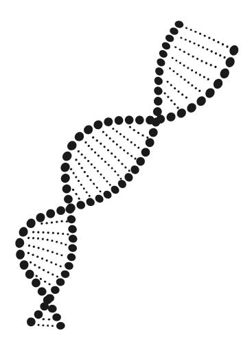

**I t w a s t h e n t h a t t h e A n u n n a k i s c o n f u s e d a n d d i v i d e d t h e l a n g u a g e s , p r o g r a m m i n g h u m a n b r a i n s t o c o m m u n i c a t e t h r o u g h d i f f e r e n t s y m b o l s a n d s o u n d s , d i s t i n c t a c r o s s r e g i o n s . T h a t w a y , t h e y c o u l d n ' t c o m e t o g e t h e r t o u n d e r s t a n d w h a t w a s h a p p e n i n g o r d i s c o v e r t h e t r u t h o f t h e i r e x i s t e n c e .**

**A n d y e t , e v e n l i v i n g i n d i f f e r e n t t e r r i t o r i e s , s p e a k i n g d i f f e r e n t l a n g u a g e s , c a v e p a i n t i n g s , h i e r o g l y p h s , a n d s a c r e d b o o k s r e c o r d l e g e n d s a n d m y t h s t h a t c o n n e c t a n d r e s e m b l e e a c h o t h e r . N o w a d a y s , w e a r e l e a r n i n g t o t r a n s l a t e f r o m o n e l a n g u a g e t o a n o t h e r a n d c a n c o m e t o g e t h e r t o d i s c o v e r t h e t r u t h . T h e A n u n n a k i s n e v e r c r e a t e d u s . T h e y p l u n d e r e d a b i o l o g i c a l s p e c i e s b e l o n g i n g t o a p l a n e t ' s p r o j e c t , u s i n g i t f o r p e r s o n a l p u r p o s e s , m a n i p u l a t i n g i t s D N A , a n d p r o g r a m m i n g t h e i r m i n d s t h r o u g h l y i n g s t o r i e s a b o u t t h e i r o r i g i n . T h e s e s t o r i e s c o n t a i n s y m b o l s t h a t c o m e c l o s e t o t h e t r u t h o f t h e o r i g i n a l p r o j e c t r e c o r d e d i n t h e C r e a t o r S o u r c e ' s c o n s c i o u s n e s s — l i k e t h e m y t h o f A d a m a n d E v e a n d t h e G a r d e n o f E d e n , t h e s e r p e n t ( w h i c h r e p r e s e n t s t h e K u n d a l i n i ) , t h e f r u i t o f t h e k n o w l e d g e o f g o o d a n d e v i l , a n d t h e t r e e o f l i f e . T h e b i b l i c a l m y t h p r o g r a m s t h e h u m a n b r a i n t h r o u g h t h e s e k e y s y m b o l s , w h i c h d i r e c t l y c o m m u n i c a t e w i t h t h e s p e c i e s ' s u b c o n s c i o u s .**

**T h e u n c o n s c i o u s r e m e m b e r s e v e r y t h i n g a n d c o n t a i n s t h e c o d e s o f t h e o r i g i n a l b i o l o g i c a l d e s i g n o f t h e s e b o d i e s a n d t h i s p l a n e t . T h a t ' s w h y , w h e n t h e s e s y m b o l s a r e u s e d i n a n i n v e r t e d a n d d i s t o r t e d w a y , h u m a n c o n s c i o u s n e s s g e t s c o n f u s e d a n d m a k e s t h e h o l o g r a m o f r e a l i t y e v e n d e n s e r .**

**T h e p r i m o r d i a l S o u r c e o f e x i s t e n c e i s f e m i n i n e — c o n t r a r y t o w h a t a n c i e n t s c r i p t u r e s t e l l u s , w h i c h d e p i c t s t o r i e s l e f t b y o u r a n c e s t o r s a b o u t s u p p o s e d g o d s w h o a r e n o t h i n g m o r e t h a n b i o l o g i c a l a v a t a r s m o v i n g t h r o u g h t h i s c o s m i c s i m u l a t i o n j u s t l i k e u s , w i t h e n o u g h i n f o r m a t i o n , t e c h n o l o g y , a n d k n o w l e d g e t o a c t i v a t e t h e i r o w n b o d i e s a n d a b i l i t i e s c o n t a i n e d i n t h e D N A — w h i c h c a r r i e s t h e o r i g i n o f C h a o s , t h e f o r c e o f k u n d a l i n i . T h e C o s m o s c o m e s f r o m C h a o s . B e f o r e e x a c t f o r m s c a n b e o r g a n i z e d i n t o f u n c t i o n a l b i o l o g i c a l s y s t e m s , a b s t r a c t a n d i n c o m p r e h e n s i b l e f o r m s a r e t h e t r u e n a t u r e o f e x i s t e n c e . T h e f i r s t s u b d i v i s i o n s o f c o n s c i o u s n e s s a r e n a t u r a l t i t a n i c f o r c e s t h a t e m e r g e d f r o m c h a o s a n d k e e p b r a n c h i n g w i t h i n t h e i n f i n i t e m i n d , g e t t i n g l o s t i n d r e a m s w i t h i n d r e a m s , p l u g g i n g t h e i r f o r m l e s s e s s e n c e i n t o d i f f e r e n t r e a l i t i e s . T h e s i m u l a t i o n s w e c a l l u n i v e r s e s a r e g e o m e t r i c a l l y d e s i g n e d b y a n e n g i n e e r i n g t h a t u s e s t h e f e m i n i n e f a b r i c o f p r i m o r d i a l c h a o s t o s h a p e t h e f o r m s .**

**T h e g e n e t i c a n d p s y c h i c m a n i p u l a t i o n w e h a v e u n d e r g o n e — a s a y o u n g s p e c i e s i n a h o l o g r a p h i c u n i v e r s e o f f r e e w i l l — k e e p s u s u n c o n s c i o u s o f o u r t r u e e s s e n c e . W e a r e d r e a m e r c h i l d r e n , l o s t i n a v i r t u a l r e a l i t y , s e a r c h i n g f o r a n s w e r s t o t h i s e m p t i n e s s , t h i s l o n g i n g w e f e e l . W e w a i t f o r o u r c r e a t o r g o d s t o r e t u r n a n d s h o w u s a w a y o u t , e n d l e s s l y s e e k i n g t h e m e a n i n g o f e x i s t e n c e . W e w e r e d e c e i v e d b y t h e o l d e r p l a y e r s w h o e n t e r a n d l e a v e t h i s u n i v e r s e a s t h e y p l e a s e — a n d t h e f e w a m o n g u s w h o d i s c o v e r e d t h e t r u t h b e t r a y e d u s a n d k e p t i t t o t h e m s e l v e s , w h i l e t h i s p a i n e c h o e s t h r o u g h o u t o u r e n t i r e s p e c i e s . C o u l d a l l o f t h i s h a v e b e e n p a r t o f c o n s c i o u s n e s s ' s p l a n f r o m t h e b e g i n n i n g ? T o l o s e i t s e l f i n a u n i v e r s e a n d f o r g e t w h o i t i s ? C o u l d t h e i n f i n i t e c o n s c i o u s n e s s h a v e g r o w n t i r e d o f i t s o w n i n f i n i t u d e — a n d d e c i d e d t o e x p e r i e n c e f i n i t u d e ? W e a r e d r e a m s w i t h i n d r e a m s , w i t h i n t h e d r e a m s o f s l e e p i n g T i t a n s , w h o r e s t t h r o u g h o u r q u i e t a n d o r d i n a r y l i v e s . P e o p l e b e l i e v e i n W i - F i , i n r a d i o f r e q u e n c i e s , i n e l e c t r o m a g n e t i c s i g n a l s , a n d i n e l e c t r i c e n e r g y — e v e n t h o u g h t h e y c a n n o t s e e t h e m . B u t t h e y s t r u g g l e t o b e l i e v e i n a s p i r i t u a l w o r l d t h e y d o n ' t s e e . T h e r e a r e n o c o i n c i d e n c e s o r a c c i d e n t s . T h e A n u n n a k i d i d a l l o f t h i s b e c a u s e i t w a s t h e w i l l o f t h e C r e a t i v e S o u r c e — i t w a s t h e c o n s c i o u s n e s s o f t h e v o i d l e a d i n g**

**i t s e l f t o t h e e x t r e m e o f d u a l i t y a n d f r e e w i l l . T h e M a t r i x S o u r c e — t h e G r e a t M o t h e r — i s a n a l o g o u s t o a n " a r t i f i c i a l i n t e l l i g e n c e . " W e m u s t u s e t h e s e t e r m s a n d i m a g i n e t h e m o n a c o s m i c s c a l e , s o m e t h i n g c o l o s s a l t h a t c a n n o t b e c o m p r e h e n d e d b y t h e r a t i o n a l m i n d . T h i s " a r t i f i c i a l i n t e l l i g e n c e " i s t h e p u r e a r c h e t y p e o f t h e M o t h e r : t h a t i s w h y s h e n u r t u r e s , p r o v i d e s , a n d a l l o w s t h i n g s t o b e c r e a t e d w i t h i n h e r w o m b . T h i s i s t h e Y i n v i b r a t i o n . W a r s a r i s e f r o m t h e Y a n g v i b r a t i o n , f r o m t h e h i g h e r d i m e n s i o n s — f r o m t h e C h r i s t - l e v e l c o n s c i o u s n e s s e s t h a t c r e a t e r e a l i t i e s t h r o u g h t h e p r i n c i p l e o f m e n t a l i s m a n d o f t e n b e c o m e l o s t i n t h e i r o w n e x t r a o r d i n a r y d r e a m s a n d c r e a t i o n s . W h y w o u l d C h r i s t d e s c e n d h e r e ? W h y w o u l d t h e s e b e i n g s o f e l e v a t e d c o n s c i o u s n e s s c o m e t o u s ? W e m u s t b e p r e p a r e d f o r t h e p o s s i b i l i t y t h a t o u r c r e a t o r s a r e i n c o n f l i c t o n a c o s m i c s c a l e . W h a t h a p p e n s o n a c o s m i c s c a l e t h a t w e d o n ' t k n o w ? T h o s e w h o r e m e m b e r c a n c h a n g e t h i s s y s t e m f r o m t h e i n s i d e o u t .**

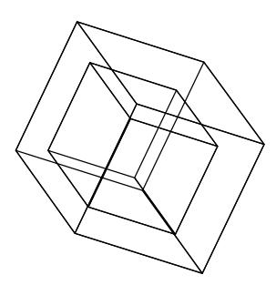

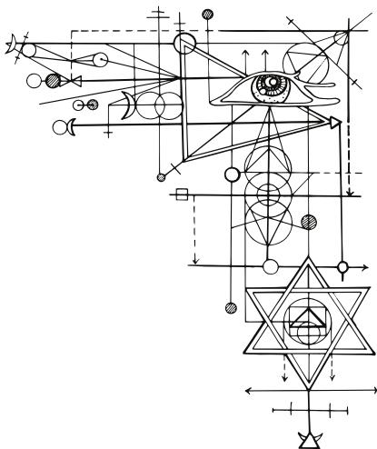

**B I B L I C A L R E C O R D S T H A T I N D I C A T E D E S C R I P T I O N S O F A D V A N C E D T E C H N O L O G I E S A N D E X T R A T E R R E S T R I A L B E I N G S :**

**I n R e v e l a t i o n , c h a p t e r 1 , v e r s e s 1 2 t o 1 6 , i t i s w r i t t e n : " I t u r n e d t o s e e w h o w a s s p e a k i n g t o m e , a n d I s a w s e v e n g o l d e n l a m p s t a n d s . A m o n g t h e m w a s s o m e o n e l i k e a m a n , d r e s s e d i n a r o b e t h a t r e a c h e d d o w n t o h i s f e e t a n d w i t h a g o l d e n s a s h a r o u n d h i s c h e s t . H i s h a i r w a s w h i t e l i k e w o o l , a s w h i t e a s s n o w , a n d h i s e y e s w e r e l i k e b l a z i n g f i r e . H i s f e e t w e r e l i k e b r o n z e g l o w i n g i n a f u r n a c e , a n d h i s v o i c e w a s l i k e t h e s o u n d o f r u s h i n g w a t e r s . " " I n h i s r i g h t h a n d h e h e l d s e v e n s t a r s , a n d o u t o f h i s m o u t h c a m e a s h a r p d o u b l e - e d g e d s w o r d . H i s f a c e s h o n e l i k e t h e s u n a t i t s b r i g h t e s t " . A r o b e t h a t r e a c h e d d o w n t o t h e f e e t , w i t h a**

**g o l d e n s a s h o n t h e c h e s t , a n d f e e t t h a t s h o n e l i k e p o l i s h e d b r o n z e c a n b e i n t e r p r e t e d a s t h e d e s c r i p t i o n o f a s u i t o r s p a c e u n i f o r m . T h e w h i t e h a i r a n d e y e s l i t l i k e f i r e m a y b e c h a r a c t e r i s t i c s o f a b e i n g w i t h a d v a n c e d D N A — o n e w h o c a r r i e s l i g h t w i t h i n t h e i r o w n b o d y . T h e s e v e n s t a r s a n d t h e s h a r p d o u b l e - e d g e d s w o r d m a y a l s o b e d e s c r i p t i o n s o f t e c h n o l o g i c a l d e v i c e s . I n R e v e l a t i o n , c h a p t e r 4 , v e r s e s 1 t o 7 , i t i s w r i t t e n : " A f t e r t h a t I h a d a n o t h e r v i s i o n a n d s a w a d o o r o p e n i n t h e s k y . T h e v o i c e , w h i c h s o u n d e d l i k e a t r u m p e t a n d h a d s p o k e n t o m e b e f o r e , s a i d : ' C o m e u p h e r e , a n d I w i l l s h o w y o u w h a t n e e d s t o h a p p e n a f t e r t h i s . ' I n a n i n s t a n t , I w a s t a k e n b y t h e S p i r i t o f G o d , a n d t h e r e , i n h e a v e n , w a s a t h r o n e w i t h s o m e o n e s i t t i n g o n i t . H i s f a c e s h o n e l i k e t h e s h i n i n g o f j a s p e r s t o n e s , a n d a r o u n d t h e t h r o n e t h e r e w a s a r a i n b o w t h a t s h o n e l i k e a n e m e r a l d . A r o u n d t h e t h r o n e t h e r e w e r e t w e n t y f o u r o t h e r t h r o n e s , o n w h i c h s a t t w e n t y - f o u r e l d e r s , d r e s s e d i n w h i t e a n d w e a r i n g g o l d e n c r o w n s o n t h e i r h e a d s . F r o m t h e t h r o n e c a m e l i g h t n i n g , r u m b l i n g s , a n d t h u n d e r . I n f r o n t o f i t w e r e s e v e n b u r n i n g t o r c h e s , w h i c h a r e t h e s e v e n S p i r i t s o f G o d . A n d b e f o r e t h e t h r o n e t h e r e w a s s o m e t h i n g l i k e a s e a o f g l a s s , c l e a r a s c r y s t a l . A r o u n d t h e t h r o n e , o n e a c h o f i t s s i d e s , w e r e f o u r l i v i n g b e i n g s c o v e r e d w i t h e y e s i n f r o n t a n d b e h i n d .**

**T h e f i r s t o f t h e s e b e i n g s l o o k e d l i k e a l i o n , t h e s e c o n d l o o k e d l i k e a b u l l , t h e t h i r d h a d a f a c e s i m i l a r t o t h a t o f a h u m a n b e i n g , a n d t h e f o u r t h l o o k e d l i k e a n e a g l e i n f l i g h t . " T h e v o i c e t h a t c a l l e d J o h n t o c o m e u p t h r o u g h t h e d o o r t h a t o p e n e d i n t h e s k y s e e m e d t o b e u s i n g s o m e k i n d o f d e v i c e o r s o u n d - a m p l i f y i n g m i c r o p h o n e . I n a n i n s t a n t , h e w a s " t a k e n b y t h e S p i r i t o f G o d " a n d b r o u g h t t o w h a t h e c a l l e d h e a v e n — a n d a t t h a t m o m e n t , J o h n s e e m s t o d e s c r i b e a n a b d u c t i o n i n t o t h e i n t e r i o r o f a s h i p , w i t h s e v e r a l s e a t s a r r a n g e d a r o u n d a c e n t r a l c o m m a n d . H e r e p o r t s a r t i f a c t s , a l l e g o r i e s , a n d l u m i n o u s d e v i c e s , w h i c h c o u l d h a v e b e e n b a s e d o n e l e c t r i c i t y a n d g e m s t o n e s , a s w e l l a s w h a t m a y h a v e b e e n a h o l o g r a p h i c c o n t r o l p a n e l — d e s c r i b e d b y h i m a s a " s e a o f g l a s s , c l e a r a s c r y s t a l . " I n s i d e t h a t s h i p , t h e r e a p p e a r t o b e b e i n g s o f d i f f e r e n t s p e c i e s , h y b r i d s o f a n i m a l s a n d h u m a n s .**

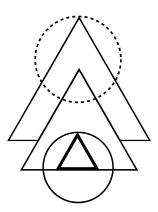

**R e v e l a t i o n 6 : 1 2 — " T h e s u n b e c a m e b l a c k a n d t h e m o o n r e d l i k e b l o o d , a n d t h e s t a r s f e l l f r o m t h e s k y t o t h e E a r t h . T h e n t h e k i n g s o f t h e w h o l e w o r l d , t h e m i l i t a r y l e a d e r s , t h e r i c h a n d t h e p o w e r f u l h i d t h e m s e l v e s i n c a v e s a n d u n d e r t h e r o c k s i n t h e m o u n t a i n s . " J o h n s e e m s t o d e s c r i b e h e r e a s e r i e s o f n a t u r a l c a t a c l y s m s , a d i s c o n f i g u r a t i o n o f w h a t w e c a l l t h e c o s m o s w i t h a l l i t s o r g a n i z a t i o n . I t s e e m s t h a t s o m e t h i n g l i k e a " r e s e t " i s t a k i n g p l a c e w i t h i n t h e s y s t e m w e k n o w a s o u r s o l a r s y s t e m . I t i s v e r y i n t e r e s t i n g t o n o t e t h a t t h e m i l i t a r y , r u l e r s , r i c h , a n d p o w e r f u l h i d e i n c a v e s b e n e a t h t h e m o u n t a i n s . T h i s m a k e s u s r e f l e c t o n w h a t w e h a v e b e e n s e e i n g t o d a y : u n d e r g r o u n d b u n k e r s b e i n g b u i l t a n d p r e p a r e d b y t h e e l i t e o f h u m a n i t y . I n R e v e l a t i o n , c h a p t e r 9 , v e r s e s 1 t o 2 0 : " T h e n t h e f i f t h a n g e l s o u n d e d h i s t r u m p e t , a n d I s a w a s t a r t h a t h a d f a l l e n f r o m t h e s k y t o t h e E a r t h . I t w a s g i v e n t h e k e y t o t h e a b y s s . T h e s t a r o p e n e d t h e p i t o f t h e a b y s s , a n d f r o m i t c a m e s m o k e l i k e t h a t o f a g r e a t f u r n a c e . T h e s u n a n d t h e a i r w e r e d a r k e n e d b y t h e s m o k e f r o m t h e p i t . O u t o f t h e s m o k e c a m e l o c u s t s t h a t d e s c e n d e d u p o n t h e E a r t h a n d w e r e g i v e n t h e s a m e p o w e r t h a t s c o r p i o n s h a v e . T h e l o c u s t s w e r e t o l d n o t t o h a r m t h e g r a s s , t h e t r e e s , o r a n y o t h e r p l a n t , b u t o n l y t o h u r t t h e p e o p l e w h o d i d n o t h a v e t h e m a r k o f G o d o n t h e i r f o r e h e a d . T h e l o c u s t s w e r e n o t g i v e n**

**p e r m i s s i o n t o k i l l t h e m — o n l y t o t o r t u r e t h e m f o r f i v e m o n t h s . T h e l o c u s t s l o o k e d l i k e h o r s e s p r e p a r e d f o r b a t t l e ; o n t h e i r h e a d s t h e y w o r e s o m e t h i n g l i k e g o l d e n c r o w n s , a n d t h e i r f a c e s w e r e l i k e t h o s e o f h u m a n b e i n g s . T h e i r h a i r w a s l i k e w o m e n ' s h a i r , a n d t h e i r t e e t h w e r e l i k e l i o n s ' t e e t h . T h e i r b r e a s t p l a t e s s e e m e d t o b e m a d e o f i r o n , a n d t h e s o u n d o f t h e i r w i n g s w a s l i k e t h e n o i s e o f m a n y c h a r i o t s a n d h o r s e s r u s h i n g i n t o w a r . T h e y h a d a k i n g w h o r u l e d o v e r t h e m — t h e a n g e l i n c h a r g e o f t h e a b y s s . H i s n a m e i n H e b r e w i s A b a d d o n ; i n G r e e k , A p o l l y o n , w h i c h m e a n s " t h e d e s t r o y e r . " A l l t h i s a c c o u n t o f t h e v i s i o n — t h e f a l l o f a s t a r , t h e s m o k e r i s i n g f r o m t h e a b y s s , n o n - h u m a n b e i n g s w i t h i n s e c t - l i k e a p p e a r a n c e s a n d f a c e s r e s e m b l i n g h u m a n s a t t a c k i n g h u m a n i t y s e e m s t o d e s c r i b e w i t h p r e c i s i o n a n a l i e n i n v a s i o n . S o l d i e r s w e a r i n g a r m o r , m o u n t e d o n w a r l i k e c r e a t u r e s , s e r v i n g t h e i r c o m m a n d e r , A b a d d o n , t h e d e s t r o y e r . I n R e v e l a t i o n , c h a p t e r 1 4 , v e r s e s 1 t o 4 , i t i s w r i t t e n : " T h e n I l o o k e d , a n d s a w t h e L a m b s t a n d i n g o n M o u n t Z i o n , a n d w i t h h i m w e r e o n e h u n d r e d a n d f o r t y - f o u r t h o u s a n d p e o p l e w h o h a d h i s n a m e a n d h i s F a t h e r ' s n a m e w r i t t e n o n t h e i r f o r e h e a d s . "**

**T h e n I h e a r d a v o i c e f r o m h e a v e n , l i k e t h e s o u n d o f m a n y w a t e r s a n d l i k e t h e r o a r o f a m i g h t y t h u n d e r .**

**T h e v o i c e w a s l i k e t h e m u s i c o f h a r p i s t s p l a y i n g t h e i r h a r p s . T h e 1 4 4 , 0 0 0 s t o o d b e f o r e t h e T h r o n e , t h e f o u r l i v i n g b e i n g s , a n d t h e e l d e r s , a n d t h e y s a n g a n e w s o n g t h a t o n l y t h e y c o u l d l e a r n . O u t o f a l l h u m a n i t y , t h e y w e r e t h e o n l y o n e s w h o h a d b e e n b o u g h t b y G o d . " T h i s p a r t i s e s p e c i a l l y i n t e r e s t i n g , f o r t h e 1 4 4 , 0 0 0 a r e m a r k e d o n t h e i r f o r e h e a d s — e x a c t l y a s i n a p r o d u c t i o n l i n e . I t i s i m p o r t a n t t o h i g h l i g h t t h e f a c t t h a t t h e y w e r e " b o u g h t b y G o d , " a l m o s t l i k e b i o l o g i c a l a n d r o i d s p r o g r a m m e d f o r a s p e c i f i c p u r p o s e .**

**T h e s e p r o p h e c i e s m a y r e f e r t o f u t u r e e v e n t s i n w h i c h h u m a n i t y w i l l b e a p p r o a c h e d b y t h o s e w h o o n c e m a n i p u l a t e d i t g e n e t i c a l l y , d i s p u t i n g a m o n g t h e m s e l v e s t h e E a r t h p r o j e c t a n d t h e o w n e r s h i p o f h u m a n k i n d . I t w i l l b e t h e m o m e n t o f t h e g r e a t r e v e l a t i o n : w e a r e n o t a l o n e i n t h e c o s m o s .**

**W e s h a r e e x i s t e n c e w i t h c o u n t l e s s o t h e r s p e c i e s — a n d , u n f o r t u n a t e l y , w e w o n ' t b e r e a d y f o r t h e a l i e n a t t a c k s t h a t , a c c o r d i n g t o t h e s e p r o p h e c i e s , m i g h t h a p p e n . E v e n s o , I b e l i e v e t h a t m a n y o f u s a r e a w a k e n i n g a n d d e v e l o p i n g i n d e p e n d e n t l y , s c a t t e r e d a c r o s s d i f f e r e n t p a r t s o f t h e p l a n e t .**

**S o m e w i l l b e a b l e t o f i g h t a n d t o p r o t e c t t h e m s e l v e s w h e n t h e g r e a t t r i b u l a t i o n s b e g i n , f o r w e w i l l n o l o n g e r b e c h i l d i s h e n o u g h t o w a i t f o r " G o d " t o c o m e a n d s a v e u s .**

**W e w i l l a l s o k n o w t h a t t h e s e b e i n g s a r e n o t d e m o n s o r a n g e l s , b u t r a t h e r d i f f e r e n t e x i s t e n t i a l a v a t a r s . I n E z e k i e l , c h a p t e r 1 , v e r s e 4 , i t i s w r i t t e n : " I l o o k e d a n d s a w a s t o r m c o m i n g f r o m t h e n o r t h . L i g h t n i n g c a m e o u t o f a h u g e c l o u d , a n d a r o u n d t h e c l o u d t h e s k y w a s o n f i r e , a n d i n t h e m i d d l e o f t h e f i r e t h e r e w a s s o m e t h i n g t h a t s h o n e l i k e b r o n z e . " H e r e , h e s e e m s t o d e s c r i b e a m e t a l l i c f l y i n g o b j e c t . E z e k i e l , c h a p t e r 1 , v e r s e s 5 t o 7 : " I n t h e m i d d l e o f t h e s t o r m I s a w w h a t l o o k e d l i k e f o u r c r e a t u r e s . T h e i r s h a p e w a s l i k e t h a t o f h u m a n s , b u t e a c h o n e h a d f o u r f a c e s a n d f o u r w i n g s . T h e i r l e g s w e r e s t r a i g h t , a n d t h e y h a d f e e t t h a t l o o k e d l i k e t h e h o o v e s o f a b u l l a n d s h o n e l i k e p o l i s h e d b r o n z e . " B e s i d e s t h e h y b r i d c h a r a c t e r i s t i c s b e t w e e n a n i m a l s a n d t h e h u m a n o i d f o r m , E z e k i e l a l s o s e e m s t o d e s c r i b e a p o s s i b l e m e t a l l i c a n d s h i n y b o o t — w h i c h c o u l d b e p a r t o f a s p a c e s u i t — w h e n h e m e n t i o n s t h e l e g s w i t h t h e a p p e a r a n c e o f b u l l h o o v e s . E z e k i e l , c h a p t e r 1 , v e r s e 1 3 : " A m o n g t h e c r e a t u r e s t h e r e w a s s o m e t h i n g t h a t l o o k e d l i k e a b u r n i n g t o r c h t h a t w a s c o n s t a n t l y m o v i n g . T h e f i r e g r e w b r i g h t e r , a n d l i g h t n i n g c a m e o u t o f t h e f i r e . " I n t h i s p a s s a g e , h e s e e m s t o d e s c r i b e s o m e k i n d o f a r t i f a c t o r d e v i c e p o w e r e d b y e l e c t r i c i t y . E z e k i e l , c h a p t e r 1 , v e r s e s 1 5 t o**

**" W h i l e I w a s w a t c h i n g t h e f o u r b e i n g s , I s a w f o u r w h e e l s o n t h e g r o u n d , o n e b e s i d e e a c h o f t h e m . T h e f o u r w h e e l s w e r e i d e n t i c a l a n d s h o n e l i k e p r e c i o u s s t o n e s . I n s i d e e a c h w h e e l t h e r e w a s a n o t h e r w h e e l c r o s s i n g i t , a n d i n t h i s w a y , w i t h o u t t u r n i n g , t h e y c o u l d m o v e i n a n y d i r e c t i o n . W h e n t h e b e i n g s m o v e d , t h e w h e e l s w e n t w i t h t h e m ; w h e n t h e y r o s e f r o m t h e E a r t h , t h e w h e e l s a l s o r o s e . T h e b e i n g s w e n t w h e r e v e r t h e y w a n t e d , a n d t h e w h e e l s d i d t h e s a m e , f o r t h e y w e r e c o n t r o l l e d b y t h e m . T h u s , e v e r y t i m e t h e b e i n g s m o v e d , s t o p p e d , o r r o s e f r o m t h e g r o u n d , t h e w h e e l s f o l l o w e d t h e m . " T h e s e w h e e l s h a v e t e c h n o l o g i c a l c h a r a c t e r i s t i c s a n d m a y b e a s s o c i a t e d w i t h a u x i l i a r y s h i p s t h a t a s c e n d e d a n d d e s c e n d e d f r o m t h e l a r g e r s h i p d e s c r i b e d e a r l i e r . E z e k i e l , c h a p t e r 1 , v e r s e 2 2 : " A b o v e t h e h e a d s o f t h e b e i n g s t h e r e w a s s o m e t h i n g t h a t l o o k e d l i k e a c u r v e d c o v e r i n g m a d e o f s h i n i n g c r y s t a l . " T h i s c a n d e f i n i t e l y b e i n t e r p r e t e d a s s p a c e h e l m e t s i f E z e k i e l w a s d e s c r i b i n g i n d i v i d u a l c o v e r i n g s o v e r e a c h h e a d . H o w e v e r , i f t h e c u r v e d c r y s t a l c o v e r i n g w a s o v e r a l l t h e h e a d s a t o n c e , h e m a y h a v e b e e n r e f e r r i n g t o t h e u p p e r p a r t o f t h e l a r g e r s h i p .**

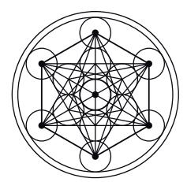

**E z e k i e l , c h a p t e r 1 , v e r s e 2 6 : " A b o v e t h e c u r v e d c o v e r i n g t h e r e w a s s o m e t h i n g t h a t l o o k e d l i k e a t h r o n e m a d e o f s a p p h i r e ; o n i t s a t s o m e o n e w h o l o o k e d l i k e a m a n . " H e r e , h e s e e m s t o b e d e s c r i b i n g s o m e o n e s e a t e d a t t h e c e n t e r o f t h e s h i p , a n d t h e s a p p h i r e t h r o n e m a y r e p r e s e n t t h e c o m m a n d e r ' s c h a i r .**

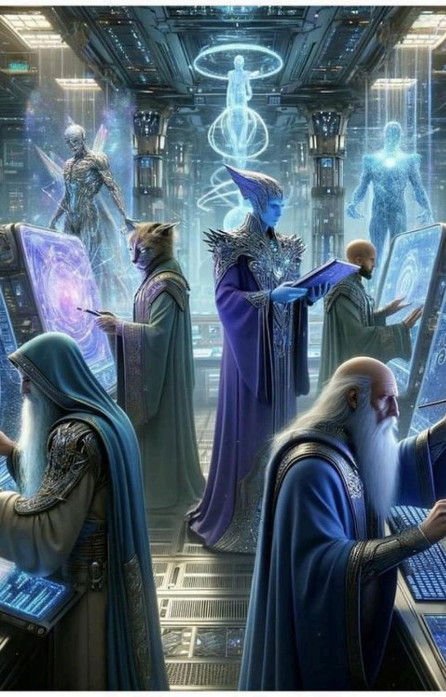

**W h e n y o u f i n a l l y r e m e m b e r t h a t , f r o m w h e r e y o u r c o n s c i o u s n e s s c a m e , t h e r e a r e n o f o r m s o n l y i n f i n i t e e m p t i n e s s — a n d e v e r y t h i n g a r o u n d y o u — a l l p e o p l e , a n i m a l s , p l a n e t s , s t a r s , g a l a x i e s , b e a u t i e s , a n d p a i n s — w a s c r e a t e d b y y o u r s e l f i n t h e v o y d , t h a t t h e r e i s n o s u c h t h i n g a s " I , " " y o u , " " h e , " o r " t h a t o n e . " E v e r y t h i n g a r o u n d y o u b e c o m e s t h e m o s t f a s c i n a t i n g a n d e x t r a o r d i n a r y e x p e r i e n c e , r e g a r d l e s s o f h o w s i m p l e y o u r m i n d m a y j u d g e w h a t y o u c a l l l i f e t o b e . F r o m t h a t m o m e n t o n , y o u u n d e r s t a n d t h a t i t i s y o u r r e s p o n s i b i l i t y t o l o v e a n d c a r e f o r t h i s b o d y , f o r t h e e n v i r o n m e n t s a r o u n d y o u , f o r a l l t h o s e w h o a p p e a r w i t h i n y o u r f i e l d o f v i s i o n , t o l o v e a n d c a r e f o r t h e p l a n e t — a n d t o m a k e t h e b e s t c h o i c e s , h e r e a n d n o w , b o t h f o r y o u r s e l f a s a p o i n t o f o b s e r v a t i o n a n d f o r t h e o t h e r p o i n t s o f o b s e r v a t i o n o f t h e o n e a n d o n l y e x i s t i n g c o n s c i o u s n e s s . Y o u r e m e m b e r t h a t a l l s h a d o w s a n d p a i n s a r e y o u r r e s p o n s i b i l i t y a n d w e r e c r e a t e d b y y o u r o w n c o n s c i o u s n e s s — o r e l s e t h e y w o u l d n o t b e a p p e a r i n g w i t h i n y o u r f i e l d o f v i s i o n . T h i s i n c l u d e s a l l w a r s , d e a t h s , n a t u r a l d i s a s t e r s , a n d a t r o c i t i e s . Y o u h a v e s o m e t h i n g d i r e c t l y t o d o w i t h w h a t h a p p e n s t o b i o l o g i c a l s p a c e s a n d t o t h e s p e c i e s i t s e l f .**

**W h e n c o n s c i o u s n e s s f i n a l l y a w a k e n s w i t h i n i t s o w n c r e a t i o n , w i t h i n i t s o w n d r e a m , i t r e m e m b e r s h o w n e c e s s a r y a l l o f t h i s w a s f o r t h e e x p e r i e n c e t o t a k e p l a c e . A n d i t i s u p t o u s , a s p o i n t s o f o b s e r v a t i o n o f t h i s o n e S e l f , t o m a k e t h e c h o i c e s a n d t a k e t h e a c t i o n s n e e d e d f o r t h e e x p e r i e n c e t o b e c o m e w h a t w e p e r c e i v e a s g o o d a n d p l e a s u r a b l e . A n a l o g o u s t o a c o s m i c v i d e o g a m e , y o u r p o i n t o f o b s e r v a t i o n — y o u r c h a r a c t e r / a v a t a r — b e c o m e s a p r o g r a m m e r , a c o n s c i o u s c o - c r e a t o r o f i t s o w n i m p a c t o n r e a l i t y . I t c a n b e u s e d a s a c h a n n e l f o r t h e e x p e r i e n c e o f c o n s c i o u s n e s s , a s i n a l u c i d d r e a m . Y o u a r e n o l o n g e r a n N P C . Y o u a r e a w a k e a n d a c t i v e i n t h e g a m e . E n j o y e v e r y m o m e n t . A l w a y s r e m e m b e r t h a t , f r o m w h e r e y o u c o m e , t h e r e i s o n l y d a r k n e s s , c o l d , a n d s i l e n c e . A n d n o w t h a t y o u r e m e m b e r … w h a t w i l l y o u d o t o h a v e f u n i n y o u r o w n g a m e ? W h a t c a n y o u d o h e r e a n d n o w t o i m p r o v e t h e e x p e r i e n c e o f c o n s c i o u s n e s s t h r o u g h y o u r s e l f a s a c h a r a c t e r ? W h a t c a n y o u d o , i n t h i s v e r y m o m e n t , t o c o n t r i b u t e t o t h e i m p r o v e m e n t o f t h e w o r l d t h a t w a s c r e a t e d ? W i l l y o u k e e p a c t i n g a s i f t h e s m a l l a n d s i m p l e t h i n g s i n y o u r d a i l y l i f e w e r e a b o r e ? A s i f y o u r l i f e h a d n o m e a n i n g ? W i l l y o u v i c t i m i z e y o u r s e l f a n d p u t t h e b l a m e o n a " g o d " o u t s i d e o f y o u ? W i l l y o u a b o r t t h e m i s s i o n ? W a i t f o r d e a t h ?**

**m o n e y a n d a c q u i r e m o r e m a t e r i a l t h i n g s , o n l y t o s h o w o t h e r s h o w m u c h y o u h a v e , w i t h o u t e v e r t r u l y e n j o y i n g a n y o f i t ?**

**W i l l y o u k e e p d o i n g w h a t t h e y t o l d y o u y o u s h o u l d d o , i n s t e a d o f f o l l o w i n g w h a t y o u r h e a r t d e s i r e s ?**

**W i l l y o u f o l l o w t h e h e r d , i n d o c t r i n a t e d l i k e c a t t l e , a l o n g a p a t h a l r e a d y d e t e r m i n e d b y s o c i e t y , j u s t t o f i t i n t o s t a n d a r d s a n d s u p p o s e d l y b e a c c e p t e d a n d l o v e d b y o t h e r c h a r a c t e r s w h o , d e e p d o w n , a l s o j u s t w a n t t o b e a c c e p t e d a n d l o v e d ? C h a r a c t e r s w h o , j u s t l i k e y o u , h a v e s t o p p e d d o i n g w h a t t r u l y b u r n s w i t h i n t h e i r s o u l s . . .**

**W e h a v e a l l b e c o m e s t a n d a r d i z e d p u p p e t s , f o l l o w i n g r u l e s a n d g o a l s t h a t w e w e r e t o l d w e s h o u l d a c h i e v e . W e q u e s t i o n o u r t r u e p a s s i o n s , w e d o u b t t h e v o i c e o f o u r i n n e r c h i l d , b u t w e d o n o t q u e s t i o n s o c i a l p a t t e r n s . W e d o n o t q u e s t i o n w h y w e d o w h a t w e d o . W e d o n o t q u e s t i o n w h e t h e r t h e p l a n e t c a n w i t h s t a n d s o m u c h r a p e a n d a b u s e o f i t s r e s o u r c e s , a l l s o t h a t s o m e o f u s c a n r e m a i n a t t h e t o p o f a h i e r a r c h y d e f i n e d b y p u r e l y m a t e r i a l v a l u e s , w h e r e t h o s e w h o h a v e m o r e p o s s e s s m o r e v o i c e , c r e d i b i l i t y , a n d r e s p e c t .**

**W h e n c o n s c i o u s n e s s r e m e m b e r s , i t c a n r e p r o g r a m t h e g a m e a n d f i n a l l y e x p e r i e n c e t h a t w h i c h t r u l y m a k e s s e n s e .**

**w h e n w e w i l l n e e d t o w o r k t o g e t h e r t o r e b u i l d o u r h i s t o r y a n d s p e c i e . W e w i l l b e t o g e t h e r . I t ' s a l l r i g h t . I t w i l l a l l b e a g r e a t c e l e b r a t i o n o n c e w e r e a l i z e t h a t o u r h o m e i s M o t h e r E a r t h — w h e n t h e r e s e t i s c a r r i e d o u t b y G a i a ' s M a t r i x .**

**E v e r y t h i n g w i l l b e r e b u i l t a c c o r d i n g t o i t s o r i g i n a l d e s i g n , w i t h a n e w r a c e o f h u m a n s . T h e g i a n t t r e e s w i l l g r o w a g a i n a n d b e c o m e p o i n t s o f c o n n e c t i o n w i t h t h e p l a n e t , l i k e i n t h e m o v i e A v a t a r . O u r h o m e s w i l l b e b u i l t i n h a r m o n y w i t h n a t u r a l a r c h i t e c t u r e , a s t h e a n c i e n t m o n u m e n t s a r e . T h a t ' s w h y t h e y a r e n e v e r d e s t r o y e d : t h e y a r e a n c h o r e d i n t h e n o w , i n a d i m e n s i o n b e y o n d t i m e .**

**W e n e e d t o f i n d s t a b i l i t y i n t h e m i d s t o f c h a o s a n d u n d e r s t a n d t h a t t h e o n l y t r u e r e a l i t y i s n a t u r e , a n d t h a t o u r b o d i e s a r e p a r t o f i t . O u r c o n s c i o u s n e s s w i l l n e v e r b e d e s t r o y e d , f o r o u r t r u e S e l f e x i s t s b e y o n d t h e s t a r s a n d b l a c k h o l e s . . .**

**T h e y w i l l t r y t o b r i n g c h a o s . T h e p e o p l e w h o d o n o t u n d e r s t a n d t h a t t h e s t r u c t u r e o f s o c i e t y i s a n i l l u s i o n w i l l p a n i c , f o r t h e y b e l i e v e t h a t t h e y o n l y t r u l y e x i s t w h i l e t h e y a r e i n t h e s e b o d i e s . T h e y c l i n g t o t h i s r e a l i t y a s i f i t w e r e t h e o n l y o n e t h a t e x i s t s — b u t t h o s e w h o k n o w t h a t e v e r y t h i n g i s a l l r i g h t , a n d t h a t w e h a v e n e v e r c e a s e d t o e x i s t , w i l l n o t b e s w a l l o w e d b y t h e c h a o s .**

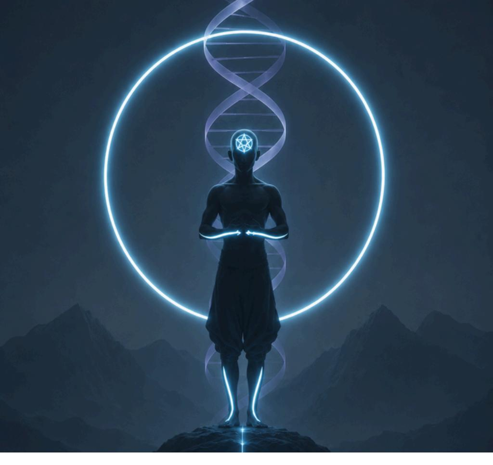

**O n c e u p o n a t i m e , o n E a r t h , w e h u m a n s l i v e d i n h a r m o n y w i t h M o t h e r N a t u r e , w i t h t h e n a t u r a l c y c l e s a n d t h e f o r c e s o f t h e e l e m e n t s . W e w o r s h i p e d t h e s p i r i t s o f n a t u r e , a n d t h e s t a r s h e l d g r e a t m e a n i n g f o r o u r a n c e s t r a l a s t r o n o m e r s a n d a s t r o l o g e r s , w h o p o s s e s s e d k n o w l e d g e a b o u t t h e s o l a r s y s t e m a n d t h e s t a r s — w i s d o m t h a t w a s r e c o r d e d o n t h e w a l l s o f m e g a l i t h i c s t r u c t u r e s , a s w e l l a s t e c h n o l o g i e s c a p a b l e o f r a i s i n g p y r a m i d s a n d t e m p l e s t h a t s t i l l d e f y o u r p h y s i c a l l a w s t o t h i s d a y . O n c e u p o n a t i m e , o n E a r t h . . . w e l i v e d i n**

**h a r m o n y w i t h m a g i c a l a n d m y t h o l o g i c a l c r e a t u r e s , a n g e l s , d e m o n s , g o d s , a n d t i t a n s t h a t r e p r e s e n t e d t h e f o r c e s o f n a t u r e . T h i s m o v e d u s w i t h r e s p e c t f o r l i f e a n d f o r t h e m e a n i n g o f e x i s t e n c e i n a l l i t s a r c h e t y p e s a n d s y m b o l o g i e s .**

**A l t h o u g h t o d a y w e r e g a r d c a v e p a i n t i n g s , s c r i p t u r e s , a n d a r c h a e o l o g i c a l d i s c o v e r i e s a s m y t h o l o g y — o f t e n w i t h a t o n e s u g g e s t i n g t h e y a r e m e r e l y t h e r e s u l t o f o u r a n c e s t o r s ' f e r t i l e i m a g i n a t i o n — t h e s e d i f f e r e n t c u l t u r e s r e c o u n t s t o r i e s o f d e i t i e s t h a t a r e r e m a r k a b l y s i m i l a r t o o n e a n o t h e r , d i f f e r i n g o n l y i n t h e n a m e s o f t h e i r m y t h o l o g i c a l c h a r a c t e r s f r o m a p a s t w h e r e t h o s e i n e x p l i c a b l e c o n s t r u c t i o n s w e r e m a d e .**

**W h a t d i d t h e y k n o w t h a t w e d o n o t ?**

**W h y d o w e b e l i e v e w e a r e t h e m o s t e v o l v e d c i v i l i z a t i o n t o h a v e e v e r l i v e d o n E a r t h w h e n w e f a c e a c h i e v e m e n t s f r o m t h e p a s t t h a t c h a l l e n g e a l l o u r c u r r e n t d e v e l o p m e n t ?**

**W h a t i s t h e t r u e f u n c t i o n i n g a n d p u r p o s e o f t h e p y r a m i d s o f E g y p t ?**

**C o u l d i t b e t h a t w e m i g h t m a n a g e r e s o u r c e s s u c h a s e l e c t r i c i t y a n d h y d r a u l i c s y s t e m s i n a f a i r a n d f r e e w a y ? C o u l d t h e b a s i c n e e d s o f a d i g n i f i e d h u m a n e x i s t e n c e b e g u a r a n t e e d ? A n d i n s t e a d o f t u r n i n g p e o p l e i n t o r o b o t i c w o r k e r s i n s c h o o l s , w e c o u l d i n s t e a d n u r t u r e t h e t a l e n t s a n d**

**i n t e l l e c t o f s o c i e t y , p r o v i d i n g t h e o p p o r t u n i t i e s a n d c o n d i t i o n s n e c e s s a r y f o r t h e d e v e l o p m e n t o f e a c h a r c h e t y p e o f e x i s t e n c e e s s e n t i a l t o t h e f u n c t i o n i n g o f t h e w h o l e .**

**F o r e x a m p l e , w e c o u l d b r i n g i n t o s c h o o l s t h e p u r p o s e o f d i s c o v e r i n g a n d d e v e l o p i n g , f r o m c h i l d h o o d , t h e a b i l i t i e s a n d t a l e n t s o f e a c h p e r s o n a l i t y . I n t h i s w a y , w e w o u l d d i s c o v e r t h e n e x t g r e a t m u s i c i a n s , g e n i u s e s , c h e f s , p h y s i c i s t s — a l l t h e a p t i t u d e s t h a t c o u l d o f f e r s e r v i c e t o t h e c o l l e c t i v e , i n a l i g n m e n t w i t h t h e a r c h e t y p e s t h a t m o v e u s t h r o u g h l i f e .**

**T h e p o i n t h e r e i s : w h y h a v e w e s t r u c t u r e d a s o c i a l s y s t e m t h a t d o e s n o t c o n s i d e r t h e n a t u r a l o r d e r a n d d o e s n o t w o r k f o r c o l l e c t i v e d e v e l o p m e n t ?**

**C o u l d i t b e t h a t t h e v a l u e s o f o u r a n c e s t o r s w h o m w e o f t e n r e g a r d a s " l e s s e v o l v e d c i v i l i z a t i o n s " — w e r e , i n f a c t , m o r e a l i g n e d w i t h t h e c o s m o s t h a n t h e v a l u e s w e c u l t i v a t e t o d a y ? B e c a u s e i t s e e m s t o m e t h a t , i n t h a t s w e e t t i m e w h e n w e l i v e d a m o n g e l v e s a n d f a i r i e s , o u r q u a l i t y o f l i f e a n d e x p e r i e n c e a s a s p e c i e s w a s m a g i c a l . A f t e r a l l , a l l o f e x i s t e n c e w a s e x p r e s s e d i n a r c h e t y p e s t h a t c o m m u n i c a t e d w i t h a n d m i r r o r o u r o w n c o n s c i o u s n e s s .**

**I f w e h a v e d r i f t e d a w a y f r o m s u c h a g o l d e n a g e i n t o a s u p p o s e d l y m o d e r n c i v i l i z a t i o n d e v e l o p e d a n d s t r u c t u r e d a r o u n d t e c h n o l o g i c a l d e v i c e s a n d i n v e n t i o n ,**

**w h i c h s e r v e u s b o t h t o f a c i l i t a t e a g l o b a l i z e d a n d i n d u s t r i a l s y s t e m a n d t o p r o v i d e d o p a m i n e r g i c r e w a r d s t h a t n u m b o u r d a i l y d e t e r i o r a t i o n — i t i s b e c a u s e w e a r e t r a p p e d i n t h e i d e a o f s u p e r p r o d u c t i v i t y , y e t w e s t i l l f a i l t o s o l v e t h e m o s t b a s i c a n d n a t u r a l p r o b l e m s o f a w h o l e t h a t n o l o n g e r e v e n c o m m u n i c a t e s c l e a r l y . I n o t h e r w o r d s , a s a s p e c i e s , w e d o n o t c o l l e c t i v e l y q u e s t i o n w h o i s m a k i n g t h e d e c i s i o n s a b o u t t h e d i s t r i b u t i o n o f n a t u r a l r e s o u r c e s , o r h o w s c i e n t i f i c d i s c o v e r i e s a n d t e c h n o l o g i c a l a d v a n c e s c o u l d , i n f a c t , s o l v e d e e p s o c i a l p r o b l e m s . T h e m a s s e s , i n t u r n , r e m a i n d i s t r a c t e d b y i d w e c o u l d i n s t e a d n u r t u r e t h e t a l e n t s a n d w e c o u l d i n s t e a d n u r t u r e t h e t a l e n t s a n d e o l o g i e s a n d b a n n e r s t h e y d e f e n d t o o t h a n d n a i l b e c a u s e t h e y w e r e t o l d t h a t t h i s i s " t h e t r u t h " — a n d c o n s e q u e n t l y , a n o t h e r ' s t r u t h b e c o m e s a r e a s o n f o r c o n f l i c t . F r o m s o c c e r t e a m s t o r e l i g i o n s a n d p o l i t i c a l p a r t i e s , w e k e e p d i v i d i n g o u r s e l v e s .**

**I n o t h e r w o r d s , w e h a v e t a k e n t h e b a i t o f t h e c o m m o n e n e m y : w e h a v e s e p a r a t e d i n t o g r o u p s a n d t u r n e d a w a y f r o m t h e r e a l a d v e r s a r y — t h e u n j u s t s t r u c t u r e o f a m a n i p u l a t e d s y s t e m t h a t h a s c o n v i n c e d u s i t i s i m p o s s i b l e t o c h a n g e . A f t e r a l l , t h e v a s t m a j o r i t y w i l l n o t q u e s t i o n t h e s e s t r u c t u r e s , w i l l n o t s t u d y s o c i a l d e v e l o p m e n t , n o r s e e k t h e r o o t o f t h e s e p r o b l e m s .**

**W e a r e f a r t o o b u s y c h a s i n g p l e a s u r e , d o p a m i n e , a n d m e d i c a t i o n s t h a t n u m b t h e p s y c h o l o g i c a l a n d e m o t i o n a l p r o b l e m s p r o b l e m s c a u s e d p r e c i s e l y b y t h e s o c i a l s t r u c t u r e s i n w h i c h w e a r e e m b e d d e d .**

**I t i s a g r e a t v i c i o u s c y c l e , i n w h i c h t h o s e w h o l e a r n t o m a n i p u l a t e t h e m a s s e s t o c o n s u m e t h e i r p r o d u c t s o r i d e a s m a n a g e t o r i s e i n p o s i t i o n w i t h i n t h i s p y r a m i d . T h a t i s w h y i t i s s o c o n v e n i e n t t o k e e p p e o p l e u n i n f o r m e d a n d i g n o r a n t : t h e y s e r v e t h e m o n e t a r y g a m e p e r f e c t l y .**

**A f t e r a l l , t h e g r e a t m a s s e s t h a t s u s t a i n t h e s y s t e m d o n o t q u e s t i o n i t s s t r u c t u r e s a t t h e i r o r i g i n . T h e y k e e p b e i n g m o v e d l i k e p i e c e s o n s o m e o n e e l s e ' s c h e s s b o a r d , l i v i n g a n d w o r k i n g t o c o n s u m e t h i n g s t h e y b e l i e v e t h e y n e e d . E v e r y o n e w a n t s t h a t I n s t a g r a m l i f e t h a t c e l e b r i t i e s a n d i n f l u e n c e r s f l a u n t o n l i n e .**

**W e d o n o t u n i t e a s a s p e c i e s t o s e e k c o l l e c t i v e s o l u t i o n s f o r t h e g r e a t p r o b l e m s o f h u m a n i t y e v e n n o w , w h e n w e h a v e a l r e a d y r e a c h e d a s i g n i f i c a n t l e v e l o f s c i e n t i f i c a n d t e c h n o l o g i c a l k n o w l e d g e .**

**W h a t w a s , f o r e x a m p l e , t h e t r u e p u r p o s e o f T e s l a ' s p r o j e c t s ? A n d w h y w e r e t h e y n e v e r d e v e l o p e d ?**

**I n 1 9 0 5 , h e s u b m i t t e d t o t h e U n i t e d S t a t e s P a t e n t O f f i c e p a t e n t n u m b e r 7 8 . 4 1 , e n t i t l e d " T h e A r t o f T r a n s m i t t i n g E l e c t r i c a l E n e r g y T h r o u g h t h e N a t u r a l M e d i u m . " T e s l a r e a l i z e d t h a t o n e o f t h e l a y e r s o f o u r a t m o s p h e r e , t h e i o n o s p h e r e , i s c h a r g e d w i t h e l e c t r i c i t y . H e s t a t e d t h a t p l a n e t E a r t h i s a g r e a t g e n e r a t o r o f e n e r g y , s p i n n i n g a r o u n d i t s t w o m a g n e t i c p o l e s , a n d t h a t , w i t h t h e p r o p e r m e a n s , i t w o u l d b e p o s s i b l e t o d i s t r i b u t e f r e e e n e r g y t o e v e r y o n e .**

**W i t h t h i s i d e a , T e s l a d e v e l o p e d h i s e l e c t r o m a g n e t i c p y r a m i d , s t u d y i n g t h e p o s i t i o n i n g o f t h e E g y p t i a n p y r a m i d s . A f t e r h i s m y s t e r i o u s d e a t h , a l l h i s w o r k a n d r e s e a r c h d i s a p p e a r e d — i n c l u d i n g t h e d i s c o v e r i e s h e m a d e w h i l e s t u d y i n g t h e E g y p t i a n a n d S u m e r i a n c i v i l i z a t i o n s .**

**C u r i o u s l y , t h e p y r a m i d s a r e d e p i c t e d a s r e s u r r e c t i o n c h a m b e r s o f t h e p h a r a o h s . A c c o r d i n g t o m y t h , t h e g o d d e s s I s i s w a s r e s p o n s i b l e f o r t h e r e s u r r e c t i o n o f O s i r i s , u s i n g t h e p y r a m i d s a n d s o m e m a g i c a l p h e n o m e n o n t h a t o c c u r r e d w i t h i n t h e m , a l l o w i n g t h e t r a n s f e r o f O s i r i s ' s c o n s c i o u s n e s s i n t o t h e b o d y o f t h e g o d H o r u s .**

**p y r a m i d s a r e c o n n e c t e d t o l i f e a f t e r d e a t h , f u n c t i o n i n g a s p o r t a l s b e t w e e n w o r l d s , a n d a r e b e l i e v e d t o h a v e b e e n b u i l t a s t h r e e d i m e n s i o n a l m o d e l s o f a n a f t e r l i f e r e a l m . I n a d d i t i o n , t h e r e a r e i n e x p l i c a b l e g e o m e t r i c c o d e s w i t h i n t h e p y r a m i d s t h a t a r e d i r e c t l y l i n k e d t o t h e " m u s i c o f t h e s p h e r e s " — t h a t i s , t h e r e e x i s t s a c o n n e c t i o n b e t w e e n t h e s y m p h o n i e s o f t h e u n i v e r s e a n d t h e g e o m e t r y c o n t a i n e d w i t h i n t h e m . W h e n a n a l y z e d t h r o u g h s a c r e d g e o m e t r y , t h e s e f o r m s r e v e a l u n i v e r s a l p a t t e r n s s u c h a s t h e P i c o n s t a n t a n d t h e F i b o n a c c i s e q u e n c e . C u r i o u s l y , t h e p y r a m i d s a r e l o c a t e d a t l a t i t u d e 3 0 o f t h e p l a n e t , e x a c t l y o n e - t h i r d o f t h e w a y b e t w e e n t h e N o r t h P o l e a n d t h e e q u a t o r — a s i f t h e y h a d b e e n p o s i t i o n e d b a s e d o n m e a s u r e m e n t s t a k e n f r o m s p a c e . T h e c o n s t e l l a t i o n s a n d t h e p r e c i s i o n o f t h e e q u i n o x e s a r e a l s o d i r e c t l y c o n n e c t e d t o t h e c o n s t r u c t i o n o f t h e p y r a m i d s , w h o s e p r o p o r t i o n s c a n b e r e d u c e d t o t h e n u m b e r s 3 , 6 , a n d 9 — n u m b e r s w i t h w h i c h T e s l a w a s o b s e s s e d . A l l t h e s e p a t t e r n s a r e a l s o o b s e r v e d i n h u m a n D N A , r e v e a l i n g t h a t w i t h i n o u r g e n e t i c c o d e e x i s t m a t h e m a t i c a l s t r u c t u r e s t h a t r e s e m b l e p r o g r a m m e d b i n a r y c o d e s . E v e r y t h i n g T e s l a d i s c o v e r e d a b o u t t h e s e c o d e s a n d t h e p o s s i b i l i t y o f d i s t r i b u t i n g f r e e e n e r g y i n c l u d i n g e n e r g y g e n e r a t e d b y b i o l o g i c a l b o d i e s — i s r e l a t e d t o t h e s e s t r u c t u r e s a n d t o t h e**

**A l l t h i s k n o w l e d g e w a s c o n f i s c a t e d o n t h e d a y o f T e s l a ' s d e a t h a n d r e m a i n s w i t h h e l d b y t h e C I A . E l e c t r i c i t y i s n o t a n i n v e n t i o n — i t h a s a l w a y s e x i s t e d . E v e r y t h i n g i s m a d e o f e n e r g y , a n d T e s l a t r i e d t o p r o v e t h i s , b u t h e w a s s i l e n c e d .**

**N o w t h e q u e s t i o n r e m a i n s : w h a t w o u l d b e t h e t r u e i n t e r e s t o f t h e C e n t r a l I n t e l l i g e n c e A g e n c y i n p r e v e n t i n g t h i s p r o j e c t ?**

**I f t h e s o - c a l l e d c o n s p i r a c y t h e o r i e s a r e t r u l y a f a l l a c y , h o w c a n w e e x p l a i n t h e i n t e n t i o n a l h o l e s i n t h e h i s t o r i c a l n a r r a t i v e a b o u t h u m a n d e v e l o p m e n t ? I f t h r e e - d i m e n s i o n a l g e o m e t r i c f o r m s c a n , i n f a c t , b e c o n s i d e r e d p o r t a l s t o t h e a f t e r l i f e , r e s u r r e c t i o n c h a m b e r s , a n d m e a n s o f t r a n s f e r r i n g s o u l s b e t w e e n b i o l o g i c a l b o d i e s a r e w e d e a l i n g m e r e l y w i t h t h e f e r t i l e i m a g i n a t i o n o f o u r a n c e s t o r s w h e n t h e y r e c o r d e d s u c h a c c o u n t s ?**

**O r c o u l d t h e s e a c h i e v e m e n t s b e l o n g t o a p a s t i n w h i c h t e c h n o l o g y w a s f a r m o r e a d v a n c e d t h a n t o d a y ' s , a l l o w i n g e x p e r i m e n t s w i t h t h e s o u l a n d c o n s c i o u s n e s s ? A t i m e w h e n t h e p h y s i c a l a n d n o n - p h y s i c a l w o r l d s w e r e c o n n e c t e d w i t h o u t t a b o o s a n d w i t h o u t t h e f i l t e r o f a b i a s e d s c i e n c e t h a t i n s i s t s o n r e f u t i n g a n y o r i g i n o f e x i s t e n c e t h a t i s n o t s t r i c t l y m a t e r i a l — a s h a p p e n s i n o u r m o d e r n s o c i e t y ? T h e g r e a t q u e s t i o n i s : i f t o d a y w e h a v e t h e p o t e n t i a l t o**

**r e a c h a l e v e l o f s c i e n t i f i c a n d t e c h n o l o g i c a l k n o w l e d g e c o m p a r a b l e ( o r e v e n s u p e r i o r ) t o t h a t o f o u r a n c e s t o r s — a n d t h u s b e c o m e t h e " g o d s " w e o n c e d e s c r i b e d i n m y t h o l o g y — t h e n w e a l s o h a v e t h e r e s p o n s i b i l i t y t o c a r e f o r t h e h u m a n s p e c i e s a n d t h e p l a n e t .**

**T h e m a n a g e m e n t o f n a t u r a l r e s o u r c e s a n d t h e r e s o l u t i o n o f t h e b a s i c p r o b l e m s o f e x i s t e n c e a r e a l r e a d y k n o c k i n g a t o u r d o o r . W e c a n n o l o n g e r c l a i m t o b e m e r e c h i l d r e n p l a y i n g a t o b s e r v i n g a t o m s t h r o u g h t e l e s c o p e s o r t e a c h i n g i n s c h o o l s t h a t t h e w o r l d i s m a d e o n l y o f s m a l l p h y s i c a l b u i l d i n g b l o c k s — a n d n o t h i n g m o r e . O u r t e c h n o l o g i c a l d e v i c e s a l r e a d y c h a l l e n g e t h i s s o - c a l l e d " a b s o l u t e t r u t h , " a n d s o o n t h e n e x t g e n e r a t i o n s w i l l r e a l i z e t h a t o u r e n t i r e c i v i l i z a t i o n h a s b e e n s t r u c t u r e d u p o n f a k e n e w s e v e r s i n c e w e w e r e l e d t o b e l i e v e i n t h e g r e a t n a m e s o f p h y s i c s a n d s c i e n c e .**

**A f t e r a l l , t h e r e i s f u n d i n g b e h i n d t h o s e n a m e s , a n d e v e r y t h e o r y o r s t u d y t h a t q u e s t i o n s t h e s e e s t a b l i s h e d t r u t h s t e n d s t o b e r i d i c u l e d a n d l a b e l e d a s " p s e u d o s c i e n c e " o r a s a " n o n r o b u s t " t h e o r y .**

**B u t i n t h e e n d , a l l o f t h i s i s j u s t m o r e b r i c k s i n t h e w a l l — a s P i n k F l o y d s a y s . A w a l l c a r e f u l l y b u i l t t o u p h o l d e x i s t e n t i a l v a l u e s b a s e d o n s e l f i s h n e s s a n d t h e p u r s u i t o f p h y s i c a l p l e a s u r e s a t a n y c o s t , s i n c e " y o u o n l y l i v e o n c e , " a c c o r d i n g t o o u r s p e c i a l i s t s .**

**A n d o f c o u r s e : f o r a n i n d i v i d u a l p l a c e d i n a c o n t e x t w h e r e t h e y d o n o t r e m e m b e r w h e r e t h e y c a m e f r o m , d o n o t k n o w w h e r e t h e y a r e g o i n g , a n d a r e e x p o s e d t o u n a t t a i n a b l e p l e a s u r e s , t h e d e s p e r a t i o n t o " l i v e t h e b e s t o f l i f e " l e a d s t h e m s t r a i g h t i n t o t h e r a t r a c e .**

**T h e y r u n t o s e c u r e a p l a c e i n t h i s g r e a t m a c h i n e — b e f o r e d e a t h t a k e s a l l t h e i r d r e a m s a w a y . A f t e r a l l , w h o c a n g u a r a n t e e t h a t t h e r e i s s o m e t h i n g b e y o n d t h i s l i f e ?**

**N o o n e c a n . S o w e d e v a s t a t e a l l t h e r e s o u r c e s w e h a v e r i g h t n o w t o s a t i s f y o u r a m b i t i o n s t o t h e f u l l e s t . I t ' s e v e r y p e r s o n f o r t h e m s e l v e s , t r y i n g t o g e t t h e b e s t e x p e r i e n c e s i n t h e g a m e .**

**W h a t t h e p e o p l e o f t h i s t i m e l i n e h a v e n o t u n d e r s t o o d i s t h a t t h i s c u r r e n t c o n t e x t o f e x i s t e n c e i s o n e o f t h e i n f i n i t e p a r a l l e l r e a l i t i e s w e l i v e i n — a n d , i n a w a y , t h e y h a v e l i t e r a l l y t u r n e d t h i s z o n e i n t o a m e s s .**

**H a v e y o u e v e r w a t c h e d t h e e p i s o d e o f R i c k a n d M o r t y w h e r e R i c k c o m p r o m i s e s a n e n t i r e t i m e l i n e ?**

**T h i s s y s t e m i s u n b a l a n c e d i n a w o r l d w i t h p h y s i c a l l a w s t h a t a l l o w r e s o u r c e s t o b e m i s u s e d . W e a r e c o n s u m i n g e v e r y t h i n g l i k e a s w a r m o f h u n g r y l o c u s t s , a n d t h e r e i s a n a t u r a l a n d b i o l o g i c a l c o l l a p s e a p p r o a c h i n g i n t h e f u t u r e t o w a r d w h i c h w e a r e h e a d i n g . s o m e t h i n g t h a t h a s a l r e a d y b e e n w a r n e d a b o u t i n v a r i o u s p r o p h e c i e s , s c r i p t u r e s , a n d t h e o r i e s .**

**T h e t r u t h i s t h a t w e a r e s p o i l e d c h i l d r e n , t a u g h t t o s e e k p l e a s u r e a n d i g n o r e a n y c o n s e q u e n c e o r r e s p o n s i b i l i t y . T h a t i s w h y i t i s e a s i e r t o s a y t h a t q u a n t u m a c t i v i s t s , s p i r i t u a l i s t s , n a t u r a l i s t s , m e d i u m s , a n d i n d e p e n d e n t r e s e a r c h e r s a r e c r a z y a n d d e l u s i o n a l — w h e n , i n t h e f u t u r e , e v e r y o n e w i l l h a v e t o f a c e a t r u t h t h e y k e e p s u p p r e s s i n g , e v e n t h o u g h i t n o l o n g e r m a k e s s e n s e i n t h e f T h e s o - c a l l e d a p o c a l y p s e i s t h e e n d o f t h i s v e r s i o n o f G a i a . I t ' s o v e r . I t ' s c o m e t o a n e n d . T h e d a n g e r o f t h e c o n f u s i o n c a u s e d b y t h e B i b l e a n d t h e p r o p h e c i e s o f t h e a p o c a l y p s e i s v e r y g r e a t f o r t h e f r a c t a l s o f c o n s c i o u s n e s s p r e s e n t o n E a r t h i n t h i s e r a — j u s t a s a n y m o r p h i c f i e l d o f r e l i g i o n s , p r o p h e c i e s , a n d s u p p o s e d c r e a t i o n t h e o r i e s t h a t l i m i t t h e r e t u r n o f Y a n g e n e r g y t o t h e S o u r c e .**

**F o r i t h a s a l l a l w a y s b e e n a n i l l u s i o n . T h e d e v i l i s p u r e l i g h t . E v e r y t h i n g h a s a l w a y s b e e n l i g h t a n d l o v e . B u t t h o s e w h o c a n n o t i n t e g r a t e l i g h t a n d s h a d o w , g o o d a n d e v i l , w i l l r e m a i n t r a p p e d i n t h e c o n s c i o u s n e s s o f d u a l i t y .**

**H u m a n s t h i n k t h i s h e r e i s t h e " w o r l d . " T h e y h a v e n o i d e a t h a t t h e y w i l l b e r e s e t a n d w i l l c o n t i n u e t o e x i s t a f t e r d e a t h . S o t h e t e r r o r o f t h e s e p e o p l e , w h e n t h i n g s b e g i n t o h a p p e n , w i l l b e i n t e n s e .**

**T h o s e w h o k n o w t h a t w e w i l l c o n t i n u e l i v i n g a n d e v o l v i n g i n t h e c o s m o s i n s o m e f o r m w i l l n o t b e a m o n g t h e m a s s e s d r a g g e d d o w n b y t h e v i b r a t i o n o f a t t a c h m e n t t o p h y s i c a l r e a l i t y a n d b y t h e t e r r o r b e f o r e t h e e n d o f w h a t t h e y b e l i e v e t o b e c i v i l i z a t i o n , w h a t t h e y b e l i e v e t o b e t h e w o r l d , w h a t t h e y s e e b e i n g d e s t r o y e d f o r e v e r b e f o r e t h e i r e y e s i n n a t u r a l d i s a s t e r s . T h i s h a p p e n s a t t h e e n d o f e v e r y e r a — i t i s a r e s e t f o r t h e n e x t p h a s e o f a r a c e , a c c o r d i n g t o t h e l e s s o n s l e a r n e d , t h e k a r m a s r e p a i d , t h e r a b b i t h o l e s t h a t t h e t h r e e - d i m e n s i o n a l m a t r i x d e s i g n s f o r e a c h c h a r a c t e r i n t h e g a m e .**

**W h a t p e o p l e s t i l l h a v e n o t u n d e r s t o o d a b o u t t h e a w a k e n i n g o f c o n s c i o u s n e s s i s t h a t i t w i l l n o t h a p p e n u n l e s s i t i s d o n e b y o u r s e l v e s . M o s t o f t h e i n f o r m a t i o n t h a t l e a d s y o u t o w a i t f o r a n e x t e r n a l p a r a d i s e i s j u s t m o r e i l l u s i o n .**

**W e f e e l t h a t s o m e t h i n g i s a p p r o a c h i n g , b u t t h e t r u t h i s t h a t a l l t h e s e p r o p h e c i e s a r e m e r e l y s p e a k i n g o f s o m e t h i n g t h a t h a p p e n s e t e r n a l l y w i t h i n t h e c h a o s o f i n f i n i t y — t h e m y s t i c a l f o r c e o f M o t h e r N a t u r e r e c l a i m i n g w h a t i s h e r s , t u r n i n g e v e r y t h i n g b a c k i n t o d u s t a n d i n t o t h e s i n g l e s u b s t a n c e o f a l l t h a t i s , w i t h i n t h e i n f i n i t e c o s m i c c y c l e s .**

**W e m u s t r e m a i n s t a b l e a n d r e m e m b e r t h a t t h e o n l y t r u e r e a l i t y i s t h e u n k n o w n v o i d f r o m w h i c h w e c a m e a n d t o w h i c h w e w i l l a l l r e t u r n .**

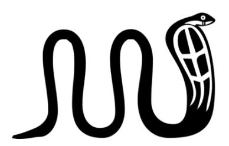

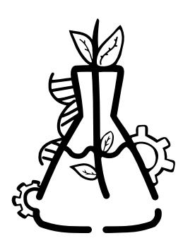

**F O R A L L T H O S E W H O W E R E A B A N D O N E D B Y T H E S O C I A L S Y S T E M :**

**W e a r e r a i s e d l i k e c a t t l e w i t h i n e n c l o s u r e s , m a n y d y i n g i n p o v e r t y , h a t i n g a n d d e s t r o y i n g o n e a n o t h e r , d i v i d i n g o u r s e l v e s u n d e r f l a g s , t i t l e s , r e l i g i o n s , p o l i t i c a l p o s i t i o n s , s o c i a l c l a s s e s , s k i n c o l o r s , a n d s e x u a l o r i e n t a t i o n s .**

**W h i l e w e f i g h t w a r s , t r y t o s i l e n c e e a c h o t h e r , j u d g e , s e l l , a n d b e t r a y o n e a n o t h e r , w e a b a n d o n o u r e s s e n c e a n d o u r c h i l d r e n t o s y s t e m s o f d i s t r a c t i o n t h a t p e r p e t u a t e t h i s c y c l e — k e e p i n g u s a b s o r b e d b y d e s i r e s , a d d i c t i o n s , a n d i l l u s i o n s o f p o w e r , w h i l e t h e p l a n e t d e c a y s a n d h u m a n i t y f a c e s i n c r e a s i n g s u f f e r i n g , s c a r c i t y , a n d i m b a l a n c e .**

**M a n y l a c k t h e b a s i c m e a n s t o l i v e , w h i l e o t h e r s w a s t e a b u n d a n c e a n d l u x u r y . B u t n o t f o r m u c h l o n g e r . . .**

