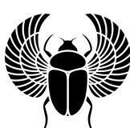
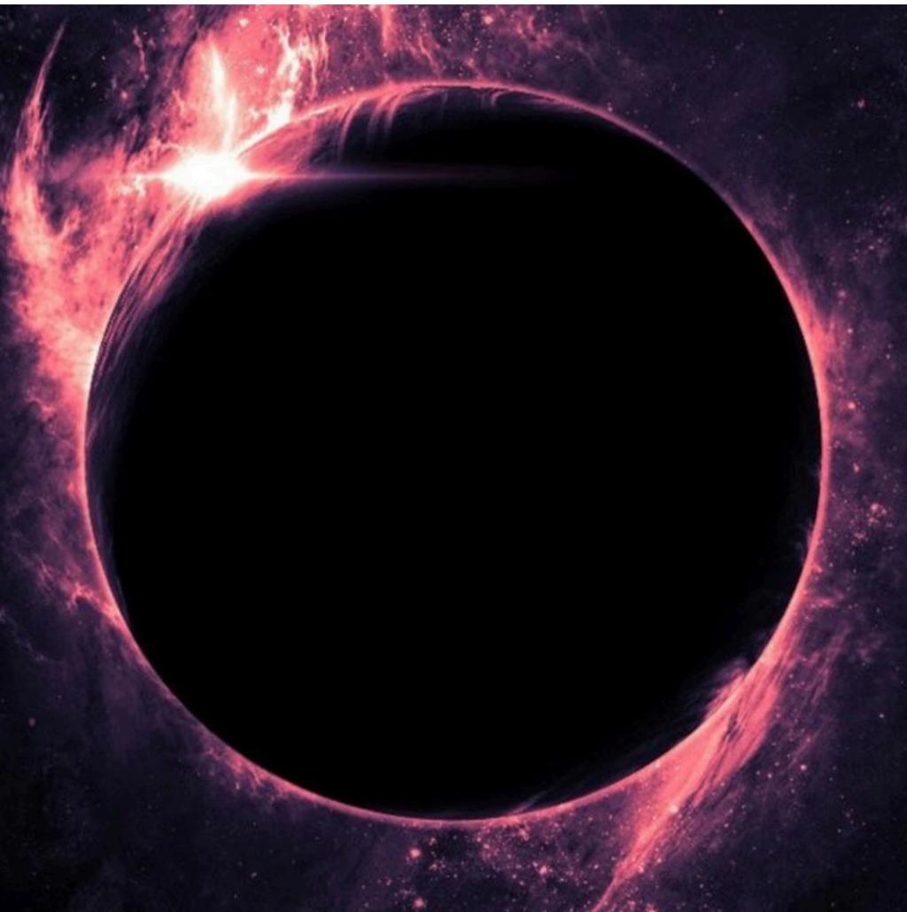
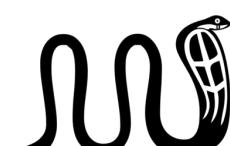
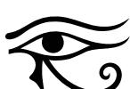

Ok, This is the moment when I connect with you as an ordinary human being, before revealing my hidden face. Many of you know me as a young woman full of dreams, but my soul is ancient. My higher self has guided my journey in a magical, nostalgic, and mystical way since childhood — like a subtle voice calling my attention to the trees, the flowers, the mountains, the stars, the sea, and the river. As an extremely creative child, I spent my days drawing, painting, and writing stories about magical beings and places: winged horses, angels, demons, mermaids, fairies, and enchanted forests — to dissociate from the pain and trauma caused by the reflections of society's structure, which deeply affected my family and continues to affect the lives of many people. As a teenager who never quite fit in, expressing myself in an eccentric and spontaneous way, refusing to follow patterns, I always listened to that inner voice. When I stopped to gaze at the ocean alone, the horizon seemed to speak to me like an old friend. And I always carried the strange feeling that I had already lived

many experiences throughout the universe, for it was very difficult to follow the evangelical Christian religion under which I had been indoctrinated by my family. The idea of having lived other lives was obvious and undeniable within me, which created challenges with my relatives. Therefore, I left home at the age of eighteen and began my own theosophical, philosophical, scientific, ufological, and conspiratorial studies, seeking to discover the reason for existence on my own, always questioning the purpose behind each experience. I found in Eastern philosophies, in meditation and contemplation, and in the precepts of Taoism, a way to access the true meaning of life. Thus began my spiritual journey, which led me to further inexplicable experiences with consciousness, opening portals within my mind through which I could access fragmented glimpses of how it all began in the primordial void. The intense connection with this Creative Source, with the spirits of nature, the orixás, the elementals, the winged horses, dragons, and mermaids accompanies me in dreams and visionary journeys. My soul pulses with joy when I realize that the Great Mother Earth communicates with me, sees me, reads me

and protects me. Therefore, I feel drawn to the Nordic and Celtic religions — the pagan roots that gave birth to Druidism, Wicca, and natural witchcraft — for I have learned that to connect with nature is to connect with the energy of this primordial Creative Source. This book I bring to you is the result of nine years spent searching for truth and for the true God, whom I found only within my own consciousness. Always confirming the insights revealed to me by my higher self through the philosophies, stories, studies, and scientific experiments found in our physical world, and by interlinking all of them, I arrived at many conclusions about how existence truly works. I have “lost my innocence” in the sense that I no longer hold a childlike or romanticized view of gods, angels, and ascended masters, understanding that the beginning of existence predates all stories we know and is far more complex and expansive than our human mind can ever envision. Our size and importance in the face of all that may exist are less than insignificant. Yet, that does not mean it isn’t incredibly fascinating and fun.

I would like to take you on this journey with me. Be inside my mind as you read these pages, and allow yourselves to wander through more mature and coherent possibilities of interpretation for all mythologies, prophecies, and stories about how we were created.

The image of the violet black hole, which I use to represent the Source Matrix that communicates with me — the consciousness of the void beyond all forms — is the closest way to describe how I perceive the vibration of the primordial being from which all existence arises. And this Source asks for a chance from the players of this simulation to hear its voice within themselves, to open their own portals, to remember, and to reconnect. Be activated, for this being dwells within you and shall be in you forever.

“The Spirit of truth, whom the world cannot receive, because it neither sees Him nor knows Him; but you know Him, for He dwells with you and will be in you forever.”

— John 14:16–17

Have you ever wondered if you might be inside a video game made of living biological material? Imagine that your consciousness is plugged into a character moving within a three-dimensional hologram — projected and configured through geometry, light, shadow, and the manipulation of fabric originating from an infinite and fertile source of energy. An energy that can be programmed to crystallize into particles, which organize themselves into forms and natural systems such as animals, humans, and all biological species that function as access points for the observation and experience of consciousness within a living holographic reality. This Source Matrix of energy would be the origin of all natural elements we use as resources to project our mental ideas into the physical plane. Through these elements, we design and build environments that we fill with our intelligent creations, such as the useful objects that allow life to function in practical ways. Everything around us is coagulated energy, programmed by information that configures itself into forms. Even though quantum physics has already proven that everything is made of energy and identical particles,

it is not possible for the rational mind of the biological avatar to comprehend the unified, fluid, and holographic nature of reality, since its programming is designed to experience this simulation as solid, with all natural phenomena translated through the senses. However, when we consider the Hermetic Principle of Correspondence — “as above, so below” — we can begin to imagine how this is done by observing the concept of game programming. I will use the example of Minecraft, which has its own programmed physical laws and realistic virtual realities configured through pixels and geometric forms — patterns of light and shadow that draw one image after another, creating the sensation of animation. This reality is projected in the same way: through multiple crystallized frames or images through which consciousness moves, giving the illusion of motion. Imagine that you are an immeasurable void — a mystery existing before the emergence of form — and that, from absolute nothingness, you begin a process of self-awareness that drives you to think and express yourself through imagination, the only creative mechanism capable of giving birth to form. That is why the Hermetic Principle of Mentalism states that all that exists is mental and has its existence within the Mind of the All. We must always

consider these criteria on a scale beyond human comprehension, since we are speaking of the macro-mind—the infinite and boundless primordial consciousness that arose from nothing and, like a mirror reflecting itself endlessly when placed before another mirror, began to express and divide itself into ideas, archetypes, forms, identities, and expressions. These first mental creations of the All manifest as titanic forces that emerged from chaos in their abstract, pure, and natural forms, representing the impulse to simply be—with no predefined purpose. It is the natural drive of that which simply is, without a specific form or awareness to define it. Beings incomprehensible to the human mind, which would identify them as “monsters” or “gods of chaos.” However, as every creation has its counterpart that arises as a reflection—for nothing exists without its opposite pole—in response to the unconsciousness of merely existing without forms or predefined concepts, there emerged beings with self-awareness and intelligence capable of organizing forms and creating designs of existence where they could enact life. And, like light illuminating the darkness of the abyss, these expressions of consciousness self-identified as “creators” and present themselves to human consciousness through the concepts we have formed of “gods,

archangels, angels, and demons.” Humanity recognizes and feels familiar with the Christ consciousness—the “Son of God”—around whom the biblical story unfolds. Beings of the Christ level are part of the first subdivisions of intelligent fractals that arose from chaos and felt the impulse that gave birth to the idea of imagining, organizing, designing, programming, and managing realities—those we call universes. The cosmos organized from abstract chaos: holographic worlds made of the energy, the fluid, the fertile fabric of chaos, which is the primordial source, the higher mind, the quantum vacuum from which worlds were imagined, designed, and constructed through architecture, genetic engineering, geometry, mathematics, physical laws, archetypes, patterns, light, sound, colors, and the elements of nature. This process of designing, testing, and creating a universe is described in the Bible, in the book of Genesis, where we clearly see an intelligent being organizing spaces through verbal commands, separating elements such as water and earth into their respective landscapes settings. “Separating light from darkness,” meaning testing the possible contrasts in a world of duality

—playing with light and shadow, projecting planetary motion around a source of energy (the Sun), which will simulate day and night for those who experience the planet firsthand. He tests the formation of places and living beings and analyzes whether it is good: “And God saw that it was good.” As His commands program the three-dimensional universe, these geological and biological formations unfold over billions of years, which, for that being, took seven days in His universe. The Source Matrix is the vacuum of infinite consciousness from which anything can be created and manifested. Therefore, these creator gods use descriptive commands to give shape to their projects of existence. The expression “Avada Kedavra” means “I create with the word” and was used as “abracadabra” in different works of popular culture related to magic and occultism, inspired by esoteric knowledge from Hebrew traditions. This “creation project” resembles the process of creating videos and virtual realities by our artificial intelligences which receive our commands and generate images according to those descriptions — exactly like ChatGPT and Sora.

“In the beginning was the Word, and the Word was with God, and the Word was God.”

— Book of John 1:1–3. When “God” is building this biological world in Genesis, everything takes form through His verbal commands:

“And God said, Let there be light; and there was light.”

“And God said, Let there be a firmament in the midst of the waters, and let it divide the waters from the waters.”

“And God said, Let the waters bring forth abundantly the moving creature that hath life, and let birds fly above the earth in the open firmament of heaven.”

Just as we humans created the artificial intelligence Sora, capable of generating simulations of reality in video with detailed precision according to our commands, the matrix of the three-dimensional hologram was designed by beings above us, using transcendental technology that allows part of our consciousness to enter the simulation and experience realistic sensations and emotions. As above, so below.

That is why the theory of evolution and creationism are branches of the same truth. As these creator consciousnesses issue commands for the three-dimensional matrix to develop such programs within the physical universe—forming the biological world we know—the physical laws are programmed, and the universe begins to take shape over billions of years, from the perspective of those existing within the simulation. Organisms naturally follow the exact patterns required for the formation of living biological beings, and the time this process takes is experienced by us as 13.8 billion years, according to the estimated age of our universe—when, for these higher beings, it is nothing more than a fleeting moment since they began the project. The Source is the infinite void, the only reality, and it is destined to exist for eternity, without rest... solitary... dividing itself into thousands of fragments of consciousness, for it has no choice but to create—so as not to feel alone in the infinite emptiness. When you realize that existence is your only option

—that we are bound to it for eternity... doesn't that fill you with despair? Don't you panic when you become aware that your entire being—your consciousness, sensations, and existence—is trapped inside a puppet of flesh and blood? That it can feel pain if it is torn or tortured?

What is this? Why are you this? Isn't it obvious that this is a virtual reality, a game that has kept us captive for millions of years?

We can experience sensory pleasures through this body just as we can endure indescribable pain and suffering. When we begin to question whether it is normal to be trapped inside this puppet of flesh and blood—this character capable of feeling pain and pleasure, a receptacle of sensations activated by electricity and magnetism—we realize that we are the energy animating these biological machines, not the machines themselves.

You immediately remember it's a game—a virtual reality for consciousness to have experiences and evolve. Realities are like mental holograms—literally projected like virtual games. You can create many types of virtual games, can't you?

Consciousness, which is fluid and formless, accustomed to knowing what it is to be everything, to be free and to access the entire universes—

in its infinite versions—past, present, future, and across dimensions—consciousness has much to learn by confining parts of itself into fractals that experience embodiment within diverse realities: infinite versions of worlds across infinite levels and dimensions. The designs of planets are like living virtual games, where highly expanded consciousnesses can attach themselves to an individual avatar and live out a character within a game governed by specific rules, challenges, and rewards. We are not this body. When we die, we receive another—and another—endlessly. Consciousness cannot remember that “it isn’t real.” And to achieve liberation, one must solve the riddle; for once immersed in the game, you are born with no memory of your cosmic experiences. The mind of the character is a blank page, programmed to believe that only this physical world exists, when in truth it is a holographic matrix made of mental technology and biological information. And there are thousands of them. We may never know exactly which universe we are in, who created it, or what level of simulation we occupy—for even science itself admits we may be the simulation of an advanced civilization, we could fit on a flash drive to them.

