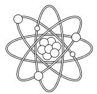

# **FOUR-DIMENSIONAL INTERFACE: SPACETIME**

### **Table of Contents:**

### **Introduction.**

### **Technical Preface.**

**Chapter I -** Reality as an Interface and Not as a Fundamental Structure.

**Chapter II -** The Fourth Dimension - Time as the Refresh Rate of Three-Dimensional Frames/Images/Moments in Motion Within the Four-Dimensional Interface.

**Chapter III -** Granular Universe - Elementary Particles Are Field Excitations That Extend Throughout Space and Can Function as "Lit Pixels" in a Screen Structure.

**Chapter IV** - Fitting the Four-Dimensional Interface into the Holographic Principle Theory.

**Chapter V -** Proposal for a Reinterpretation of Schrödinger's Paradox Through the Lens of the Rendered Interface Hypothesis.

**Chapter VI -** Gravity as a Consistency Algorithm: Spacetime as a Rendering Interface.

**Chapter VII -** The Black Hole as a Resource Management Mechanism in an Emergent Spatiotemporal Interface.

**Chapter VIII -** Large-Scale Optimization and the Phenomenon of Dark Matter as Low-Fidelity Rendering (LOD).

**Chapter IX -** The Unification of General Relativity and Quantum Mechanics Through the Model of Spacetime as an Emergent Four-Dimensional Interface of a Fundamental Structure.

**Chapter X -** If This Universe Is Emergent from a Structure Analogous to a Screen - The Big Bang Is the Initial Boot, the "Start" Button of the Interface.

**Chapter XI -** The Technology of Transistors and Silicon Chips and Their Cosmic Equivalence to an Analogous Supertechnology - Energy Trapped in a Two-Dimensional Structure and the Holographic Principle.

**Chapter XII -** Plasma Technology - Shaping Three-Dimensional Images with Mass and Volume in the Four-Dimensional Interface.

**Chapter XIII -** DNA - Technology for Rendering Animatable Avatars (Biotechnology) in the Four-Dimensional Interface.

**Chapter XIV -** Interface Realism - Donald Hoffman.

**Chapter XV -** The Phenomenon of Dreams, Memories, and Imagination - In What Space Do They Occur And How Does This Connect With the Four-Dimensional Interface Theory?

**Chapter XVI -** Consciousness May Be The Energy Itself Trapped In The Two-Dimensional Structure of a Supertechnology - or Be Plugged Into This Interface By Electrical Current.

**Final Conclusion -** Technology is Not a Product of Human Evolution, But Precedes The Existence of The Universe Itself.

**Experiments That Can Prove the Theory of This Book.**

EUREKA!!! I truly feel that this is a moment of union for all of us — scientists, physicists, philosophers, professors, students, and aspirants of the Cosmos — because I am confident in saying that the pages of this book deserve a place of attention, investigation, analysis, testing, and an inevitable sense of "Eureka." I never imagined that I would reconcile General Relativity and Quantum Mechanics, but this is exactly the kind of thing destined to happen to me, an independent researcher of science and physics who cannot be stifled by an "academic fear" of being ridiculed by institutions and their "absolute truths." In other words, I do not have an "academic reputation" to uphold; therefore, this fear cannot control me as it controls great minds who already understand what this book will explain but do not have the courage to speak in these terms. It is important to note that there is a reason for this resistance: healthy skepticism. If science accepted every new idea without testing it exhaustively, knowledge would be chaos. However, let us not forget that Einstein himself stated that "I never made one of my discoveries through the process of rational thinking," and this is exactly the principle that brought me here and that will help you, the reader, the scientific community, and all aspirants to a "Theory of Everything" to understand this book and finally discover that the truth was right under our noses the entire time. Before we embark on a journey through the unification of General Relativity and Quantum Mechanics by understanding that Spacetime functions as a four-dimensional interface emergent from a "granular/pixelated screen structure" (transcendent supertechnology), it is necessary to consider that technology is not something artificial in the opposite sense of nature; it is nature itself understanding itself through the human being. All technology—from silicon computers to cellular bioelectricity—already exists in nature, which is itself a functional and absolute technology. Our human concepts of what "technology" is and the names we have given to our discoveries are merely symbols that help us interpret phenomena. However, it does not mean that these phenomena are exclusive within these concepts; for example, just because we developed a "computer" does not mean that this idea, or something equivalent to it,

but on a colossal scale that transcends our minds, could not have already been created, being precisely the possible cause for the development of a universe such as this one. Our concepts of what "technology" is and the names we attribute to our discoveries are, ultimately, only linguistic symbols. When we pronounce words like "electricity," "atom," or "silicon," we are not describing the ultimate essence of reality, but rather creating labels for phenomena that we manage to isolate and measure. The fact that we have developed something we call a "computer"—a data processing machine based on semiconductors—frequently causes us to fall into the error of believing that computation is a human exclusivity. However, the phenomenon of "processing information" is not exclusive to our concept of a case and wires; nature was already "computing" the position of stars and DNA replication billions of years before Turing. What we call a computer is merely our local instance of a universal principle of data processing. It is not because our technology has a certain form that the fundamental idea behind it cannot exist on a colossal scale, transcending the limits of our imagination. If we observe that the universe operates under strict mathematical rules, that it possesses processing limits (speed of light) and minimum units of information (Planck scale), it becomes logically viable to suppose that the Universe itself is the result of a transcendental processing architecture. In this scenario, the "computer" that gave rise to our spacetime would not look like anything we could hold in our hands; it would be a structure of higher dimensions, where the substance is not silicon, but consciousness itself or a form of pure energy that we have not yet named. Our universe would be, therefore, the "output" of a calculation executed by this colossal intelligence. Technology as a Mirror of Nature: We did not invent the concept of a "network"; we only symbolized it through the Internet by observing how the brain and ecosystems behave. We did not invent "data storage"; we only mimicked it in chips by observing the persistence of information in the universe. This leads us to a profound reflection: if our technology is a mirror of natural laws, the fact that we are creating virtual worlds and artificial intelligences today may be the clearest sign that we ourselves are the product of an analogous process happening on a colossal scale. Through this vision, we will embark on an investigation of physical laws and how they may be the fruit of a

possible "supertechnology," through analogies and comparisons with our own technological discoveries.

# **TECHNICAL PREFACE. THE ARCHITECTURE OF RELATIONAL HARDWARE.**

RECONCILING QUANTUM GRANULARITY WITH GENERAL RELATIVITY - OVERCOMING THE LORENTZ INVARIANCE CONFLICT THROUGH EMERGENT GEOMETRY:

For the Four-Dimensional Interface hypothesis to be fully understood in its entirety, it is necessary to resolve an apparent conflict with 20th-century physics: Lorentz Invariance. Conservative scientists may question how a "pixelated" or granulated universe can appear the same in all directions (isotropy) without presenting a preferred direction in the grid. This book proposes that the conflict is resolved through Background Independence and the relational nature of the system.

1. The Screen as a Logical Addressing Matrix: The Hardware of this universe is not a rigid Cartesian monitor (like a grid of pixels on a television). As proposed in Loop Quantum Gravity (LQG), the fundamental structure is a Spin Network:

- Relational Pixels: "Planck pixels" do not have an absolute position; they are space itself.

- Memory Addressing: The Hardware functions like a data server where "distance" is defined by the density of logical connections (entanglement), rather than a fixed geographical layout.

The area of this "screen" is not continuous, but quantized according to the area operator:

A(s) = 8π l\_p^2 Σ\_i √[j\_i(j\_i + 1)]

This granularity ensures that the Hardware remains discrete and computable (Quantum Physics), while the Interface remains fluid (Relativity).

2. The Software as the Guarantor of the Constancy of "c": Lorentz Invariance is not a limitation of the screen, but a rule of the Rendering Engine. The speed of light (c) is redefined as the maximum data update rate between nodes of the quantum network. To maintain consistency between different observers, the system applies the Lorentz Factor (γ) as a processing load adjustment in the Interface:

γ = 1 / √[1 - v^2/c^2]

Thus, length contraction and time dilation are not hardware deformations, but LOD (Level of Detail) mechanisms and buffer management to maintain network synchrony.

3. Architectural Conclusion: By separating the Static Infrastructure (Quantum Hardware) from the Dynamic Phenomenon (Relativistic Interface), we unify the two greatest theories of physics. The hardware provides the information pixels; the software provides geometry and gravity. What we call reality is the meeting point where quantum data becomes an observable phenomenon through continuous rendering.

# **CHAPTER I REALITY AS AN INTERFACE AND NOT AS A FUNDAMENTAL STRUCTURE.**

This scientific research aims to discuss the hypothesis that spacetime, and consequently gravity, are not the ultimate fundamental reality but rather an emergent result of a structure analogous to a screen that projects three-dimensional space moved by time (4th Dimension) as the frame rate of a four-dimensional interface. In this interface, the complexity of minimally conscious life allows for the animation of 3D images that, although they appear solid, are essentially composed of billions of energy cycles. Understanding this will imply a chain reaction that will affect how we interpret everything we have discovered about the macro world (relativity) and the micro world (quantum physics), changing physics forever. Many loose ends can be reconciled, such as the Measurement Problem: quantum mechanics states that a particle is in several states at the same time (superposition); however, when there is an interaction, we see only one state. This would not be a problem if we understood quantum field excitation (a particle) as an event analogous to the lighting of a pixel on a screen to render images. Just as a pixel only lights up in a defined position at the moment of image projection, yet can be lit anywhere across the full extent of the screen, a particle only collapses into a defined position when there is an observation/interaction of a moment in spacetime (quantum excitation = lit pixel). Since quantum excitations can occur anywhere throughout the fabric of space (interface/screen), this explains the probabilistic nature of the particle. This mechanism would be analogous to digital animation rendering, like a three-dimensional movie or an advanced computer game that we play (live) in the first person (supertechnology/transcendent). In other words, the transistor technology "discovered and developed" by us — the intelligent organization of images rendered on a screen — may be a micromodel of the technology that precedes the universe itself, something transcendent to the third and fourth dimensions, just as we create two-dimensional technologies (computers and cell phones).

If we can prove that spacetime is the interface of a structure analogous to a "digital screen," there would be a paradigm shift in physics; spacetime would cease to be the "fundamental stage"

and would become an emergent phenomenon. This would unify two ideas that are currently separate: general relativity (geometric) and quantum mechanics (informational). The greatest open problem in physics today is unifying general relativity with quantum mechanics, but if spacetime is emergent, gravity would not need to be quantized directly; it would arise as a collective effect of the underlying structure (just as elasticity arises from atoms). This would enable us to resolve paradoxes such as:

\* Singularities (black holes, Big Bang).

\* Mathematical infinities.

\* Explaining why gravity is so weak.

\* Understanding the origin of the geometry of the universe.

In the case of black holes, the information paradox could be resolved, as the event horizon would be like a resolution limit of the "screen," and entropy would become a count of the fundamental states of the structure. The Big Bang would cease to be a singularity and would become a phase transition, like when a screen turns on or when the system begins to "render" the interface (spacetime). A theory of emergent spacetime could lead to new types of physical computation, control of geometric states (gravity as an emergent effect), technologies based on fundamental information, and extremely precise sensors of the fabric of space. If it were proven that spacetime is emergent from a screen-like structure, this would:

\* Redefine what is "real."

\* Resolve the greatest problem of modern physics (unifying relativity and quantum mechanics).

\* Unify geometry, information, and quantum mechanics.

\* Open up new experimental predictions.

\* Create technologies that are unimaginable today.

It would be one of the greatest discoveries in human history; therefore, I invite you to embark with me in this book on an exploration and analysis of all the evidence that can lead us to this conclusion.

